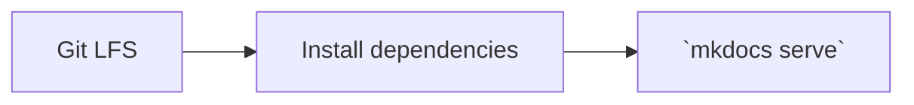

# Tino Docs Hub

[](https://github.com/d0tTino/docs-/actions/workflows/tests.yml) [](LICENSE)

Central repository for documentation and research across Tino projects, providing a single source of truth via modular MkDocs, pre-commit hooks, and structured directories.

Key features:

- [AI Research](docs/ai-research/)
- [Non-AI Research](docs/non-ai-research/)
- [Gaze Research](docs/gaze-research/)
- [Security](docs/security/)

- Centralizes project docs with modular MkDocs and Git submodules.
- Standardizes contributions with pre-commit hooks and helper scripts.
- Streamlines browsing and preserves version history with clear directory conventions.


Shows documentation flowing from individual project modules into the hub.

This repository aggregates documentation and research across multiple projects. Architecture decisions are documented in [adr/](adr/).

For setup instructions, directory overview, and detailed research listings,
see [docs/index.md](docs/index.md). For a quick start, read the [Quickstart
guide](docs/quickstart.md) and review the [documentation threat
model](docs/security/threat-model.md).

Quickstart steps at a glance:



## Table of Contents

- [Repository Structure](#repository-structure)
- [Development](#development)
    - [Pre-commit](#pre-commit)
    - [Preview Docs Locally](#preview-docs-locally)
    - [Update Submodules](#update-submodules)
    - [Update Research Indexes](#update-research-indexes)
- [Contributing](#contributing)
- [Resources](#resources)

## Repository Structure

- [`docs/`](docs/) – User-facing documentation modules.
- [`adr/`](adr/) – Architectural Decision Records.
- [`scripts/`](scripts/) – Helper scripts and automation.
- [`tests/`](tests/) – Test suite for repository tooling.

## Development

### Pre-commit

Install [pre-commit](https://pre-commit.com/) hooks to expand snippets and lint
Markdown files:

| Command | Purpose | When to run it |
| --- | --- | --- |
| `pip install pre-commit` | Install tooling | Once during setup |
| `pre-commit install` | Set up Git hooks | After installing tooling |
| `npm run preexpand -- <file>` | Expand snippet refs | For docs with snippets |

The hook runs `scripts/expand_snippets.py` to inline snippet references and
`scripts/lint_research_docs.py` to catch mid-word line splits and empty image alt text.

To expand multiple files at once, pass each path after the `--`, for example
`npm run preexpand -- docs/page.md docs/another-page.md`.

### Preview Docs Locally

```bash
pip install -r requirements.txt
mkdocs serve
```

Install Python dependencies and serve the docs at
<http://127.0.0.1:8000>.

### Update Submodules

```bash
git submodule update --init --recursive
```

Fetch documentation submodules to ensure project docs are available.

### Update Research Indexes

Rebuild research index pages after adding or renaming documents:

```bash
python scripts/update_ai_research_index.py
python scripts/update_non_ai_research_index.py
```

## Contributing
See the [contributing guidelines](CONTRIBUTING.md) for the latest process.

1. Create a branch from `main` for your work.
2. Run `scripts/setup_hooks.sh` to install Git hooks and linters.
3. Commit your changes and open a Pull Request for review.

## Resources

- [Documentation](docs/index.md)
- [Issue Tracker](../../issues)
- [Community Discussions](../../discussions)

