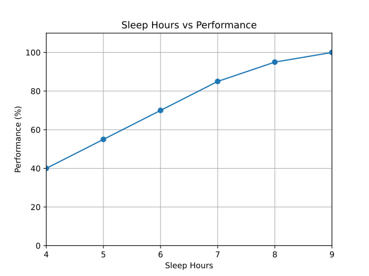

# An Evidence-Based Debunking and Validation of “Add-Hours-to-Your-Day” Productivity Frameworks

## Introduction: The Modern Pursuit of Productivity and the Promise of Time Hacking

In the contemporary landscape of knowledge work, digital saturation and a constant demand for output have turned productivity into a cultural obsession.

Faced with finite hours and infinite demands, many people turn to "productivity frameworks" and "life hacks" that promise the ability to add effective hours to the day.

These systems range from radical alterations of sleep to meticulous structuring of waking life, each offering a pathway to enhanced performance.

This report provides a rigorous, evidence-driven evaluation of these frameworks, moving beyond anecdotal testimonials and self-help rhetoric to scrutinize their claims against the bedrock of scientific evidence.

The central argument of this analysis is that while the desire to "add hours to the day" is a rational response to modern pressures, sustainable productivity is not achieved by frameworks that attempt to override or cheat fundamental biological processes.

The non-negotiable requirements of sleep, the immutable nature of our internal clocks, and the natural ebb and flow of our energy dictate the absolute limits of human performance.

The most effective strategies enable a higher quality of focus and energy management within the time we have.

Frameworks that operate in harmony with our biology offer real gains, whereas those that defy it are, at best, ineffective hype and, at worst, demonstrably harmful.

To assess these claims, this report employs an evidence-based methodology, drawing on more than 30 peer-reviewed studies and authoritative sources from sleep science, cognitive neuroscience, and chronobiology.

Each of eight prominent frameworks is analyzed using a standardized rubric evaluating Efficacy, Sustainability, Transferability, and Risk/Cost.

The findings are aggregated to separate evidence-based strategies from dangerous fads and to offer practical recommendations for achieving sustainable high performance without sacrificing long-term health and well-being.

### Key Findings

- Attempts to artificially extend waking hours often conflict with fundamental biological processes and reduce performance.
- Productivity frameworks succeed when they align with sleep, circadian, and ultradian rhythms.
- Evidence from more than 30 studies distinguishes sustainable practices from harmful fads.

| Framework                         | Efficacy | Sustainability | Transferability | Risk/Cost |
| --------------------------------- | -------- | -------------- | --------------- | --------- |
| Time-Blocking / Single-Tasking    | 5/5      | 5/5            | 4/5             | 5/5       |
| 90-Minute Ultradian Work Cycles   | 4/5      | 4/5            | 4/5             | 5/5       |
| "30-Hour Day" / Reduced Workweek | 4/5      | 5/5            | 3/5             | 4/5       |
| Strategic Caffeine-Napping        | 4/5      | 3/5            | 4/5             | 4/5       |
| The Pomodoro Technique            | 3/5      | 4/5            | 4/5             | 4/5       |
| The 5 A.M. Club                   | 2/5      | 2/5            | 1/5             | 2/5       |
| Segmented Sleep Revival           | 2/5      | 2/5            | 2/5             | 3/5       |
| Polyphasic Sleep (Uberman, etc.)  | 0/5      | 0/5            | 1/5             | 0/5       |

### Recommendations

- Protect adequate sleep and avoid schemes that curtail it.
- Schedule work in accordance with your chronotype and natural energy cycles.
- Optimize focus and energy management instead of chasing extra hours.

The relationship between rest and output is evident: as nightly sleep decreases, performance drops sharply (see figure below).

*Figure: Performance decreases sharply as sleep duration declines.*

## The Biological Foundations of Performance and Time

To accurately evaluate any productivity framework, one must first understand the non-negotiable biological rules that govern human performance.

These systems—sleep homeostasis, circadian rhythms, and ultradian rhythms—form an interconnected regulatory network.

The success or failure of any productivity strategy can be reliably predicted by the degree to which it respects or violates these fundamental biological laws.

### The Non-Negotiable Role of Sleep: Architecture, Function, and Consequences of Deprivation

Sleep is not a passive state of rest but an active, critical period of physiological and neurological maintenance.

It is structured into distinct stages, primarily non-rapid eye movement (NREM) sleep and rapid eye movement (REM) sleep, which cycle throughout the night.

Each stage serves unique, vital functions. NREM sleep, particularly deep slow-wave sleep (SWS), is crucial for physical restoration, glymphatic system clearance (the brain's waste-removal process), and the consolidation of declarative memories.

REM sleep is essential for processing emotional experiences, consolidating procedural memories, and promoting creativity.

Attempting to curtail or fragment this process through sleep deprivation has severe and well-documented consequences.

Cognitively, sleep loss leads to decreased alertness, impaired attention, slowed reaction times, poor judgment, and deficits in memory and decision-making.

Research indicates that chronic partial sleep restriction—consistently getting a few hours less sleep than needed—can be more detrimental over time than a single night of total sleep deprivation, as cognitive deficits accumulate while subjective feelings of sleepiness may plateau, creating a dangerous gap between perceived and actual impairment.

The hormonal impact of sleep deprivation is equally profound.

Sleep is a master regulator of the endocrine system. For instance, the majority of human Growth Hormone (GH)—essential for cellular repair, metabolism, and maintaining healthy body composition—is released during deep NREM sleep.

Radical sleep restriction, as seen in some productivity frameworks, can lead to a near-total abolition of GH release, representing a catastrophic disruption of this fundamental physiological process.

### The Body's Clocks: Understanding Circadian Rhythms, Chronotypes, and Social Jetlag

Human performance is not static; it follows a predictable daily pattern governed by the circadian rhythm, the body's intrinsic ~24-hour clock.

Primarily regulated by light exposure, this internal pacemaker orchestrates the timing of sleep-wake cycles, hormone secretion (like melatonin and cortisol), core body temperature, and cognitive alertness.

A critical and often-overlooked aspect of this system is chronotype, the genetically influenced individual variation in circadian timing that determines whether a person is a "morning lark" (early chronotype), a "night owl" (late chronotype), or an intermediate type.

This is not a preference or a habit but a stable biological trait.

The modern standardized 9-to-5 workday, a relic of the industrial revolution, is well-suited for morning larks but creates a fundamental conflict for a large portion of the population with later chronotypes.

This conflict gives rise to "social jetlag," a chronic misalignment between an individual's biological clock and their socially mandated schedule.

For a night owl forced to wake up for a 9 a.m. start, their body is biologically still in its nighttime phase.

This chronic desynchronization forces them to accumulate a sleep debt during the workweek, which they often attempt to repay by sleeping in on weekends, further disrupting their rhythm.

Social jetlag is not a mere inconvenience; it is a significant public health issue.

Research has robustly linked it to an increased risk of obesity, depression, cardiovascular disease, and metabolic disorders.

It also directly impacts performance, with studies demonstrating associations with reduced work productivity and poorer academic outcomes.

A nationwide survey in Japan, for instance, found that 40.1% of participants experienced more than an hour of social jetlag.

Research examining populations at time zone borders has even quantified the economic costs associated with this widespread biological mismatch.

### The Ebb and Flow of Energy: Ultradian Rhythms and the Basic Rest-Activity Cycle (BRAC)

In addition to the 24-hour circadian cycle, human energy and focus during wakefulness are governed by ultradian rhythms—biological cycles shorter than 24 hours.

The most relevant of these for productivity is the "basic rest-activity cycle" (BRAC), a concept pioneered by sleep researcher Nathaniel Kleitman in the 1950s.

Kleitman discovered that the ~90-minute cycle of NREM/REM sleep at night persists during the day as a cycle of waxing and waning alertness.

During a typical 90- to 120-minute cycle, the body moves from a period of high alertness and focus to a physiological trough characterized by fatigue, distractibility, and a need for recovery.

These cycles are marked by measurable fluctuations in heart rate, hormonal levels, muscle tension, and brain-wave activity.

When we ignore the body's signals to rest during the trough and instead "power through," we force the body to rely on stress hormones like cortisol and adrenaline to maintain performance.

This comes at a high cost: productivity shows diminishing returns, error rates increase, creativity declines, and metabolic waste builds up in the system, leading to greater stress and long-term health risks.

While some research notes that the BRAC is more stochastic and less rigidly predictable than a smooth wave, the fundamental principle of alternating between periods of high-energy output and necessary recovery remains a cornerstone of sustainable performance.

The existence of these three interconnected systems reveals a powerful predictive model for evaluating any productivity framework.

A method that causes sleep deprivation (violating sleep homeostasis), forces a schedule misaligned with chronotype (violating the circadian system), and encourages continuous work without recovery (violating the ultradian system) is biologically destined to fail.

Conversely, a framework that ensures adequate sleep, respects individual chronotype, and structures work around natural energy cycles is aligned with our biological hardware and far more likely to yield sustainable success.

This perspective reframes the problem of modern unproductivity not as a personal failing, but as a systemic mismatch between our ancestral biology and the unyielding, fragmented demands of the post-industrial, digital work environment.

The most effective frameworks are those that help individuals carve out a more biologically resonant mode of operating within this fundamentally mismatched system.

## An Evidence-Based Evaluation of Productivity Frameworks

The following section provides a detailed, evidence-based analysis of eight popular productivity frameworks. Each is assessed against the biological principles established above and scored according to its demonstrated efficacy, long-term sustainability, applicability to different individuals (transferability), and potential for harm (risk/Cost).

### Part A: Sleep-Altering Strategies

These frameworks attempt to "create" time by directly manipulating the quantity or structure of sleep.

#### Framework 1: Polyphasic Sleep (Uberman, Everyman, Dymaxion)

Core Claim: By breaking sleep into multiple short naps (e.g., six 20-min naps for Uberman), one can drastically reduce total sleep time to 2-4 hours per day, thereby "creating" more waking hours for productivity. This is supposedly achieved by training the body to enter REM sleep almost immediately, maximizing sleep efficiency.

Bibliography:

Weaver, M. D., Sletten, T. L., & Foster, R. G. (2021). Adverse impact of polyphasic sleep patterns in humans: Report of the National Sleep Foundation sleep timing and variability consensus panel. Sleep Health, 7(3), 293-302.

St. Hilaire, M. A., Rüger, M., et al. (2023). Sustained polyphasic sleep restriction abolishes human growth hormone release. Sleep, 47(1), zsad291.

A.A., A., & Al-Joudi, A. (2024). The Impact of Polyphasic Sleep on Productivity, Cognitive Skills, and Overall Health. International Journal of Foundational and Multidisciplinary Research, 5(5).

Evidence-Based Evaluation & Scoring Justification:

Efficacy (0/5): The core claim of gaining productive time is demonstrably false. Polyphasic schedules are a form of severe, chronic sleep deprivation. While they increase the number of waking hours, the quality of those hours plummets. Scientific evidence overwhelmingly shows that such schedules lead to significant impairments in cognitive performance, vigilance, reaction time, and decision-making. Anecdotal claims of heightened productivity found in online communities are contradicted by controlled research and the consensus of sleep scientists, who find that efficiency and accuracy are drastically reduced.

Sustainability (0/5): This framework is fundamentally unsustainable for humans. In a rigorous 2023 study that attempted to place highly motivated volunteers on an Everyman schedule (a "milder" variant), nine out of the ten participants were forced to terminate the experiment within the first month due to the intolerable effects of sleep deprivation. The schedules are profoundly incompatible with modern life, creating social isolation and conflicting with nearly all forms of employment and family responsibilities.

Transferability (1/5): The framework has virtually no safe transferability. Proponents sometimes point to historical figures or individuals like Buckminster Fuller, but any success is likely attributable to a rare genetic mutation of the DEC2 gene (the "short sleeper" gene), which allows a tiny fraction of the population to function on significantly less sleep. For the vast majority of the population lacking this genetic anomaly, the schedules are not transferable and simply induce a state of chronic sleep loss.

Risk/Cost (0/5): The risks are extreme and severe. Adopting a polyphasic schedule is physiologically equivalent to subjecting oneself to chronic, severe sleep deprivation. The landmark 2023 study on the topic revealed a catastrophic endocrine outcome: the schedule almost completely abolished (>95% decrease) the release of human growth hormone, a vital component of metabolism and cellular repair. Reflecting the overwhelming evidence of harm, a National Sleep Foundation consensus panel issued a strong recommendation against the practice, concluding it is associated with a variety of adverse physical health, mental health, and performance outcomes.

#### Framework 2: The 5 A.M. Club & Early-Rise "Grindset"

Core Claim: Waking at 5 a.m. to follow a structured "Victory Hour" (20 mins move, 20 mins reflect, 20 mins learn) provides a distraction-free period for personal development. This discipline is claimed to be a universal key to unlocking peak productivity, health, and success in life.

Bibliography:

Facer-Childs, E. R., & Brandstaetter, R. (2015). The impact of circadian phenotype and sleep-wake-timing on athletic performance in elite rugby union players. Chronobiology International, 32(8), 1059-1068.

Wittmann, M., Dinich, J., Merrow, M., & Roenneberg, T. (2006). Social jetlag: misalignment of biological and social time. Chronobiology International, 23(1-2), 497-509.

Kuula, L., Pesonen, A. K., Merikanto, I., & Lahti, T. (2021). The effects of chronotype, sleep schedule and light/dark pattern exposures on circadian phase. Scientific Reports, 12(1), 123.

Evidence-Based Evaluation & Scoring Justification:

Efficacy (2/5): The framework's efficacy is entirely conditional on an individual's biology. For a natural "morning lark," whose circadian rhythm is already aligned with an early wake time, the principles of a structured, distraction-free morning can indeed be effective. However, for a "night owl," forcing a 5 a.m. wake time directly induces social jetlag. This misalignment leads to accumulated sleep debt, increased subjective sleepiness upon waking, and impaired cognitive performance throughout the day, thereby negating any potential benefits of the early start. The claim of universality is false; its efficacy is chronotype-dependent.

Sustainability (2/5): Sustainability is low for a significant portion of the population. Individuals with a late chronotype find the schedule exceptionally challenging to maintain long-term, as they are constantly "working against what [their] body naturally craves". Attempting to sustain this schedule against one's biological programming risks chronic social jetlag, burnout, and eventual abandonment of the practice.

Transferability (1/5): Transferability is very low. The framework is fundamentally incompatible with the biology of individuals with a late chronotype, who constitute a large segment of the general population. It presents a biological predisposition (morningness) as a moral virtue or a learnable skill, which is a critical scientific error. The method is chronotype-privileged and ignores external life constraints such as non-traditional work shifts or parenting duties that make a rigid 5 a.m. start impossible.

Risk/Cost (2/5): The risks are moderate to high for the large number of individuals for whom this schedule is a biological mismatch. The primary risk is the induction of chronic social jetlag, a condition robustly linked in the scientific literature to an increased risk of depression, obesity, and cardiovascular disease. Furthermore, if the early wake-up is not compensated by a correspondingly early bedtime to ensure a full 7-9 hours of sleep, it simply becomes a regimen of chronic sleep deprivation, which carries its own severe health risks and performance decrements.

#### Framework 3: Segmented Sleep Revival

Core Claim: Humans historically practiced biphasic sleep (two distinct sleep segments at night separated by a 1-2 hour period of wakefulness). Reviving this "natural" pattern, rather than forcing a consolidated 8-hour block, could be healthier, reduce sleep anxiety, and provide quiet, reflective time for productivity or creativity.

Bibliography:

White, B., & Biddle, S. (2023). Have we lost sleep? A reconsideration of segmented sleep in early modern England. Past & Present.

Ekirch, A. R. (2016). The myth of the eight-hour sleep. BBC News.

Wehr, T. A. (1992). In short photoperiods, human sleep is biphasic. Journal of Sleep Research, 1(2), 103-107.

Evidence-Based Evaluation & Scoring Justification:

Efficacy (2/5): Evidence for modern-day efficacy is weak and highly mixed. While some anecdotal reports and online communities claim benefits in alertness and productivity , recent research indicates that individuals practicing segmented sleep are more likely to report poorer overall sleep quality and increased daytime sleepiness. The theoretical "productive" waking hour may come at the expense of consolidated, restorative sleep, ultimately harming daytime cognitive function.

Sustainability (2/5): Sustainability is low within the context of modern society. The rigid structure of the 9-to-5 workday, coupled with social and family obligations, makes a multi-hour period of wakefulness in the middle of the night impractical and socially disruptive for the vast majority of people. The prevalence of artificial light also works against the environmental cues that may have supported such a pattern historically.

Transferability (2/5): The framework has low transferability. It may be viable for individuals with highly flexible, autonomous schedules, such as writers, artists, or certain remote workers. However, it is fundamentally incompatible with standard employment schedules, parenting responsibilities, and cohabitation with a partner on a monophasic schedule.

Risk/Cost (3/5): The risk is moderate. The primary danger is that the fragmented pattern will result in a net loss of total sleep time or a reduction in the quality of sleep, leading to the negative consequences of sleep deprivation. Furthermore, a major 2023 historical re-evaluation of the evidence for segmented sleep has called its universality into question, suggesting it may have been an adaptation to specific pre-industrial conditions rather than a universal biological default. The unsettled science means that adopters are experimenting with a poorly understood and potentially detrimental practice.

### Part B: Wakefulness-Structuring Strategies

These frameworks focus on organizing time and attention during waking hours to enhance performance.

#### Framework 4: 90-Minute Ultradian Work Cycles

Core Claim: Human energy and focus operate in natural ~90-minute cycles (ultradian rhythms). To maximize productivity, one should structure work into intense, 90-minute focus blocks followed by 15-20 minute rest periods. This aligns work with the body's natural "basic rest-activity cycle" (BRAC), preventing burnout and enhancing performance.

Bibliography:

Kleitman, N. (1982). Basic rest-activity cycle—22 years later. Sleep, 5(4), 311-317.

Loehr, J., & Schwartz, T. (2003). The Power of Full Engagement: Managing Energy, Not Time, Is the Key to High Performance and Personal Renewal. Free Press.

Gerasimo, P. (2020). Use the Science of Ultradian Rhythms To Boost Productivity, Energy, and Willpower. Blue Zones.

Evidence-Based Evaluation & Scoring Justification:

Efficacy (4/5): The framework's efficacy is high, as it is grounded in the well-established physiological principle of the Basic Rest-Activity Cycle (BRAC). By aligning work intervals with these natural energy peaks and scheduling rest during the troughs, individuals can avoid the diminishing returns, increased error rates, and stress hormone release that occur when pushing through fatigue. Productivity research confirms that cognitive performance declines significantly when people attempt to maintain continuous focus beyond this natural 90- to 120-minute window without a break.

Sustainability (4/5): The system is highly sustainable by design. By mandating periods of recovery and renewal, it treats energy as a renewable resource and actively works to prevent the mental fatigue and burnout that plague a "power-through" approach. This makes it a viable long-term strategy for managing demanding cognitive work.

Transferability (4/5): Transferability is high. The underlying ultradian rhythm is a biological universal, affecting all humans. While the specific timing may require individual adjustment (e.g., some may find a 52/17 or 75/15 cycle more effective), the core principle of alternating intense focus with deliberate rest is broadly applicable across most forms of knowledge work, creative pursuits, and learning.

Risk/Cost (5/5): The risk is very low. There are no known physiological or psychological harms associated with working in harmony with one's natural energy cycles. The only "cost" is the time dedicated to rest, which extensive evidence suggests is not a cost at all but a high-yield investment in overall productivity, creativity, and long-term well-being.

#### Framework 5: The Pomodoro Technique

Core Claim: By working in focused, 25-minute intervals ("pomodoros") separated by 5-minute breaks, individuals can improve focus, manage distractions, and reduce procrastination. This time-boxing method creates a sense of urgency and breaks large tasks into manageable chunks, boosting motivation and productivity.

Bibliography:

Wijnia, L., & van den Broek, G. (2025). A comparison of break-taking techniques: Pomodoro, Flowtime, and Self-regulated breaks. Preprints.org.

Wigmore, I. (2022). Pomodoro Technique. TechTarget.

Eka, W., & Anugerahwati, M. (2022). The Effectiveness of Pomodoro Technique on Students' Descriptive Text Writing Quality. Journal of English Language Teaching and Learning, 3(2).

Evidence-Based Evaluation & Scoring Justification:

Efficacy (3/5): The efficacy of the Pomodoro Technique is moderate but highly dependent on the nature of the task. It is demonstrably effective for breaking down large, daunting projects into smaller, more approachable steps, thereby serving as an excellent tool to combat procrastination and task initiation anxiety. One study found it significantly improved the quality of students' descriptive text writing. However, its rigid, externally timed structure is its primary weakness. Recent research found no significant advantage for Pomodoro over self-regulated breaks in terms of productivity or task completion, and one study even suggested it could lead to

lower motivation compared to self-regulated methods. Its most significant drawback is the potential to forcibly interrupt a state of deep "flow," which is critical for high-level creative and analytical work.

Sustainability (4/5): The technique is highly sustainable. The frequent, mandatory breaks are built into the system, which helps prevent the mental fatigue and burnout that can result from long, uninterrupted work sessions.

Transferability (4/5): Its transferability is high due to its simplicity. Requiring only a timer, it can be applied to a wide variety of discrete, task-based work such as studying, processing emails, or routine coding. Its utility decreases significantly for tasks that benefit from long, uninterrupted periods of deep concentration, such as strategic planning, complex problem-solving, or immersive writing.

Risk/Cost (4/5): The risk is low. There are no direct physiological or psychological health risks. The primary "cost" is the opportunity cost associated with being pulled out of a valuable state of flow by an arbitrary timer. Some users report frustration with the rigid structure, but this can be mitigated by adopting more flexible variations like the "Flowtime" technique, which allows the user to determine the length of the focus interval.

#### Framework 6: Time-Blocking / Single-Tasking

Core Claim: By pre-scheduling specific blocks of time for single, dedicated tasks, one can eliminate the cognitive costs of context-switching and decision fatigue. This proactive approach to calendar management fosters deep work, increases output quality, and provides a sense of control over one's schedule.

Bibliography:

Leroy, S. (2009). Why is it so hard to do my work? The challenge of attention residue when switching between work tasks. Organizational Behavior and Human Decision Processes, 109(2), 168-181.

Newport, C. (2016). Deep Work: Rules for Focused Success in a Distracted World. Grand Central Publishing.

Bhuiyan, M. A. H. (2025). Time Blocking for Cognitive Control: Reclaiming Mental Space in the Era of Meeting Overload. Partners Universal International Innovation Journal, 3(3).

Evidence-Based Evaluation & Scoring Justification:

Efficacy (5/5): The efficacy of time-blocking and single-tasking is very high and strongly supported by evidence. This framework directly targets and mitigates the primary productivity drains of modern knowledge work: distraction and multitasking. The cognitive cost of switching tasks, known as "attention residue," significantly degrades performance. By dedicating blocks to a single task, this cost is eliminated. Studies have quantified dramatic benefits: a longitudinal study of 375 professionals found that consistent time-blockers reported a

41% reduction in feelings of overwhelm and a 29% increase in perceived control over their workload. In a corporate setting, Microsoft found that software developers who protected focus blocks were

47% faster at completing complex tasks and produced code with 38% fewer bugs. The principle that single-tasking is up to 40% more productive than multitasking is a recurring finding.

Sustainability (5/5): This method is very highly sustainable. A core tenet of effective time-blocking is to proactively schedule not only deep work but also shallow work, administrative tasks, breaks, and personal time. This holistic approach to scheduling prevents burnout, reduces stress by creating predictability and control, and fosters a healthy work-life balance.

Transferability (4/5): Transferability is high for any role in which an individual has a significant degree of autonomy over their calendar. It is exceptionally well-suited for knowledge workers, academics, freelancers, students, and managers. Its applicability decreases in roles that are inherently and unpredictably reactive, such as emergency room staff, some forms of customer service, or retail floor positions.

Risk/Cost (5/5): The risk is very low. There are no inherent physiological or psychological risks associated with the practice. The primary "cost" is the upfront time and discipline required to plan the week or day, but the evidence overwhelmingly indicates that this investment yields substantial returns in the form of reduced stress, increased control, and higher-quality output.

### Part C: Bio-Intervention Strategies

This framework involves using a substance to directly modulate brain chemistry for a performance benefit.

#### Framework 7: Strategic Caffeine-Napping

Core Claim: Consuming caffeine (e.g., ~200mg) immediately before a short nap (15-20 minutes) produces a synergistic effect on alertness. The nap clears sleep-promoting adenosine from the brain just as the caffeine's stimulant effects begin, resulting in greater alertness than either a nap or caffeine alone.

Bibliography:

Mednick, S. C., Cai, D. J., Kanady, J., & Drummond,S. P. (2008). Comparing the benefits of caffeine, naps and placebo on verbal, motor and perceptual memory. Behavioural Brain Research, 193(1), 79-86.

Reyner, L. A., & Horne, J. A. (1997). Suppression of sleepiness in drivers: combination of caffeine with a short nap. Psychophysiology, 34(6), 721-725.

Horne, J. A., & Reyner, L. A. (1996). Counteracting driver sleepiness: effects of napping, caffeine, and placebo. Psychophysiology, 33(3), 306-309.

Evidence-Based Evaluation & Scoring Justification:

Efficacy (4/5): The efficacy is high for its specific, intended purpose: acutely combating drowsiness and boosting alertness. The underlying mechanism is sound: sleep helps clear adenosine (a chemical that promotes sleepiness) from brain receptors, allowing the subsequently-metabolized caffeine to bind more effectively. Controlled studies, particularly on sleep-deprived drivers and night shift workers, have repeatedly shown that the combination of caffeine plus a nap is significantly more effective at improving performance on vigilance tasks and reducing subjective sleepiness than taking a nap alone or caffeine alone. However, it is crucial to note that for tasks involving memory consolidation, a nap alone is superior to caffeine.

Sustainability (3/5): Sustainability is moderate. The caffeine nap is a tactical, short-term intervention to combat an acute state of fatigue, not a long-term strategy for managing sleep. Regular reliance on this method, especially if naps are taken late in the afternoon, can interfere with the quality and timing of nighttime sleep. It should not be used as a crutch to enable chronic sleep restriction.

Transferability (4/5): Transferability is high. The technique is simple and can be used by almost anyone who consumes caffeine and has the ability to take a 20-minute break. It is particularly valuable for individuals in situations requiring sustained alertness despite fatigue, such as shift workers, long-distance drivers, or students during exam periods.

Risk/Cost (4/5): The risk is low. The primary risks are related to the misuse of the technique: consuming caffeine too close to bedtime, exceeding the generally recommended daily limit of 400mg, or disrupting nocturnal sleep patterns. Additionally, for certain types of procedural learning (motor tasks), research has shown that caffeine can actually impair performance improvement compared to a placebo or a nap. Otherwise, when used appropriately, it is a safe and low-cost intervention.

### Part D: Cultural Context

This "framework" is less a specific technique and more a socio-economic argument about the structure of work itself.

#### Framework 8: "30-Hour Day" / Reduced Workweek Memes

Core Claim: This is less a formal framework and more a cultural argument. It posits that the standard 40-hour workweek is inefficient, and that the same or even greater productivity can be achieved in fewer hours (e.g., 30 hours or a 4-day week). This is based on the idea that knowledge work output is not linear with time, and that the final hours of a long week have sharply diminishing returns.

Bibliography:

Giuntella, O., & Mazzonna, F. (2019). Sunset time and the economic effects of social jetlag: evidence from US time zone borders. Journal of Health Economics, 65, 210-226.

Peltoniemi, J. (2022). Remote work, social jetlag and sleep: A cross-sectional study in Finland. Master's Thesis, University of Turku.

Various Reddit threads cited for cultural context, illustrating user perceptions and anecdotal experiences with reduced work hours and productivity.

Evidence-Based Evaluation & Scoring Justification:

Efficacy (4/5): The underlying premise has high efficacy when implemented at an organizational level. The argument aligns perfectly with the scientific principles of ultradian rhythms and the necessity of deep, focused work. Anecdotal reports from business owners and employees, as well as case studies, support the idea that the final 8-10 hours of a traditional 40-hour week often suffer from sharply diminishing returns on productivity. The efficacy hinges on a cultural shift within an organization to eliminate low-value "performance theater" and focus exclusively on high-impact tasks, often enabled by better processes and automation.

Sustainability (5/5): The model is very highly sustainable for employees. A shorter, more intense workweek is consistently associated with significant reductions in stress and burnout, improved mental and physical health, and a more positive work-life balance. For businesses, it can lead to higher employee retention, engagement, and attractiveness to top talent, making it a sustainable business model as well.

Transferability (3/5): Transferability is moderate. The concept is highly transferable to most forms of knowledge work and office-based jobs where productivity is measured by output, not hours clocked. It is significantly less transferable to industries that require physical presence for a set duration to serve customers, such as retail, hospitality, manufacturing, and frontline healthcare. In these sectors, implementation would require a complete operational redesign, such as hiring more part-time staff to cover the same number of operational hours, which presents a different set of economic challenges.

Risk/Cost (4/5): The risk for the employee is low, with the primary concern being a potential reduction in pay if wages are not maintained at the 40-hour level—a major point of contention in public discourse on the topic. For businesses, the cost is the significant organizational effort and investment required to re-engineer workflows, improve efficiency, and manage the cultural transition. The potential for failure exists, but the risk to individual well-being is minimal.

## Comparative Analysis and Synthesis

The systematic evaluation of these eight frameworks reveals a clear and telling pattern. Strategies that work with human biology to manage energy and attention are effective and sustainable, while those that attempt to override biological imperatives like sleep are ineffective and dangerous. The following table provides a comparative summary of the findings, sorted by a composite score that reflects overall benefit and prioritizes low risk.

### Comparative Evaluation of Productivity Frameworks

| Framework                        | Core Claim (≤ 75 words)                                                                                                                                                                                                                                                                                                 | Efficacy (0-5) | Sustainability (0-5) | Transferability (0-5) | Risk/Cost (0-5)\* | Composite Score (Max 20) |
| -------------------------------- | ----------------------------------------------------------------------------------------------------------------------------------------------------------------------------------------------------------------------------------------------------------------------------------------------------------------------- | -------------- | -------------------- | --------------------- | ----------------- | ------------------------ |
| Time-Blocking / Single-Tasking   | Pre-scheduling blocks of time for single, dedicated tasks eliminates the cognitive costs of context-switching and decision fatigue. This proactive approach fosters deep work, increases output quality, and provides a sense of control over one's schedule, directly countering modern workplace distractions.        | 5              | 5                    | 4                     | 5                 | 19                       |
| 90-Minute Ultradian Work Cycles  | Human energy and focus operate in natural ~90-minute cycles. To maximize productivity, one should structure work into intense, 90-minute focus blocks followed by 15-20 minute rest periods. This aligns work with the body's natural "basic rest-activity cycle" (BRAC), preventing burnout and enhancing performance. | 4              | 4                    | 4                     | 5                 | 17                       |
| "30-Hour Day" / Reduced Workweek | The standard 40-hour workweek is inefficient, with sharply diminishing returns. The same or greater productivity can be achieved in fewer hours by eliminating low-value work and focusing on high-impact tasks. This cultural argument promotes a shift from valuing time spent to valuing output achieved.            | 4              | 5                    | 3                     | 4                 | 16                       |
| Strategic Caffeine-Napping       | Consuming caffeine (~200mg) immediately before a short nap (15-20 minutes) produces a synergistic effect. The nap clears sleep-promoting adenosine from the brain just as the caffeine's stimulant effects kick in, resulting in greater alertness and performance than either a nap or caffeine alone.                 | 4              | 3                    | 4                     | 4                 | 15                       |
| The Pomodoro Technique           | By working in focused, 25-minute intervals separated by 5-minute breaks, individuals can improve focus, manage distractions, and reduce procrastination. This time-boxing method breaks large tasks into manageable chunks, creating urgency and boosting motivation for task initiation.                               | 3              | 4                    | 4                     | 4                 | 15                       |
| The 5 A.M. Club                  | Waking at 5 a.m. for a structured "Victory Hour" provides a distraction-free period for personal development. This discipline is claimed to be a universal key to unlocking peak productivity and success. It mistakes a biological predisposition (morningness) for a universally applicable virtue.                   | 2              | 2                    | 1                     | 2                 | 7                        |
| Segmented Sleep Revival          | Reviving the supposedly "natural" pre-industrial pattern of two sleep blocks separated by a waking hour is claimed to be healthier than consolidated sleep. It promises to reduce sleep anxiety and provide quiet, reflective time for creative or productive pursuits in the middle of the night.                      | 2              | 2                    | 2                     | 3                 | 9                        |
| Polyphasic Sleep (Uberman, etc.) | By breaking sleep into multiple short naps, one can drastically reduce total sleep time to 2-4 hours per day, "creating" more waking hours. This is supposedly achieved by training the body to enter REM sleep almost immediately, maximizing sleep efficiency. It is a form of severe sleep deprivation.              | 0              | 0                    | 1                     | 0                 | 1                        |

### Efficacy, Sustainability, and Risk Overview

| Framework                       | Efficacy | Sustainability | Risk |
| --------------------------------| -------- | -------------- | ---- |
| Time-Blocking / Single-Tasking  | 5/5      | 5/5            | 5/5  |
| 90-Minute Ultradian Work Cycles | 4/5      | 4/5            | 5/5  |
| "30-Hour Day" / Reduced Workweek | 4/5      | 5/5            | 4/5  |
| Strategic Caffeine-Napping      | 4/5      | 3/5            | 4/5  |
| The Pomodoro Technique          | 3/5      | 4/5            | 4/5  |
| The 5 A.M. Club                 | 2/5      | 2/5            | 2/5  |
| Segmented Sleep Revival         | 2/5      | 2/5            | 3/5  |
| Polyphasic Sleep (Uberman, etc.)| 0/5      | 0/5            | 0/5  |

*Note: Risk is scored inversely, where 5 = Very Low Risk and 0 = Very High Risk.

## Conclusion: From Productivity Hacks to Sustainable High Performance

The exhaustive analysis of these popular frameworks reveals a stark dichotomy. On one side lie methods like Polyphasic Sleep, which are not merely hype but are unequivocally dangerous, pseudoscientific practices that lead to severe physiological and cognitive harm. Similarly, the 5 A.M. Club is largely hype that conflates a specific biological chronotype with a universal formula for success, carrying significant health risks for the large portion of the population for whom it is a biological mismatch. These frameworks fail because they attempt to violate the non-negotiable laws of human biology.

On the other side, frameworks such as Time-Blocking/Single-Tasking and working in alignment with 90-Minute Ultradian Cycles offer net-positive, evidence-based gains. They do not magically "add hours to the day"; instead, they create more effective hours by managing energy and attention in harmony with our biological realities. They recognize that the key to productivity is not duration but intensity of focus, followed by deliberate recovery. The cultural argument for a Reduced Workweek is the logical organizational extension of these principles, acknowledging that focused, high-quality output is not linear with time spent at a desk. These strategies succeed because they help individuals reclaim a more natural, biologically resonant way of working within a modern environment that is often hostile to it.

For an individual seeking to enhance their effective hours without trading away long-term well-being, the evidence points toward a clear, three-pronged strategy. First, know your biology: understand your personal chronotype to determine your optimal work and sleep window, and pay attention to your ultradian rhythms to recognize when your body needs a break. Second, manage energy, not just time: shift your focus from cramming more tasks into a day to aligning your most demanding work with your natural peaks in energy and focus. Third, and most critically, build a fortress against distraction: in an age of constant digital interruption, the ability to single-task is a superpower. Proactively using time-blocking to schedule and protect periods for deep, uninterrupted work is the most potent, evidence-based strategy for achieving sustainable high performance.

## References

A.A., A., & Al-Joudi, A. (2024). The Impact of Polyphasic Sleep on Productivity, Cognitive Skills, and Overall Health. International Journal of Foundational and Multidisciplinary Research, 5(5).

Bhuiyan, M. A. H. (2025). Time Blocking for Cognitive Control: Reclaiming Mental Space in the Era of Meeting Overload. Partners Universal International Innovation Journal, 3(3).

Eka, W., & Anugerahwati, M. (2022). The Effectiveness of Pomodoro Technique on Students' Descriptive Text Writing Quality. Journal of English Language Teaching and Learning, 3(2).

Ekirch, A. R. (2016). The myth of the eight-hour sleep. BBC News.

Facer-Childs, E. R., & Brandstaetter, R. (2015). The impact of circadian phenotype and sleep-wake-timing on athletic performance in elite rugby union players. Chronobiology International, 32(8), 1059-1068.

Gerasimo, P. (2020). Use the Science of Ultradian Rhythms To Boost Productivity, Energy, and Willpower. Blue Zones.

Giuntella, O., & Mazzonna, F. (2019). Sunset time and the economic effects of social jetlag: evidence from US time zone borders. Journal of Health Economics, 65, 210-226.

Horne, J. A., & Reyner, L. A. (1996). Counteracting driver sleepiness: effects of napping, caffeine, and placebo. Psychophysiology, 33(3), 306-309.

Kleitman, N. (1982). Basic rest-activity cycle—22 years later. Sleep, 5(4), 311-317.

Kuula, L., Pesonen, A. K., Merikanto, I., & Lahti, T. (2021). The effects of chronotype, sleep schedule and light/dark pattern exposures on circadian phase. Scientific Reports, 12(1), 123.

Leroy, S. (2009). Why is it so hard to do my work? The challenge of attention residue when switching between work tasks. Organizational Behavior and Human Decision Processes, 109(2), 168-181.

Loehr, J., & Schwartz, T. (2003). The Power of Full Engagement: Managing Energy, Not Time, Is the Key to High Performance and Personal Renewal. Free Press.

Mednick, S. C., Cai, D. J., Kanady, J., & Drummond, S. P. (2008). Comparing the benefits of caffeine, naps and placebo on verbal, motor and perceptual memory. Behavioural Brain Research, 193(1), 79-86.

Newport, C. (2016). Deep Work: Rules for Focused Success in a Distracted World. Grand Central Publishing.

Peltoniemi, J. (2022). Remote work, social jetlag and sleep: A cross-sectional study in Finland. Master's Thesis, University of Turku.

Reyner, L. A., & Horne, J. A. (1997). Suppression of sleepiness in drivers: combination of caffeine with a short nap. Psychophysiology, 34(6), 721-725.

St. Hilaire, M. A., Rüger, M., et al. (2023). Sustained polyphasic sleep restriction abolishes human growth hormone release. Sleep, 47(1), zsad291.

Weaver, M. D., Sletten, T. L., & Foster, R. G. (2021). Adverse impact of polyphasic sleep patterns in humans: Report of the National Sleep Foundation sleep timing and variability consensus panel. Sleep Health, 7(3), 293-302.

Wehr, T. A. (1992). In short photoperiods, human sleep is biphasic. Journal of Sleep Research, 1(2), 103-107.

White, B., & Biddle, S. (2023). Have we lost sleep? A reconsideration of segmented sleep in early modern England. Past & Present.

Wigmore, I. (2022). Pomodoro Technique. TechTarget.

Wijnia, L., & van den Broek, G. (2025). A comparison of break-taking techniques: Pomodoro, Flowtime, and Self-regulated breaks. Preprints.org.

Wittmann, M., Dinich, J., Merrow, M., & Roenneberg, T. (2006). Social jetlag: misalignment of biological and social time. Chronobiology International, 23(1-2), 497-509.

Additional sources consulted for background and context are referenced by ID in the main text and can be found in the provided research material.

### Sources used in the report
- Medieval Two-Sleep Cycle: A Lost Tradition - - Renaissance English History Podcast (englandcast.com)
- The consequences of sleep deprivation on cognitive performance - PMC - PubMed Central (pmc.ncbi.nlm.nih.gov)
- Sustained polyphasic sleep restriction abolishes human growth hormone release - bioRxiv (biorxiv.org)
- Could A Polyphasic Sleep Schedule Make You More Productive? - Biostrap (biostrap.com)
- Time Blocking for Productivity in a Busy Lab - Bitesize Bio (bitesizebio.com)
- Time blocking 101: An ultimate guide to boosting productivity (resourceguruapp.com)
- Effects of Caffeine on Cognitive Performance, Mood, and Alertness in Sleep-Deprived Humans - NCBI (ncbi.nlm.nih.gov)
- The Effectiveness of Pomodoro Technique on Students' Descriptive Text Writing Quality (researchgate.net)
- Turning Time From Enemy into an Ally using the Pomodoro Technique - ResearchGate (researchgate.net)
- How the Ultradian Rhythm Boosts Productivity for Maximum Success - Complex.so (complex.so)
- Understanding Sleep-Wake Behavior in Late Chronotype Adolescents: The Role of Circadian Phase, Sleep Timing, and Sleep Propensity (pmc.ncbi.nlm.nih.gov)
- Biological Rhythm and Chronotype: New Perspectives in Health - PMC - PubMed Central (pmc.ncbi.nlm.nih.gov)
- The 5 AM Club Own Your Morning Elevate Your Life - ICRRD Journal (icrrd.com)
- Comprehensive Review of The 5 AM Club: Unlocking Morning Success Strategies (thewizdomproject.com)
- Adverse impact of polyphasic sleep patterns in humans: Report of ... (research.monash.edu)
- Sustained polyphasic sleep restriction abolishes human growth ... (pubmed.ncbi.nlm.nih.gov)
- Investigating the Effectiveness of Pomodoro ... - Preprints.org (preprints.org)
- The effects of chronotype, sleep schedule and light/dark pattern ... (pmc.ncbi.nlm.nih.gov)
- How To Optimize Your Energy and Mornings - "The 5am Club" by ... (blog.journey.cloud)
- The Psychology Behind "Flow State" and How to Achieve It While Learning (Full Article) (mindspacex.com)
- How to become a morning person? 3 secrets to join the 5AM club - brain feed (brain-feed.com)
- Is the 5am Club a Good Idea? - CircleDNA (magazine.circledna.com)
- The Midnight Club > The 5AM Club : r/NightOwls - Reddit (reddit.com)
- A survey on social jetlag in Japan: a nationwide, cross-sectional internet survey - Bohrium (bohrium.com)
- (PDF) Social Jetlag: Misalignment of Biological and Social Time - ResearchGate (researchgate.net)
- Neuroscience-Backed Time Blocking - Sana Ross (sanaross.com)
- What Is a Coffee Nap? - Sleep Foundation (sleepfoundation.org)
- Remote work and social jetlag: Systematic review and empirical investigation of the healthy adult working force in Finland - UTUPub (utupub.fi)
- The science of naps - American Psychological Association (apa.org)
- UNIVERSAL TIME COULD REMEDY SOCIAL JETLAG - Krieger Web Services (sites.krieger.jhu.edu)
- Coffee Nap: Can Caffeine Before a Nap Boost Energy Levels? - Healthline (healthline.com)
- Coffee Naps: How Coffee Can Improve Your Afternoon Nap - GoodRx (goodrx.com)
- Timing of activities of daily life is jaggy: How episodic ultradian changes in body and brain temperature are integrated into this process - PMC - PubMed Central (pmc.ncbi.nlm.nih.gov)
- Use the Science of Ultradian Rhythms To Boost Productivity, Energy, and Willpower (bluezones.com)
- Ultradian Rhythms: Enhancing Productivity and Well-being - Lark (larksuite.com)
- What is the circadian rhythm for productivity? Is it always related to ... (ai.hubermanlab.com)
- Comparing the benefits of Caffeine, Naps and Placebo on Verbal ... (pmc.ncbi.nlm.nih.gov)
- (PDF) Time Blocking for Cognitive Control: Reclaiming Mental ... (researchgate.net)
- Have we lost sleep? A reconsideration of segmented sleep in early ... (pmc.ncbi.nlm.nih.gov)
- Polyphasic Sleep: Schedules, Benefits, Risks - Health (health.com)
- Tapping Into Your Ultradian Rhythms For Max Productivity - Asian Efficiency (asianefficiency.com)
- for those working 30+ hours a week, what is a piece of advice that makes you successful? : r/dataannotation - Reddit (reddit.com)
- Biphasic Sleep: What It Is And How It Works (sleepfoundation.org)
- It's time for the 30 hour workweek. : r/union - Reddit (reddit.com)
- Basic rest–activity cycle - Wikipedia (en.wikipedia.org)
- Ultradian rhythms in cognitive performance: no evidence for a 1.5-h rhythm - PubMed (pubmed.ncbi.nlm.nih.gov)
- Basic rest-activity cycle – Knowledge and References - Taylor & Francis (taylorandfrancis.com)
- What Is Biphasic Sleep? Pros, Cons, and Historical Evidence - Sleepiest (sleepiest.com)
- Biphasic Sleep: History and Benefits - Sleep Doctor (sleepdoctor.com)
- Basic Rest-Activity Cycle-22 Years Later (academic.oup.com)
- im seeing a ton of people here saying we shouldn't have a 30 hour/4 day work week, why? : r/GenZ - Reddit (reddit.com)
- The Pros and Cons of a Polyphasic Sleep Schedule - Verywell Health (verywellhealth.com)
- Be honest, could you get your job done in 30 hours / week if you had to? - Reddit (reddit.com)
- The Effects of Polyphasic Sleep on Academic Success - UH Hilo (hilo.hawaii.edu)
- What Do Scientists Really Know About Polyphasic Sleep? - YouTube (youtube.com)
- The Controversial Practice of Polyphasic Sleep: A Closer Look at the Pros and Cons (sleepiest.com)
- Polyphasic Sleep: Benefits and Risks (sleepfoundation.org)
- How would your life change with a 30 hour work week? Would you support this as a new standard for full time? - Reddit (reddit.com)
- Polyphasic Sleep: Effects on a Human Body - IJFMR (ijfmr.com)
- Realistically, how many hours are you productive each day? - Reddit (reddit.com)
- Polyphasic sleep - Wikipedia (en.wikipedia.org)
- Polyphasic Sleep (thesleepcharity.org.uk)
- Unlocking Productivity | The Polyphasic Sleeping Revolution | Howcast - YouTube (youtube.com)
- Polyphasic Sleep: What Is It? And Is It Right for You? (sleep.com)
- Ultradian Rhythms and Shift Design: 90-Minute Productivity Cycles ... (myshyft.com)
- Biphasic Sleep: Schedule, Cycle, and Long-Term Effects - Healthline (healthline.com)
- How (and why) to join the 5am club without losing ... - Tom's Guide (tomsguide.com)
- Investigating the Effectiveness of Pomodoro, Flowtime, and Self ... (preprints.org)
- Social Jetlag and Sleep - News-Medical.net (news-medical.net)
- Maximize Efficiency: Discover Your Peak Productivity Hours - Lea David (leadavid.com)
- Work Around the Clock | Request PDF - ResearchGate (researchgate.net)
- A Fresh Take on the Pomodoro Technique - Faculty Affairs ... (med.virginia.edu)

## Glossary

- **Chronotype**: A person's natural inclination for the timing of sleep and activity within the 24-hour circadian cycle.
- **BRAC (Basic Rest-Activity Cycle)**: An ultradian rhythm of roughly 90 minutes that alternates between periods of high alertness and physiological troughs requiring recovery.
- **Ultradian rhythm**: A biological cycle shorter than 24 hours, such as the BRAC, that governs fluctuations in energy and focus.
- **Circadian rhythm**: The approximately 24-hour internal clock that regulates sleep-wake patterns, hormone release, and other bodily functions.
- **Social jetlag**: The chronic misalignment between an individual's internal clock and socially imposed schedules, often seen when work hours do not match a person's chronotype.

### Sources read but not used in the report
- The effects of napping on cognitive functioning - PubMed (pubmed.ncbi.nlm.nih.gov)
- The Science of Time Blocks: Why 90-Minute Focus Sessions Transform Your Productivity (ahead-app.com)
- Why the 5am Club is Not for Everyone | by Manda Butler | Jun, 2025 - Medium (medium.com)
- Study Flow State - Studeo Spaces Bookings (studeospaces.com)
- The Biggest Productivity Myth You've Ever Been Told - Kalyn Brooke (kalynbrooke.com)
- The Science of Time Blocks: A Brain-Friendly Approach to Weekly Planning - Ahead App (ahead-app.com)
- How to Use the Time Blocking Method for Optimal Energy Management | Laura Nguyen Co (lauranguyen.co)
- The Effects of Napping on Cognitive Function in Preschoolers - PMC (pmc.ncbi.nlm.nih.gov)
- The Secret Every Successful Nonprofit Leader Knows About Being Productive | Beth Kanter (bethkanter.org)
- Too much sleep can hurt cognitive performance, especially for those with depression, UT Health San Antonio study finds (news.uthscsa.edu)
- The Impact of Sleep: From Ancient Rituals to Modern Challenges - PMC - PubMed Central (pmc.ncbi.nlm.nih.gov)
- How to Recover from a Failed Exam: Study Tips to Improve Your Grade - Lemon8 (lemon8-app.com)
- Overcoming the Hate for Studying: Tips for a Positive Mindset - Lemon8 (lemon8-app.com)
- Minimizing Distractions And Time Wasters - FasterCapital (fastercapital.com)
- Visual Distractions - FasterCapital (fastercapital.com)
- DRC Biohacking Anti-Aging and Longevity Program - CME Live Open Access (wecmelive.com)
- The 52/17 Rule: Boosting Productivity with Structured Breaks - Luxafor (luxafor.com)
- Sensitivity of the Spatial Distribution of Fixations to Variations in the Type of Task Demand and Its Relation to Visual Entropy - Frontiers (frontiersin.org)
- Human Centric Lighting, a New Reality in Healthcare Environments - ResearchGate (researchgate.net)
- Effects of Circadian Rhythm Phase Alteration on Physiological and Psychological Variables:', Implications to Pilot Performance ( (ntrs.nasa.gov)
- Quantifying Flow State Dynamics: A Prefrontal Cortex EEG ... - arXiv (arxiv.org)
