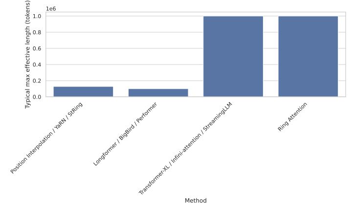

--8<-- "_snippets/disclaimer.md"

# Context Windows Design Matrix

The matrix compares long-context techniques across complexity, maximum effective length, advantages, and caveats. Each row represents a strategy for extending transformer context windows, enabling quick trade-off evaluations.

| **Method** | **Complexity** | **Typical max effective length** | **Advantages** | **Caveats** |
| :--- | :--- | :--- | :--- | :--- |
| Position Interpolation / YaRN / StRing | Quadratic | 32k–128k | Simple to implement; preserves in-window quality | Drift or instability beyond trained range; still quadratic |
| Longformer / BigBird / Performer | Linear or sparse | 100k+ | Scales to long inputs; good for long documents | May lose global information; trained models required |
| Transformer-XL / Infini-attention / StreamingLLM | Streaming | 100k–1M | Handles arbitrarily long streams; bounded memory | Compression may lose information; limited joint reasoning |
| Ring Attention | Distributed quadratic | 1M+ | Exact full attention for extreme lengths | Requires multiple GPUs and high-speed interconnect |
| kNN-LM / RETRO / RAG | Retriever-dependent | Unbounded | Decouples knowledge from window; excels at factual recall | Requires external memory and retriever; alignment complexity |
| FlashAttention / PagedAttention / vLLM | Quadratic but IO-optimised | Hardware-dependent | Makes long context feasible by reducing memory bandwidth; essential for serving | Kernel/serving stack changes required; does not change algorithmic scaling |

## Appendix

### Regeneration

Use `scripts/context-windows-design-matrix.py` to regenerate the chart and interactive table. Requires `plotly` and `kaleido`. The script writes an updated [`context-windows-design-matrix.svg`](context-windows-design-matrix.svg) and a companion HTML table in the same directory.

