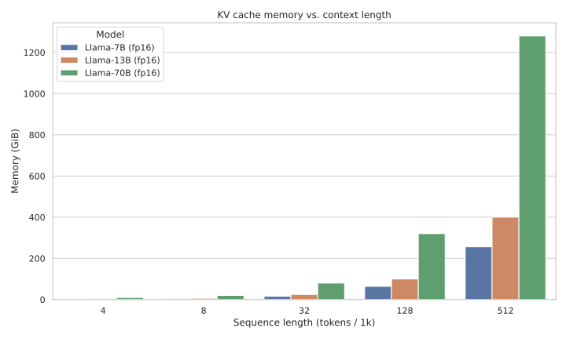

--8<-- "_snippets/disclaimer.md"

[[toc]]

# Context Windows Field Guide

## Executive summary

Modern large language models (LLMs) are defined not only by the number of parameters they contain but by how much input they can consider at once.  The **context window**—the span of tokens processed per call—has grown from 2–4 k tokens in early GPT-3 to hundreds of thousands or even millions of tokens in 2025[^1].  Larger windows unlock new capabilities: summarising long books, reasoning over codebases, preserving conversational state and enabling multi-document question answering.  But context is expensive: doubling the window roughly quadruples compute and memory, and a model’s advertised limit often exceeds what it uses effectively.  Simply increasing the window can lead to the *lost-in-the-middle* effect, where information in the middle of long sequences is ignored[^2], and extreme lengths stress the serving stack and positional encodings.  This guide maps the landscape of context windows in 2025, explains why different models have different limits, details the math behind scaling, surveys the families of techniques to extend or circumvent context limits and outlines a practical multi-tier architecture for approaching an **effectively infinite context**.  For a deeper technical exploration, see the companion [Context Windows Deep Dive](context-windows-deep-dive.md), and consult the [appendix](context-windows-appendix.md) for formulas and evaluation templates.

## 1 Introduction and definitions

LLMs operate on sequences of discrete tokens.  At inference time, a model receives a prompt consisting of **N** tokens and predicts the next token.  The **context window** (also called the attention span or maximum sequence length) is the maximum **N** supported.  When the window is short, tasks requiring long memory—such as analysing lengthy documents or maintaining conversational history—must be broken into pieces, with information condensed or lost.  A 32 k-token window corresponds to roughly 49 pages of text[^1]; a 128 k-token window encompasses an entire novella; a million-token window can contain thousands of pages of code or multiple books.  However, a longer window increases compute cost quadratically (for standard attention) and pushes memory requirements beyond what most GPUs can handle[^3].

### 1.1 Nominal vs effective context

The **nominal context length** is the maximum supported by the model.  The **effective context** is the portion of the input the model actually attends to and utilises during generation.  Studies like *Lost-in-the-Middle* show that even models with 32 k–128 k contexts pay more attention to the first and last few thousand tokens and often ignore content placed in the middle[^2].  Effective context is influenced by positional encodings, training distribution and architectural biases.  Practical evaluation requires tasks that measure retrieval and reasoning across different positions and lengths, such as RULER and LongBench benchmarks.

### 1.2 Memory and compute scaling

For a transformer with **L** layers, **H** heads and head dimension **d**, storing the key–value (KV) cache for each token requires roughly **2 × L × H × d × dtypeBytes** bytes.  For a 70 B-parameter model (L≈80, H≈64, d≈128) in FP16, the KV cache consumes about 2.6 MiB per thousand tokens[^3].  Thus:

```
KV_memory_bytes ≈ 2 × L × H × d × seq_length × dtypeBytes
```



*Figure 1: Near-linear KV cache scaling with model size and token count.*

The underlying data in [context-windows-design-matrix.md](context-windows-design-matrix.md) maps each bar to a model and sequence length, helping you read exact memory requirements from the chart.
{{ read_file('docs/ai-research/context-windows-design-matrix.html') }}


[Interactive table](context-windows-design-matrix.html). Regenerate the SVG and HTML with `scripts/context-windows-design-matrix.py`.
A single 16 k-token request therefore uses over 40 GiB of memory[^3].  Activation memory (intermediate activations needed for backpropagation) also scales with sequence length.  Training long contexts often requires gradient accumulation, checkpointing, recomputation or reversible layers to manage memory[^4].  During inference, memory fragmentation and scheduler constraints further limit the usable window.  Hardware improvements (larger VRAM, faster memory bandwidth) and algorithmic innovations (FlashAttention, PagedAttention) are critical to make long context practical.

## 2 Landscape of context sizes in 2025

The race to extend context windows has accelerated dramatically.  Models launched in 2025 span five orders of magnitude.  Table 1 summarises representative context windows and their typical use cases.

| Model (2025) | Approx. context window | Notes and typical uses |
|---|---|---|
| **Magic.dev LTM-2-Mini** | 100 million tokens | Processes entire code repositories or large document corpora; built for ultra-long code comprehension[^5]. |
| **Meta Llama 4 Scout** | 10 million tokens | MoE model delivering a 10 M-token window on a single GPU, suitable for on-device multimodal workflows and book-length summarisation[^6]. |
| **GPT-4.1 / Gemini 2.5 Pro/Flash / Llama 4 Maverick** | 1 million tokens | Frontier models offering million-token windows for complex multimodal tasks, deep research and enterprise document analysis[^7].  Gemini 1.5 Pro has demonstrated up to 10 million tokens in research experiments[^8]. |
| **Claude 4 & 3.7 Sonnet, OpenAI o3/o4** | 200 k tokens | High-precision multi-step reasoning and safe multi-turn dialogues[^9]. |
| **GPT-4o, Mistral Large 2, DeepSeek R1/V3, Mistral Medium 3** | 128 k tokens | Balanced efficiency and performance across vision-language tasks, code generation and summarisation[^10]. |
| **Llama 3.1 8B/70B, Claude 3.5 Sonnet, Gemini 1.0** | 100 k – 128 k tokens | Extended via position scaling techniques or trained from scratch with long contexts[^1]. |
| **GPT-3.5, Mistral 7B** | 8 k – 32 k tokens | Early models with limited windows; still widely used for cost-effective tasks. |

The progression from 8 k to 100 million tokens has been achieved through a combination of longer pre-training sequences, improved positional encodings, sparse attention, compressive memory and system-level innovations.  However, many of these extremely large contexts are experimental or restricted to certain tiers of customers.  Using them effectively requires careful engineering.

## 3 Why context sizes differ

### 3.1 Training length and positional encoding

Transformers need a way to represent token positions.  Most mainstream models use **rotary position embeddings** (RoPE), which encode relative positions as complex exponentials and naturally generalise across sequence lengths.  RoPE parameters are implicitly trained only up to the maximum sequence length seen during pre-training.  Extrapolating to longer positions without adaptation can produce very large attention scores, causing instabilities.  Several techniques have emerged to extend RoPE:

* **Position Interpolation (PI):** downscales the input positions so that a model trained on 2 k tokens can be fine-tuned to handle 32 k or 64 k tokens without modifying the architecture[^11].  PI ensures that the effective positional frequencies remain within the range the model has seen, avoiding large magnitude attention values.
* **YaRN:** modifies the interpolation schedule to reduce the number of tokens needed during fine-tuning, enabling RoPE models to reach 128 k tokens with 10× fewer tokens and 2.5× fewer steps[^12].
* **StRing:** shifts the position indices during fine-tuning, rebalancing the distribution of positional frequencies and improving performance on long-context benchmarks[^13].  Models fine-tuned with StRing on 70 B parameters surpass GPT-4-128 k and Claude 2 on RULER and InfiniteBench tasks[^13].
* **ALiBi:** uses a linear bias in attention that can extrapolate gracefully beyond the training range.  It is used by some models (e.g., early GPT-NeoX and Pythia) and allows training with shorter sequences.
* **Relative position encodings (Transformer-XL):** encode distances rather than absolute positions, enabling recurrence across segments[^14].

By contrast, models like Llama 4 Scout and GPT-4.1 were trained from scratch with long sequences.  Their positional embeddings and attention layers have directly experienced millions of tokens, avoiding the need for extrapolation.  Training with long sequences is expensive and requires gradient accumulation, but yields more stable long-context behaviour.

### 3.2 Memory and compute ceilings

Even if a model can theoretically attend to a million tokens, hardware limits may make such contexts impractical.  VRAM memory is dominated by the KV cache.  For example, a 7 B model with 32 layers and 32 heads might require ~0.7 MiB per thousand tokens; a 70 B model uses ~2.6 MiB[^3].  Serving a million-token prompt for a 70 B model would require over 2.6 TiB of memory—beyond any single GPU.  Multi-GPU systems can shard the KV cache (as in Ring Attention), but high-speed interconnects are needed.  Activation memory during training also scales with sequence length, requiring gradient checkpointing or reversible layers.  All of these factors influence the maximum *practical* context length.

### 3.3 Serving stack and scheduling

Long contexts often cause performance degradation due to kernel inefficiencies, memory fragmentation and scheduling overhead.  **FlashAttention** reorders the attention computation to reduce memory traffic and achieve near-ideal bandwidth, enabling longer sequences and higher throughput[^3].  **PagedAttention** in vLLM stores KV tensors in a paged format and evicts unused pages, allowing dynamic batching and greatly reducing fragmentation.  Without such kernel and memory improvements, the overhead of moving KV tensors around can dominate runtime.  Thus the same model may have different effective context windows depending on the serving environment.

## 4 Effective vs nominal: how models use long context

Models seldom use their entire window uniformly.  **Lost-in-the-Middle** experiments place a “needle” (a piece of relevant information) at various positions within a long prompt.  Even models with extended contexts perform best when the needle is at the beginning or end; accuracy drops when it is placed in the middle[^2].  This suggests that positional encodings and attention patterns bias the model toward recency and early positions.  Effective context is further reduced by the training distribution; if most training sequences are <4 k tokens, the model may not learn to distribute attention evenly across 128 k positions.

The **RULER** benchmark extends “needle in a haystack” to multi-step reasoning and aggregation over sequences up to 1 M tokens.  **LongBench** and **LongBench v2** evaluate summarisation, code understanding, question answering and mathematical reasoning at 32 k–512 k tokens.  These benchmarks measure not only retrieval but also whether the model can combine distant pieces of information and perform arithmetic or logic.  Evaluations must report performance as a function of sequence length and token position, along with throughput and VRAM usage, to capture effective context.

## 5 Strategies for extending or circumventing context limits

### 5.1 Extended positional encodings

Position scaling methods (PI, YaRN, StRing, NTK scaling) retrofit RoPE models to longer contexts with minimal modifications.  They are inexpensive to implement and maintain performance within the original window.  However, extreme extrapolations may lead to drift or instability, and the attention computation remains quadratic.  They are well suited to extending models to 32 k–128 k tokens.

### 5.2 Efficient and sparse attention

Reducing the number of pairwise interactions lowers the asymptotic cost.  **Longformer** uses a sliding local window with a handful of global tokens, achieving linear complexity and outperforming RoBERTa on long document tasks[^15].  **BigBird** combines local, random and global attention; it offers theoretical guarantees for capturing dependencies and scales to hundreds of thousands of tokens.  **Performer** approximates softmax attention using random feature maps, making attention linear in sequence length.  Other variants (Reformer, Nyströmformer, Linformer) employ low-rank or kernel approximations.  These techniques enable long contexts but may sacrifice some global reasoning capability and require training from scratch or substantial fine-tuning.

### 5.3 Streaming, recurrent and compressive models

Models like **Transformer-XL** employ segment-level recurrence and relative positional encodings to reuse past hidden states[^14].  **StreamingLLM** introduces “attention sinks” and sliding windows that allow continuous processing without storing all keys and values.  **Compressive Transformer** and **Infini-attention** add a compressive memory that summarizes distant past activations; Infini-attention combines masked local attention with long-term linear attention and compressive memory to handle sequences hundreds of thousands of tokens long[^16].  These methods achieve essentially unbounded context with bounded memory but require custom architectures and may lose fine-grained information across long distances.  They are ideal for streaming inputs, logs and chat applications where approximate memory suffices.

### 5.4 Distributed full attention

When one needs exact full attention over extreme lengths, sequences can be distributed across multiple devices.  **Ring Attention** partitions the sequence into blocks across devices and rotates the key and value blocks around the ring while computing attention, overlapping communication with computation[^17].  This allows processing sequences millions of tokens long without approximations but requires as many devices as the block size and high-speed interconnects.  It is used primarily in research and high-end deployments.

### 5.5 External memory and retrieval augmentation

Instead of storing all context within the model, one can retrieve relevant information from an external datastore.  **kNN-LM** augments a base language model by interpolating its next-token distribution with a k-nearest-neighbour search over an embedding datastore[^18].  **RETRO** uses a frozen BERT retriever to fetch chunks from a large corpus and cross-attends to them[^19].  Retrieval-augmented generation (RAG) decouples knowledge from the context window, allowing a modest window (e.g., 8 k tokens) to answer questions about arbitrarily long documents.  However, these approaches require building and maintaining a retrieval index and rely on the retriever’s recall; they also introduce latency due to the search step.

### 5.6 System-level and architectural optimisations

**FlashAttention** reorders the loops in attention computation to maximize memory locality and minimise redundant reads and writes, achieving exact attention with much lower memory bandwidth[^3].  **PagedAttention** in vLLM uses a paged KV cache and dynamic batching to avoid fragmentation and support concurrent requests at long context lengths.  **Quantisation** and **Mixture-of-Experts (MoE)** architectures can reduce memory footprint per token; MoE models like Llama 4 Scout use gating to activate only a subset of experts, enabling larger contexts on the same hardware[^6].  Training strategies such as gradient accumulation, reversible layers and memory-efficient optimisers allow fine-tuning at longer sequence lengths without prohibitive memory usage[^4].

## 6 Evaluation and benchmarking

When evaluating long-context models, one should measure more than single-needle retrieval.  A comprehensive evaluation plan includes:

* **Retrieval tests** (Needle in a Haystack, RULER retrieval): insert unique identifiers at different positions and lengths and measure recall accuracy.
* **Aggregation and arithmetic**: ask the model to count, sum or compute statistics across dozens of numbers spread across the sequence (RULER aggregation tasks).  This reveals whether it can integrate information across long distances.
* **Multi-hop reasoning**: place relevant sentences far apart and ask for a conclusion that requires combining them (LongBench reasoning tasks).  Evaluate success rate and error types.
* **Real-world tasks**: long document summarisation, codebase question answering and multi-document QA (LongBench and LongBench v2).  Vary sequence lengths (4 k, 32 k, 128 k, 512 k, 1 M) and record both accuracy and latency.
* **Position sensitivity**: measure accuracy when relevant information is placed at the beginning, middle or end of the sequence.
* **Resource metrics**: record VRAM usage, KV bytes per token and tokens per second (prefill and decode).  These metrics highlight system-level bottlenecks.

Public benchmarks such as Lost-in-the-Middle[^2], RULER, LongBench, LongBench v2 and InfiniteBench provide standardised tasks.  However, custom tests tailored to an application’s domain (e.g., legal document analysis, code comprehension) are essential for real-world deployment.

## 7 Toward effectively infinite context


*Figure: Tier 1 keeps a working set in full attention, Tier 2 compresses long-range history, Tier 3 retrieves from external memory, and optional Tier 4 uses distributed full attention for extreme cases.*

No single method provides an infinite context; practical systems layer multiple techniques to approximate it.  A **three-tier architecture** can achieve near-infinite context:

1. **Working set (Tier 1):** Keep a small window (8 k–32 k tokens) in full attention using FlashAttention or similar kernels.  Use a paged KV cache and smart eviction policies to prioritise recent and important tokens.  This tier supports precise reasoning and short-term memory.
2. **Compressed stream (Tier 2):** Use a streaming or compressive model (e.g., Transformer-XL or Infini-attention) to summarise the distant past into a fixed-size state[^14][^16].  This allows the system to remember salient information across hundreds of thousands of tokens without storing all keys.  The compressed state is updated as new tokens arrive.
3. **External memory and retrieval (Tier 3):** Store the entire conversation history and relevant documents in a retrieval index.  At each step, retrieve the most relevant chunks based on the current query and insert them into the working set.  This decouples knowledge from the window and enables unlimited memory.  Use RAG or kNN-LM style interpolation to integrate retrieved information[^18].

Optional **Tier 4** for extreme cases uses distributed full attention (e.g., Ring Attention) across multiple GPUs to process million-token sequences exactly[^17].  This is used for research experiments or one-off deep analyses.

To implement such a system in practice:

* Preprocess the input to identify salient sections and index them for retrieval.
* Use a summariser or compressive model to maintain a running condensed memory.
* Employ dynamic windowing: if the query only references recent content, keep Tier 3 off; if the question requires older information, retrieve and insert relevant chunks.
* Monitor memory and latency; adjust window sizes, compression rates and retrieval top-k accordingly.

## 8 Future directions and open problems

As context windows expand, new challenges emerge.  **Attention span vs. quality trade-off:** bigger windows do not guarantee better answers; models may hallucinate or become distractible when given huge amounts of irrelevant information.  **Memory bandwidth and energy:** million-token contexts push hardware to its limits.  **Alignment of retrieved information:** retrieval-augmented models must ensure that retrieved chunks are relevant and that the model integrates them correctly.  **Hybrid architectures:** combining state-space models (e.g., Mamba), MoE routing and compressive memory may yield better scaling.  **Better benchmarks:** current tests focus on retrieval and summarisation; we need tasks that stress reasoning over long causal chains and mixing of modalities.  **Long-range safety:** handling harmful content and personal information becomes more challenging when the context includes entire books or codebases.

Researchers are exploring **state-space models** (Mamba) and **implicit memory mechanisms** that encode long sequences without quadratic attention.  Others are working on **neuromorphic architectures** and **photonic accelerators** to overcome memory bandwidth limits.  Meanwhile, software engineers are integrating retrieval, summarisation and compression into production chatbots and code assistants.  The next frontier may involve **adaptive context allocation**, where the model itself decides which parts of the history to keep at high fidelity and which to compress or discard.

## 9 Conclusion

The context window is a key determinant of what an LLM can do.  While nominal windows have expanded dramatically—from thousands to millions of tokens—the true power lies in using context effectively.  Memory and compute constraints, positional encoding limits and bias toward recent tokens mean that bigger windows are not automatically better.  A rich ecosystem of techniques—positional scaling, efficient attention, streaming and compressive models, distributed attention, external memory, and system-level optimisations—offers many ways to extend context length or sidestep it.  Building systems that approximate an effectively infinite context requires layering these methods, carefully evaluating their trade-offs and monitoring resource usage.

As hardware improves and architectures evolve, LLMs will continue to push the limits of context.  The ultimate goal is not just to read more tokens but to understand, reason and act across long horizons.  By combining algorithmic innovation with thoughtful system design, practitioners can harness the benefits of long context while mitigating its costs.

## See also

- [Context Windows Deep Dive](context-windows-deep-dive.md)
- [Context Windows Field Guide — Appendix](context-windows-appendix.md)

[^1]: Source 477669928722032 lines 226-297.
[^2]: Source 812281553901334 lines 65-76.
[^3]: Source 563653443713035 lines 150-171.
[^4]: Source 477669928722032 lines 344-360.
[^5]: Source 480357281697940 lines 73-83.
[^6]: Source 480357281697940 lines 79-83.
[^7]: Source 480357281697940 lines 82-89.
[^8]: Source 162697279310482 lines 304-324.
[^9]: Source 480357281697940 lines 86-89.
[^10]: Source 480357281697940 lines 90-93.
[^11]: Source 989342212075024 lines 50-60.
[^12]: Source 556094126408083 lines 50-60.
[^13]: Source 199134859253240 lines 78-94.
[^14]: Source 626234754762794 lines 260-315.
[^15]: Source 222591077498926 lines 48-60.
[^16]: Source 100878192473897 lines 50-60.
[^17]: Source 138967914803289 lines 71-85.
[^18]: Source 605812693674672 lines 49-63.
[^19]: Source 897139308669472 lines 78-95.
