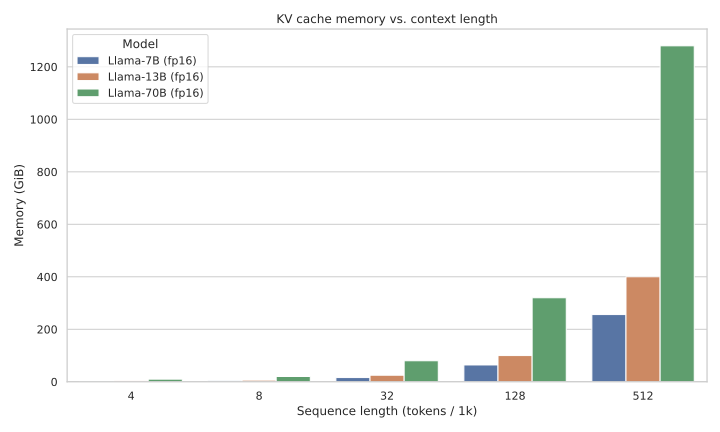

--8<-- "_snippets/disclaimer.md"

# AI Research

This index collects documents exploring context windows, reverse engineering, and strategic planning.

[[toc]]

## Context Windows
- [Context Windows Deep Dive](context-windows-deep-dive.md) — Analyzes long LLM context scaling
- [Context Windows Design Matrix](context-windows-design-matrix.md) — Compares context extension methods
- [Context Windows Field Guide](context-windows-field-guide.md) — Tips for scaling long context windows
- [Context Windows Field Guide — Appendix](context-windows-appendix.md) — Formulas supporting the field guide
- [KV Cache Chart](kv-cache-chart.md) — Memory scaling of key-value caches
- [Logical Chunking Strategies](logical-chunking.md) — Best practices for splitting RAG docs

## Reverse Engineering
- [Reverse-Engineering Design Report: facebookresearch/algonauts-2025 (TRIBE)](reverse-engineering-tribe.md) — Analyzes Meta's TRIBE brain-encoding system
- [Reverse-Engineering Design Report: OpenAI ChatGPT Agent System](reverse-engineering-chatgpt-agent-system.md) — Blueprint for ChatGPT agent architecture
- [Reverse-Engineering Design Report: stanford-oval/storm](reverse-engineering-storm.md) — Examines Stanford's STORM research pipeline
- [Reverse-Engineering GPT-o3 Multi-Turn Reasoning](reverse-engineering-gpt-o3.md) — Blueprint for GPT-o3's multi-turn reasoning
- [Reverse-Engineering Grok 4 Heavy](reverse-engineering-grok4-heavy.md) — Details Grok 4 Heavy's multi-agent architecture
- [Reverse-Engineering OpenAI Codex](reverse-engineering-codex.md) — Blueprint of the reverse-engineered Codex agent

## Strategic Roadmaps
- [Democratizing Brain-Inspired AI: A Strategic Analysis and 5-Year Roadmap for an Open Neuromorphic Ecosystem](open-neuromorphic-roadmap.md) — Five-year roadmap for open neuromorphic computing
- [Seed-Factory Feasibility Dossier](seed-factory-feasibility-dossier.md) — Self-replicating manufacturing feasibility
- [Strategic R&D Roadmap for the DeepThought-ReThought Initiative](strategic-roadmap-deepthought.md) — Bayesian roadmap for the DeepThought project
- [Agentic SWE Discontinuity Forecast](agentic-swe-discontinuity-forecast.md) — Forecasts leaps in agentic software engineering
- [Peaks and Freezes: A Strategic Analysis of AI's 70-Year Hype Cycle and Lessons for the Next Decade](peaks-and-freezes.md) — Reviews AI booms, winters, and lessons
- [The Thick Band of 21st-Century Possibilities](thick-band-of-21st-century-possibilities.md) — Maps plausible twenty-first-century futures

## Additional Topics
- [Grok's Utilization of the X Ecosystem](grok-x-ecosystem-utilization.md) — Real-time X platform data usage
- [The Cognitive Architecture of Artificial Societies](cognitive-architecture-of-artificial-societies.md) — Architectures for emergent multi-agent societies
- [The Energy-Efficient Swarm: A Playbook for High-Density, Multi-Agent LLM Deployment on Consumer GPUs](energy-efficient-swarm.md) — High-density quantized LLM deployment on GPUs
- [Neurosymbolic Reasoning Dossier](neurosymbolic-reasoning-dossier.md) — Surveys hybrid neuro-symbolic AI approaches
- [PRD: Discord 'Friend or Foe' AGI Chatbot](discord-friend-foe-prd.md) — Requirements for a dynamic Discord AGI chatbot
- [Evolving Perspectives on AGI: A Dialogue Between Francois Chollet and Dwarkesh Patel](evolving-perspectives-on-agi.md) — Dialogue on shifting AGI timelines and capabilities
- [You Weren't Supposed to Invent Infinite Jest](you-werent-supposed-to-invent-infinite-jest.md) — Examines addictive media loops from personalized AI
