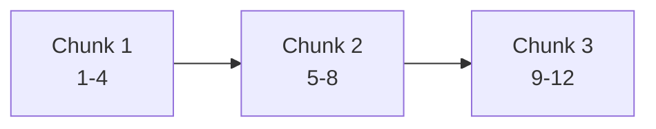

--8<-- "_snippets/disclaimer.md"

# Logical Chunking Strategies

## Introduction

Large language models (LLMs) and embedding models have finite context windows, which means that long documents must be broken into smaller pieces before they can be embedded and searched in a retrieval‑augmented generation (RAG) system. Effective chunking is critical: it allows RAG pipelines to fit data into the context window of embedding models, preserve semantic continuity, improve retrieval accuracy, and reduce latency and cost[^1][^2]. A good chunking strategy ensures that chunks are large enough to capture complete ideas yet small enough to index efficiently. This section surveys factors to consider and common chunking methods, and provides guidelines for selecting chunk sizes and overlaps.

For broader context window strategies, see [Context Windows Field Guide](context-windows-field-guide.md).

## Key Factors for Effective Chunking

When designing a chunking strategy, several variables need to be considered[^1][^2]:

- **Content type and structure:** Long books, technical papers, codebases and chat logs all have different internal structures (chapters, sections, functions) that can guide how to split them. Short documents like tweets may not need chunking at all.
- **Embedding model context size:** Different embedding models support varying context windows (e.g., 1,024 vs. 8,196 tokens). Use the model’s maximum token length as an upper bound for chunk size[^2].
- **Query complexity and use‑case:** Agents running complex multi‑hop queries may benefit from larger chunks to provide richer context, whereas simple Q&A queries may retrieve more relevant information with smaller chunks.
- **Retrieval task:** Semantic search, question answering, summarisation and code assistance each place different demands on chunk size. Consider whether retrieved chunks will be fed into an LLM or directly presented to a user.
- **Context preservation:** Chunks should make sense when read in isolation; if a human cannot understand a chunk without surrounding context, an LLM is unlikely to either[^2].

## Core Chunking Strategies

This section summarises several common chunking methods along with their advantages and limitations.

### Fixed‑Size Chunking

Fixed-size chunking divides documents into chunks of a specified token length, typically equal to or slightly less than the embedding model’s context window[^3][^4]. Because it is simple to implement, fixed-size chunking is a good default starting point[^2]. However, it may cut sentences mid‑thought and ignore natural document structure[^3]. Use this approach when processing large, homogeneous texts or during early prototyping.



### Sentence‑Based Chunking

Sentence-based chunking splits text at sentence boundaries[^3]. This approach preserves semantic units and reduces the risk of splitting in the middle of an idea. It can be implemented with Python libraries like NLTK or spaCy[^2]. Sentence chunking works well for news articles, legal documents and transcripts where sentences encapsulate discrete facts, but may produce uneven chunk sizes and may still cut paragraphs mid‑way[^3].

```python
from nltk.tokenize import sent_tokenize

text = "LLMs need good chunking. This sentence will be separated."
chunks = sent_tokenize(text)
```

### Paragraph‑Based Chunking

Paragraph-based chunking treats each paragraph as a chunk[^3]. This preserves high‑level structure and is appropriate for essays, whitepapers and books where paragraphs express cohesive ideas. It yields variable chunk sizes and can exceed embedding limits for long paragraphs, so additional splitting may be needed. It is often combined with token-limit splitting for consistency.

```python
import re

text = "Paragraph one explains chunking.\n\nParagraph two goes deeper."
chunks = [p.strip() for p in re.split(r"\n{2,}", text) if p.strip()]
```

### Sliding‑Window Chunking

Sliding‑window chunking creates overlapping windows of a fixed length that slide through the document[^3]. Overlap ensures continuity across chunks and alleviates the "lost in the middle" problem, but increases redundancy and storage cost. This strategy is beneficial when retrieving sequential context is critical (e.g., conversation logs) or when using models prone to positional biases.


### Semantic Chunking

Semantic chunking uses embeddings to group sentences about the same topic[^3][^2]. By measuring semantic distances between sentence groups, it identifies natural topic shifts and uses those as boundaries. Semantic chunking produces highly coherent chunks suited for diverse documents with irregular structure (e.g., multi-topic reports). However, it requires computing intermediate embeddings and may be more complex to implement[^3].

### Recursive Chunking

Recursive chunking splits text hierarchically using a predefined set of separators (e.g., double newlines, single newlines, spaces) until chunks meet a target length[^3][^2]. Tools like LangChain’s `RecursiveCharacterTextSplitter` implement this approach. It balances preserving structure with achieving uniform chunk sizes, making it a versatile choice for many text types.

### Context‑Enriched Chunking

When documents are very long or contain rapidly shifting topics, even semantic chunking may lose important global context. Context-enriched chunking attaches a summary or metadata to each chunk[^3]. Anthropic’s contextual retrieval approach prompts a language model with the entire document and its chunk to generate a description that captures high-level meaning, which is then appended and embedded[^5]. This technique helps maintain global awareness at the cost of extra tokens.

### Modality‑Specific Chunking

Different data formats require specialised chunking methods[^3][^2]. For example, PDF files may be split using headings and table structures; HTML can be chunked by tags; Markdown can be chunked by heading levels; LaTeX can be chunked by section commands. Code may be split by functions or classes. Tailoring chunking to the data modality improves context preservation and retrieval relevance.

### Agentic and Subdocument Chunking

For agentic workflows, chunking must support iterative reasoning and tool use. Agentic chunking splits documents into task‑oriented subdocuments (e.g., introduction, method, results) so that an agent can retrieve only the section needed to perform a subtask[^3]. Similarly, subdocument chunking isolates specific elements (tables, code blocks, diagrams) for targeted retrieval. These approaches are particularly useful when combining natural language and structured data.

### Hybrid Chunking

Hybrid approaches combine two or more strategies to balance their strengths[^3][^5]. For instance, one can apply sentence splitting and then enforce a maximum token length, or use semantic chunking to group related sentences and then apply a sliding window with overlap. Hybrid chunking often yields the best retrieval performance across varied document types.

## Chunk Size and Overlap

Selecting the right chunk size involves balancing context preservation with retrieval performance. Too small and the chunk may lack context; too large and it may exceed embedding limits or degrade search accuracy. A typical starting range is 200–600 tokens for general text, with adjustments for domain‑specific documents (e.g., longer for legal). Overlapping chunks by 10–20 % can mitigate context loss but increases index size[^4]. It is often necessary to experiment with different sizes and overlaps and measure retrieval metrics to identify the optimal configuration[^2].

## Best Practices

- **Preserve natural boundaries:** Whenever possible, split on paragraph or sentence boundaries to maintain coherence[^3].
- **Iterate and evaluate:** Test different chunk sizes and strategies on a representative dataset and evaluate retrieval accuracy[^2].
- **Align with downstream models:** Match chunking decisions to the context length of your embedding and generation models[^2].
- **Use appropriate tools:** Libraries such as NLTK, spaCy and LangChain provide reliable sentence segmentation and recursive splitting utilities[^2].
- **Combine strategies:** Start with simple fixed-size or sentence-based splitting, then refine using semantic or hybrid approaches when necessary.

## Conclusion

Logical chunking is a foundational step in retrieval‑augmented generation systems. Thoughtful chunking improves recall, reduces hallucination risk and helps LLMs use context effectively. By considering the type of content, embedding model limits, downstream tasks and available tools, practitioners can choose or combine chunking strategies that best suit their application. Continuous experimentation and measurement are essential, since optimal chunk size and method often vary across domains. Adopting a flexible, evidence‑based approach to chunking will yield more accurate and efficient RAG pipelines.

## See also

- [Context Windows Field Guide](context-windows-field-guide.md)
- [Context Windows Deep Dive](context-windows-deep-dive.md)
- [Reverse-Engineering GPT-o3 Multi-Turn Reasoning](reverse-engineering-gpt-o3.md)

[^1]: Grgoire Mialon et al., "Augmented Language Models: a Survey," arXiv, 2023. https://arxiv.org/abs/2302.07842
[^2]: OpenAI, "Retrieval Augmented Generation," https://platform.openai.com/docs/guides/rag
[^3]: Pinecone, "Chunking Strategies for LLM Applications," https://www.pinecone.io/learn/chunking-strategies/
[^4]: Nelson F. Liu et al., "Lost in the Middle: How Language Models Use Long Contexts," arXiv, 2023. https://arxiv.org/abs/2307.03172
[^5]: Anthropic, "Contextual Retrieval," https://www.anthropic.com/engineering/contextual-retrieval
