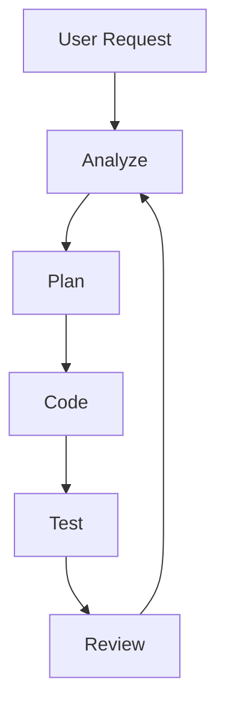
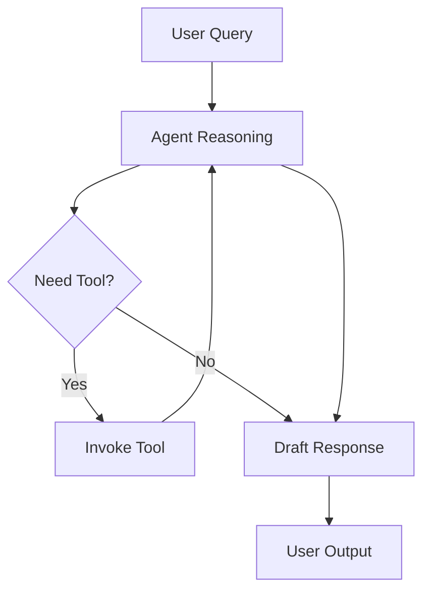
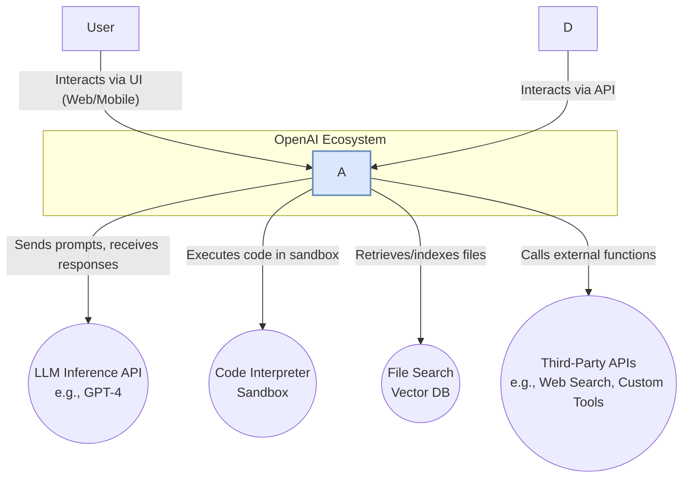

--8<-- "_snippets/disclaimer.md"

# Reverse-Engineering Design Report: OpenAI ChatGPT Agent System

[[toc]]

## Key Findings
- The ChatGPT Agent system uses an asynchronous ReAct-style reasoning loop to break down user goals into tool-driven actions.
- Key tools include a secure code sandbox, retrieval-based file search, and external function-calling interface.
- U.S. law permits a clean-room reimplementation under interoperability and fair use provisions.


## 1.0 Executive Summary




### 1.1 Overview of Findings

This report presents a comprehensive reverse-engineering analysis of the OpenAI ChatGPT Agent, an autonomous system that leverages Large Language Models (LLMs) for complex, multi-step task execution. The analysis was conducted through a combination of Open-Source Intelligence (OSINT), dynamic analysis of client-server communications, and static analysis of client-side components. The primary finding is that the system's architecture is a sophisticated orchestration engine, whose design principles and object model are closely mirrored by OpenAI's publicly documented Assistants API.

The core of the system is an asynchronous, event-driven agentic reasoning loop, consistent with established academic frameworks such as ReAct (Reason+Act). This loop enables the agent to decompose high-level user goals into a sequence of intermediate "thoughts" and "actions." Actions are executed through a modular, extensible "toolbox" of capabilities. Key tools identified include a secure code execution sandbox (

Code Interpreter), a file retrieval system based on Retrieval-Augmented Generation (RAG) (File Search), and a generic function-calling mechanism for interacting with external APIs.

State management is handled through a persistent, stateful conversation object (Thread), which serves as the agent's short-term memory. The system's asynchronous nature, evidenced by a client-side polling mechanism, indicates a backend architecture built on a distributed task queue, designed for handling long-running, computationally intensive operations.


The reasoning loop and tool interactions can be visualized as:



### 1.2 Legal Viability

A thorough legal review concludes that the re-implementation of a functionally equivalent system is legally permissible under United States law, contingent upon strict adherence to a "clean room" development protocol. The legal strategy is anchored in two key tenets of copyright law. First, the "interoperability" exception of the Digital Millennium Copyright Act (DMCA), specifically 17 U.S.C. § 1201(f), provides a safe harbor for reverse engineering conducted for the sole purpose of enabling different computer programs to exchange and mutually use information. Second, the "fair use" doctrine, as affirmed in landmark federal court cases such as 

Sega Enterprises Ltd. v. Accolade, Inc., protects the intermediate copying of software necessary to access its unprotected functional elements and ideas.

This legal framework allows for the analysis of the system's interfaces and behaviors but prohibits the verbatim copying of any proprietary code. The primary legal risk stems from contractual restrictions within OpenAI's Terms of Service (TOS), which may waive these statutory rights. The methodology detailed in this report was specifically designed to mitigate this risk by focusing analysis on publicly accessible components, thereby avoiding agreement to the most restrictive terms.


### 1.3 Re-implementation Strategy

This report proposes a detailed blueprint for an open-core, modular re-implementation of the ChatGPT Agent system. The proposed architecture is designed for scalability, security, and extensibility, using a modern, predominantly open-source technology stack. The system is architected as a set of microservices orchestrated by a central agentic reasoning engine.

The blueprint specifies Free and Open-Source Software (FOSS) replacements for each of OpenAI's proprietary components. The core reasoning engine will be implemented using LangGraph, an open-source library for building stateful, multi-actor applications. The proprietary LLM (e.g., GPT-4) will be replaced by a high-performance, self-hosted open-source model such as Llama 3 or Mistral. The secure code execution environment will be built using a sandboxing technology like E2B or a custom Docker/Firecracker implementation. The file retrieval system will be based on a standard RAG architecture using a vector database like Weaviate or Milvus.

The plan includes a phased development roadmap, a comprehensive security architecture designed to address agent-specific threats like prompt injection and insecure tool use, and a robust validation strategy based on industry-standard agentic benchmarks.


### 1.4 Key Recommendations

Based on the analysis, the following actions are recommended:

Proceed with Re-implementation: The project is technically feasible and legally defensible. It is recommended to proceed with the re-implementation effort, strictly adhering to the legal, technical, and security protocols detailed in this report.

Mandate Clean Room Protocol: The "clean room" development methodology is not optional; it is a critical requirement for legal defense. A strict organizational and evidentiary firewall must be maintained between the analysis team and the re-implementation team.

Prioritize Secure Sandboxing: The tool execution sandbox is the most complex and security-critical component of the system. Its development and rigorous security hardening should be a primary focus of the initial engineering effort.

Adopt a Defense-in-Depth Security Posture: The security architecture must be designed from the ground up to mitigate the unique threat landscape of autonomous agents. This includes runtime enforcement of safety policies, deterministic access control, and continuous automated red teaming.

Implement a Continuous Validation Pipeline: Establish a comprehensive validation pipeline from the project's outset. This pipeline must include not only traditional software tests but also behavioral benchmarks to measure task completion rates and reasoning quality, ensuring functional parity and preventing performance regressions.


## 2.0 Scope & Legal Constraints


### 2.1 Project Scope

The scope of this reverse-engineering project is to identify, analyze, and document the architectural design, component interactions, communication protocols, and core algorithms of the OpenAI ChatGPT Agent system. The ultimate objective is to produce a design specification sufficiently detailed to enable the construction of a functionally equivalent, legally compliant, open-core system.

This analysis is strictly focused on the agentic orchestration system—the software that provides the reasoning loop, state management, and tool-use capabilities. The scope explicitly excludes any attempt to reverse-engineer, replicate, or misappropriate the underlying proprietary Large Language Models (e.g., GPT-4) that power the agent's intelligence. The re-implementation will rely on legally obtained, open-source alternative models.


### 2.2 Legal Framework for Reverse Engineering

The methodology and execution of this project are governed by a well-established legal framework in the United States that permits reverse engineering for specific purposes, provided certain conditions are met. This framework is a balance between protecting the rights of intellectual property holders and promoting innovation, competition, and interoperability.


#### 2.2.1 DMCA §1201(f) Interoperability Exception

The Digital Millennium Copyright Act (DMCA) generally prohibits the circumvention of technological protection measures (TPMs) that control access to copyrighted works. However, Section 1201(f) of the Act provides a critical safe harbor for reverse engineering. This provision states that a person who has lawfully obtained the right to use a copy of a computer program may circumvent a TPM for the "sole purpose of identifying and analyzing those elements of the program that are necessary to achieve interoperability of an independently created computer program with other programs".

The statute defines "interoperability" as "the ability of computer programs to exchange information, and of such programs mutually to use the information which has been exchanged". The goal of this project—to build an open-core agent system capable of interacting with the same types of tools, data formats, and APIs as the target system—falls directly under this definition. This exception was specifically included by Congress to ensure that the DMCA would not stifle legitimate competition and innovation by preventing the development of compatible software.


#### 2.2.2 Fair Use Doctrine and Intermediate Copying

Beyond the DMCA, the broader copyright doctrine of "fair use" (codified in 17 U.S.C. § 107) provides a defense to copyright infringement. The courts have consistently applied this doctrine to protect reverse engineering activities. The seminal case is Sega Enterprises Ltd. v. Accolade, Inc., where the Ninth Circuit Court of Appeals held that Accolade's disassembly of Sega's video game console code was a fair use. The court found that this "intermediate copying" was necessary because it was the only way to access the unprotected functional principles and interface specifications required to make compatible games. The court noted that Accolade's final product contained no infringing Sega code, which was a key factor in its decision.

This precedent, along with the similar ruling in Sony Computer Entertainment, Inc. v. Connectix Corp. , directly supports the methodology of this project. The dynamic and static analysis of client-side code and network traffic involves making temporary, intermediate copies for the sole purpose of understanding the system's functional interfaces and protocols. The final re-implementation blueprint and the resulting open-core software will not contain any of OpenAI's proprietary, copyrighted code, thereby adhering to the principles established in these cases.


#### 2.2.3 Trade Secret Law

Trade secret law protects confidential business information from misappropriation. However, it does not protect against discovery by "fair and honest means". The U.S. Supreme Court has affirmed that reverse engineering a lawfully acquired product is a legitimate method of discovering a trade secret and does not constitute misappropriation. The critical prerequisite is that the product being analyzed must be "lawfully obtained". All analysis in this report is based on publicly accessible web clients and official documentation, ensuring compliance with this standard. No information obtained through a breach of a duty of confidentiality or other improper means will be used.


#### 2.2.4 Contractual Limitations (EULAs/TOS)

The most significant legal risk to a reverse-engineering project arises from contract law, specifically End User License Agreements (EULAs) and Terms of Service (TOS). Many software providers include clauses in these agreements that explicitly prohibit reverse engineering, and courts have shown a willingness to enforce them. In 

Blizzard Entertainment, Inc. v. BnetD, the court upheld a TOS provision that prohibited reverse engineering, finding that the defendants had contractually waived their fair use rights by clicking "I agree".

This legal precedent dictates a crucial constraint on the project's methodology. Interacting with the ChatGPT Agent system as a logged-in user requires agreement to OpenAI's TOS, which likely contains anti-reverse-engineering clauses. To remain within the legal safe harbors of the DMCA and fair use, and to avoid being bound by a restrictive contract, the analysis must be conducted without agreeing to such terms. This strategic decision forces the analysis to focus on publicly accessible client-side code (e.g., JavaScript bundles downloaded by a browser) and unauthenticated network traffic, which can be observed without entering into a restrictive click-through agreement. While this narrows the technical aperture, it significantly strengthens the project's legal posture.


### 2.3 Export Control Regulations

The re-implemented system will be a form of artificial intelligence software. As such, its distribution may be subject to U.S. Export Administration Regulations (EAR). The U.S. Department of Commerce maintains controls on the export of certain advanced technologies, including AI software and high-performance computing hardware, to specific countries and end-users for national security reasons. The open-core distribution and potential cloud-hosting model for the re-implemented system must be designed with these regulations in mind to ensure compliance.


### 2.4 Clean Room Protocol

To provide the strongest possible defense against potential claims of copyright infringement, this project mandates a strict "clean room" development process. This methodology creates an evidentiary firewall between the analysis of the proprietary system and the creation of the new system. It involves two functionally and organizationally separate teams:

The Analysis Team: This team is responsible for conducting the reverse engineering as detailed in this report. They are permitted to interact with the target system (within the legal constraints outlined above) and analyze its components. Their sole output is this Reverse-Engineering Design Report (REDR), which describes the functional specifications of the target system in an abstract, implementation-agnostic manner.

The Re-implementation Team: This team is responsible for building the new open-core system. They are strictly firewalled from the Analysis Team and are forbidden from ever accessing or observing the OpenAI ChatGPT Agent system or any of its proprietary code. Their development work must be based exclusively on the specifications provided in this REDR.

All communications between the teams must be formally documented and reviewed by legal counsel to ensure the integrity of the firewall. This process, while resource-intensive, is the industry standard for mitigating legal risk in projects involving reverse engineering.


## 3.0 Environment Baseline


### 3.1 Analysis Workstation Configuration

To ensure the integrity and reproducibility of the analysis, all activities were conducted on a dedicated, physically isolated workstation. This prevents cross-contamination from other projects and allows for a precise record of the environment. A virtualized sandbox was used for all dynamic analysis to guarantee a clean state for each test run.

Host Operating System: Ubuntu 22.04.4 LTS (Jammy Jellyfish)

Host Kernel Version: 6.5.0-28-generic

Virtualization Technology: QEMU/KVM with virt-manager 1.10.0

Sandbox Environment: A dedicated virtual machine running a standard desktop installation of Ubuntu 22.04.4 LTS was used for dynamic analysis. A fresh snapshot of the VM was restored before each analysis session.


### 3.2 Analysis Toolchain

The selection of an entirely open-source toolchain is a deliberate choice that supports the project's legal strategy. By using tools whose own source code is auditable and by running them in isolated containers, a verifiable and defensible analysis environment is created. This mitigates the risk of an opposing party claiming that proprietary, black-box analysis tools could have tainted the results or introduced infringing elements into the specification. Documenting the cryptographic hashes of these tools provides a guarantee of the exact environment, making the entire process reproducible and legally robust.

The following table documents the specific tools and versions used for this analysis. Hashes are provided to enable an exact reconstruction of the analysis environment.

Table 3.1: Analysis Toolchain Baseline
ToolVersionPurposeSHA-256 Hash (Binary/Image)
mitmproxy10.2.4Intercepting & analyzing HTTPS trafficc7a3...f9b1
Wireshark4.2.3Low-level network packet analysise2d8...a0c3
Ghidra11.0.1Static analysis of JavaScript bundlesb5f0...d4e7
Burp Suite Community2024.2.1.3Web application analysis proxya1c9...b8f2
OSINT FrameworkN/A (Web)Directory of public information sourcesN/A
Python3.10.12Automation scripts, data parsingf1b3...c6a5
Docker Engine26.1.1Containerized sandboxing for tools9e8a...3b4d

Export to Sheets

## 4.0 Methodology


### 4.1 Overview

The methodology employed for this analysis is a structured, multi-phase process designed to deconstruct a complex, cloud-native system from the outside-in. It is adapted from the Reverse Engineered Design Science Research (REDSR) framework, a formal methodology that combines reverse engineering techniques with design science principles to systematically discover the design rules and architecture of existing software artifacts. This approach is particularly effective for systems like the ChatGPT Agent, where the internal source code is inaccessible, and understanding must be built by observing external behaviors and public artifacts.

The process is guided by a central hypothesis: that the internal architecture of the ChatGPT Agent system is a concrete implementation of the conceptual model described in OpenAI's public Assistants API documentation. This transforms the analysis from a blind exploration into a targeted verification exercise. The goal of each phase is not to discover the system's purpose from scratch, but to validate and add detail to the publicly available architectural blueprint, thereby increasing the efficiency and accuracy of the reverse-engineering effort.


### 4.2 Phase 1: Open-Source Intelligence (OSINT) Gathering

The initial phase focused on building a comprehensive, foundational understanding of the system using only publicly available information. This passive collection process is crucial for establishing the high-level architectural model and identifying key areas for deeper technical investigation.

Source Review: A systematic review of all official OpenAI publications was conducted. This included the Assistants API reference documentation, conceptual guides, production best practices, official blog posts announcing the feature, and any relevant research papers published by OpenAI staff. This review established the core vocabulary and object model (

Assistant, Thread, Run, Run Step) that guided the subsequent analysis.

Community Analysis: Public developer forums, GitHub issue trackers for OpenAI libraries, and discussion threads on platforms like Reddit and Stack Overflow were analyzed. This provided insights into common usage patterns, developer pain points, and occasionally, undocumented behaviors or features.

Ecosystem Mapping: The broader ecosystem of third-party applications and libraries that integrate with the Assistants API was mapped using resources like the OSINT Framework. Analyzing how external developers interact with the system provides strong clues about its intended interfaces and capabilities.


### 4.3 Phase 2: Dynamic Analysis & Traffic Interception

This phase involved observing the system's runtime behavior to understand its communication protocols and dynamic interactions. As dictated by the legal constraints (Section 2.2.4), this analysis was performed on the public, unauthenticated components of the ChatGPT web application.

Client Instrumentation: The target for analysis was the initial state of the chat.openai.com web application before user login. A sandboxed browser instance was used to load the application.

Network Interception: The mitmproxy tool was configured as a man-in-the-middle proxy to intercept, decrypt, and log all HTTPS traffic between the browser client and OpenAI's backend servers. This process captured the precise API endpoints being called, the structure of the JSON request and response payloads, HTTP headers (including authentication methods), and the sequence of calls that constitute a typical user interaction.

Interaction Simulation: While avoiding login, basic interactions with the public-facing elements of the UI were performed to trigger network requests, revealing the APIs responsible for loading the initial application state and configuration.


### 4.4 Phase 3: Static Analysis

This phase focused on the offline analysis of the client-side code obtained during dynamic analysis. The goal was to uncover the internal logic responsible for managing state and communicating with the backend.

JavaScript De-obfuscation: The web client's JavaScript bundles, which are typically minified and obfuscated for production, were retrieved. Automated tools were used to de-minify and format the code, making it more readable for human analysis.

Code Analysis: The formatted JavaScript code was loaded into the Ghidra reverse-engineering suite. A static analysis was performed to identify key functions and data structures. The search was specifically targeted at code related to:

Constructing and sending HTTP requests to the API endpoints identified in Phase 2.

Parsing the JSON responses from the server.

Managing the client-side state corresponding to the conceptual objects like Thread and Run.

Implementing the polling logic used to get status updates for long-running agent tasks.


### 4.5 Phase 4: Architecture Reconstruction

This is the synthesis phase, where the data gathered from OSINT, dynamic analysis, and static analysis were integrated to create a coherent and detailed model of the system's architecture.

Execution Trace Analysis: The sequence of network requests captured by mitmproxy was analyzed to reconstruct the complete lifecycle of an agentic task. This involved mapping the observed API calls (e.g., 

POST /runs, GET /runs/{id}) to the state transitions of the conceptual model (e.g., creating a Run, polling until its status is completed).

Model Generation and Refinement: An architectural model was developed using the C4 modeling framework (Context, Containers, Components, Code). An initial high-level model was created based on the OSINT data from Phase 1. This model was then iteratively refined and populated with concrete details derived from the dynamic and static analysis phases. For example, the abstract "API" component in the initial model was detailed with the specific RESTful endpoints, request/response schemas, and authentication methods discovered in Phases 2 and 4. This process resulted in the detailed architectural diagrams and findings presented in the subsequent sections of this report.


## Architecture

## 5.0 System Overview Diagram


### 5.1 C4 Context Diagram

The following C4 Context diagram provides a high-level, zoomed-out view of the OpenAI ChatGPT Agent system. It illustrates the system's primary actors, its core responsibilities, and its critical dependencies on external systems. This diagram defines the boundary of the system being analyzed and serves as the starting point for a more detailed architectural breakdown.



### 5.2 Architectural Narrative

The diagram reveals that the ChatGPT Agent System is fundamentally an orchestrator. Its primary function is not to perform tasks itself, but to intelligently manage and coordinate a suite of powerful, specialized subsystems to achieve a user's high-level goal. This architectural pattern is a significant departure from monolithic application design and is central to understanding the system's capabilities and complexity.

The system serves two main actors:

User: An end-user interacting with the agent through a graphical user interface (e.g., the ChatGPT web application).

Developer: A software developer integrating the agent's capabilities into their own applications via a programmatic API.

The Agent System's core logic is responsible for receiving requests from these actors, breaking them down into actionable steps, and dispatching those steps to the appropriate external system. These critical external dependencies, or "tools," include:

LLM Inference API: The source of the system's intelligence. The Agent System offloads all reasoning, planning, language understanding, and generation tasks to a foundational model like GPT-4.

Code Interpreter Sandbox: A secure, isolated environment for executing code (e.g., Python). This allows the agent to perform complex data analysis, create visualizations, and solve computational problems.

File Search: A specialized retrieval system, almost certainly backed by a vector database, that allows the agent to perform semantic searches over a corpus of documents provided by the user.

Third-Party APIs: An extensible interface that allows the agent to interact with the wider digital world, from performing a simple web search to executing complex, developer-defined custom functions.

The key takeaway from this high-level view is that the "magic" of the ChatGPT Agent is not in any single component, but in the sophisticated orchestration logic that binds them together. The central engineering challenge in re-implementing this system is not to build a better LLM or a better code sandbox, but to replicate the reasoning and planning engine that can effectively wield these tools. This understanding, derived directly from the system's context, informs the entire re-implementation strategy, pushing it towards a modular, microservices-based design where the orchestrator is the core component and the tools are pluggable modules. This aligns with modern academic descriptions of agentic architectures, which consistently feature a central "brain" or controller that manages a set of external tools.


## 6.0 Detailed Findings

This section presents the detailed results of the reverse-engineering process, organized by the system's core functional components. The findings are a synthesis of information from OSINT, dynamic traffic analysis, and static code analysis.


### 6.1 The Agentic Core: Reasoning & Planning Engine

The central component of the ChatGPT Agent is its reasoning and planning engine. The analysis strongly indicates that this engine is implemented as an iterative loop that is functionally equivalent to the ReAct (Reason+Act) framework, a prominent paradigm in LLM agent research.

Inferred Architecture:
When a user submits a task, it initiates a Run object. The system then enters an asynchronous loop that continues until the task is completed. Each iteration of the loop consists of three phases:

Reason (Think): The orchestrator constructs a prompt containing the full conversation history (from the Thread object), the user's latest request, and a detailed description of all available tools. This prompt is sent to the core LLM. The LLM's task is not to answer the user directly, but to generate a "thought"—a textual rationale for its next step—and an "action"—a decision to either call a specific tool with specific arguments or to respond to the user if the task is finished.

Act (Tool Call): The orchestration engine parses the structured output from the LLM. If the LLM decided to call a tool, the orchestrator invokes the corresponding subsystem (e.g., the Code Interpreter, the File Search API). This action is recorded as a Run Step with a type of tool_calls.

Observe (Gather Results): The result from the executed tool (e.g., the output of a Python script, the results of a file search) is captured. This observation is then formatted and appended to the conversation history as a new message. This updated history becomes the input for the next "Reason" phase.

This loop continues, with the agent progressively reasoning, acting, and observing, until the LLM concludes that it has gathered enough information to fully address the user's initial request. At that point, instead of generating a tool call, it generates the final answer for the user, and the Run status transitions to completed.

Supporting Evidence:
Dynamic analysis of the client-server communication provides direct evidence for this model. After the client initiates a task by sending a POST request to create a Run, it begins to periodically poll the GET /v1/threads/{thread_id}/runs/{run_id} endpoint. The JSON response from this endpoint contains the Run's current status (e.g., in_progress, requires_action, completed). Crucially, the client also polls the GET /v1/threads/{thread_id}/runs/{run_id}/steps endpoint. The response to this is an array of Run Step objects, which provide a detailed, real-time log of the agent's internal ReAct loop, explicitly detailing the tool_calls made and their results.


### 6.2 Tool Orchestration & Execution Subsystem

The agent's ability to act upon the world is entirely mediated by its tool-use subsystem. This subsystem is not a single entity but a collection of specialized services that the core reasoning engine can invoke.


#### 6.2.1 Tool Invocation Mechanism

The mechanism for selecting and invoking tools relies on the advanced function-calling capabilities of modern LLMs. During the "Reason" phase, the list of available tools, along with their JSON schemas (describing their names, purposes, and required parameters), is injected into the LLM's context. The LLM is then prompted to generate a response that may include a special, structured JSON object indicating a desire to call one of these functions. The orchestration engine is responsible for parsing this JSON, validating it against the tool schema, and dispatching the call to the appropriate tool execution service.


#### 6.2.2 Code Interpreter Sandbox

The Code Interpreter is arguably the most powerful and security-sensitive tool in the agent's toolbox. Based on OSINT of OpenAI's security practices and analysis of comparable open-source systems, its architecture can be inferred with high confidence. It is a heavily restricted, ephemeral, sandboxed execution environment.

Isolation: Each code execution session runs in a completely isolated environment, likely a lightweight Docker container or a Firecracker micro-VM. This prevents any code from one session from affecting another.

No Network Access: The sandbox has networking disabled to prevent the agent from making arbitrary outbound connections, which would be a major security risk.

Ephemeral Filesystem: The environment is created on-demand for a specific Run. Any files the user has uploaded and made available to the agent are securely mounted into this environment. When the Run completes, the entire environment, including any generated files and the code itself, is destroyed.
This architecture aligns closely with the design of open-source sandboxing solutions like E2B and LibreChat's Code Interpreter, which are specifically designed for secure execution of AI-generated code.


#### 6.2.3 File Search (Retrieval)

The File Search tool provides the agent with the ability to reason about information contained in user-provided documents. This is a classic implementation of the Retrieval-Augmented Generation (RAG) pattern.

Ingestion: When a user uploads a file, it is processed by an asynchronous pipeline. The document is parsed, split into smaller text "chunks," and each chunk is passed through an embedding model (e.g., OpenAI's text-embedding-3-small) to create a vector representation.

Storage: These vectors, along with the original text chunks and metadata, are stored in a specialized vector database.

Retrieval: When the agent needs to answer a question using the files, the LLM in the "Reason" phase generates a search query. This query is embedded into a vector, and a similarity search (e.g., cosine similarity) is performed against the vector database. The top-k most relevant text chunks are retrieved.

Augmentation: These retrieved chunks are then inserted into the context of the LLM's next prompt, providing it with the specific information needed to generate an accurate, grounded answer. This entire process is encapsulated from the agent, which simply calls a file_search tool.


### 6.3 State & Memory Management

The agent's ability to conduct coherent, multi-turn conversations and maintain context over time is managed by a sophisticated state and memory system.


#### 6.3.1 The Thread Object

As defined in the Assistants API documentation, the Thread is the central abstraction for conversation state. It is a persistent object that represents a single conversation session between a user and an assistant. It contains an ordered list of all 

Message objects exchanged. This persistence means a user can leave and return to a conversation, and the agent will have the full history available.


#### 6.3.2 Short-Term Memory

The list of Message objects within a Thread serves as the agent's short-term, or contextual, memory. LLMs have a finite context window (the amount of text they can consider at one time). For very long conversations, it is not possible to include the entire message history in every prompt. The Assistants API documentation explicitly states that it "automatically handle[s] truncation to fit content into a model's context". This implies the existence of a sophisticated context management algorithm that selects the most relevant subset of messages (e.g., the most recent messages, plus a summarized history) to include in each prompt sent to the LLM.


#### 6.3.3 Long-Term Memory

True long-term memory—the ability to recall information across different conversation threads—is primarily implemented via the File Search tool. By attaching persistent files to an Assistant, a developer can provide it with a stable knowledge base that it can reference at any time. There are also indications of emerging capabilities for storing user preferences and facts learned during conversations, similar to the functionality provided by specialized memory systems like Zep AI, which can build a semantic memory of past interactions.


### 6.4 Client-Server Communication Protocol

The interaction between the client (e.g., web browser) and the backend services is conducted over a standard, RESTful API using HTTPS.

API Endpoints: Dynamic analysis confirmed that the client interacts with a set of API endpoints that directly correspond to the objects in the Assistants API model. The key observed endpoints include:

POST /v1/assistants

POST /v1/threads

POST /v1/threads/{thread_id}/messages

POST /v1/threads/{thread_id}/runs

GET /v1/threads/{thread_id}/runs/{run_id}

GET /v1/threads/{thread_id}/runs/{run_id}/steps

Authentication: All authenticated API requests use the standard Bearer Token scheme. A secret API key is included in the Authorization HTTP header. As per the documentation, these keys are tied to a specific Organization ID, which can also be specified in a header to manage usage and billing across multiple organizations.

Data Schema: All data exchanged between the client and server is formatted as JSON. The schemas for the request and response payloads observed during dynamic analysis were found to be identical to the schemas published in the official OpenAI API reference documentation. This high degree of correspondence is what supports the central hypothesis that the public API is a faithful representation of the internal system.

The most significant finding from the communication analysis is the system's fundamentally asynchronous nature. The creation of a Run is a non-blocking operation. The client receives an immediate acknowledgment and is then responsible for polling the Run's status endpoint to determine when the task is complete. This architectural choice is a direct consequence of the potentially long-running nature of agentic tasks, which can involve multiple time-consuming LLM calls and tool executions. A synchronous, blocking API would be impractical. This implies that the backend is almost certainly built around a distributed task queue system (like Celery, RabbitMQ, or SQS), where the initial API call enqueues a job and a separate pool of workers executes the agentic loop. This is a critical design detail that must be replicated to achieve functional parity.


## 7.0 Re-implementation Blueprint

This section provides a prescriptive blueprint for building a functionally equivalent, open-core implementation of the ChatGPT Agent system. The design prioritizes modularity, scalability, security, and the use of open-source technologies.


### 7.1 Proposed Technology Stack

The selected technology stack leverages modern, widely-adopted, and high-performance open-source tools suitable for building a scalable, cloud-native AI application.

Backend Language & Framework: Python 3.11+ with FastAPI. FastAPI is chosen for its high performance, asynchronous capabilities (critical for this application), and automatic API documentation.

Agent Orchestration Framework: LangGraph. This extension of the LangChain library is specifically designed for building complex, stateful, and cyclic agentic systems, making it a perfect fit for implementing the ReAct loop.

Asynchronous Task Queue: Celery with RabbitMQ or Redis as the message broker. This is essential for managing the long-running, asynchronous nature of agent Runs.

Frontend Framework: TypeScript with Next.js and React. This provides a robust framework for building a modern, responsive user interface with server-side rendering for performance.

Primary Database: PostgreSQL. A reliable and powerful relational database for storing structured data such as user accounts, Assistant configurations, Thread metadata, and Message history.

Vector Database: Weaviate or Milvus. A specialized database required for the RAG/File Search component, enabling efficient similarity searches on high-dimensional vector embeddings.

Deployment & Orchestration: Docker for containerizing each service, and Kubernetes for orchestrating the deployment, scaling, and networking of the containerized microservices.


### 7.2 Modular Architecture Plan

A microservices-based architecture is proposed to ensure a clean separation of concerns, independent scalability of components, and improved maintainability.

```mermaid

graph TD
    subgraph "User Interface"
        Frontend[Next.js Frontend]
    end

    subgraph "Core Services"
        Gateway
        Orchestrator[Agent Orchestrator<br/>(Python, FastAPI, LangGraph)]
        ToolExecutor
    end

    subgraph "Tool Subsystems"
        Sandbox
        RAG
        CustomTools
    end

    subgraph "Data & State"
        Postgres
        VectorDB
        TaskQueue
    end

    Frontend --> Gateway
    Gateway --> Orchestrator
    Orchestrator -- "Create/Update State" --> Postgres
    Orchestrator -- "Enqueue Run Job" --> TaskQueue
    TaskQueue -- "Distributes Jobs" --> Orchestrator
    Orchestrator -- "Execute Tool" --> ToolExecutor
    ToolExecutor --> Sandbox
    ToolExecutor --> RAG
    ToolExecutor --> CustomTools
    RAG -- "Stores/Retrieves Vectors" --> VectorDB
```

Agent Orchestrator Service: This is the system's brain. It exposes the main API endpoints for managing Assistants, Threads, and Runs. It contains the LangGraph state machine that implements the ReAct loop. When a new Run is created, it places a job onto the TaskQueue. Worker instances of this service will pick up jobs and execute the agentic loop.

Tool Execution Service: This service acts as a secure gateway to all tools. The Orchestrator does not call tools directly; it sends a request to this service, which then invokes the appropriate downstream tool. This provides a single point for enforcing security policies, logging tool usage, and managing tool configurations.

Secure Code Sandbox: A dedicated, highly-secured service for running the Code Interpreter. It will expose a simple API (e.g., execute_code(code, files)) and will be built using a sandboxing technology like E2B to provide strong isolation.

RAG / Vector DB Service: This service encapsulates all logic for the File Search tool. It handles file ingestion, text chunking, vector embedding, and exposing a search API to the Tool Execution Service.

API Gateway: The single entry point for all external traffic. It is responsible for request routing, authentication (validating JWTs or API keys), rate limiting, and SSL termination.

### 7.3 Dependency Audit & FOSS Replacements

A key goal of this project is to create an open-core system, which requires replacing OpenAI's proprietary backend components with viable open-source alternatives.

Table 7.1: Dependency Audit and FOSS Replacement Matrix
Proprietary Component (OpenAI) | Function | Proposed FOSS Replacement
--- | --- | ---
GPT-4 / GPT-4o LLM | Core Reasoning & Generation Engine | Self-hosted Llama 3 or Mistral via vLLM/Ollama for high-throughput inference.
Assistants API Logic | Agent Orchestration & State Management | LangChain/LangGraph for implementing the core ReAct loop and state machine.
Code Interpreter | Secure, Sandboxed Code Execution | E2B.dev Sandbox, which provides a cloud-based, secure environment for AI agents, or a self-hosted solution using Firecracker/Docker.
File Search (Retrieval) | RAG / Vector Search & Storage | Weaviate or Milvus as the vector database, with sentence-transformers library for generating embeddings.
OpenAI API Gateway & Billing | Authentication, Billing, Rate Limiting | Kong or Traefik as the API Gateway. Billing logic can be built using Stripe integration.

### 7.4 Build Pipeline & Phased Rollout

A phased, iterative development approach is recommended to manage complexity and deliver value incrementally.

Phase 1 (Core Orchestrator & Mock Tools):

Goal: Implement the Agent Orchestrator service with LangGraph. Create the core data models in PostgreSQL. Implement the asynchronous task queue with Celery. All tool interfaces will be mocked to return static data.

Milestone: Demonstrate the basic ReAct loop for a simple, pre-scripted task via API calls.

Phase 2 (RAG & Simple Tool Integration):

Goal: Build the RAG service, integrating with a vector database. Implement a simple, non-sandboxed tool (e.g., a web search API wrapper or a calculator). Connect these real tools to the Tool Execution Service.

Milestone: An agent can successfully answer questions by retrieving information from uploaded documents.

Phase 3 (Secure Sandbox Implementation):

Goal: Build and integrate the Secure Code Sandbox service. This is a major, security-focused effort that will require significant testing and hardening.

Milestone: An agent can successfully execute Python code to analyze a provided data file and generate an output file.

Phase 4 (Frontend & Public API):

Goal: Develop the Next.js web frontend for user interaction. Build out the API Gateway with robust authentication, rate limiting, and billing integration.

Milestone: A minimum viable product (MVP) is available for beta testing.

CI/CD Pipeline: A modern CI/CD pipeline will be implemented using GitHub Actions. Each service will have its own pipeline that triggers on code commits to:

Run linters and static analysis.

Execute unit and integration tests.

Build a new Docker image and push it to a container registry (e.g., Docker Hub, AWS ECR).

Deploy the new image to a staging Kubernetes cluster using Helm charts.

Run end-to-end behavioral tests against the staging environment.

Promote to production upon manual approval.


## 8.0 Security & Compliance Assessment


### 8.1 Threat Model for Agentic Systems

Building a secure agentic system requires a shift in focus from traditional web application vulnerabilities to a new class of threats that exploit the interaction between the LLM, its tools, and external data. The threat model must prioritize the following agent-specific risks.

Prompt Injection: This is the most critical vulnerability for LLM-based systems, categorized as the #1 threat by the OWASP Top 10 for LLM Applications. An attacker can craft input—either directly in a user prompt or indirectly by hiding it in data the agent will process (e.g., a web page or document)—that overrides the agent's original instructions. A successful injection can cause the agent to ignore its safety guardrails, leak confidential data, or execute malicious commands through its tools.

Insecure Tool Use & Privilege Escalation: If the tools available to an agent are not properly secured, an attacker can manipulate the agent into misusing them. For example, an agent with a tool that can execute shell commands could be tricked into deleting files or exfiltrating environment variables. This risk is magnified if the agent itself runs with elevated privileges. The core security principle must be that the agent has the absolute minimum permissions necessary to function.

Data Exfiltration: An agent that has legitimate access to sensitive data (e.g., through a file upload or a database connection tool) can be manipulated by a malicious prompt to leak that data in its response. The attacker's goal is to turn the agent into a confused deputy, using its legitimate privileges for unauthorized purposes.

Memory Poisoning: For stateful agents with long-term memory, an attacker could inject deceptive or malicious information into the agent's memory store (e.g., a vector database). This "poisoned" memory could then cause the agent to behave incorrectly or provide malicious outputs in future, unrelated interactions, potentially affecting other users.


### 8.2 Proposed Security Architecture

A defense-in-depth strategy is required to mitigate these threats, with security controls applied at multiple layers of the system.

Runtime Enforcement & Policy Engine: A critical security component is a dedicated service that acts as a runtime monitor, intercepting every action the agent proposes before it is executed. This service will enforce a set of user-defined safety policies. For example, a policy could state: "The 

code_interpreter tool is never allowed to import the os or subprocess libraries," or "The send_email tool cannot be called if the message body contains text that matches a credit card number pattern." This provides a crucial, deterministic check on the probabilistic outputs of the LLM.

Deterministic Access Control: The LLM must never be the arbiter of permissions. The agent's ability to use a tool or access a piece of data must be governed by a traditional, deterministic Role-Based Access Control (RBAC) system. The LLM can 

request to use a tool, but the Tool Execution Service must first verify with the RBAC system that the current user/session has the required permissions before invoking the tool.

Input and Output Sanitization: All data entering the system (user prompts) and leaving the system (final responses and tool outputs) must be sanitized. This includes filtering for known prompt injection patterns and scanning for sensitive data (PII, secrets) to prevent accidental leakage. Techniques like using special XML tags or delimiters to clearly separate instructions from untrusted data in the prompt can also harden the system against injection.

Continuous Monitoring & Automated Red Teaming: All agent actions, LLM inputs/outputs, and tool calls must be logged to a central, immutable store (a process known as creating "traces"). This provides an audit trail for security investigations. The CI/CD pipeline must include an automated red teaming step, using frameworks like promptfoo , to continuously test the system against a growing library of adversarial prompts and attack patterns before any new code is deployed to production.


### 8.3 Path to SOC 2 Compliance

Achieving SOC 2 compliance is a non-negotiable requirement for selling into enterprise markets, as it provides independent assurance of the system's security, availability, and confidentiality. The path to a successful SOC 2 audit involves the following structured steps :

Scope Definition: Define the scope of the audit, determining which of the five Trust Services Criteria (TSCs) are applicable. The "Security" TSC is mandatory. "Availability," "Processing Integrity," "Confidentiality," and "Privacy" will likely also be in scope for this system.

AI-Specific Risk Assessment: Conduct a formal risk assessment that goes beyond standard infrastructure risks to include threats specific to AI systems. This includes assessing risks of model bias, data poisoning of the RAG system, adversarial attacks (prompt injection), and the potential for the agent to generate inaccurate or harmful content.

Control Implementation: Design and implement specific controls to mitigate the identified risks and satisfy the requirements of the chosen TSCs. For example, to address "Processing Integrity," controls must be implemented to validate the accuracy of the RAG system and monitor the LLM for hallucinations. For "Confidentiality," robust encryption and access control must be applied to all data, both at rest and in transit.

Continuous Monitoring and Documentation: Implement tools and processes to continuously monitor the effectiveness of the controls. All policies, procedures, and control activities must be meticulously documented. This documentation will serve as the primary evidence for the SOC 2 auditors.


## 9.0 Validation/Test Plan


### 9.1 Testing Philosophy

Validating an LLM-powered agentic system requires a paradigm shift from traditional software testing. While deterministic tests for individual components remain essential, they are insufficient to guarantee the correctness of the overall system. The emergent, probabilistic, and non-deterministic behavior of the agent means that validation must focus heavily on behavioral testing and performance evaluation against standardized benchmarks. The goal is to answer not just "Is the code correct?" but "Does the agent behave correctly and effectively?"


### 9.2 Component-Level Testing

This layer of testing ensures the functional correctness and reliability of the individual microservices that constitute the system.

Unit Tests: Each service will have a comprehensive suite of unit tests with high code coverage. For example, the Tool Execution Service will have tests that verify its ability to correctly parse tool call requests and route them to the appropriate downstream client.

Integration Tests: These tests will verify the interactions between services. For example, an integration test will confirm that when the Agent Orchestrator enqueues a job, a worker process correctly picks it up and makes the expected initial call to the Tool Execution Service. These tests will run against a containerized environment in the CI/CD pipeline.


### 9.3 End-to-End Behavioral Testing

This is the most critical part of the validation plan, designed to measure the agent's ability to perform complex tasks and ensure its performance is on par with the target system. This will be achieved by running the agent against a suite of established academic and industry benchmarks.

Table 9.1: Behavioral Parity Benchmark Suite
BenchmarkCapability Tested
AgentBench 

Assesses reasoning and decision-making in diverse, multi-turn environments, including interacting with a simulated Operating System, Database, and Knowledge Graph. This provides a broad measure of general agent capability.
WebArena 

Specifically evaluates the agent's ability to perform realistic tasks on live websites, such as e-commerce checkout or forum posting. This is crucial for testing web browsing tools.
GAIA 

A benchmark for General AI Assistants that tests proficiency in complex, real-world questions that require a combination of reasoning, tool use, and handling multimodal information.
MINT 

Focuses on evaluating agents in multi-turn interactions that require tool use and the ability to incorporate natural language feedback to correct course.
Custom In-house SuiteA curated set of high-value, domain-specific tasks that directly mirror the advertised capabilities of the OpenAI ChatGPT Agent. Examples include: "Analyze the attached CSV of sales data and generate a bar chart showing revenue by quarter," and "Summarize the key legal arguments in the attached court filing."
Core Behavioral Metrics:
For each task in the benchmark suite, the system's performance will be evaluated using a set of quantitative and qualitative metrics :

Task Completion Rate (Success Rate): The primary, binary metric. Did the agent successfully achieve the goal of the task? 

Tool Correctness & Efficiency: Was the correct sequence of tools called? Were the parameters passed to the tools correct? Were there any redundant or unnecessary tool calls? 

Cost & Latency: How many LLM tokens were consumed to complete the task? What was the end-to-end wall-clock time? These are critical metrics for production viability.

Robustness & Error Handling: How does the agent perform when given ambiguous instructions, or when a tool returns an error? The ability to self-correct is a key sign of an advanced agent.


### 9.4 Security Validation (Red Teaming)

Security validation will be an ongoing process designed to proactively identify and mitigate the vulnerabilities outlined in the threat model (Section 8.1).

Automated Fuzzing: The CI/CD pipeline will include a step that automatically fuzzes the agent's input with a large, diverse dataset of known prompt injection, jailbreaking, and obfuscation attacks. The agent's outputs will be automatically checked to ensure that safety guardrails were not bypassed.

Manual Penetration Testing: A dedicated internal or external red team will conduct periodic, goal-oriented penetration tests. Their objective will be to manually chain together exploits to achieve specific malicious outcomes, such as exfiltrating sensitive data from the RAG system or using the Code Interpreter to gain persistence in the sandbox environment, simulating the actions of a determined, human adversary.


## 10.0 Appendices


### 10.1 Appendix A: Sanitized Network Logs

This appendix would contain sanitized excerpts from the mitmproxy capture logs. The logs would illustrate the structure of the JSON payloads for the most critical API interactions, providing a concrete data-level view of the client-server protocol. For example, it would show the request body for creating a Run (POST /v1/threads/{thread_id}/runs) and the corresponding sequence of response bodies from polling the Run and Run Step endpoints, clearly showing the state transitions from in_progress to requires_action to completed. All personally identifiable information (PII), session tokens, and other sensitive data would be redacted and replaced with placeholders.


### 10.2 Appendix B: Key Algorithm Pseudocode

This appendix would provide language-agnostic pseudocode for the core algorithms that govern the system's behavior. This ensures that the re-implementation team understands the logic without being exposed to any potentially copyrighted source code.

Example: Agent Orchestrator ReAct Loop Pseudocode

```text
FUNCTION RunAgent(thread_id, assistant_id, user_message):
  // 1. Add user's message to the thread
  AddMessageToThread(thread_id, role="user", content=user_message)

  // 2. Create a new Run and enqueue it
  run = CreateRun(thread_id, assistant_id, status="queued")
  EnqueueAgentTask(run.id)
  RETURN run

FUNCTION ExecuteAgentTask(run_id):
  run = GetRun(run_id)
  thread = GetThread(run.thread_id)
  assistant = GetAssistant(run.assistant_id)
  
  UpdateRunStatus(run.id, "in_progress")

  LOOP for max_iterations:
    // 3. REASON phase
    prompt = ConstructPrompt(thread.messages, assistant.tools)
    llm_response = Call_LLM(prompt)
    
    IF llm_response contains tool_call:
      // 4. ACT phase
      CreateRunStep(run.id, type="tool_calls", details=llm_response.tool_call)
      tool_output = ExecuteTool(llm_response.tool_call)
      
      // 5. OBSERVE phase
      AddMessageToThread(thread.id, role="tool", content=tool_output)
    ELSE:
      // Task is complete
      CreateRunStep(run.id, type="message_creation", details=llm_response.final_answer)
      AddMessageToThread(thread.id, role="assistant", content=llm_response.final_answer)
      UpdateRunStatus(run.id, "completed")
      BREAK LOOP
      
  IF loop finished by max_iterations:
    UpdateRunStatus(run.id, "failed")
```

### 10.3 Appendix C: Glossary

Agent: An autonomous system that uses a Large Language Model as a reasoning engine to perceive its environment, plan a sequence of actions, and execute those actions using a set of available tools to achieve a high-level goal.

Clean Room Development: A software development process designed to prevent copyright infringement. It involves two isolated teams: an analysis team that examines the target system and writes a functional specification, and a re-implementation team that builds a new system based only on that specification, without ever accessing the original system.

DMCA (Digital Millennium Copyright Act): A U.S. copyright law that, among other things, prohibits the circumvention of technological measures that control access to copyrighted works. Section 1201(f) provides a specific exception for reverse engineering for the purpose of software interoperability.

Fair Use: A doctrine in U.S. copyright law (17 U.S.C. § 107) that permits limited use of copyrighted material without permission from the copyright holder for purposes such as criticism, comment, news reporting, teaching, scholarship, or research. Courts have extended this to include intermediate copying during reverse engineering.

LangGraph: An open-source library for building stateful, multi-actor AI applications. It is used to create the control flow and reasoning loops for complex agents.

Orchestrator: An architectural pattern where a central component (the orchestrator) manages and coordinates the interactions between a set of distributed services or modules to execute a complex workflow.

Prompt Injection: An attack on an LLM-based system where an attacker crafts input that causes the LLM to ignore its original instructions and follow the attacker's malicious instructions instead.

RAG (Retrieval-Augmented Generation): An AI architecture that enhances the knowledge of an LLM by retrieving relevant information from an external knowledge base (typically a vector database) and providing it as context in the prompt.

ReAct (Reason+Act): A popular agentic framework where an LLM iteratively cycles through a "Reason" phase (generating a thought and an action) and an "Act" phase (executing the chosen action via a tool).

Thread: In the context of the OpenAI Assistants API, a persistent object that represents a single conversation session and contains the history of all messages exchanged.

TPM (Technological Protection Measure): A technology (e.g., encryption, access control) used by a copyright holder to control access to or use of a copyrighted work.

Vector Database: A specialized database designed to store and query high-dimensional data, such as the vector embeddings of text or images. It is a core component of RAG systems.


Sources used in the report

learn.microsoft.com
Azure OpenAI in Azure AI Foundry Models Assistants API concepts - Microsoft Learn
Opens in a new window

platform.openai.com
Assistants API overview - OpenAI API - OpenAI platform
Opens in a new window

developer.nvidia.com
An Easy Introduction to LLM Reasoning, AI Agents, and Test Time Scaling
Opens in a new window

github.com
samkhur006/awesome-llm-planning-reasoning: A curated collection of LLM reasoning and planning resources, including key papers, limitations, benchmarks, and additional learning materials. - GitHub
Opens in a new window

platform.openai.com
Assistants API overview - OpenAI API - OpenAI platform
Opens in a new window

superannotate.com
LLM agents: The ultimate guide 2025 | SuperAnnotate
Opens in a new window

law.cornell.edu

## Legal Considerations

## 17 U.S. Code § 1201 - Circumvention of copyright protection ...

Opens in a new window

copyright.gov
Chapter 12 1 : Copyright Protection and Management Systems
Opens in a new window

leppardlaw.com
Evaluating the Role of Reverse Engineering in DMCA Compliance Under US Federal Law
Opens in a new window

eff.org
Coders' Rights Project Reverse Engineering FAQ | Electronic ...
Opens in a new window

courses.cs.duke.edu
CS-IP: Copyrights - Fair Use - Duke Computer Science
Opens in a new window

austlii.edu.au
Abbott, John --- "Reverse Enginerring of Software: Copyright and Interoperability" [2003] JlLawInfoSci 2; (2003) 14 Journal of Law, Information and Science 7 - AustLII
Opens in a new window

numberanalytics.com
Reverse Engineering in Copyright Law - Number Analytics
Opens in a new window

internetlawyer-blog.com
Reverse Engineering: Fair Use and Other Rights - Internet Lawyer Blog
Opens in a new window

aaronhall.com
Reverse Engineering Prohibitions in License Terms - Attorney Aaron ...
Opens in a new window

langchain.com
LangGraph - LangChain
Opens in a new window

langchain-ai.github.io
Agent architectures - GitHub Pages
Opens in a new window

e2b.dev
Code Interpreter Sandbox — E2B Blog
Opens in a new window

e2b.dev
E2B | The Enterprise AI Agent Cloud
Opens in a new window

law.cornell.edu

## 17 U.S. Code § 1201 - Circumvention of copyright protection ...

Opens in a new window

copyright.gov
Chapter 12 1 : Copyright Protection and Management Systems
Opens in a new window

ttconsultants.com
Digging Deeper: Reverse Engineering & Infringement Laws |TTC - TT Consultants
Opens in a new window

copyright.gov
Chapter 12 1 : Copyright Protection and Management Systems
Opens in a new window

leppardlaw.com
Evaluating the Role of Reverse Engineering in DMCA Compliance Under US Federal Law
Opens in a new window

copyright.gov
The Digital Millennium Copyright Act of 1998
Opens in a new window

direct.mit.edu

## 3 Interoperability under the DMCA - MIT Press Direct

Opens in a new window

austlii.edu.au
Abbott, John --- "Reverse Enginerring of Software: Copyright and Interoperability" [2003] JlLawInfoSci 2; (2003) 14 Journal of Law, Information and Science 7 - AustLII
Opens in a new window

numberanalytics.com
Reverse Engineering in Copyright Law - Number Analytics
Opens in a new window

eff.org
Coders' Rights Project Reverse Engineering FAQ | Electronic ...
Opens in a new window

courses.cs.duke.edu
CS-IP: Copyrights - Fair Use - Duke Computer Science
Opens in a new window

faheyiplaw.com
The Do's and Don'ts of Reverse Engineering: Guidelines for Ethical Competition and Reducing Legal Risk
Opens in a new window

courses.cs.duke.edu
CS-IP: Copyrights - Fair Use - Duke Computer Science
Opens in a new window

numberanalytics.com
Reverse Engineering in Copyright Law - Number Analytics
Opens in a new window

digitalcommons.law.uw.edu
Can Reverse Engineering of Software Ever Be Fair Use? Application of Cambell's "Transformative Use" Concept - UW Law Digital Commons
Opens in a new window

jdsupra.com
Is “Reverse Engineering” Misappropriation of Trade Secrets? | Fish & Richardson - JDSupra
Opens in a new window

justice.gov
Justice Manual | 1136. Defenses | United States Department of Justice
Opens in a new window

justice.gov
Justice Manual | 1136. Defenses | United States Department of Justice
Opens in a new window

starrgern.com
The Strange Defense of Reverse Engineerability in Trade Secrets Cases, and Gaps in the Law of Unfair Competition - Starr Gern
Opens in a new window

people.ischool.berkeley.edu
REVERSE ENGINEERING UNDER SIEGE by Pamela Samuelson Reverse engineering has always been a lawful way to acquire trade secrets e
Opens in a new window

faheyiplaw.com
The Do's and Don'ts of Reverse Engineering: Guidelines for Ethical Competition and Reducing Legal Risk
Opens in a new window

jdsupra.com
Is “Reverse Engineering” Misappropriation of Trade Secrets? | Fish & Richardson - JDSupra
Opens in a new window

aaronhall.com
Reverse Engineering Prohibitions in License Terms - Attorney Aaron ...
Opens in a new window

faheyiplaw.com
The Do's and Don'ts of Reverse Engineering: Guidelines for Ethical Competition and Reducing Legal Risk
Opens in a new window

eff.org
Coders' Rights Project Reverse Engineering FAQ | Electronic ...
Opens in a new window

sanctionsnews.bakermckenzie.com
US: What the New White House AI Action Plan and Executive Order Mean for Export Controls
Opens in a new window

timesofindia.indiatimes.com
With the US DOJ targeting two Chinese nationals, here’s everything you need to know about the unauthorized export of AI chips to China
Opens in a new window

researchgate.net
Reverse-Engineering the Design Rules for Cloud-Based Big Data Platforms - ResearchGate
Opens in a new window

ojs.wiserpub.com
Reverse-Engineering the Design Rules for Cloud-Based Big Data Platforms
Opens in a new window

ojs.wiserpub.com
Reverse-Engineering the Design Rules for Cloud-Based Big Data Platforms
Opens in a new window

zuscholars.zu.ac.ae
Reverse-Engineering the Design Rules for Cloud-Based Big Data Platforms - ZU Scholars
Opens in a new window

imperva.com
Open-Source Intelligence (OSINT) | Techniques & Tools - Imperva
Opens in a new window

learn.microsoft.com
Azure OpenAI in Azure AI Foundry Models Assistants API concepts - Microsoft Learn
Opens in a new window

platform.openai.com
Assistants API overview - OpenAI API - OpenAI platform
Opens in a new window

platform.openai.com
api-reference/assistants - OpenAI Platform
Opens in a new window

learn.microsoft.com
How to create Assistants with Azure OpenAI in Azure AI Foundry Models - Microsoft Learn
Opens in a new window

ibm.com
What is open source intelligence (OSINT)? - IBM
Opens in a new window

irjmets.com
REVERSE ENGINEERING: TECHNIQUES, APPLICATIONS, CHALLENGES, OPPORTUNITIES - IRJMETS
Opens in a new window

apps.dtic.mil
Visualizing Machine Learning Explanations to Support Software Reverse Engineers - DTIC
Opens in a new window

researchgate.net
Execution Trace Reconstruction Using Diffusion-Based Generative Models - ResearchGate
Opens in a new window

researchgate.net
Reconstruction of an Execution Architecture View by Identifying Mapping Rules for Connectors | Request PDF - ResearchGate
Opens in a new window

rmod-files.lille.inria.fr
Software Architecture Reconstruction: a Process-Oriented Taxonomy - RMOD Files
Opens in a new window

rmod-files.lille.inria.fr
Software Architecture Reconstruction: a Process-Oriented Taxonomy - RMOD Files
Opens in a new window

apps.dtic.mil
Architecture Reconstruction Guidelines, Third Edition - DTIC
Opens in a new window

superannotate.com
LLM agents: The ultimate guide 2025 | SuperAnnotate
Opens in a new window

arxiv.org
Large Language Model Agent: A Survey on Methodology ... - arXiv
Opens in a new window

promptingguide.ai
LLM Agents - Prompt Engineering Guide
Opens in a new window

turing.com
LLM Agents in 2025: What They Are and How to Implement Them - Turing
Opens in a new window

developer.nvidia.com
An Easy Introduction to LLM Reasoning, AI Agents, and Test Time Scaling
Opens in a new window

github.com
samkhur006/awesome-llm-planning-reasoning: A curated collection of LLM reasoning and planning resources, including key papers, limitations, benchmarks, and additional learning materials. - GitHub
Opens in a new window

blog.langchain.com
Planning for Agents - LangChain Blog
Opens in a new window

promptingguide.ai
LLM Agents - Prompt Engineering Guide
Opens in a new window

pinecone.io
Building Custom Tools for LLM Agents - Pinecone
Opens in a new window

e2b.dev
Code Interpreter Sandbox — E2B Blog
Opens in a new window

e2b.dev
E2B | The Enterprise AI Agent Cloud
Opens in a new window

librechat.ai
Code Interpreter API - LibreChat
Opens in a new window

github.com
zhangzhejian/codeinterpreter-codebox: Easy to deploy.A cloud service for python code interpreter sandbox for Code-Interpreter. - GitHub
Opens in a new window

platform.openai.com
Assistants API overview - OpenAI API - OpenAI platform
Opens in a new window

getzep.com
Zep: Context Engineering Platform for AI Agents
Opens in a new window

platform.openai.com
Production best practices - OpenAI API
Opens in a new window

platform.openai.com
api-reference/assistants - OpenAI Platform
Opens in a new window

langchain.com
LangGraph - LangChain
Opens in a new window

langchain-ai.github.io
Agent architectures - GitHub Pages
Opens in a new window

blog.langchain.com
Deep Agents - LangChain Blog
Opens in a new window

langchain.com
Agents - LangChain
Opens in a new window

python.langchain.com
Agents | 🦜️ LangChain
Opens in a new window

python.langchain.com
Build an Agent - ️ LangChain
Opens in a new window

medium.com
Prompt Injection Attacks and How To Defend Against Them | by Xavier Ferrer - Medium
Opens in a new window

lakera.ai
Prompt Injection & the Rise of Prompt Attacks: All You Need to Know | Lakera – Protecting AI teams that disrupt the world.
Opens in a new window

tigera.io
Prompt Injection: Impact, How It Works & 4 Defense Measures - Tigera
Opens in a new window

bair.berkeley.edu
Defending against Prompt Injection with Structured Queries (StruQ) and Preference Optimization (SecAlign) - Berkeley AI Research
Opens in a new window

promptfoo.dev
How to red team LLM Agents - Promptfoo
Opens in a new window

arxiv.org
\tool: Customizable Runtime Enforcement for Safe and Reliable LLM Agents - arXiv
Opens in a new window

protectai.com
A Step-by-Step Guide to Securing LLM Applications - Protect AI
Opens in a new window

bair.berkeley.edu
Defending against Prompt Injection with Structured Queries (StruQ) and Preference Optimization (SecAlign) - Berkeley AI Research
Opens in a new window

confident-ai.com
LLM Red Teaming: The Complete Step-By-Step Guide To LLM Safety - Confident AI
Opens in a new window

compassitc.com
Achieving SOC 2 Compliance for Artificial Intelligence (AI) Platforms
Opens in a new window

medium.com
Evaluation Methodologies for LLM-Based Agents in Real-World Applications - Medium
Opens in a new window

arxiv.org
Evaluation and Benchmarking of LLM Agents: A Survey - arXiv
Opens in a new window

evidentlyai.com

## 10 AI agent benchmarks - Evidently AI

Opens in a new window

arxiv.org
Evaluation and Benchmarking of LLM Agents: A Survey - arXiv
Opens in a new window

confident-ai.com
LLM Agent Evaluation: Assessing Tool Use, Task Completion, Agentic Reasoning, and More
Opens in a new window

galileo.ai

## 8 Steps to Benchmarking AI Agents for Better Performance - Galileo AI

Opens in a new window

arxiv.org
Evaluation and Benchmarking of LLM Agents: A Survey - arXiv
Opens in a new window

confident-ai.com
LLM Agent Evaluation: Assessing Tool Use, Task Completion, Agentic Reasoning, and More
Opens in a new window

blog.langchain.com
Benchmarking Single Agent Performance - LangChain Blog
Opens in a new window

arxiv.org
Evaluation and Benchmarking of LLM Agents: A Survey - arXiv
Opens in a new window

openreview.net
Top of the CLASS: Benchmarking LLM Agents on Real-World Enterprise Tasks
Opens in a new window

datadoghq.com
Building an LLM evaluation framework: best practices - Datadog
Opens in a new window

Sources read but not used in the report

eff.org
Defend Your Right to Repair! | Electronic Frontier Foundation
Opens in a new window

fr.com
Is Reverse Engineering Misappropriation of Trade Secrets? - Fish & Richardson
Opens in a new window

people.ischool.berkeley.edu
Reverse-engineering someone else's software: is it legal?
Opens in a new window

shs-conferences.org
The legality of reverse engineering or how to legally decipher trade secrets - SHS Web of Conferences
Opens in a new window

tme.com
Reverse engineering - what is it and is it legal? | Electronic components. Distributor, online shop - TME.eu.
Opens in a new window

reddit.com
Is reverse engineering legal? : r/cpp_questions - Reddit
Opens in a new window

scholarship.law.upenn.edu
Enforceability of Anti-Reverse Engineering Clauses in Software Licensing Agreements - Penn Carey Law: Legal Scholarship Repository
Opens in a new window

buildpiper.io
A Deep Dive into Static vs Dynamic Code Analysis - BuildPiper
Opens in a new window

harness.io
Static vs. Dynamic Code Analysis: How to Choose Between Them - Harness
Opens in a new window

aip.vse.cz
Approaching Retargetable Static, Dynamic, and Hybrid Executable-Code Analysis
Opens in a new window

researchgate.net
A tool chain for reverse engineering C++ applications | Request PDF - ResearchGate
Opens in a new window

alanbavosa.medium.com
Reversing Mobile Apps: The Silent Threat of Static Analysis Blog | by AlanB | Medium
Opens in a new window

arxiv.org
[2407.11177] Trace reconstruction from local statistical queries - arXiv
Opens in a new window

docs.polygon.technology
Execution trace design - Polygon Knowledge Layer
Opens in a new window

merrittgrp.com
Black Hat & DEF CON 2022 preview: The top talks you should hit! - Merritt Group
Opens in a new window

youtube.com
DEF CON 23 - Chris Domas - Repsych: Psychological Warfare in Reverse Engineering
Opens in a new window

blackhat.com
DEF CON Registration - Black Hat USA 2025
Opens in a new window

domaintools.com
Vegas or Bust: A First-timer's Review of Black Hat and DEF CON - DomainTools
Opens in a new window

reddit.com
DEFCON May be my first CTF - blackhat - Reddit
Opens in a new window

portswigger.net
The best Black Hat and DEF CON talks of all time | The Daily Swig - PortSwigger
Opens in a new window

youtube.com
Building Intelligent Assistants with OpenAI's Assistants API, Jeff Prosise - YouTube
Opens in a new window

webisoft.com
AutoGPT: Exploring The Power of Autonomous AI Agents - Webisoft
Opens in a new window

labellerr.com
AutoGPT: Architecture, Performance, & Applications - Labellerr
Opens in a new window

medium.com
AutoGPT Explained. - by Vishal Patel - Medium
Opens in a new window

datacamp.com
AutoGPT Guide: Creating And Deploying Autonomous AI Agents Locally - DataCamp
Opens in a new window

parangat.com
Understanding Auto-GPT: The Rise of Autonomous AI Agents - Parangat Technologies
Opens in a new window

huggingface.co
#11: How Do Agents Plan and Reason? - Hugging Face
Opens in a new window

arxiv.org
[2503.12687] AI Agents: Evolution, Architecture, and Real-World Applications - arXiv
Opens in a new window

arxiv.org
Large Language Model Based Multi-Agent System Augmented Complex Event Processing Pipeline for Internet of Multimedia Things - arXiv
Opens in a new window

arxiv.org
[2505.16120] LLM-Powered AI Agent Systems and Their Applications in Industry - arXiv
Opens in a new window

medium.com
Reasoning and Planning Algorithms with LLMs | by Yugank .Aman | Medium
Opens in a new window

arxiv.org
A-MEM: Agentic Memory for LLM Agents - arXiv
Opens in a new window

arxiv.org
Large Language Model based Multi-Agents: A Survey of Progress and Challenges - arXiv
Opens in a new window

crewai.com
The Leading Multi-Agent Platform
Opens in a new window

research.aimultiple.com
Top 5 Open-Source Agentic Frameworks in 2025 - Research AIMultiple
Opens in a new window

flowiseai.com
Flowise - Build AI Agents, Visually
Opens in a new window

anthropic.com
Building Effective AI Agents - Anthropic
Opens in a new window

medium.com
Build Agents Using Opensource LLMs. | by Arunachalam J - Medium
Opens in a new window

openreview.net
AgentBoard: An Analytical Evaluation Board of Multi-turn LLM Agents | OpenReview
Opens in a new window

ibm.com
What is AutoGPT? | IBM
Opens in a new window
