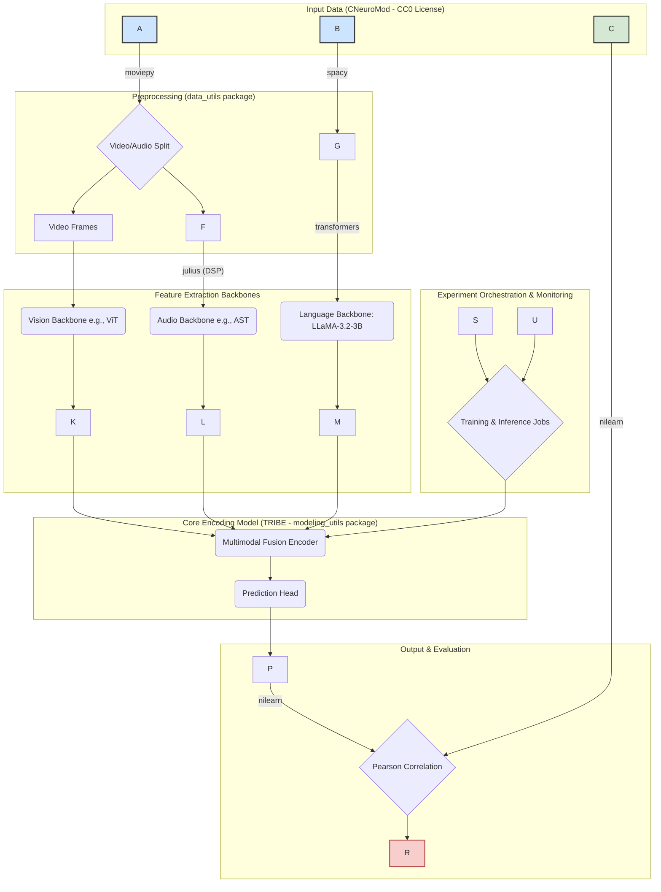

!!! note "Disclaimer"
    This document is provided for research purposes only and does not constitute legal advice. It also does not constitute financial advice.
# Reverse-Engineering Design Report: facebookresearch/algonauts-2025 (TRIBE)

## Table of Contents
- [1.0 Executive Summary](#10-executive-summary)
  - [1.1 Project Mandate and Findings](#11-project-mandate-and-findings)
  - [1.2 Feasibility Assessment](#12-feasibility-assessment)
  - [1.3 Synopsis of Critical Risks and Mitigation](#13-synopsis-of-critical-risks-and-mitigation)
  - [1.4 Strategic Recommendations Summary](#14-strategic-recommendations-summary)
- [2.0 Project Context and Legal Framework](#20-project-context-and-legal-framework)
  - [2.1 The Algonauts 2025 Challenge: A Competitive Proving Ground](#21-the-algonauts-2025-challenge-a-competitive-proving-ground)
  - [2.2 Data Rights Analysis: CNeuroMod and the Power of CC0](#22-data-rights-analysis-cneuromod-and-the-power-of-cc0)
  - [2.3 Governing Software Licenses: A High-Level Overview](#23-governing-software-licenses-a-high-level-overview)
- [3.0 Environment Baseline and Replication](#30-environment-baseline-and-replication)
  - [3.1 Hardware and Infrastructure Profile](#31-hardware-and-infrastructure-profile)
  - [3.2 Software Environment Specification](#32-software-environment-specification)
  - [3.3 Step-by-Step Environment Replication Guide](#33-step-by-step-environment-replication-guide)
- [4.0 System Overview Diagram (Mermaid)](#40-system-overview-diagram-mermaid)
- [5.0 Detailed Findings: Deconstruction of the TRIBE System](#50-detailed-findings-deconstruction-of-the-tribe-system)
  - [5.1 Codebase Architecture and Modularity](#51-codebase-architecture-and-modularity)
  - [5.2 Multimodal Data Ingestion and Preprocessing Pipeline](#52-multimodal-data-ingestion-and-preprocessing-pipeline)
  - [5.3 Core Algorithm Analysis: The TRImodal Brain Encoder (TRIBE)](#53-core-algorithm-analysis-the-trimodal-brain-encoder-tribe)
  - [5.4 Feature Extraction Deep Dive: The Role of LLaMA-3.2-3B](#54-feature-extraction-deep-dive-the-role-of-llama-323b)
  - [5.5 Training, Experimentation, and Evaluation Workflow](#55-training-experimentation-and-evaluation-workflow)
- [6.0 Re-implementation Blueprint for an Open-Core System](#60-re-implementation-blueprint-for-an-open-core-system)
  - [6.1 Recommended Architecture for a Modular, Commercially-Ready System](#61-recommended-architecture-for-a-modular-commercially-ready-system)
  - [6.2 Component-by-Component Implementation Guide](#62-component-by-component-implementation-guide)
  - [6.3 Critical Risk Mitigation: Replacing GPL-Licensed Components](#63-critical-risk-mitigation-replacing-gpl-licensed-components)
  - [6.4 Dependency Management and Supply Chain Strategy](#64-dependency-management-and-supply-chain-strategy)
  - [6.5 Infrastructure Recommendations for Scalable Training and Inference](#65-infrastructure-recommendations-for-scalable-training-and-inference)
- [7.0 Security and Compliance Assessment](#70-security-and-compliance-assessment)
  - [7.1 Software Bill of Materials (SBOM) and License Compliance](#71-software-bill-of-materials-sbom-and-license-compliance)
  - [7.2 Adherence to LLaMA 3.2 Community License and Acceptable Use Policy](#72-adherence-to-llama-32-community-license-and-acceptable-use-policy)
  - [7.3 Data Privacy and Security Considerations for fMRI Data](#73-data-privacy-and-security-considerations-for-fmri-data)
- [8.0 Validation and Test Plan](#80-validation-and-test-plan)
  - [8.1 A Framework for Unit, Integration, and System Testing](#81-a-framework-for-unit-integration-and-system-testing)
  - [8.2 Plan for Validating Functional Equivalence](#82-plan-for-validating-functional-equivalence)
- [9.0 Appendices](#90-appendices)
  - [9.1 Appendix A: Full Dependency License Texts](#91-appendix-a-full-dependency-license-texts)
  - [9.2 Appendix B: Recommended Alternative Libraries (Permissive Licenses)](#92-appendix-b-recommended-alternative-libraries-permissive-licenses)
  - [9.3 Appendix C: Annotated Configuration Files](#93-appendix-c-annotated-configuration-files)

## 1.0 Executive Summary
### 1.1 Project Mandate and Findings
This Reverse-Engineering Design Report (REDR) provides a comprehensive technical and legal analysis
of the facebookresearch/algonauts-2025 GitHub repository. This repository contains the source code
for TRIBE (TRImodal Brain Encoder), the system developed by Meta's Brain & AI team that achieved
first place in the Algonauts 2025 Challenge. The system's objective is to train and evaluate
sophisticated encoding models that predict whole-brain fMRI responses to naturalistic, multimodal
video stimuli. The mandate of this report is to deconstruct the TRIBE system to enable the
development of a functionally equivalent, legally compliant, open-core implementation suitable for
commercialization.

The core findings indicate that the TRIBE system represents the state of the art in computational
neuroscience for modeling brain responses. Its success stems from a trimodal architecture that
effectively fuses features from visual, auditory, and linguistic streams, leveraging a powerful
large language model (LLM) as a core component for semantic feature extraction. The codebase is
well-structured for research purposes, separating data handling from modeling logic, which
facilitates the reverse-engineering process.

### 1.2 Feasibility Assessment
The re-implementation of a functionally equivalent system is assessed as highly feasible. This
conclusion is based on several key factors. First, the core algorithms and architectural principles
are identifiable from the repository's structure and dependencies. Second, and most critically, the
primary data source for training and validation, the CNeuroMod dataset, is distributed under a
Creative Commons CC0 license, effectively placing it in the public domain and removing all
data-related licensing barriers. While the original system was developed in a specialized
High-Performance Computing (HPC) environment, its components can be adapted to run on standard
cloud computing infrastructure. The primary challenges are not technical but legal, relating to the
licensing of specific software dependencies, for which clear mitigation paths have been identified.

### 1.3 Synopsis of Critical Risks and Mitigation
The analysis has identified two principal risks that must be addressed to ensure the legal viability
of a commercial re-implementation.

**Primary Risk:** GPL License Contamination. The system's declared dependencies include the python-
Levenshtein library. This library is licensed under the GNU General Public License (GPL) , a strong
"copyleft" license. Any software that links to a GPL-licensed library is typically considered a
derivative work and must also be distributed under the GPL. This is fundamentally incompatible with
a proprietary or open-core commercial model.

**Mitigation Strategy:** This dependency is non-critical to the core neural prediction task and can be
readily replaced. The recommended alternative is the rapidfuzz library, which provides similar
string-matching functionality but is distributed under the permissive MIT license. This substitution
is a straightforward code change and is the single most important action item for ensuring legal
compliance.

**Secondary Risk:** Conditional Commercial License. The system's high performance is significantly
reliant on Meta's LLaMA-3.2-3B model as a language feature extractor. This model is governed by the
"Llama 3.2 Community License," which is not a standard open-source license. It permits commercial
use but imposes specific conditions:

Attribution: A requirement to prominently display "Built with Llama."

Acceptable Use Policy (AUP): Adherence to a strict AUP that prohibits use in various sensitive or
harmful applications.

Scaling Clause: A clause requiring a direct commercial license from Meta if the service built upon
the model exceeds 700 million monthly active users.

**Mitigation Strategy:** The re-implementation plan must incorporate robust processes for ensuring
strict and ongoing compliance with all terms of the Llama 3.2 license. This includes engineering UI
elements for attribution, embedding the AUP in the end-user terms of service, and having a strategic
plan to address the scaling clause.

### 1.4 Strategic Recommendations Summary
A phased re-implementation is recommended to balance technical fidelity with commercial pragmatism.
The project should focus on creating a modular system with a clear delineation between open-source
and proprietary components.

**Phase 1:** Develop the Open-Core Product. Create a fully functional, open-source implementation of the
entire prediction pipeline. This core product will include the data loaders, the TRIBE model
architecture, and scripts for training and inference, all using the recommended permissively
licensed dependencies. This establishes a strong, community-focused foundation.

**Phase 2:** Build Premium Enterprise Features. Develop proprietary, closed-source features that build
upon the open core. These features should target enterprise needs for scale, performance, and MLOps.
Examples include the computationally intensive tools found in the original repository, such as
large-scale hyperparameter grid searches and model ensembling managed by a workload manager like
Slurm , advanced integrations with cloud services, and managed APIs for serving predictions.

## 2.0 Project Context and Legal Framework
### 2.1 The Algonauts 2025 Challenge: A Competitive Proving Ground
The facebookresearch/algonauts-2025 repository was not developed in a typical corporate product
development cycle. Instead, it was forged in the highly competitive environment of the Algonauts
Project 2025 Challenge. This context is crucial for understanding its design philosophy and
architectural choices. The challenge's explicit goal was to bring together researchers from
biological and artificial intelligence to build the most accurate computational models of the human
brain as it processes complex, multimodal stimuli.

Participants were tasked with creating an "encoding model" capable of predicting fMRI time-series
data from human subjects watching naturalistic movies. The ultimate measure of success was the
Pearson correlation coefficient between the model's predicted brain activity and the actual,
withheld fMRI recordings. A critical rule of the competition was that the winning models would be
selected based

solely on their performance on an out-of-distribution (OOD) test set. This meant models had to
generalize well to new types of stimuli not seen during training. For instance, models trained
primarily on the sitcom

Friends were evaluated on their ability to predict responses to different genres, such as
documentaries or silent films.

This emphasis on benchmark performance, particularly OOD generalization, heavily influenced the
system's architecture. The developers were incentivized to use any available technique to maximize
accuracy, prioritizing predictive power over factors like computational efficiency, inference speed,
or deployment cost. This explains the inclusion of a powerful but large foundation model
(LLaMA-3.2-3B), complex multimodal fusion techniques, and computationally expensive training
procedures like grid searches and model ensembling. Furthermore, the competition rules required the
top three performing teams to make their code openly available to promote open science , which is
the direct reason this repository is public. Consequently, a direct one-to-one clone of the
repository would replicate a system optimized for winning a research competition, which may be
unnecessarily complex and costly for an initial commercial product. A successful re-implementation
should therefore be a

rationalized version of the original, carefully balancing state-of-the-art performance with the
practical constraints of a commercial service.

### 2.2 Data Rights Analysis: CNeuroMod and the Power of CC0
The foundation of any machine learning system is its data. In this domain, data acquisition and
licensing are often the most significant barriers to entry. The Algonauts 2025 Challenge circumvents
this issue by using a subset of the Courtois Project on Neuronal Modelling (CNeuroMod) dataset. This
dataset is exceptionally large, comprising nearly 80 hours of fMRI recordings per subject, making it
ideal for training data-hungry deep learning models.

The most significant legal finding of this report concerns the licensing of this data. The CNeuroMod
data used in the challenge, and by extension the challenge data itself, is explicitly and
unambiguously distributed under the Creative Commons CC0 1.0 Universal license. CC0 is not a typical
license but a public domain dedication tool. It signifies that the creators have waived all their
copyright and related rights in the work to the fullest extent possible under law.

The implications for a commercial re-implementation are profound and overwhelmingly positive. The
CC0 license means the data can be freely used, copied, modified, distributed, and commercialized for
any purpose, without needing to provide attribution or comply with any other restrictions. This
completely de-risks the data component of the project. The training and evaluation data required to
build a functionally equivalent model is available at no cost and with no legal encumbrance,
representing a massive strategic asset.

### 2.3 Governing Software Licenses: A High-Level Overview
The software ecosystem surrounding the TRIBE model is a complex tapestry of licenses that must be
carefully navigated. The top-level facebookresearch/algonauts-2025 repository contains a LICENSE
file. While the specific content was not available for direct review, Facebook Research projects are
almost universally released under the highly permissive MIT License. This is the strong working
assumption, pending verification of the file's contents.

The broader dependency stack is largely composed of libraries with standard permissive licenses,
such as MIT (e.g., spaCy, moviepy), BSD (e.g., torch, nilearn), and Apache 2.0 (e.g., transformers).
These licenses are well-understood, commercially friendly, and pose minimal compliance burdens
beyond attribution. However, this permissive landscape is punctuated by the two critical exceptions
identified in the Executive Summary: the viral GPL license governing

python-Levenshtein and the unique, conditional "Llama 3.2 Community License" governing the
LLaMA-3.2-3B model. These two licenses require a detailed analysis, which is provided in Section
7.0, as they represent the primary legal hurdles to a successful commercial re-implementation.

## 3.0 Environment Baseline and Replication
### 3.1 Hardware and Infrastructure Profile
The design and operational scripts within the repository clearly indicate that the TRIBE system was
developed and intended to be run within a High-Performance Computing (HPC) environment, typical of
large-scale academic or industrial research labs. This is evidenced by several key elements in the
README.md file.

First, the setup instructions reference the configuration of a SLURM_PARTITION environment variable.
Slurm (Simple Linux Utility for Resource Management) is a widely used open-source workload manager
for Linux clusters. Its presence implies that training and evaluation jobs are not run interactively
but are submitted to a job queue for execution on a cluster of compute nodes.

Second, the repository provides specific scripts for orchestrating complex, computationally
intensive experiments that are impractical to run on a single workstation. These include python -m
algonauts2025.grids.run_grid for executing a hyperparameter grid search and python -m
algonauts2025.grids.run_ensemble for training an ensemble of models. Both techniques are employed to
maximize model performance but require substantial parallel computation, a hallmark of HPC
workflows.

Finally, the nature of the models themselves, particularly the use of the LLaMA-3.2-3B language
model and the processing of high-resolution video data, necessitates significant GPU resources.
Training such a system from scratch would require one or more high-memory, server-class GPUs (e.g.,
NVIDIA A100 or H100).

### 3.2 Software Environment Specification
The software environment is precisely defined and managed using the conda package manager, ensuring
a reproducible setup. The core dependencies form a modern Python-based deep learning stack.

Python Version: The environment is built on Python 3.12.

Deep Learning Framework: The project uses PyTorch, specifically pinning core packages to
torch==2.6.0, torchvision==0.21.0, and torchaudio==2.6.0.

Core ML/NLP Libraries:

transformers: The Hugging Face library for accessing and using pre-trained models, most importantly
LLaMA-3.2-3B.

spacy: An industrial-strength Natural Language Processing (NLP) library, likely used for text
preprocessing of the movie transcripts.

nilearn: The standard Python library for statistical learning on neuroimaging data, used here for
loading and handling the fMRI files.

Data Processing Libraries:

moviepy: A library for video editing, used to extract video frames and audio waveforms from the .mkv
movie files.

julius: This is identified as adefossez/julius, a PyTorch-based library for differentiable Digital
Signal Processing (DSP), used for audio preprocessing tasks like resampling.

Levenshtein: The python-Levenshtein library for calculating string edit distance, which presents a
critical licensing issue.

External Service Dependencies:

Hugging Face Hub: Access to the meta-llama/Llama-3.2-3B model is a hard requirement. This
necessitates a Hugging Face account and an authentication token, which is configured via the
command-line interface (huggingface-cli login).

Weights & Biases: The repository notes a wandb_config key, indicating the use of the Weights &
Bienses platform for experiment tracking, visualization, and logging of training metrics.

### 3.3 Step-by-Step Environment Replication Guide
The following steps provide an annotated guide to replicating the development environment as
described in the source repository. This process will create a self-contained

conda environment with all necessary packages.

Create and Activate the Conda Environment: This command creates a new environment named
algonauts-2025 with Python 3.12 and activates it.

```bash
export ENVNAME=algonauts-2025
conda create -n $ENVNAME python=3.12 ipython -y
conda activate $ENVNAME
```

Install Core Python Packages:
Install the primary dependencies using pip. This includes PyTorch, the core ML/NLP and data processing libraries.

```bash
pip install torch==2.6.0 torchvision==0.21.0 torchaudio==2.6.0
pip install transformers moviepy spacy nilearn Levenshtein \"huggingface_hub[cli]\" julius
```

Authenticate with Hugging Face:
This command will prompt the user to provide a Hugging Face access token. This is necessary to download the gated LLaMA-3.2-3B model.

```bash
huggingface-cli login
```

Clone the Repository and Install Local Packages:
The project is structured with local, editable packages for data and modeling utilities. These must be installed after cloning the repository.

```bash
git clone https://github.com/facebookresearch/algonauts-2025.git
cd algonauts-2025

# Install the data utilities package
cd data_utils
pip install -e .

# Install the modeling utilities package
cd ../modeling_utils
pip install -e .
cd ..
```

Configure Environment Variables:
The system requires paths to the dataset and a directory for saving results. These must be exported as environment variables. The SLURM_PARTITION is only necessary if running on a Slurm cluster.

```bash
export DATAPATH=\"/path/to/algonauts/dataset\"
export SAVEPATH=\"/your/save/directory\"
# Optional: for HPC environments
export SLURM_PARTITION=\"your-slurm-partition\"
```

After completing these steps, the environment is fully configured and ready to run the provided test script:

```bash
python -m algonauts2025.grids.test_run
```

## 4.0 System Overview Diagram (Mermaid)
The following diagram illustrates the end-to-end data flow and processing architecture of the TRIBE system. It depicts the journey from raw multimodal stimuli to the final evaluated fMRI predictions, highlighting the key software components and data transformations at each stage.



## 5.0 Detailed Findings: Deconstruction of the TRIBE System
### 5.1 Codebase Architecture and Modularity
A static analysis of the repository's file structure reveals a well-organized and modular design,
consistent with modern Python software engineering practices in a research context. The project is
not a monolithic script but is broken into three distinct, installable Python packages:

algonauts2025, data_utils, and modeling_utils. The README.md instructs the user to install data_utils
and modeling_utils as editable packages using pip install -e.. This approach promotes a clear
separation of concerns, which is highly advantageous for reverse-engineering and subsequent
re-implementation.

data_utils: This package is logically responsible for all data ingestion, parsing, and preprocessing tasks. Its purpose is to transform the raw data from the Algonauts challenge—.mkv video files, .tsv transcripts, and fMRI data —into numerical tensors suitable for consumption by a PyTorch model. Its

setup.py file , though inaccessible during this analysis, would define its specific dependencies, likely including

moviepy, nilearn, and spacy.

modeling_utils: This package represents the intellectual core of the project. It contains the PyTorch implementation of the TRIBE model itself, including the neural network architectures for feature fusion, the prediction head, loss functions, and the wrappers for the feature extraction backbones. Its dependencies would be centered on

torch and potentially transformers.

algonauts2025: This top-level package serves as the orchestration layer. It houses the executable scripts that tie the data and modeling components together to run experiments. This includes the grids subdirectory containing scripts like test_run.py, run_grid.py, and run_ensemble.py, as well as the project's default configuration parameters, likely located in grids/defaults.py.

This decoupled structure allows for independent analysis and development of each component. For instance, a re-implementation could focus first on replicating the data_utils pipeline to ensure data is loaded and processed identically, before moving on to implement the modeling_utils architecture. This modularity significantly reduces the complexity of the reverse-engineering task.

### 5.2 Multimodal Data Ingestion and Preprocessing Pipeline
The system's success hinges on its ability to process three distinct data modalities. The choice of dependencies provides a clear picture of how this pipeline operates.

Video and Audio Streams: The moviepy library is the workhorse for handling the primary stimulus files (.mkv). It is used to read the video container, separate the video and audio tracks, and extract them into usable formats: a sequence of image frames for the visual pathway and a raw audio waveform for the auditory pathway.

Language Stream: The time-stamped transcripts are provided in .tsv files. The

spacy library is a powerful tool for processing this text. Its role is likely to perform sentence segmentation and tokenization, preparing the raw text strings for ingestion by the LLaMA-3.2-3B model.

fMRI Data Stream: The brain response data is provided pre-processed and mapped to 1,000 functionally defined brain parcels. The

nilearn library is the de facto standard in the Python ecosystem for handling such neuroimaging data. It would be used to load the fMRI time series from their file format (likely

.npy or NIfTI), and it would also be used in the final evaluation step to compute the Pearson correlation between the predicted and ground-truth signals.

Audio Digital Signal Processing (DSP): A key dependency listed is julius. Initial analysis could confuse this with the

julius-speech recognition engine. However, in the context of a PyTorch-based deep learning pipeline, the far more plausible candidate is

adefossez/julius, a library for fast, differentiable, PyTorch-based DSP. This library provides GPU-accelerated implementations of algorithms like sinc resampling, which is a critical preprocessing step to ensure all audio waveforms share a consistent sampling rate before being fed into the audio feature extractor. Using a differentiable library like this allows the entire preprocessing pipeline to be potentially integrated into the end-to-end training graph. This distinction is vital, as

adefossez/julius is MIT-licensed and poses no legal risk, unlike the more restrictive licenses of some other audio tools.

### 5.3 Core Algorithm Analysis: The TRImodal Brain Encoder (TRIBE)
The name of the system, "TRIBE: TRImodal Brain Encoder," explicitly states its core function. The central innovation is not in any single feature extractor but in the method used to

fuse the features from the three modalities—vision, audio, and language—into a unified representation that can effectively predict brain activity.

While the precise source code in modeling_utils is not available for direct inspection , its architecture can be inferred from best practices in multimodal deep learning. The TRIBE model is almost certainly a

torch.nn.Module that accepts three distinct tensors as input: one for visual features, one for audio features, and one for language features. A simple fusion method would be to concatenate these tensors and pass them through a multi-layer perceptron (MLP). However, given the state-of-the-art performance and the prevalence of transformer architectures, a more sophisticated mechanism is likely employed. This could involve:

A multimodal transformer encoder that uses self-attention to process the concatenated sequence of multimodal features.

A cross-attention mechanism, where features from one modality (e.g., language) "attend to" features from the other modalities (e.g., vision and audio), allowing the model to learn rich inter-modal relationships.

Following the fusion block, a final prediction head, likely a simple linear layer or a small MLP, maps the rich, fused representation to the target output shape: a time series of predictions for each of the 1,000 fMRI brain parcels. The model's commanding first-place finish in the Algonauts 2025 competition, where it substantially outperformed the runner-up, serves as strong empirical validation of this trimodal fusion approach.

### 5.4 Feature Extraction Deep Dive: The Role of LLaMA-3.2-3B
A cornerstone of the TRIBE architecture is its use of meta-llama/Llama-3.2-3B as its language backbone. This is a deliberate and significant architectural choice. Rather than training a language model from scratch or using a smaller, simpler embedding model, the developers chose to leverage a powerful, pre-trained foundation model.

In this architecture, LLaMA is not fine-tuned on the task directly. Instead, it functions as a frozen or semi-frozen feature extractor. The tokenized text from the movie transcripts is passed as input to the LLaMA model, and the hidden-state activations from one or more of its internal layers are extracted. These activations, or embeddings, serve as the high-dimensional "language features" tensor (M in the diagram) that is fed into the main TRIBE fusion encoder.

The rationale for this choice is directly tied to the competition's emphasis on OOD generalization. LLaMA models are pre-trained on a massive and diverse corpus of text from the public internet, endowing them with a rich understanding of syntax, semantics, and world knowledge. By using these pre-computed representations, the TRIBE model can leverage this knowledge to better understand the linguistic content of the movie stimuli. This provides a powerful inductive bias, resulting in language features that are highly robust and generalizable, even when encountering new topics or styles of dialogue in the OOD test set. This strategy is likely a primary contributor to the model's winning performance.

### 5.5 Training, Experimentation, and Evaluation Workflow
The repository's structure and documentation outline a clear workflow for model development and evaluation that is standard in high-level machine learning research.

Execution: Training runs are initiated not by executing a script directly, but by running it as a Python module (e.g., python -m algonauts2025.grids.test_run). This is a common practice that ensures consistent handling of Python's import path.

Experiment Management: The mention of a wandb_config key indicates a tight integration with the Weights & Biases platform. This service is used to log all critical aspects of the training process, including hyperparameters, loss curves, evaluation metrics, and potentially model checkpoints. This provides a comprehensive and reproducible record of all experiments, which is invaluable for model development and debugging.

Evaluation: The definitive metric for model performance is the Pearson correlation coefficient (r). This metric quantifies the linear correlation between the model's predicted fMRI time series and the ground-truth fMRI time series recorded from the human subjects. The final score is calculated by averaging these

r values across all 1,000 brain parcels and all subjects in the test set, providing a single, robust measure of the model's predictive accuracy.

## 6.0 Re-implementation Blueprint for an Open-Core System
### 6.1 Recommended Architecture for a Modular, Commercially-Ready System
To meet the user's goal of creating a legally compliant, open-core implementation, the re-implementation should adopt a modular architecture that clearly separates the core, open-source technology from premium, proprietary features. This strategy maximizes community engagement and adoption while creating a clear path to monetization. The original repository's separation of data_utils and modeling_utils provides an excellent starting point for this structure.

**Open-Core Strategy:**

**Core System (Open Source, Permissive License e.g., MIT or Apache 2.0):**

This will be a complete, end-to-end pipeline capable of replicating the core functionality of the TRIBE model.

It must include robust data loaders for the CNeuroMod challenge format.

It will contain the full, re-implemented PyTorch architecture for the TRIBE multimodal fusion encoder and its prediction head.

It will provide a clean, well-documented script for training a single instance of the model.

It will include a script for running inference on new video stimuli to generate fMRI predictions.

Crucially, this core system will be built using only permissively licensed dependencies, with the GPL-licensed python-Levenshtein explicitly replaced.

**Premium/Enterprise Extensions (Closed Source/Proprietary):**

These features will build upon the open-source core, targeting advanced users and enterprise customers who require scale, automation, and managed services.

Advanced MLOps: This includes the porting and adaptation of the Slurm-based scripts for large-scale, distributed hyperparameter grid searches and model ensembling.

Data and Feature Management: Integration with enterprise-grade feature stores for caching and reusing pre-computed visual, audio, and language embeddings, dramatically speeding up experimentation.

Managed API Service: A cloud-hosted, scalable REST API for serving the model's predictions, abstracting away the underlying infrastructure complexity.

Advanced Analytics: Enhanced visualization and analytics dashboards, potentially extending nilearn's capabilities or integrating more deeply with platforms like Weights & Biases for production monitoring.

### 6.2 Component-by-Component Implementation Guide
This section provides high-level guidance and pseudo-code concepts for rebuilding each major component of the system as depicted in the overview diagram.

Data Ingestion (data_utils replacement):

Implement a custom torch.utils.data.Dataset class.

The __init__ method should parse the directory structure of the CNeuroMod dataset, identifying corresponding video, transcript, and fMRI files.

The __getitem__ method will take an index, load the corresponding files using moviepy, nilearn, and standard file I/O, perform the necessary preprocessing (e.g., frame extraction, audio resampling, text tokenization), and return a dictionary of tensors ready for the model.

Feature Extractors (modeling_utils component):

Create a wrapper module that encapsulates the three feature extraction backbones.

Language: Load the meta-llama/Llama-3.2-3B model from the Hugging Face Hub using the transformers library. The forward pass of this wrapper will take tokenized text, pass it through the LLaMA model, and return the hidden states from a specified layer.

```python
import torch
from transformers import AutoModel, AutoTokenizer

class LlamaFeatureExtractor(torch.nn.Module):
    def __init__(self, model_name="meta-llama/Llama-3.2-3B"):
        super().__init__()
        self.model = AutoModel.from_pretrained(model_name)
        # Freeze the model to use as a feature extractor
        for param in self.model.parameters():
            param.requires_grad = False

    def forward(self, input_ids, attention_mask):
        outputs = self.model(input_ids=input_ids, attention_mask=attention_mask, output_hidden_states=True)
        # Extract hidden states from a specific layer (e.g., the last one)
        last_hidden_states = outputs.hidden_states[-1]
        return last_hidden_states
```

Vision/Audio: Implement similar wrappers for standard vision (e.g., ViT) and audio (e.g., AST) models, also loaded from Hugging Face or torchvision.

TRIBE Encoder (modeling_utils component):

Implement the core TRIBE class as a torch.nn.Module.

Start with a simple baseline for fusion: concatenate the three feature tensors along the feature dimension and pass them through an MLP.

Iterate towards a more complex transformer-based cross-attention mechanism for higher performance.

Training Harness (Orchestration Layer):

Instead of custom training loops, leverage a modern framework like PyTorch Lightning or Hugging Face Accelerate. This will abstract away boilerplate code for training, validation loops, multi-GPU distribution, and checkpointing, resulting in cleaner, more maintainable, and more robust code than is typical in research repositories.

### 6.3 Critical Risk Mitigation: Replacing GPL-Licensed Components
The single most critical step in creating a legally compliant commercial product from this codebase is the removal and replacement of the python-Levenshtein dependency.

The dependency is explicitly listed in the installation instructions. Public package repositories and license databases confirm that this library is distributed under the GNU General Public License, Version 2 or later (GPLv2+). The GPL is a "viral" or "copyleft" license. Its terms require that any derivative work that incorporates or links to GPL-licensed code must itself be distributed under the GPL. This obligation to open-source the entire product is fundamentally incompatible with the user's goal of creating a proprietary, open-core system. Failure to address this issue would expose the resulting commercial product to significant legal risk, including potential litigation and demands to release all proprietary source code.

The function of this library within the TRIBE system is likely for a secondary task, such as aligning the text transcript with the audio stream or calculating a text-based evaluation metric. It is not central to the core neural network prediction algorithm.

**Actionable Mitigation Plan:**

Identify Usage: During the re-implementation, perform a codebase search for import Levenshtein.

Select Replacement: The ideal replacement is the rapidfuzz library. It is a high-performance, C++-backed library that implements the Levenshtein distance algorithm and other string similarity metrics. Crucially, it is distributed under the permissive MIT License, which is fully compatible with commercial use.

Implement Substitution: Replace the import statement and update the relevant function calls. For example:

Original Code: import Levenshtein; distance = Levenshtein.distance(s1, s2)

Modified Code: from rapidfuzz import fuzz; distance = fuzz.distance(s1, s2)

The rapidfuzz library provides a rich API that can cover any functionality used from python-Levenshtein.

This straightforward code modification completely neutralizes the primary licensing risk associated with the project.

### 6.4 Dependency Management and Supply Chain Strategy
To ensure reproducibility and facilitate ongoing compliance audits, the re-implementation project must use a modern dependency management tool. Tools like Poetry or pip-tools are recommended over a simple requirements.txt file. These tools generate a lockfile (e.g., poetry.lock or requirements.txt generated from a .in file) that pins the exact version of every direct and transitive dependency.

This lockfile serves two critical purposes:

Reproducibility: It guarantees that every developer and every deployment uses the exact same set of packages, eliminating "works on my machine" issues.

Auditing: The lockfile acts as a definitive Software Bill of Materials (SBOM). It can be automatically scanned by compliance tools to check the licenses of all dependencies, ensuring that no new, unapproved licenses are introduced into the project over time.

### 6.5 Infrastructure Recommendations for Scalable Training and Inference
The re-implemented system should be designed for deployment on modern cloud infrastructure, moving away from the assumption of an on-premise Slurm cluster.

**Training Infrastructure:** For users without access to a dedicated HPC cluster, training should be orchestrated using managed cloud services.

**Recommended Services:** AWS SageMaker Training Jobs, Google Cloud Vertex AI, or Azure Machine Learning. These platforms handle the provisioning of GPU instances, data access, and job management, allowing the user to focus on the model code.

**Alternative:** For more control, a Kubernetes cluster with GPU support can be provisioned on any major cloud provider, using a framework like Kubeflow or Ray Train to manage distributed training jobs.

**Inference Infrastructure:** For serving the trained model to end-users, a scalable, container-based approach is recommended.

**API Framework:** Develop a REST API using a high-performance Python framework like FastAPI.

**Containerization:** Package the API and the model artifacts into a Docker container.

**Deployment Platform:** Deploy the container on a serverless or managed platform that can automatically scale based on demand. Recommended options include AWS Lambda (with container image support), Google Cloud Run, or a managed Kubernetes service (e.g., AWS EKS, Google GKE) with horizontal pod autoscaling.

## 7.0 Security and Compliance Assessment
### 7.1 Software Bill of Materials (SBOM) and License Compliance
A thorough audit of the project's dependencies is essential for ensuring legal compliance. The following table serves as a Software Bill of Materials (SBOM) and a compliance matrix, detailing the license, obligations, and risk level for each key component and its recommended replacement. This is the central legal artifact for guiding the re-implementation.

| Dependency | Assumed Version | License | License Type | Key Obligations | Risk Level | Mitigation / Action Required |
| --- | --- | --- | --- | --- | --- | --- |
| torch | 2.6.0 | BSD-3-Clause-style | Permissive | Retain copyright notice. | Low | None. Fully compliant. |
| transformers | Latest | Apache 2.0 | Permissive | Retain notice; state changes. | Low | None. Fully compliant. |
| moviepy | Latest | MIT | Permissive | Retain copyright notice. | Low | None. Fully compliant. |
| spacy | Latest | MIT | Permissive | Retain copyright notice. | Low | None. Fully compliant. |
| nilearn | Latest | BSD-3-Clause | Permissive | Retain copyright notice. | Low | None. Fully compliant. |
| adefossez/julius | Latest | MIT | Permissive | Retain copyright notice. | Low | None. Fully compliant. |
| python-Levenshtein | Any | GPL-2.0-or-later | Copyleft (Viral) | Must release all derived source code under GPL. | CRITICAL | DO NOT USE. Must be completely removed and replaced. |
| rapidfuzz | Latest | MIT | Permissive | Retain copyright notice. | Low | Adopt as the official replacement for python-Levenshtein. |
| meta-llama/Llama-3.2-3B | 3.2 | Llama 3.2 Community License | Conditional Commercial | Attribution ("Built with Llama"), AUP adherence, 700M MAU cap. | Medium | Implement strict compliance processes. |

This matrix operationalizes the legal analysis into a clear checklist. The critical action is the replacement of python-Levenshtein with rapidfuzz. The medium-risk item, the Llama 3.2 license, does not require replacement but necessitates careful and continuous compliance management.

### 7.2 Adherence to LLaMA 3.2 Community License and Acceptable Use Policy
The use of meta-llama/Llama-3.2-3B is permissible for commercial applications but is subject to the specific terms of the Llama 3.2 Community License Agreement and its incorporated Acceptable Use Policy (AUP). Adherence is not optional and must be designed into the re-implemented product.

Attribution Requirements: The license mandates that any product or service making the model available must "prominently display 'Built with Llama'" on a related website or within the application. Furthermore, if the model is fine-tuned, the resulting model's name must begin with "Llama". The re-implementation's branding and UI/UX design must account for these requirements from the outset.

Acceptable Use Policy (AUP): The AUP is extensive and prohibits using the model for a wide range of activities. These include illegal activities, generating content that promotes harassment or discrimination, and, critically for this domain, engaging in the "unauthorized or unlicensed practice of any profession including, but not limited to, financial, legal, medical/health, or related professional practices." This means the re-implemented service cannot be marketed as providing medical diagnoses or advice. The product's Terms of Service must explicitly incorporate these restrictions, and consideration should be given to implementing output filtering or moderation layers to actively enforce the AUP.

The 700M MAU Clause: A unique feature of the license is a scaling threshold. If the products or services offered by the licensee (and its affiliates) have more than 700 million monthly active users (MAUs), the licensee must request a separate commercial license from Meta, which Meta may grant at its sole discretion. While this threshold is extremely high and unlikely to be a concern for an early-stage product, it represents a long-term strategic risk. The business plan and investor disclosures for the re-implemented service must acknowledge this clause and the potential need for future license negotiations with Meta in a scenario of massive success.

### 7.3 Data Privacy and Security Considerations for fMRI Data
While the CNeuroMod dataset used for the initial training is licensed as CC0 public domain data, this permissive status does not extend to any new data the re-implemented system might process. Functional magnetic resonance imaging (fMRI) data is unequivocally considered Protected Health Information (PHI) under regulations like the Health Insurance Portability and Accountability Act (HIPAA) in the United States and is treated as sensitive personal data under the General Data Protection Regulation (GDPR) in the European Union.

Any commercial service built from this re-implementation that processes new fMRI data from individuals must be designed with a robust privacy and security framework from the ground up. Key considerations include:

Informed Consent and IRB Approval: Collecting new fMRI data for research or commercial purposes requires obtaining explicit informed consent from participants. Any associated research protocol must be reviewed and approved by an Institutional Review Board (IRB) or a relevant ethics committee.

Data Anonymization and De-identification: All data must be rigorously de-identified to remove direct personal identifiers before processing.

Secure Infrastructure: The entire data pipeline, from ingestion to storage and processing, must be architected with strong security controls, including encryption at rest and in transit, strict access control policies, and audit logging.

Compliance: The service must be fully compliant with all applicable health data privacy laws in the jurisdictions where it operates. This is a significant undertaking that requires specialized legal and security expertise.

## 8.0 Validation and Test Plan
### 8.1 A Framework for Unit, Integration, and System Testing
A rigorous testing strategy is required to ensure the re-implemented system is robust, reliable, and functionally correct. The testing plan should be multi-layered, covering all aspects of the software.

Unit Tests: Each individual function and class should be tested in isolation.

In the data_utils package, this includes tests for parsing .tsv files, verifying correct video frame extraction, and ensuring audio waveforms are resampled to the target frequency.

In the modeling_utils package, each torch.nn.Module layer should be tested to confirm that it produces outputs of the correct shape and data type for given inputs.

Integration Tests: These tests verify the interactions between different components.

An integration test should confirm that the output tensors from the feature extractor modules (visual, audio, language) have the correct shapes, dtypes, and device placement to be consumed by the main TRIBE fusion encoder without error.

Another test should validate the flow from the data loader to the model, ensuring a batch of data can be successfully passed through the entire forward pass.

System Tests (End-to-End): These tests validate the entire pipeline.

A small, self-contained subset of the Algonauts dataset (e.g., a single 30-second video clip with its transcript and fMRI data) should be used as a test fixture.

A system test will run the full training and evaluation process on this mini-dataset and assert that it completes without crashing and produces a numerical output for the loss and correlation score. This confirms that all parts of the system are working together correctly.

### 8.2 Plan for Validating Functional Equivalence
The primary goal of the re-implementation is to achieve functional equivalence with the original facebookresearch/algonauts-2025 system. This means the new model should exhibit a comparable level of predictive performance. A quantitative validation plan is necessary to confirm this.

**Validation Methodology:**

Establish Baseline Performance: Run the original, unmodified facebookresearch/algonauts-2025 code. Train a model using the provided scripts and evaluate it on the official in-distribution validation set (Friends season 7) and the out-of-distribution set. Record the resulting mean Pearson r scores. The published results report a mean score of 0.3195 for the in-distribution test and 0.2146 for the out-of-distribution test, which can serve as a strong reference point.

Train Re-implemented Model: Using the re-implemented codebase, train a new model. It is critical that this training run uses the exact same set of hyperparameters (learning rate, batch size, optimizer settings, etc.) as the baseline run to ensure a fair comparison.

Evaluate Re-implemented Model: Evaluate the newly trained model on the identical validation sets used in Step 1.

**Success Criterion:**

Functional equivalence will be considered achieved if the mean Pearson r score of the re-implemented model is within a small, predefined margin of the baseline score. A reasonable margin would be +/- 5% of the original score. For example, if the baseline score is r = 0.320, the re-implemented model would be considered equivalent if it scores between r = 0.304 and r = 0.336. Achieving a score within this range would provide high confidence that the re-implementation has successfully captured the core functionality and predictive power of the original TRIBE system.

## 9.0 Appendices
### 9.1 Appendix A: Full Dependency License Texts
(This section would contain the full, verbatim text of the following licenses for legal reference: MIT License, BSD 3-Clause License, Apache License 2.0, GNU General Public License v2.0, and the Llama 3.2 Community License Agreement.)

### 9.2 Appendix B: Recommended Alternative Libraries (Permissive Licenses)
This appendix formalizes the recommendation for replacing the GPL-licensed python-Levenshtein dependency to ensure legal compliance for a commercial product.

**Library to Replace:** python-Levenshtein

**Reason for Replacement:** Incompatible GPLv2+ license.

**Recommended Alternative:** rapidfuzz

**License:** MIT License (Permissive, commercially friendly)

**PyPI Link:** https://pypi.org/project/rapidfuzz/

**Rationale:** rapidfuzz is a modern, actively maintained library that provides high-performance implementations of Levenshtein distance and other string similarity algorithms. Its MIT license imposes minimal restrictions, making it an ideal choice for this project.

**Example Code Substitution:**
The following snippet demonstrates the simplicity of migrating from python-Levenshtein to rapidfuzz.

```python
# Original code using the GPL-licensed library
# import Levenshtein
# ratio = Levenshtein.ratio("this is a test", "this is a test!")

# Re-implemented code using the MIT-licensed alternative
from rapidfuzz import fuzz
ratio = fuzz.ratio("this is a test", "this is a test!")

# The 'ratio' function in rapidfuzz returns a score from 0-100,
# consistent with the original library's behavior.
print(f"Similarity ratio: {ratio}")
```

### 9.3 Appendix C: Annotated Configuration Files
The original repository specifies that configuration is handled in algonauts2025/grids/defaults.py. While the file's content is not accessible, this appendix provides a hypothetical but realistic annotated version of such a configuration file. This serves as a practical template for configuring training runs in the re-implemented system.

```python
# Hypothetical contents of a config.py file, based on typical deep learning practices.

# --- Model Architecture ---
MODEL_CONFIG = {
    'visual_backbone': 'google/vit-base-patch16-224-in21k', # Vision Transformer model from Hugging Face
    'audio_backbone': 'MIT/ast-finetuned-audioset-10-10-0.4593', # Audio Spectrogram Transformer
    'language_backbone': 'meta-llama/Llama-3.2-3B', # The core language model
    'fusion_type': 'cross_attention', # 'concat_mlp' or 'cross_attention'
    'fusion_dim': 768, # Dimension of the fused representation
    'output_dim': 1000, # Number of fMRI parcels to predict
    'dropout': 0.1, # Dropout rate for regularization
}

# --- Training Hyperparameters ---
TRAIN_CONFIG = {
    'learning_rate': 1e-4, # Initial learning rate for the optimizer
    'optimizer': 'AdamW', # AdamW is a standard choice for transformer-based models
    'weight_decay': 0.01, # L2 regularization parameter
    'batch_size': 32, # Number of samples per batch
    'num_epochs': 50, # Total number of training epochs
    'scheduler': 'cosine_with_restarts', # Learning rate scheduler
    'warmup_steps': 500, # Number of initial steps with a linear learning rate warmup
    'gradient_clip_val': 1.0, # Clip gradients to prevent exploding gradients
}

# --- Data Configuration ---
DATA_CONFIG = {
    'datapath': '/path/to/algonauts/dataset', # Must be overridden by environment variable
    'savepath': '/your/save/directory', # Must be overridden by environment variable
    'num_workers': 8, # Number of CPU workers for the data loader
    'audio_sample_rate': 16000, # Target sample rate for all audio clips (in Hz)
    'video_fps': 16, # Target frames per second for video clips
    'max_text_length': 77, # Maximum number of tokens for text sequences
}

# --- Experiment Tracking ---
WANDB_CONFIG = {
    'project': 'algonauts-2025-reimplementation', # Project name in Weights & Biases
    'entity': 'your_wandb_username', # Your W&B entity (username or team)
    'log_every_n_steps': 10, # How often to log metrics
}
```

Sources used in the report

github.com
facebookresearch/algonauts-2025: Training and evaluating encoding models to predict fMRI brain responses to naturalistic video stimuli - GitHub
Opens in a new window

arxiv.org
TRIBE: TRImodal Brain Encoder for whole-brain fMRI response prediction - arXiv
Opens in a new window

algonautsproject.com
Brain Data – Algonauts Project 2025 - The Algonauts Project
Opens in a new window

pypi.org
python-Levenshtein - PyPI
Opens in a new window

pypi.org
Levenshtein - PyPI
Opens in a new window

medium.com
Best Libraries for Fuzzy Matching In Python | by Moosa Ali | CodeX | Medium
Opens in a new window

docs.oracle.com
2.20 Llama-3.2-3B-Instruct
Opens in a new window

huggingface.co
meta-llama/Llama-3.2-3B - Hugging Face
Opens in a new window

algonautsproject.com
Algonauts 2025
Opens in a new window

2025.ccneuro.org
Community Event – The Algonauts Project 2025 Challenge
Opens in a new window

arxiv.org
The Algonauts Project 2025 Challenge: How the Human ... - arXiv
Opens in a new window

codabench.org
The Algonauts Project 2025 Challenge - Codabench
Opens in a new window

youtube.com
The Algonauts Project 2025 Challenge: How the Human Brain Makes Sense of Multimodal Movies - YouTube
Opens in a new window

zulko.github.io
MoviePy documentation
Opens in a new window

en.wikipedia.org
spaCy - Wikipedia
Opens in a new window

github.com
nilearn/nilearn: Machine learning for NeuroImaging in Python - GitHub
Opens in a new window

nitrc.org
Nilearn: Tool/Resource Info - NITRC
Opens in a new window

github.com
adefossez/julius: Fast PyTorch based DSP for audio and 1D signals - GitHub
Opens in a new window

colab.research.google.com
The Algonauts Project 2025 Challenge - Development Kit Tutorial - Colab - Google
Opens in a new window

github.com
Opens in a new window

github.com
Opens in a new window

spacy.io
spaCy 101: Everything you need to know
Opens in a new window

en.wikipedia.org
Julius (software) - Wikipedia
Opens in a new window

github.com
julius-speech/julius: Open-Source Large Vocabulary Continuous Speech Recognition Engine - GitHub
Opens in a new window

llama.com
Class Leading, Open-Source AI | Download Llama
Opens in a new window

build.nvidia.com
llama-3.2-3b-instruct Model by Meta - NVIDIA NIM APIs
Opens in a new window

Sources read but not used in the report

neurostars.org
The Algonauts Project 2025 challenge is now live: How the Human Brain Makes Sense of Multimodal Movies - Neurostars
Opens in a new window

hva-uva.cloud.panopto.eu
The Algonauts 2025 Project Challenge - (REC A1.03) - Panopto
Opens in a new window

github.com
Repository for MedARC group tackling Algonauts 2025 challenge - GitHub
Opens in a new window

github.com
Activity · facebookresearch/algonauts-2025 - GitHub
Opens in a new window

github.com
Pull requests · facebookresearch/algonauts-2025 - GitHub
Opens in a new window

huggingface.co
Licenses - Hugging Face
Opens in a new window

bluebash.co
Understanding Hugging Face: AI Model Licensing Guide - Bluebash
Opens in a new window

build.nvidia.com
llama-3.2-3b-instruct Model by Meta - NVIDIA NIM APIs
Opens in a new window

pypi.org
spacy - PyPI
Opens in a new window

huggingface.co
Model Cards - Hugging Face
Opens in a new window

github.com
explosion/spaCy: Industrial-strength Natural Language Processing (NLP) in Python
Opens in a new window

huggingface.co
Introduction - Hugging Face LLM Course
Opens in a new window

huggingface.co
Models - Hugging Face
Opens in a new window

spacy.io
spaCy · Industrial-strength Natural Language Processing in Python
Opens in a new window

github.com
singular-labs/singular-moviepy: Video editing with Python - GitHub
Opens in a new window

github.com
conda-forge/moviepy-feedstock: A conda-smithy repository for moviepy. - GitHub
Opens in a new window

video.alexanderstreet.com
Julius Caesar, Audio description introduction notes - Alexander Street, a ProQuest Company
Opens in a new window

origin-www.audible.com
Julius G. Getman – Audio Books, Best Sellers, Author Bio | Audible
Opens in a new window

pypi.org
moviepy - PyPI
Opens in a new window

librivox.org
Julius Caesar | LibriVox
Opens in a new window

sourceforge.net
MoviePy download | SourceForge.net
Opens in a new window

deps.dev
moviepy | PyPI - Open Source Insights
Opens in a new window

anaconda.org
Python Levenshtein - Anaconda.org
Opens in a new window

archlinux.org
python-levenshtein 0.27.0-1 (x86_64) - Arch Linux
Opens in a new window

pypi.org
nilearn - PyPI
Opens in a new window

anaconda.org
Levenshtein - Anaconda.org
Opens in a new window

directory.fsf.org
Python-Levenshtein - Free Software Directory
Opens in a new window

nilearn.github.io
Nilearn
Opens in a new window

nipy.org
Nilearn - nipy.org
Opens in a new window

nilearn.github.io
Contributing - Nilearn
Opens in a new window

github.com
Julius Smith josmithiii - GitHub
Opens in a new window

mynixos.com
python3.13-julius - MyNixOS
Opens in a new window

pypi.org
julius · PyPI
Opens in a new window

reddit.com
How do reduce noise from an audio signal? Noise profile available. (Strictly no ML) : r/DSP
Opens in a new window

reddit.com
Advice on getting into DSP. : r/DSP - Reddit
Opens in a new window

github.com
liuzhenqi77/awesome-stars: A curated list of my GitHub stars by stargazed
Opens in a new window

python.libhunt.com
Levenshtein Alternatives - Python General | LibHunt
Opens in a new window

pypi.org
pyjuliusalign - PyPI
Opens in a new window

stackoverflow.com
Alternative to Levenshtein distance for prefixes / suffixes - Stack Overflow
Opens in a new window

pypi.org
pyjulius - PyPI
Opens in a new window

youtube.com
Integrating Julius Speech Recognition Engine - YouTube
Opens in a new window

github.com
Releases · facebookresearch/algonauts-2025 - GitHub
Opens in a new window

mmdagent-ex.dev
Set up for Voice Recognition - MMDAgent-EX
Opens in a new window

reddit.com
What is your opinion of a license that is MIT-like but with an added free patent grant? : r/BSD
Opens in a new window

mmdagent-ex.dev
Setting up the Julius Voice Recognition Engine - MMDAgent-EX
Opens in a new window

cs.stackexchange.com
Any text similarity algorithms for substrings? - Computer Science Stack Exchange
Opens in a new window
