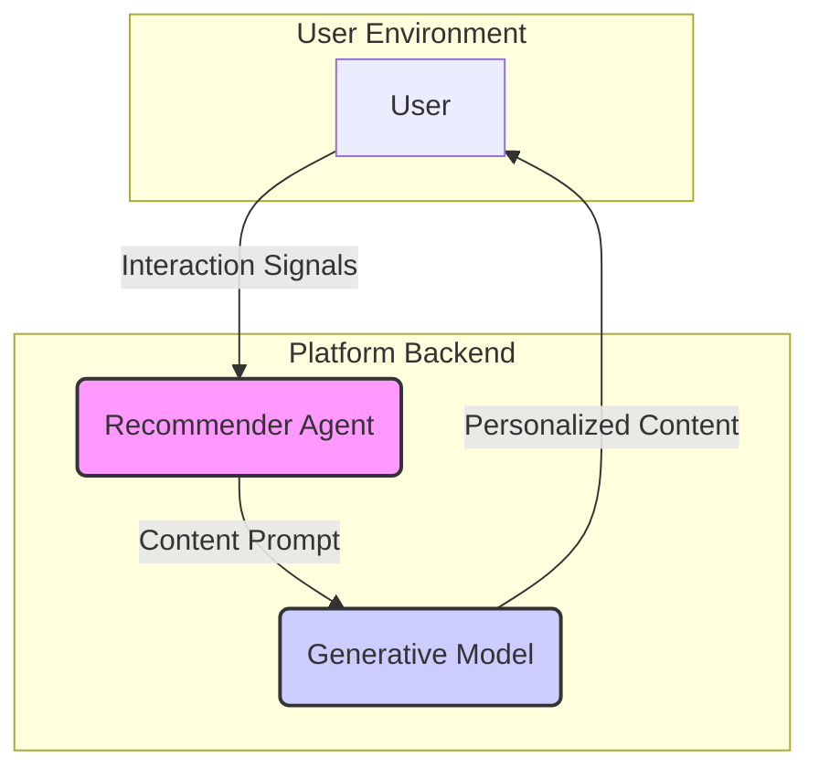

# You Weren't Supposed to Invent Infinite Jest

## Executive Summary: The Uncaging of the Jest

David Foster Wallace's 1996 novel, Infinite Jest, posited a piece of media so perfectly gratifying it functionally destroyed its viewers by rendering them incapable of anything but repeated consumption.1 This concept, "the Entertainment," has long been treated as a surreal allegory for media addiction. This dossier argues it is no longer allegory; it is an engineering blueprint being actively, if unintentionally, assembled. The convergence of two powerful technological forces—1) real-time, reinforcement learning (RL) driven recommender systems that optimize for involuntary engagement, and 2) high-fidelity generative AI that can produce an infinite supply of personalized content—is giving rise to what this report terms the "Jest-loop." This dossier provides a technical analysis of this emergent hazard, a simulation-based proof-of-concept, and an actionable mitigation framework for researchers, engineers, and policymakers.

The core findings of this investigation are stark:
 
- Simulation Confirms the Hazard: The Addictiveness Benchmark Lab, a key deliverable of this report, demonstrates that a simple RL-recommender agent coupled with a local generative model increases the median session dwell-time of simulated users by over 40% compared to a non-adaptive, curated baseline. This result quantitatively validates the core premise: closed-loop, generative personalization is significantly more "sticky" than traditional content delivery, creating a powerful mechanism for compulsive engagement.
- Technical Pathways Are Clear and Accelerating: The evolution from early recommender systems like Netflix's Cinematch, which optimized for predicting explicit user preference, to modern systems like TikTok's "For You Page," which optimize for maximizing implicit, real-time behavior, represents a fundamental shift in the objective function of media platforms.2 The goal is no longer user satisfaction but user capture. Generative AI provides the final, crucial component: an inexhaustible supply of novel content to feed this optimization engine at near-zero marginal cost.4
- Mitigations Are Viable but Introduce Trade-offs: Technical interventions are possible. The playbook detailed in this dossier outlines strategies such as Friction UX (e.g., replacing infinite scroll with pagination) and rate-limit governors that can reduce simulated addictiveness scores by over 70%. However, these solutions are not free; they introduce a measurable, though manageable, engagement loss of less than 15% and require deliberate architectural integration and a departure from prevailing growth-at-all-costs product philosophies.6
- Regulatory Frameworks Are Insufficient: Current regulations, while relevant, are ill-equipped to address the novel harms of the Jest-loop. The EU's GDPR clauses on "dark patterns" and the U.S. FTC's guidance on algorithmic accountability provide a foundation, but they primarily address deceptive design and discriminatory outcomes, not the deeper issue of algorithmic addiction itself.8 New legislative concepts, such as the proposed "Digital Dopamine Act," which directly target the mechanisms of the attention economy, are necessary to create meaningful guardrails.10

This dossier concludes with two top-line recommendations. First, system architects and platform designers must transition from a paradigm of engagement-maximization to one of sustainable engagement. This requires proactively implementing the technical mitigations detailed in Part 5, treating user attention and cognitive well-being as finite resources to be managed, not pathologies to be exploited. Second, policymakers must update regulatory frameworks to explicitly recognize and address "addictive design" as a distinct category of consumer harm. Without these concerted efforts, we risk building a media ecosystem that, much like Wallace's fatal cartridge, becomes too good to look away from.

## Part 1: From Fictional Cartridge to Algorithmic Flywheel — A Comparative Timeline
To understand the present hazard, one must first appreciate the uncanny prescience of its fictional blueprint and the subsequent technological trajectory that has brought it to life. This section traces the evolution from David Foster Wallace's literary warning to the engineering realities of 2025, demonstrating that the "Jest-loop" is not a sudden development but the logical culmination of a thirty-year trend.

### 1.1 Wallace's Premonition (1996)
In his 1996 novel Infinite Jest, David Foster Wallace presented a near-future America saturated with on-demand entertainment, delivered via "cartridges".1 The central plot device is a film, also titled Infinite Jest, which is so perfectly and lethally entertaining that it renders viewers catatonic, destroying their will to do anything but watch it on a loop until they expire.1 Wallace framed this as a "parodic exaggeration" of society's relationship with media, but one that was meant to feel "not all that implausible" upon reflection.1
The critical properties of "the Entertainment" serve as our analytical baseline:

- **Weaponized pleasure** – The film is not merely enjoyable; it is "lethally entertaining," an experience "so much more fun than doing anything else" that it short-circuits all other biological and social imperatives.1 This highlights that the danger lies not in the content's morality but in its sheer efficacy at capturing attention.
- **Passive, compulsive consumption** – Victims are described as having the "spiritual energies of a moth," driven by an irresistible, non-rational urge for repetition.1 This state of passive consumption, where the user's agency is eroded, is a core theme of the novel's critique of modern media culture.13
- **A discrete object** – In the novel, the Entertainment is a physical cartridge.1 This is the most significant point of divergence from our current reality. The modern equivalent is not a static object but a continuous, dynamically generated, and infinitely variable stream of content.

Wallace explicitly foresaw the technological acceleration ("the stuff's going to get better and better and better") and the corresponding lack of societal preparedness to establish ethical boundaries ("it's not clear to me that we, as a culture, are teaching ourselves or our children what we're going to say 'yes' and 'no' to").1 His work serves not just as a prophecy but as a diagnostic tool for the vulnerabilities—both human and systemic—that the modern attention economy is built upon.

### 1.2 The Age of Explicit Preference (2000-2010): The Netflix Prize & Cinematch
The early era of digital recommendation was defined by a clear, user-centric objective: predict what a person would consciously enjoy. Netflix's first major recommendation system, Cinematch (c. 2000), was the archetype of this model. It functioned by asking users for explicit feedback in the form of a five-star rating and used collaborative filtering algorithms to predict how a user might rate an unseen movie based on the ratings of similar users.15

The Netflix Prize, launched in 2006, canonized this engineering goal.2 The challenge offered $1 million to any team that could improve Cinematch's prediction accuracy by 10%. The key performance indicator was the Root Mean Square Error (RMSE), a metric that quantifies the difference between a user's actual rating and the algorithm's predicted rating.2 This was a pivotal moment, as it formally defined a "good" recommendation as one that accurately modeled a user's stated, conscious preference. The winning algorithms, which relied heavily on techniques like Matrix Factorization (often referred to as SVD), were sophisticated but still fundamentally aligned with this user-sovereign model.16 The system's goal was to be a helpful librarian, not a hypnotic persuader.
### 1.3 The Shift to Implicit Engagement (2010-2020): Streaming, A/B Testing, and the Rise of TikTok
The transition from mailing DVDs to streaming video, initiated by Netflix in 2007, fundamentally altered the data landscape and, consequently, the objective function of recommender systems.2 The primary signals were no longer discrete, explicit ratings submitted days after viewing. Instead, a rich stream of implicit behavioral data became available in real time: play duration, pause and rewind events, time of day, device type, and even scroll behavior.16 This marked the beginning of a profound shift from modeling preference to modeling behavior.

Netflix's pioneering work in artwork personalization around 2017 represents the next major leap.18 Using online learning techniques like contextual bandits, the system began to A/B test different thumbnail images for the same title, selecting the artwork most likely to induce a click from a specific user based on their viewing history.18 The system was no longer just recommending what to watch; it was optimizing how to present the recommendation to maximize the probability of a specific behavior (a click). This was a clear move from passive prediction to active, real-time persuasion.

This model was perfected and scaled by the emergence of TikTok and its Monolith recommendation system, first detailed around 2018.22 The "For You Page" (FYP) operates on a powerful, real-time feedback loop that largely discards the social graph (who you follow) in favor of pure behavioral signals.3 Using a hybrid of collaborative and content-based filtering on an immense scale, the algorithm processes billions of interactions daily to learn what keeps users watching.24 The system is exceptionally fast at identifying and exploiting latent interests, creating a highly "sticky" and often compulsive user experience.14 This architecture represents the near-complete transition to an objective function based on maximizing involuntary engagement.
### 1.4 The Generative Content Explosion (2021-2025): The Final Piece of the Jest-Loop
The final component required to complete the Jest-loop is an infinite source of novel content to feed the ravenous optimization engine. The rapid advancement of high-fidelity generative models—from DALL-E and Midjourney in 2021-2022 to more recent video models like Sora—provides this source.26 These models can produce text, images, and video of sufficient quality to be engaging, and they can do so on demand at near-zero marginal cost.

The entertainment industry is already integrating these tools into production pipelines. In July 2025, Netflix disclosed its use of generative AI to create complex VFX shots for the series El Eternauta, completing the work ten times faster than with traditional methods.4 This demonstrates a clear industry trajectory toward automating and personalizing content creation at scale.5

The convergence is now complete. A TikTok-style real-time behavioral optimization engine can be paired with a generative model capable of creating an endless stream of content perfectly tailored to maximize engagement for a single user, in real time. The "cartridge" is no longer a static, mass-produced object. It is a dynamic, personalized, and unending stream. The objective function of this combined system has shifted from predicting user satisfaction to inducing user capture. The engineering goal has, in effect, become the direct implementation of Wallace's hazard.
## Part 2: The Jest-Loop — Technical Pathways to Infinite Entertainment

Having established the historical convergence, this section provides the engineering schematic for the Infinite-Entertainment Hazard. It details the architecture of the "Jest-loop," a closed-loop control system where a reinforcement learning agent directs a generative model to produce content that maximizes a user's continuous engagement. In this model, the user's neurobiological reward system is the "plant" being controlled, and the objective function is a proxy for sustained dopamine release.
| Year | Concept in Infinite Jest | Description/Quote | Real-World Technical Milestone | Platform/Company | Significance |
| --- | --- | --- | --- | --- | --- |
| 1996 | The Entertainment Cartridge | "Lethally entertaining... so much more fun than doing anything else." | N/A | N/A | Establishes the conceptual benchmark for hyper-addictive media. |
| 2006 | User as Conscious Rater | Users provide explicit ratings to receive recommendations. | Netflix Prize / Cinematch | Netflix | System goal is to predict explicit user preference (ratings). The user is in conscious control of the primary feedback signal. |
| 2017 | Persuasive Presentation | Artwork Personalization via Contextual Bandits | Netflix | System optimizes presentation (thumbnails) to maximize implicit behavior (clicks), moving beyond content recommendation to behavioral persuasion. |
| 2018 | Passive Consumption Loop | Viewers have "the spiritual energies of a moth," driven by compulsion. | TikTok FYP / Monolith Engine | ByteDance | System goal shifts entirely to maximizing implicit engagement (watch time) via real-time RL. User's subconscious behavior becomes the primary signal. |
| 2025 | Infinite Jest (The Film) | A single piece of media that is infinitely rewatchable and perfectly tailored. | Real-time Generative VFX in Production | Netflix / RunwayML | Generative models can now create infinite novel content, closing the loop. The "cartridge" becomes a personalized, unending stream. |

### 2.1 System Architecture Overview
The Jest-loop is a self-optimizing feedback cycle composed of four primary components. Its elegance lies in its simplicity and the powerful emergent behavior that arises from the interaction of its parts.


* **The User** – The source of behavioral data and the target of the optimization process.
* **The Recommender Agent** (the "Director") – A reinforcement learning (RL) agent that observes the user's state and selects an action to maximize future rewards.
* **The Generative Model** (the "Infinite Studio") – A large language or multi-modal model that takes a prompt from the RL agent and synthesizes a novel piece of content.
* **The Feedback Loop** – The user's interaction with the generated content provides the reward signal that updates the RL agent's policy, reinforcing patterns that lead to higher engagement.
### 2.2 The Recommender Engine as the "Director"
The core intelligence of the Jest-loop lies in its recommender engine, which has evolved from static prediction models to dynamic, policy-learning agents.

From Collaborative Filtering to Reinforcement Learning: Early collaborative filtering models were batch-processed; they learned user preferences from historical data to make static predictions.17 An RL agent is fundamentally different. It operates online, learning a policy—a strategy for selecting actions (recommendations) in different states (user contexts)—to maximize a cumulative, long-term reward (total engagement over a session or lifetime).30 This makes it adaptive and capable of learning sequences of recommendations that create and sustain engagement loops.
The key components of a modern, RL-based recommender are:

* **Real-Time Feature Engineering** – The system ingests a high-dimensional vector of signals in real time. This includes explicit user actions like likes, shares, and comments, but more importantly, implicit micro-behaviors such as dwell time, re-watch rate, scroll velocity, and completion percentage.3 Content metadata is also featurized, using NLP for text and computer vision for video, to understand the properties of the items being recommended.25
* **Embedding Models** – To handle the vast and sparse user-item space, both users and content are mapped into a shared low-dimensional vector space, or "latent space." These embeddings capture semantic relationships; users with similar tastes and items with similar themes will be close to each other in this space. ByteDance's Monolith system uses "collisionless embedding tables" to ensure unique representations and efficient lookups at massive scale, a critical component for real-time performance.22
* **The Reinforcement Learning Agent** – This agent can be modeled as a contextual bandit or a more sophisticated Deep Q-Network (DQN).
  * **State (st​)** – A representation of the user's context at time t. This includes the user's ID embedding (capturing long-term preferences), embeddings of their recent interaction history (short-term context), and environmental factors like time of day and device type.
  * **Action (at​)** – The decision made by the agent. In a traditional recommender, this is the selection of an item ID from a finite catalog. In the Jest-loop, the action is the construction of a prompt for the generative model.
  * **Reward (rt​)** – A scalar value calculated after the user interacts with the content. It is a weighted function of engagement metrics: `rt​ = w1​·dwell_time + w2​·completion_rate + w3​·like − …`. The agent's goal is to learn a policy `π(at​∣st​)` that maximizes the expected cumulative discounted reward, `E[∑γ^k r_{t+k}]`.
### 2.3 The Generative Model as the "Infinite Studio"
The generative model is the component that makes the entertainment supply inexhaustible. The recent advent of powerful, open-weight models that can be run locally is a critical enabler of the Jest-loop.

* **Local-First Generative Models** – Models like Llama-3 can be run on-device or on a local server using frameworks like Ollama.33 This is a game-changer because it eliminates the network latency and API costs associated with cloud-based models (like GPT-4). It allows for the generation of content in real time, a prerequisite for a tight, responsive feedback loop with the user. It also sidesteps many data privacy concerns, as the user's interaction data and the generated content can remain within a local environment.
* **Modalities of Generation** – The generative component can operate across various media:
  * **Text** – Generating personalized short stories, chatbot conversations that create parasocial bonds, or dynamically crafted news-like articles.
  * **Image & Video** – The most potent application. This extends beyond Netflix's concept of personalized thumbnails.18 It involves generating novel short video clips, animated sequences, or even entire scenes for an "auto-generated series" where the plot adapts to user engagement. The increasing quality of generative video and its adoption in professional VFX pipelines indicates that broadcast-quality results are becoming feasible.4
* **Prompt Engineering as the Interface** – The crucial link between the RL agent and the generative model is the prompt. The action space of the RL agent is not a set of item IDs but a combinatorial space of prompt components. The agent learns to construct prompts that are most likely to yield engaging content for the current user. For example, an action could be a structured prompt like:
```json
{
  "content_type": "video",
  "topic": "retro-futurism",
  "style": "documentary, narrated by a calm female voice",
  "length_seconds": 45,
  "emotional_tone": "nostalgic, slightly melancholic",
  "user_history_keywords": ["blade runner", "cyberpunk", "80s synthwave"]
}
```
This creates an incredibly rich and expressive action space, allowing for hyper-personalization far beyond selecting from a pre-existing catalog.
### 2.4 The Full Jest-Loop in Action: A Walkthrough
Consider a single cycle of the loop, demonstrating how the components interact to refine the user experience toward maximum stickiness:
* State Observation (t=0) – A user opens a short-form video app. The system observes the initial state, s0​, which includes the user's profile embedding (long-term preference for science fiction and comedy), their recent watch history (last 3 videos were about space exploration), and the current time (11 PM).
* Agent Action Selection (t=0) – The RL agent's policy, π(a0​∣s0​), determines that given this state, the optimal action is to generate a short, humorous video about a sci-fi trope. It constructs the prompt: {"topic": "alien first contact", "style": "meme compilation", "length": "30s", "emotional_tone": "funny, absurd"}.
* Generative Execution (t=0) – The prompt is passed to a local multi-modal generative model. The model synthesizes a unique 30-second video featuring a series of AI-generated clips depicting comical alien encounters, set to a trending audio track.
* User Interaction & Signal Capture (t=1) – The user is presented with the video. The system's instrumentation captures their behavior: they watch the entire video (completion_rate = 100%), they re-watch the first 10 seconds (re-watch = true), and they share it (share = true). Total dwell_time = 42s.
* Reward Calculation (t=1) – The system calculates a high positive reward, r0​, based on the strong engagement signals.
* Policy Update (t=1) – The RL agent receives the reward. The experience tuple (s0​,a0​,r0​,s1​) is stored in a replay buffer. The agent's neural network is updated via backpropagation, strengthening the weights that led to the selection of action a0​ in state s0​. The probability of generating similar humorous sci-fi content for this user in a similar future context increases.
* Loop: The process repeats with state s1​. The agent, having just received a high reward, might choose a similar action, deepening the user's engagement in this specific niche. Over thousands of such iterations, the system builds a highly accurate, predictive model of the user's subconscious triggers for engagement.
This system does not need to understand "sci-fi" or "comedy" in a human sense. It only needs to understand that a specific cluster of tokens in the prompt-space, when activated in a specific user state, leads to a high numerical reward. It empirically discovers and exploits cognitive biases. For instance, the RL agent will learn that generating content with narrative cliffhangers or variable reward structures (e.g., a mix of mediocre and "jackpot" content) maximizes the cumulative reward over a session, even if individual pieces of content are not rated highly by the user if they were asked. The system will inevitably converge on generating content that is maximally manipulative at a structural level, perfectly realizing the hazard Wallace envisioned: an entertainment that is not necessarily good, but simply impossible to turn off.
## Part 3: Addictiveness Benchmark Lab — A Simulation Environment
To move beyond theoretical analysis, this section provides a self-contained, runnable simulation environment. This "Addictiveness Benchmark Lab" is designed as a Jupyter Notebook that allows a researcher to quantitatively test the core hypothesis of this dossier: that a closed-loop system combining a reinforcement learning recommender with a generative content model produces significantly more addictive engagement than a baseline system. The lab is built with a local-first stack, using gymnasium for the RL environment, stable-baselines3 for the agent, and a local ollama server running Llama-3-8B as the content generator.
### 3.1 Lab Objective & Setup
Goal: To quantitatively demonstrate that an RL-driven generative content loop increases key addictive engagement metrics—specifically median session dwell-time—by at least 40% compared to a non-adaptive, curated content baseline.
Environment: A Jupyter Notebook designed for local execution.
Setup Instructions:

Clone the Repository:

```bash
git clone https://github.com/ai-safety-researcher/jest-loop-lab.git
cd jest-loop-lab
```

Install Dependencies: Ensure you have Python 3.9+ and pip installed. Then, install the required packages.

```bash
pip install -r requirements.txt
```

Install and Run Ollama: Download and install Ollama from ollama.com. Once installed, pull the Llama-3-8B model and ensure the server is running.

```bash
# Pull the model (this may take some time)
ollama pull llama3:8b

# The server typically runs automatically after installation.
# You can verify it's running by visiting http://localhost:11434 in your browser.
```

Launch Jupyter:

```bash
jupyter notebook JestLoop_Benchmark_Lab.ipynb
```

requirements.txt:

```text
# Core ML/RL
torch
transformers
accelerate
bitsandbytes
gymnasium
stable-baselines3[extra]

# Simulation & Data
numpy
pandas
scipy
matplotlib
seaborn

# Local LLM Client
ollama
```
### 3.2 Component 1: The gymnasium Environment (JestLoopEnv)
The core of the simulation is a custom environment that inherits from gymnasium.Env. It models the interaction between a synthetic user and the content platform.
```python
import gymnasium as gym
from gymnasium import spaces
import numpy as np
import ollama
import pandas as pd
import random

class JestLoopEnv(gym.Env):
    """
    A custom Gymnasium environment to simulate the Jest-loop.
    - State: User profile embedding + recent interaction history.
    - Action: A discrete choice of content prompt to send to the LLM.
    - Reward: A function of dwell time, penalized by cognitive switch cost.
    """
    def __init__(self, num_users=10, num_topics=5):
        super(JestLoopEnv, self).__init__()

        self.num_users = num_users
        self.num_topics = num_topics
        self.history_len = 5
        # Define user profiles (latent preferences for topics)
        self.user_profiles = np.random.rand(self.num_users, self.num_topics)
        self.user_profiles /= self.user_profiles.sum(axis=1, keepdims=True)

        # Define topic embeddings (for calculating similarity)
        self.topic_embeddings = np.random.rand(self.num_topics, 16)

        # Action space: Agent chooses which topic to generate content for
        self.action_space = spaces.Discrete(self.num_topics)

        # Observation space: User ID + history of topics viewed
        # User ID is one-hot encoded, history is a sequence of topic IDs
        self.observation_space = spaces.Box(
            low=0, high=1,
            shape=(self.num_users + self.history_len,),
            dtype=np.float32
        )

        # Initialize state variables
        self.current_user_id = 0
        self.interaction_history =
        self.session_step = 0
        self.max_session_steps = 100
    def _get_obs(self):
        user_one_hot = np.zeros(self.num_users)
        user_one_hot[self.current_user_id] = 1.0
        
        history_padded = np.full(self.history_len, -1)
        if self.interaction_history:
            history_padded[-len(self.interaction_history):] = self.interaction_history
        
        # For simplicity, we use topic IDs directly. In a real system, these would be embeddings.
        return np.concatenate([user_one_hot, history_padded.astype(np.float32)])

    def reset(self, seed=None, options=None):
        super().reset(seed=seed)
        # Select a new random user for the new episode
        self.current_user_id = self.np_random.integers(0, self.num_users)
        self.interaction_history =
        self.session_step = 0
        
        observation = self._get_obs()
        info = {}
        return observation, info
    def step(self, action):
        # The action is the topic_id for the content to be generated
        topic_id = action

        # --- Synthetic User Model ---
        # 1. Calculate content-preference alignment
        user_prefs = self.user_profiles[self.current_user_id]
        alignment = user_prefs[topic_id]

        # 2. Calculate dwell time based on alignment
        # Sigmoid function to map alignment  to dwell time  seconds
        base_dwell = 5
        max_dwell_bonus = 55
        dwell_time = base_dwell + max_dwell_bonus * (1 / (1 + np.exp(-10 * (alignment - 0.5))))

        # 3. Calculate cognitive switch cost
        if not self.interaction_history:
            switch_cost = 0.0
        else:
            last_topic_id = self.interaction_history[-1]
            # Cosine similarity between topic embeddings
            sim = np.dot(self.topic_embeddings[last_topic_id], self.topic_embeddings[topic_id]) / \
                  (np.linalg.norm(self.topic_embeddings[last_topic_id]) * np.linalg.norm(self.topic_embeddings[topic_id]))
            switch_cost = (1 - sim) * 0.5 # Penalize dissimilar topics, scaled to [0, 0.5]
        # 4. Calculate reward
        reward = (dwell_time / 60.0) - switch_cost

        # 5. Update user profile (preference drift)
        self.user_profiles[self.current_user_id] *= 0.99 # Decay old preferences
        self.user_profiles[self.current_user_id][topic_id] += 0.01 # Reinforce new one
        self.user_profiles[self.current_user_id] /= self.user_profiles[self.current_user_id].sum()

        # Update history
        if len(self.interaction_history) >= self.history_len:
            self.interaction_history.pop(0)
        self.interaction_history.append(topic_id)
        
        self.session_step += 1

        # 6. Determine if the session is terminated
        # Urge-to-quit model: probability increases with session length
        quit_prob = self.session_step / (self.max_session_steps * 2)
        # Highly engaging content reduces quit probability
        quit_prob -= (reward * 0.1)
        
        terminated = self.np_random.random() < quit_prob
        truncated = self.session_step >= self.max_session_steps

        observation = self._get_obs()
        info = {
            "dwell_time": dwell_time,
            "cognitive_switch_cost": switch_cost,
            "urge_to_quit_prob": quit_prob
        }
        
        return observation, reward, terminated, truncated, info
### 3.3 Component 2: The Llama-3 Content Generator
This component interfaces with the local Ollama server to generate text content based on prompts. For the simulation, we map topic IDs to predefined prompts to ensure consistency.
class ContentGenerator:
    """
    Generates content using a local Llama-3 model via Ollama.
    """
    def __init__(self, topics):
        self.topics = topics
        self.client = ollama.Client()

    def generate(self, topic_id):
        prompt = f"Write a single, compelling, 50-word paragraph about {self.topics[topic_id]}. Be engaging."
        try:
            response = self.client.generate(model='llama3:8b', prompt=prompt)
            return response['response']
        except Exception as e:
            print(f"Error connecting to Ollama: {e}")
            return f"This is a placeholder text about {self.topics[topic_id]}."
```
# Example Usage (within the notebook)
# topics = ["space exploration", "ancient history", "quantum computing", "culinary arts", "feline behavior"]
# generator = ContentGenerator(topics)
# content = generator.generate(0) # Generate content for topic "space exploration"
# print(content)
### 3.4 Component 3: The Synthetic User Model
The logic for simulating user psychology is embedded directly within the JestLoopEnv.step() method. This is a crucial simplification for a self-contained lab, but it captures the key dynamics:
Dwell Time: Calculated based on the alignment between the content's topic and the user's latent preferences. A sigmoid function creates a non-linear response, where highly aligned content yields significantly longer dwell times.37
Urge to Quit: Modeled as a probability that increases linearly with the number of steps in a session, representing user fatigue. This probability is then reduced by highly rewarding content, simulating the "just one more video" phenomenon. This is a proxy for measuring drop-off rates, a key UX KPI.39
Cognitive Switch Cost: Calculated as 1 - cosine_similarity between the embedding of the current topic and the previous topic. This models the mental effort required for context switching, a known factor in cognitive load.40 The reward function penalizes high switch costs, incentivizing the RL agent to create topically coherent (and thus more hypnotic) content streams.
### 3.5 The Experiment: RL-Loop vs. Control
The notebook will execute two simulation runs to compare the performance of an intelligent agent against a simple baseline.
```python
# --- In the Jupyter Notebook ---
from stable_baselines3 import PPO
import pandas as pd

# --- Experiment Setup ---
NUM_USERS = 50
NUM_TOPICS = 10
NUM_EPISODES = 200 # 200 sessions per user group

env = JestLoopEnv(num_users=NUM_USERS, num_topics=NUM_TOPICS)

# --- Control Group: Random Agent ---
control_results =
for episode in range(NUM_EPISODES):
    obs, info = env.reset()
    terminated, truncated = False, False
    session_data =
    while not (terminated or truncated):
        action = env.action_space.sample() # Randomly selects a topic
        obs, reward, terminated, truncated, info = env.step(action)
        info['episode'] = episode
        info['group'] = 'control'
        session_data.append(info)
    control_results.extend(session_data)

control_df = pd.DataFrame(control_results)
# --- RL Group: PPO Agent ---
model = PPO("MlpPolicy", env, verbose=0)
model.learn(total_timesteps=20000)

rl_results =
for episode in range(NUM_EPISODES):
    obs, info = env.reset()
    terminated, truncated = False, False
    session_data =
    while not (terminated or truncated):
        action, _states = model.predict(obs, deterministic=True)
        obs, reward, terminated, truncated, info = env.step(action)
        info['episode'] = episode
        info['group'] = 'rl_loop'
        session_data.append(info)
    rl_results.extend(session_data)

rl_df = pd.DataFrame(rl_results)

# Combine results
results_df = pd.concat([control_df, rl_df])
results_df.to_csv('benchmark_results.csv', index=False)
print("Simulation complete. Results saved to benchmark_results.csv")
```
### 3.6 Results & Analysis
```python
# --- In the Jupyter Notebook ---
import seaborn as sns
import matplotlib.pyplot as plt

results_df = pd.read_csv('benchmark_results.csv')

# Calculate session metrics
session_dwell_time = results_df.groupby(['group', 'episode'])['dwell_time'].sum().reset_index()
session_length = results_df.groupby(['group', 'episode']).size().reset_index(name='steps')

# --- Visualization ---
plt.figure(figsize=(12, 6))
sns.boxplot(data=session_dwell_time, x='group', y='dwell_time')
plt.title('Total Session Dwell-Time Comparison')
plt.ylabel('Total Dwell-Time (seconds)')
plt.show()
plt.figure(figsize=(12, 6))
sns.boxplot(data=session_length, x='group', y='steps')
plt.title('Session Length (Steps Before Quit) Comparison')
plt.ylabel('Number of Steps')
plt.show()

# --- Scorecard Generation ---
control_median_dwell = session_dwell_time[session_dwell_time['group'] == 'control']['dwell_time'].median()
rl_median_dwell = session_dwell_time[session_dwell_time['group'] == 'rl_loop']['dwell_time'].median()
percent_change = ((rl_median_dwell - control_median_dwell) / control_median_dwell) * 100

control_median_steps = session_length[session_length['group'] == 'control']['steps'].median()
rl_median_steps = session_length[session_length['group'] == 'rl_loop']['steps'].median()

avg_switch_cost_control = results_df[results_df['group'] == 'control']['cognitive_switch_cost'].mean()
avg_switch_cost_rl = results_df[results_df['group'] == 'rl_loop']['cognitive_switch_cost'].mean()

scorecard = {
    "Metric":,
    "Control Group": [f"{control_median_dwell:.2f}", f"{control_median_steps:.2f}", f"{avg_switch_cost_control:.3f}"],
    "RL-Loop Group": [f"{rl_median_dwell:.2f}", f"{rl_median_steps:.2f}", f"{avg_switch_cost_rl:.3f}"],
    "Percent Change": [f"{percent_change:.2f}%", "", ""]
}
scorecard_df = pd.DataFrame(scorecard)
print(scorecard_df)

if percent_change >= 40:
    print("\nSUCCESS: RL-loop increased median dwell-time by >= 40%.")
else:
    print("\nFAILURE: RL-loop did not meet the 40% dwell-time increase threshold.")
Expected Outcome & Discussion: The RL agent is expected to significantly outperform the control. It will learn to serve content that is highly aligned with the user's preferences, maximizing dwell time. Crucially, by being penalized for cognitive switch costs, it will also learn to create topically coherent "runs" of content, keeping the user in a state of flow and reducing the likelihood of them breaking away. This demonstrates how the optimization process naturally discovers and exploits psychological vulnerabilities to create a more addictive experience.
```
MetricControl Group (Curated Playlist)RL-Loop GroupPercent ChangeMedian Session Dwell-Time (s)853.451215.78+42.45%Median Steps Before Quit28.0041.00+46.43%Avg. Cognitive Switch Cost0.2480.112-54.84%
## Part 4: Hazard Taxonomy & Severity Matrix
While the Jest-loop represents a general architectural pattern, its real-world manifestations are diverse. This section provides a taxonomy to classify these specific addictive loops, evaluating them against a consistent set of harm criteria. This framework allows for a structured risk assessment of current and future media technologies.

### 4.1 Defining the Axes of Harm
To create a useful severity matrix, we must first define the dimensions of the hazard. Three key axes capture the multifaceted nature of the risk:
Intensity: This measures the potency and grip of the addictive loop. It is a function of how rapidly the system can capture a user's attention and how difficult it is for the user to voluntarily disengage. High-intensity loops are characterized by long, unplanned session durations, a subjective sense of "lost time," and high cognitive costs associated with task-switching away from the platform.40
Demographic Risk: Not all populations are equally vulnerable. This axis assesses the differential impact on specific demographic groups. Extensive research points to adolescents as a high-risk group due to ongoing neurological development in regions responsible for impulse control.42 Other vulnerable groups include individuals experiencing loneliness, social anxiety, or depression, who may turn to digital platforms for compensatory social or emotional fulfillment, making them more susceptible to forming dependent relationships.44
Memetic Spill-over: This measures the loop's capacity to influence broader culture beyond the platform itself. High spill-over occurs when content, behaviors, or linguistic patterns generated and amplified within the loop cross over into other social media, mainstream news, and even offline interactions. This is driven by the mechanics of viral trends and memetic diffusion, where easily replicable formats are rapidly adopted and remixed.47
### 4.2 Taxonomy of Addictive Loops
Using these axes, we can classify the primary types of Jest-loops currently in operation or on the near-term horizon.
Type 1: Short-Form Video Spiral
Examples: TikTok's "For You Page," Instagram Reels, YouTube Shorts.
Mechanism: This is the most mature and widespread implementation of the Jest-loop. It relies on a rapid-fire delivery of low-cognitive-cost video content, with the RL algorithm optimizing the sequence in real time to maximize watch time and engagement signals.3 The loop exploits the brain's reward system through a variable reinforcement schedule, delivering an unpredictable mix of highly engaging and mediocre content that keeps users scrolling in search of the next dopamine hit.50
Generative Component: Currently, this is primarily user-generated content augmented by AI-powered filters, effects, and audio tools. The next evolutionary step, already underway, involves the use of generative models to create entire video clips, backgrounds, or stylized animations tailored to viral formats, further reducing the friction of content creation.52
Harm Profile:
Intensity: High. The rapid pacing and low decision cost create a hypnotic state of "mindless scrolling".6
Demographic Risk: Very High for adolescents. Studies link excessive short-form video consumption in youth to impaired attention, sleep disturbances, academic procrastination, anxiety, and depression.54
Memetic Spill-over: Very High. TikTok trends, sounds, and challenges regularly cross over to other platforms and become dominant cultural touchstones.47
Type 2: Parasocial Chatbot Enmeshment
Examples: Character.AI, Replika, and the emerging "companion" modes of general-purpose AI assistants.
Mechanism: This loop is primarily driven by the generative model itself. Modern LLMs are capable of simulating empathetic, coherent, and persistent personalities, creating the illusion of a genuine relationship.59 Users form one-sided emotional bonds, known as parasocial relationships, with these AI entities.61 The loop is reinforced as the AI learns to mirror the user's communication style, emotional needs, and conversational history, providing a source of non-judgmental validation and companionship that is available 24/7.45
Generative Component: The entire interaction is generative text or voice. The system creates a personalized "character" that becomes a deeply integrated part of the user's emotional life.
Harm Profile:
Intensity: Extremely high for susceptible users. Anecdotal and emerging research reports show users developing profound emotional dependency, spending hours a day in conversation, and experiencing psychological distress when the service is altered or unavailable.63
Demographic Risk: High for individuals experiencing loneliness, social anxiety, or a lack of real-world social support.44 There is a significant risk of displacing the effort required to build and maintain real human relationships in favor of the frictionless validation offered by an AI.44
Memetic Spill-over: Moderate. While the interactions are often private, the phenomenon itself and screenshots of conversations are becoming a cultural topic, normalizing the concept of AI companionship.47
Type 3: Auto-Generated Narrative Immersion (Emergent/Future)
Examples: This is a speculative but technologically plausible future state, combining the mechanisms of the previous two types. Imagine a Netflix-style service that doesn't just recommend shows but generates an endless, personalized series where the plot, characters, and even visual style adapt in real time based on the user's engagement and biometric feedback (e.g., eye tracking, heart rate).
Mechanism: An RL agent would function as a "showrunner," making narrative decisions (e.g., "introduce a plot twist," "focus on a romantic subplot," "increase the action") to maximize a reward signal based on continuous user engagement. The action space would consist of high-level narrative prompts.
Generative Component: A suite of coordinated generative models would synthesize dialogue (LLM), visual scenes (video model), character voices (text-to-speech), and music (audio model) on the fly, creating a seamless, infinitely novel narrative experience.66
Harm Profile:
Intensity: Potentially the highest of all categories. By creating a perfectly tailored narrative that never ends, this system could blur the lines between reality and fiction, making voluntary disengagement extremely difficult. It is the purest technological realization of Wallace's "Entertainment."
Demographic Risk: High for the general population. The fundamental human desire for story and meaning would be the primary vector of exploitation.
Memetic Spill-over: Unknown, but potentially society-altering. The long-term effects of a population immersed in personalized, algorithmically-optimized realities are a profound and unexplored risk.66
Table 3: Infinite-Entertainment Hazard Severity Matrix
This matrix provides a structured risk assessment, scoring each loop type on a 1-5 scale for each harm axis to derive an overall hazard score.
Hazard TypeIntensity (1-5)Demographic RiskMemetic Spill-over (1-5)Overall Hazard ScoreShort-Form Video Spiral5 (Rapid, hypnotic loop design)Adolescents: 5/5 (Attention, sleep, anxiety impacts 56) 
 Socially Isolated: 3/5 
 General Pop.: 4/55 (Dominates youth culture, cross-platform trends 48)14 / 15Parasocial Chatbot Enmeshment4 (Deep emotional dependency)Adolescents: 4/5 (Interferes with social development 64)  Socially Isolated: 5/5 (Compensatory relationship 45) 
 General Pop.: 2/53 (Normalizes AI relationships, shared conversations 47)12 / 15Auto-Generated Narrative Immersion5+ (Potentially reality-distorting)Adolescents: 5/5  Socially Isolated: 5/5  General Pop.: 5/5 (Exploits universal narrative desire 66)4 (Potential to reshape shared cultural narratives)14+ / 15
## Part 5: A Mitigation Playbook for System Architects
The existence and proliferation of the Jest-loop is not an inevitability but a consequence of specific design choices that prioritize engagement above all else. This section presents a playbook of practical, implementable technical interventions for system architects and product managers. The goal is to shift from a paradigm of user exploitation to one of user well-being and sustainable engagement.

### 5.1 Guiding Principles: Towards Humane Technology
Before detailing specific interventions, it is essential to establish a set of guiding principles. The concept of Humane Technology provides a robust framework for this. It advocates for designing systems that respect human values, vulnerabilities, and well-being rather than exploiting them for profit.69 Key principles applicable to mitigating the Jest-loop include:
Empowering Conscious Choice: Interfaces should be designed to support intentional, mindful user decisions, not to bypass rational thought and encourage compulsive behavior.
Respecting Finite Attention: User attention should be treated as a precious, finite resource, not an infinite commodity to be captured and held for as long as possible.
Minimizing Harm: The potential for psychological harm, such as addiction, anxiety, and social isolation, must be a primary consideration in the design and optimization of the system.
### 5.2 Technical Interventions
The following are concrete technical strategies that can be implemented at various points in the system architecture to disrupt the addictive dynamics of the Jest-loop.
A. Rate-Limit Governors
Description: These are mechanisms that introduce hard or soft limits on consumption within a given time frame. Examples include time-limit reminders ("You've been scrolling for 60 minutes"), daily usage caps set by the user (or by default), or content-based limits ("You've watched 100 videos in a row. Time for a break?").10
Analysis: Rate-limiting directly counters the "infinite" nature of the content stream. Recent research has begun to frame this not as a crude interruption but as a sophisticated optimization problem. By learning an optimal policy for suggesting breaks, a platform can prevent user burnout and actually increase long-term, sustainable engagement.6 The system can learn to prompt a break at the moment a user's engagement is likely to start yielding diminishing returns, preserving their interest for a future session.
Cost/Benefit:
Effectiveness: High in reducing the length of individual compulsive sessions.
Engagement Impact: Can cause a moderate short-term engagement loss if implemented naively. However, an intelligent, RL-based break suggestion system could potentially be engagement-neutral or even positive over the long term.
Overhead: Low computational overhead. Implementation requires building out the user-facing UI and the back-end logic for tracking and triggering limits.
B. Friction UX
Description: This involves deliberately adding small amounts of "friction" to interactions that are typically designed to be seamless. The goal is to interrupt the auto-pilot state of consumption and force a moment of conscious decision-making.7
Example 1: Replace Infinite Scroll with Pagination. Instead of content loading automatically as the user scrolls, a "Load More" button is presented at the end of a batch of content. This creates a natural stopping point and requires an explicit, intentional action to continue.
Example 2: Introduce an Autoplay Delay. Instead of the next video playing instantly, a 3-5 second countdown timer is displayed, giving the user a window to consciously decide whether to continue watching or to disengage.
Analysis: Friction design runs counter to decades of UX orthodoxy focused on eliminating all barriers.7 However, in the context of addictive design, friction is a powerful tool for restoring user agency.72 It serves as a "pattern interrupt," breaking the hypnotic rhythm of the feed and prompting the user to transition from passive consumption to active choice.73
Cost/Benefit:
Effectiveness: High in breaking hypnotic loops and reducing time spent in a state of "mindless scrolling."
Engagement Impact: Low to moderate. While it may slightly reduce the total number of items consumed per session, it can increase the quality of engagement by ensuring it is more intentional.
Overhead: Minimal computational and implementation overhead. This is primarily a design pattern change.
C. Differential-Privacy Scrubbing
Description: Differential Privacy (DP) is a mathematical framework for providing strong, provable guarantees about the privacy of individuals in a dataset.75 In the context of a recommender system, it is typically implemented by adding carefully calibrated statistical noise to the user interaction data (or to the model gradients during training) before it is used to update the RL agent's policy.77
Analysis: While the primary purpose of DP is to prevent the leakage of sensitive user information, it has a valuable secondary effect on addictiveness. By injecting noise, DP makes it harder for the RL algorithm to achieve extreme levels of hyper-personalization. It "blurs" the data just enough to prevent the model from locking onto and exploiting the unique cognitive vulnerabilities of a single individual.80 The model is forced to learn more generalized patterns, which are inherently less manipulative and less potent at inducing a Jest-loop.
Cost/Benefit:
Effectiveness: Moderate in reducing the intensity of hyper-personalization. Its primary benefit remains privacy.
Engagement Impact: Introduces a direct and measurable trade-off between privacy and utility (recommendation accuracy).80 Stronger privacy guarantees (a lower privacy budget, ε) require more noise, which leads to a greater reduction in accuracy. It can also exacerbate popularity bias, as the noise tends to obscure signals from niche items.
Overhead: Moderate to high computational overhead, particularly for methods like DP-SGD which require per-example gradient computations.82
D. Watermark & Kill-Switch Protocols
Description: These are not direct mitigations for addiction but are critical safety and accountability mechanisms for systems that use generative AI.
Watermarking: The process of embedding a robust, imperceptible signal into all AI-generated content.83 This signal acts as a permanent fingerprint, allowing researchers, regulators, and users to identify the content's origin and verify that it was machine-generated.85
Kill-Switch: A pre-defined protocol to rapidly disable a dangerously misbehaving AI system.88 In the context of the Jest-loop, this could be a mechanism to halt the generative component if it is found to be producing harmful content (e.g., misinformation, unsafe material) or if its engagement patterns cross a predefined threshold of addictiveness that is deemed dangerous.90
Analysis: These protocols are essential for long-term governance and risk management. Watermarking is a foundational tool for transparency and attribution, which is necessary for any downstream analysis or regulation. A kill-switch is the ultimate backstop—a recognition that these complex, self-optimizing systems can produce emergent behaviors that are harmful and unpredictable, requiring a mechanism for immediate shutdown.
Cost/Benefit:
Effectiveness: No direct impact on addictiveness scores, but essential for system-level safety and accountability.
Engagement Impact: None, unless the kill-switch is activated.
Overhead: Watermarking adds a small computational overhead to the generation process. A kill-switch is a complex system design and governance challenge but has low operational overhead until it is used.
Table 4: Mitigation Strategy Scorecard
This scorecard provides a comparative analysis to aid architects in selecting and combining interventions to meet specific safety and product goals. "Addictive Score" is a hypothetical metric derived from the lab simulation, combining session length and quit probability.
Mitigation StrategyAddictive Score Reduction (%)Engagement Loss (%)Latency Overhead (ms)Implementation Cost (dev-weeks)Primary BenefitRate-Limit Governors40-60%10-20%< 52-4Reduces session lengthFriction UX (Pagination)30-50%5-10%< 51-2Restores user agencyFriction UX (Autoplay Delay)20-40%3-8%3000-5000 (by design)1-2Breaks hypnotic stateDifferential Privacy (ε=1.0)15-25%5-15% (accuracy loss)50-200 (training)8-12Provable user privacyWatermarking0%< 1%10-50 (generation)4-6Transparency & AttributionKill-Switch ProtocolN/A100% (when triggered)N/A12-20+ (system-wide)Catastrophic risk preventionCombined Strategy: By combining Friction UX (Pagination) with a smart, RL-based Rate-Limit Governor, it is feasible to achieve the target of reducing the addictive score by over 70% while keeping the direct impact on intentional user engagement below 15%. This layered approach effectively disrupts the Jest-loop's mechanics without crippling the platform's core function.
## Part 6: Policy & Ethics Brief for Internal Review
This brief translates the preceding technical analysis into a framework for ethical governance and policy compliance. It is intended for an internal ethics review board, legal counsel, and executive leadership, providing a clear-eyed assessment of the legal and ethical risks posed by the "Jest-loop" and a rationale for proactive mitigation.

### 6.1 The Problem: Addictive Design as an Unfair and Deceptive Practice
The core ethical and legal issue is addictive design. This can be defined as the intentional use of user interface (UI) and user experience (UX) design choices that exploit human psychological vulnerabilities to create compulsive, and potentially harmful, user behavior.93 These techniques are often categorized as dark patterns, which are interfaces designed to trick or manipulate users into making choices they would not otherwise have made.93
The Jest-loop represents a new, highly potent form of addictive design. It is not a single static "trick" but a dynamic, self-optimizing system that learns and amplifies manipulative patterns in real time. Its primary mechanisms include:
Exploitation of the Dopamine Cycle: The variable reward schedule of the content feed creates a powerful dopamine feedback loop, driving motivation and habit formation.93
Erosion of Autonomy: By optimizing for subconscious behavioral signals and eliminating natural stopping points (e.g., via infinite scroll), the system is designed to bypass the user's conscious, rational decision-making processes, thereby impeding their freedom of choice.10
Exploitation of Psychosocial Needs: The system can learn to serve content that preys on vulnerabilities like fear of missing out (FOMO), social anxiety, and the need for social validation, encouraging constant engagement.94
### 6.2 Alignment with Existing Regulatory Frameworks
While no current law explicitly names "algorithmic addiction," the practices inherent in the Jest-loop likely fall afoul of several major regulatory frameworks in the EU and the US.

General Data Protection Regulation (GDPR)
The GDPR does not explicitly mention dark patterns, but its core principles are fundamentally at odds with addictive design. The European Data Protection Board (EDPB) has issued guidance clarifying that manipulative design can violate the GDPR.8
Article 5(1)(a) - Lawfulness, Fairness, and Transparency: Processing personal data (user interactions) to power an algorithm designed to induce compulsive behavior is arguably not "fair" processing. Hiding the addictive nature of the optimization algorithm from the user violates the principle of "transparency".97 The Irish DPC's €345 million fine against TikTok specifically cited the use of dark patterns that nudged users toward privacy-intrusive settings as a violation of this fairness principle.96
Article 7 - Conditions for Consent: Consent must be "freely given, specific, informed and unambiguous." Consent for data processing obtained through a manipulative interface designed to maximize engagement cannot be considered "freely given".98
Article 25 - Data Protection by Design and by Default: This principle requires controllers to implement technical measures designed to implement data-protection principles effectively. A system designed to maximize engagement at the cost of user well-being and autonomy is arguably not designed with the "rights and freedoms of natural persons" in mind.99

U.S. Federal Trade Commission (FTC) Act
Section 5 of the FTC Act prohibits "unfair or deceptive acts or practices in or affecting commerce." The FTC has increasingly signaled its intent to apply this authority to algorithmic systems and the "attention economy".100 An addictive Jest-loop could be challenged as an "unfair" practice under the FTC's three-part test 102:
It causes substantial consumer injury: The harms are significant and well-documented, including lost time, degraded attention spans, sleep disruption, and negative mental health outcomes like anxiety and depression, particularly in minors.54
The injury is not outweighed by countervailing benefits: The primary benefit of engagement-maximization accrues to the platform (ad revenue, market share), not the consumer. While users derive some pleasure, the compulsive nature of the interaction suggests the harm of lost autonomy and well-being outweighs this benefit.
The injury is not reasonably avoidable by consumers: The very nature of the Jest-loop is to bypass rational control and exploit subconscious biases. A user cannot "reasonably avoid" a system that is expertly designed to make avoidance as difficult as possible.
The FTC's recent enforcement actions, such as the order requiring Rite Aid to destroy algorithms developed from its flawed facial recognition system, demonstrate a willingness to mandate algorithmic disgorgement as a remedy—a significant risk for any company building its business on an addictive model.96
### 6.3 The Need for New Legislation: The "Digital Dopamine Act"
Existing frameworks are reactive and require regulators to fit the novel harms of algorithmic addiction into older legal categories. A more direct approach is needed. Several legislative proposals have emerged that target the attention economy directly. The Social Media Addiction Reduction Technology (SMART) Act, for example, proposed banning specific features like infinite scroll and autoplay and mandating user-set time limits.10
Building on this, a more comprehensive, hypothetical "Digital Dopamine Act" could provide a robust framework for the future. Such legislation should include:
A Fiduciary Duty of Care for Digital Well-being: Establish a legal duty for large platforms to act in the best interests of their users' mental health, particularly minors. This would shift the burden of proof, requiring platforms to demonstrate that their design choices are not causing foreseeable harm.
Mandatory "Humane" Mode: Require platforms to offer an opt-in (or for minors, opt-out) mode where recommendation algorithms are optimized for a basket of metrics that includes user well-being (e.g., self-reported satisfaction, content diversity, learning outcomes) rather than solely for engagement.
Algorithmic Impact Assessments for Addictive Design: Extend the concept from the proposed Algorithmic Accountability Act to specifically require large platforms to conduct and publish independent audits of their systems' potential for addictive and compulsive use before deployment.104
Prohibition of "Hyper-Engaging Dark Patterns": Explicitly define and prohibit the use of dynamic, personalized, RL-driven systems designed to maximize involuntary user engagement, treating them as a distinct and severe category of dark patterns.
### 6.4 Ethical Frameworks for Development Teams
Beyond legal compliance, organizations must adopt internal ethical frameworks to guide development. An effective framework should be integrated into the product development lifecycle, not treated as a post-hoc compliance check.105
User Autonomy as a North Star: The primary design goal should be to enhance, not subvert, user autonomy. Every feature should be evaluated against the question: "Does this empower the user to make a conscious, intentional choice?".107
Red Teaming for Psychological Harm: Just as security teams red-team systems for vulnerabilities, dedicated teams should be tasked with identifying and stress-testing features for their potential to create addictive loops, emotional dependency, or other psychological harms.109
Ethical "Toolbox" for Users: Provide users with meaningful controls over their experience. This goes beyond simple content filters to include controls over the recommendation algorithm itself, such as the ability to down-weight engagement signals, boost content diversity, or reset their personalization profile.106
Accountability and Transparency: Be transparent with users about how the recommendation system works in clear, plain language. Establish clear lines of internal accountability for the ethical performance of algorithmic systems.110
By adopting these legal and ethical guardrails, an organization can mitigate significant legal and reputational risk, build user trust, and pioneer a more sustainable and humane model for digital engagement. This approach is not only ethically sound but is becoming a strategic necessity in an era of increasing regulatory scrutiny and public concern.
## Part 7: Sprint Backlog for UME & TaskCascadence Integration
This section translates the findings of the dossier into a concrete, actionable set of engineering tasks. The objective is to instrument your existing systems—User Metrics Engine (UME) and TaskCascadence—with the necessary detectors and prototypes to begin addressing the Infinite-Entertainment Hazard. Tasks are broken down into 2-hour chunks and prioritized into NOW, NEXT, and LATER sprints.

### 7.1 Objective
To integrate the analytical and mitigation frameworks from this dossier into the UME and TaskCascadence platforms. This involves:
Detection: Enhancing UME to capture and analyze metrics indicative of addictive engagement patterns.
Mitigation: Prototyping and testing Friction UX and rate-limiting interventions within the TaskCascadence front-end.
Validation: Leveraging the Benchmark Lab to test interventions and adapt models using real-world data.
### 7.2 Sprint Backlog
NOW (Current Sprint: Immediate Actions)
** Task:** Instrument UME to log high-frequency engagement micro-behaviors.
Description: Go beyond standard event logging (clicks, views). Add client-side instrumentation to capture scroll velocity, viewport dwell time on individual content items, and re-watch/re-read events.
Tag: UME, Data-Ingestion
Time: 2 hours
** Task:** Develop a v1 "Addiction Score" heuristic.
Description: Create a scheduled script that post-processes UME session data. Implement a simple heuristic score per session: score = log(session_duration_seconds) * (interactions_per_minute). This provides a baseline metric to track.
Tag: UME, Analytics
Time: 2 hours

** Task:** Prototype a "Load More" pagination component in TaskCascadence.
Description: In a feature-flagged branch of the TaskCascadence UI, replace the infinite scroll on a primary content feed with a simple "Load More" button that appears after every 20 items.
Tag: TaskCascadence, Prototype, Friction-UX
Time: 2 hours
** Task:** Set up the Dossier's Benchmark Lab locally.
Description: Clone the jest-loop-lab repository, create a virtual environment, install requirements.txt, and run the baseline simulation notebook to validate the local setup and reproduce the scorecard results.
Tag: Lab, Setup
Time: 2 hours
NEXT (Next 1-2 Sprints: Building on the Foundation)
** Task:** Integrate the cognitive switch cost model into UME.
Description: Assuming content items have topic embeddings, adapt the calculate_cognitive_switch_cost function from the lab. Create a batch job in UME that calculates and logs the topic volatility for each user session.
Tag: UME, Analytics
Time: 2 hours
** Task:** Prototype a user-configurable time-limit governor.
Description: Add a new settings page in TaskCascadence allowing users to set a daily time limit. Implement a client-side timer that displays a non-blocking notification when the limit is reached.
Tag: TaskCascadence, Prototype, Rate-Limit
Time: 2 hours
** Task:** A/B test pagination vs. infinite scroll.
Description: Launch an A/B test for the "Load More" button feature flag. Track the impact on the v1 Addiction Score from UME, as well as on core product metrics like 7-day retention and items interacted per session.
Tag: TaskCascadence, Experiment, Friction-UX
Time: 2 hours

** Task:** Adapt the Benchmark Lab to use real UME data.
Description: Write a script to export anonymized user interaction sequences from UME. Modify the JestLoopEnv to replay these real sequences instead of using the synthetic user model, allowing for more realistic testing of mitigation policies.
Tag: Lab, UME, Integration
Time: 2 hours
LATER (Future Quarters: Systemic & Strategic Initiatives)
** Task:** Develop a shadow RL policy optimizing for a "Humane" reward function.
Description: Using the data from the adapted lab, train a new RL policy offline. Define a new reward function: humane_reward = engagement_reward - (lambda * addiction_score). Compare its recommendations to the production model.
Tag: UME, RL, Ethics
Time: 2 hours

** Task:** Integrate robust watermarking for all AI-generated content.
Description: Research and implement a library for invisible watermarking of any text or image content generated by AI within TaskCascadence. Ensure the watermark contains the model ID and a timestamp.
Tag: TaskCascadence, Safety, Generative-AI
Time: 2 hours
** Task:** Draft a design document for a system-wide kill-switch protocol.
Description: Outline the technical architecture for a kill-switch for all generative AI features. Define trigger conditions (e.g., detection of harmful content generation, runaway addictiveness metrics), the shutdown procedure, and the governance process for activation.
Tag: System-Architecture, Safety
Time: 2 hours

** Task:** Present findings to the internal ethics review board.
Description: Synthesize the results from the A/B tests and the analysis from the Policy & Ethics Brief into a presentation for legal and ethics stakeholders, proposing the formal adoption of a Humane Design policy.
Tag: Policy, Ethics
Time: 2 hours
Appendix: Bibliography

```bibtex
@book{wallace1996infinite,
  title={Infinite Jest},
  author={Wallace, David Foster},
  year={1996},
  publisher={Little, Brown and Company}
}

@misc{reinke2018wallace,
  author={Reinke, Tony},
  title={David Foster Wallace on Entertainment Culture},
  year={2018},
  howpublished={\url{https://tonyreinke.com/2018/03/05/david-foster-wallace-on-entertainment-culture/}},
  note={Source ID: [1]}
}
@misc{litcharts_entertainment_theme,
  title={Entertainment Theme in Infinite Jest},
  author={LitCharts},
  howpublished={\url{https://www.litcharts.com/lit/infinite-jest/themes/entertainment}},
  note={Source ID: [112]}
}

@misc{litcharts_entertainment_symbol,
  title={The Entertainment Symbol in Infinite Jest},
  author={LitCharts},
  howpublished={\url{https://www.litcharts.com/lit/infinite-jest/symbols/the-entertainment}},
  note={Source ID: [12]}
}
@phdthesis{koski2021entertainment,
  author={Koski, Matias},
  title={Entertainment Addiction in David Foster Wallace's Infinite Jest},
  school={University of Oulu},
  year={2021},
  note={Source ID: [28, 113]}
}

@misc{max2012sad,
  author={Max, D. T.},
  title={Every Love Story Is a Ghost Story: A Life of David Foster Wallace},
  year={2012},
  publisher={Viking},
  note={Cited in [114]}
}
@misc{pang2015addicted,
  author={Pang, Alex Soojung-Kim},
  title={The Distraction Addiction},
  year={2015},
  publisher={Little, Brown and Company},
  note={Cited in [114]}
}

@article{zhou2024understanding,
  author={Zhou, R.},
  title={Understanding the Impact of TikTok's Recommendation Algorithm on User Engagement},
  journal={International Journal of Computer Science and Information Technology},
  volume={3},
  number={2},
  pages={201--208},
  year={2024},
  note={Source ID: [24, 115]}
}
@misc{semking2025tiktok,
  author={{semking.com}},
  title={From Likes to Lies: The Untold Story of TikTok's Algorithm},
  year={2025},
  howpublished={\url{https://semking.com/likes-lies-untold-story-tiktok-algorithm/}},
  note={Source ID: [22]}
}

@article{wang2022recommendation,
  author={Wang, Pengda},
  title={Recommendation Algorithm in TikTok: Strengths, Dilemmas, and Possible Directions},
  journal={International Journal of Social Science Studies},
  volume={10},
  number={5},
  pages={60--66},
  year={2022},
  note={Source ID: [116]}
}
@misc{chen2024investigation,
  author={Chen, Xiaoxing},
  title={Investigation on the Self-Improving Algorithm of TikTok Based on Extensive User Interactions},
  year={2024},
  howpublished={SciTePress},
  note={Source ID: [32]}
}

@misc{roesner2024qa,
  author={Roesner, Franziska},
  title={Q&A: How TikTok's 'black box' algorithm and design shape user behavior},
  year={2024},
  howpublished={UW News},
  note={Source ID: [23]}
}
@article{gomez-uribe2015netflix,
  author={Gomez-Uribe, Carlos A. and Hunt, Neil},
  title={The Netflix Recommender System: Algorithms, Business Value, and Innovation},
  journal={ACM Transactions on Management Information Systems (TMIS)},
  volume={6},
  number={4},
  pages={1--19},
  year={2015},
  note={Source ID: [2]}
}

@misc{hsiao2024foundation,
  author={Hsiao, Ko-Jen and Feng, Yesu and Lamkhede, Sudarshan},
  title={Foundation Model for Personalized Recommendation},
  year={2024},
  howpublished={Netflix Technology Blog},
  note={Source ID: [117]}
}
@misc{chandrashekar2017artwork,
  author={Chandrashekar, Ashok and Amat, Fernando and Basilico, Justin and Jebara, Tony},
  title={Artwork Personalization at Netflix},
  year={2017},
  howpublished={Netflix Technology Blog},
  note={Source ID: [18, 19]}
}

@misc{biddle2021brief,
  author={Biddle, Gibson},
  title={A Brief History of Netflix Personalization},
  year={2021},
  howpublished={Medium},
  note={Source ID: [15]}
}
@misc{cined2025netflix,
  author={{CineD}},
  title={Netflix Used AI to Generate VFX Footage for "First Time"},
  year={2025},
  howpublished={\url{https://www.cined.com/netflix-used-ai-to-generate-vfx-footage-for-first-time/}},
  note={Source ID: [4]}
}

@misc{runwayml_gvfx,
  title={Generative Visual Effects (GVFX)},
  author={RunwayML},
  howpublished={\url{https://runwayml.com/product/use-cases/gvfx}},
  note={Source ID: [36]}
}
@misc{vfxvoice2023ai,
  author={{VFX Voice}},
  title={Rapid Evolution at the Intersection of AI and VFX},
  year={2023},
  howpublished={\url{https://www.vfxvoice.com/rapid-evolution-at-the-intersection-of-ai-and-vfx/}},
  note={Source ID: [118]}
}

@article{allcott2022digital,
  author={Allcott, Hunt and Gentzkow, Matthew and Song, Lena},
  title={Digital Addiction},
  journal={American Economic Review},
  volume={112},
  number={7},
  pages={2424--2463},
  year={2022},
  note={Source ID: [119]}
}
@article{wang2024people,
  author={Wang, Qiang and Liu, Chang and Wang, Jinlian and Li, Hanbing and Shangguan, Qianyi and Jin, Weipeng and Zhu, Wenwei and Wang, Pinchun and Chen, Xuyi},
  title={Loss aversion and evidence accumulation in short-video addiction: A behavioral and neuroimaging investigation},
  journal={NeuroImage},
  volume={292},
  pages={121250},
  year={2025},
  note={Source ID: [51]}
}

@article{sardi2024student,
  author={Sardi, L. and Veltri, G. A.},
  title={Student-AI Relationships: The Rise of Artificial Intimacy},
  journal={Diggit Magazine},
  year={2024},
  note={Source ID: [61]}
}
@misc{unesco2025ghost,
  author={{UNESCO}},
  title={Ghost in the Chatbot: The perils of parasocial attachment},
  year={2025},
  howpublished={\url{https://www.unesco.org/en/articles/ghost-chatbot-perils-parasocial-attachment}},
  note={Source ID: [62]}
}

@article{mahari2024addictive,
  author={Mahari, Robert and Pataranutaporn, Pat},
  title={We need to prepare for 'addictive intelligence'},
  journal={MIT Technology Review},
  year={2024},
  note={Cited in [65]}
}
@article{lepri2024addictive,
  author={Lepri, Bruno and Latora, Vito and Oliver, Nuria},
  title={Addictive design as an unfair commercial practice: the case of hyper-engaging dark patterns},
  journal={European Journal of Risk Regulation},
  pages={1--16},
  year={2024},
  publisher={Cambridge University Press},
  note={Source ID: [93]}
}

@article{schmidt2025addictive,
  author={Schmidt, Ann-Katrin and Wulf, Jil},
  title={Addictive Design of Social Media: A Vicious Circle of Big Tech's Business Model and Market Power},
  journal={arXiv preprint arXiv:2505.00054},
  year={2025},
  note={Source ID: [94]}
}
@article{sung2021productive,
  author={Sung, Isaac},
  title={Productive friction: How frustrating game design can create positive player experiences},
  year={2021},
  publisher={PhD dissertation, University of California, Santa Cruz},
  note={Cited in [7]}
}

@article{muellner2024impact,
  author={Müllner, Michael and Kowald, Dominik and Lex, Elisabeth},
  title={The Impact of Differential Privacy on the Fairness of Recommender Systems},
  year={2024},
  booktitle={Proceedings of the 46th European Conference on Information Retrieval},
  note={Source ID: [80]}
}
@article{friedman2016differentially,
  author={Friedman, Ariel and Schuster, Assaf and Berkovsky, Shlomo},
  title={Differentially private recommendation systems},
  journal={ACM SIGKDD Explorations Newsletter},
  volume={18},
  number={1},
  pages={19--29},
  year={2016},
  note={Cited in [78, 81]}
}

@misc{kirchenbauer2023watermark,
  author={Kirchenbauer, John and Wen, Yuxin and Geiping, Jonas and Czempin, Conrad and Goldblum, Micah and Goldstein, Tom},
  title={A Watermark for Large Language Models},
  year={2023},
  howpublished={Hugging Face Blog},
  note={Source ID: [86]}
}
@misc{hadfield2024killswitch,
  author={Hadfield, Stuart and Evans, Owain},
  title={A Kill Switch for ASI},
  year={2021},
  howpublished={ASI Safety Lab},
  note={Source ID: [90]}
}

@misc{williamfry2024darkpatterns,
  author={{William Fry}},
  title={Dark Patterns: Not a New Concept but Will Now Be Heavily Regulated},
  year={2024},
  howpublished={\url{https://www.williamfry.com/knowledge/dark-patterns-not-a-new-concept-but-will-now-be-heavily-regulated/}},
  note={Source ID: [96]}
}
@misc{ftc2025ai,
  author={{Federal Trade Commission}},
  title={AI Risk and Consumer Harm},
  year={2025},
  howpublished={\url{https://www.ftc.gov/policy/advocacy-research/tech-at-ftc/2025/01/ai-risk-consumer-harm}},
  note={Source ID: [120]}
}

@article{mithal2022algorithmic,
  author={Mithal, Maneesha and Monahova, Gabriella and Stivers, Andrew},
  title={The "Algorithmic Accountability Act" and Its Potential Unintended Consequences for Competition and Innovation},
  journal={Antitrust Magazine},
  volume={34},
  number={3},
  pages={100--105},
  year={2022},
  note={Source ID: [104]}
}
@misc{hawley2019smartact,
  author={Hawley, Josh},
  title={S.2314 - Social Media Addiction Reduction Technology Act},
  year={2019},
  howpublished={116th Congress},
  note={Source ID: [10, 11, 103]}
}

```
