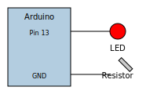

--8<-- "_snippets/disclaimer.md"

# Overview

This section gathers hardware notes and microcontroller sketches. Refer to
the [Arduino documentation](https://www.arduino.cc/) for detailed board
guides. Additional pages will appear here as projects evolve.

## LED Blink Example



```cpp
// Blink an LED on digital pin 13
void setup() {
  pinMode(13, OUTPUT); // initialize digital pin 13 as an output
}

void loop() {
  digitalWrite(13, HIGH); // turn the LED on
  delay(1000);            // wait for a second
  digitalWrite(13, LOW);  // turn the LED off
  delay(1000);            // wait for a second
}
```

For more details, see the [Blink tutorial](https://docs.arduino.cc/tutorials/uno-and-uno-r3/basic-blink).

