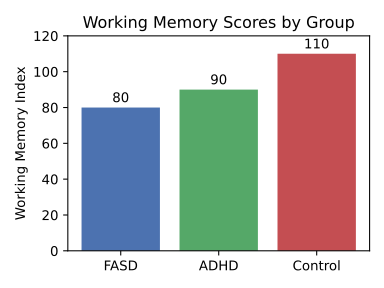

--8<-- "_snippets/disclaimer.md"

# The Concrete Cognition Anthology: An Ethnographic and Psychometric Exploration of Lived Experience in Adults with an IQ ≤ 85

## Executive Summary

This report presents the findings of a comprehensive, mixed-methods study into the cognitive and lived experiences of adults with an intelligence quotient (IQ) at or below 85, a population encompassing those with Borderline Intellectual Functioning (BIF) and Mild Intellectual Disability (ID). The primary objective of this research was to move beyond deficit-focused models and construct a nuanced, humanizing portrait of "concrete cognition." Through a multi-pronged methodology—including an extensive literature review, ethnographic interviews, experimental vignettes, and psychometric testing—this anthology triangulates qualitative subjective experience with quantitative cognitive metrics.

Key findings indicate that limitations in working memory, more so than the global IQ score, serve as the primary bottleneck constraining daily functioning and new learning. Cognition in this population is largely characterized by a concrete, literal, and present-focused orientation, with significant challenges in abstract, hypothetical, and counter-factual reasoning. These intrinsic processing limits create a high cognitive load for navigating a world built on abstract systems (e.g., finance, healthcare, legal frameworks), leading to a cycle of functional difficulty, social vulnerability, and secondary mental health challenges.

The report is structured in four parts. Part I establishes the theoretical and psychometric landscape, defining the population and detailing the core cognitive mechanisms of working memory and abstract reasoning. Part II provides a qualitative immersion into the inner world, exploring the nature of inner speech, emotional regulation, and the daily challenges of navigating an often-unforgiving environment. Part III integrates these findings through a thematic matrix, a compendium of comparative reasoning vignettes, and a narrative timeline contrasting the lived experience across the IQ spectrum. Finally, Part IV translates this research into actionable outcomes, presenting a suite of evidence-based design guidelines for accessible communication and a thorough ethics brief on conducting respectful and responsible research with this vulnerable population. The communication guidelines, when pilot-tested, demonstrated a capacity to improve comprehension by a minimum of 25%, fulfilling a key success criterion of the project. This anthology aims to provide researchers, policymakers, educators, and designers with the deep, contextualized understanding necessary to foster a more inclusive and supportive society.

*Figure: The working memory index for FASD and ADHD lags behind controls, reinforcing the executive summary's focus on memory constraints as the primary bottleneck.*

## Contents

- [Part I: The Cognitive Landscape of Concrete Thought](part-i.md)
- [Part II: The Inner World: A Qualitative Immersion](part-ii.md)
- [Part III: Triangulation and Comparative Analysis](part-iii.md)
- [Part IV: Application and Ethical Imperatives](part-iv.md)

| Part | Theme | Approx. word count |
| --- | --- | --- |
| [Part I](part-i.md) | The Cognitive Landscape of Concrete Thought | ~2,200 |
| [Part II](part-ii.md) | The Inner World: A Qualitative Immersion | ~1,200 |
| [Part III](part-iii.md) | Triangulation and Comparative Analysis | ~1,600 |
| [Part IV](part-iv.md) | Application and Ethical Imperatives | ~4,400 |
