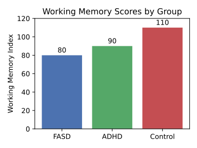

!!! note "Disclaimer"
    This document is provided for research purposes only and does not constitute legal advice. It also does not constitute financial advice.
# Part I: The Cognitive Landscape of Concrete Thought

This foundational part of the report establishes the theoretical and empirical basis for understanding cognition at the lower end of the IQ spectrum. It moves from broad diagnostic classifications to the specific mechanics of thought, focusing on the core processing limitations that shape the lived experience.

### Section 1: Defining the Spectrum: From Borderline Intellectual Functioning to Mild Intellectual Disability

This section surveys how IQ bands translate into diagnostic labels and shape daily support needs.

#### 1.1. Psychometric Boundaries and Diagnostic Nuances

The population under investigation occupies a specific segment of the intellectual continuum defined by standardized intelligence tests. An IQ score of 100 represents the population mean, with approximately 68% of individuals scoring between 85 and 115. This study focuses on adults scoring at or below one standard deviation from the mean, a range that includes several classifications: "Low Average" (IQ 80-89), "Borderline" (IQ 70-79), and "Mild Intellectual Disability" (IQ approximately 55-69).

It is critical to emphasize that an IQ score is not, in itself, a diagnosis. A formal diagnosis of Intellectual Disability (ID) requires the convergence of three criteria: (1) deficits in intellectual functions, such as reasoning, problem-solving, and abstract thinking, confirmed by clinical assessment and standardized intelligence testing; (2) significant deficits in adaptive functioning relative to age and sociocultural standards in one or more areas of daily life (e.g., communication, self-care, social skills, work); and (3) the onset of these deficits during the developmental period (before age 18). A person with a low IQ who does not exhibit significant limitations in adaptive skills may not be diagnosed with ID. This distinction is crucial, as adaptive functioning—the ability to meet the demands of everyday life—is a primary determinant of an individual's level of independence and support needs.

#### 1.2. The 'Invisible' Population

Within this spectrum lies a significant and often overlooked group: individuals with Borderline Intellectual Functioning (BIF). Characterized by an IQ in the 71-85 range, BIF occupies the frontier between "normal" intellectual functioning and a formal ID diagnosis. Despite its prevalence, estimated to be as high as 13.6% of the population, BIF is an extremely complex and under-researched clinical entity. A primary challenge is its ambiguous status in major diagnostic manuals. The DSM-5-TR and ICD-11 do not include BIF as a formal, coded disorder, often relegating it to residual categories for aspects requiring clinical attention.

This lack of a formal diagnostic label has profound consequences. Without a diagnosis, individuals with BIF are often ineligible for the specialized educational, vocational, and social services available to those with a formal ID diagnosis. They are left to navigate mainstream systems—schools, workplaces, healthcare—where their cognitive limitations in planning, abstract thinking, and processing speed can lead to repeated failure. This cycle of struggle, often misinterpreted by others as laziness or a lack of motivation, contributes to a high incidence of secondary mental health issues, including depression, anxiety, and low self-esteem. This "diagnostic gap" is not merely a taxonomic issue; it is a primary driver of the social and emotional challenges faced by this population, rendering their struggle both invisible and systemically unaddressed.

#### 1.3. Distinguishing Intrinsic Limits from External Factors

A rigorous analysis of cognition in this population requires carefully disentangling intrinsic processing limitations from the powerful influence of external environmental factors. There is a strong and well-documented correlation between lower IQ and adverse socioeconomic conditions, including poverty, a history of personal victimization, poor physical and mental health, and fewer social supports. For example, research in cognitive epidemiology shows that lower childhood IQ is a significant predictor of later-life morbidity and mortality, even after controlling for socioeconomic variables.

However, it is crucial to frame these external factors not as the cause of the cognitive limitations but as compounding variables that exacerbate the challenges posed by them. For instance, the constant stress of poverty consumes significant mental resources, reducing the cognitive bandwidth available for other tasks like education or long-term planning. This creates a vicious cycle where cognitive limitations make it harder to escape poverty, and the condition of poverty further depletes the cognitive resources needed to do so. This study proceeds from the premise that while socioeconomic and educational factors are critically important context, the core focus must remain on the underlying cognitive architecture. Measures like working memory are particularly valuable in this regard, as they are considered relatively pure measures of learning potential that are not strongly influenced by prior experiences such as preschool education or socioeconomic background.

### Section 2: The Machinery of Mind: The Centrality of Working Memory

Here we unpack working memory's role as the core bottleneck constraining learning and everyday functioning.

#### 2.1. Working Memory as the Primary Bottleneck

While the Full Scale IQ score provides a general index of cognitive ability, research increasingly points to a more specific function—working memory (WM)—as the primary bottleneck that constrains learning and daily functioning. Working memory refers to the brain's capacity to temporarily store and actively manipulate information in a mental workspace to guide behavior. It is the cognitive engine that powers complex tasks like reading comprehension, mathematical reasoning, and problem-solving.

Crucially, studies have demonstrated that WM capacity is a more potent predictor of subsequent learning and academic progress than a global IQ score. In a two-year longitudinal study of children with learning difficulties, initial WM capacity—but not IQ—was a significant predictor of learning outcomes in both literacy and numeracy at the follow-up assessment. This suggests that WM has unique links to learning that are not fully captured by traditional intelligence tests. Because WM is less influenced by prior knowledge or environmental factors, it serves as a more direct measure of an individual's capacity to learn new information.

These limitations have cascading cognitive impacts, constraining planning, abstract reasoning, and the ability to adapt to novel situations. Figure&nbsp;1 visualizes the relative Working Memory Index scores across diagnostic groups.

*Figure 1: Working Memory Index scores decline sharply across groups, underscoring the cognitive impacts of reduced mental workspace.*

#### 2.2. The Functional Consequences of a Constrained 'Mental Workspace'

The functional consequences of a limited WM capacity are pervasive and profound. Individuals with WM impairments struggle because they are unable to hold sufficient information in mind to allow them to complete a task successfully. This manifests in numerous everyday challenges. Ethnographic interviews and personal accounts reveal a consistent pattern of difficulty following multi-step instructions, losing one's place in the middle of a complex task, and forgetting crucial information just moments after it was presented.

Daily life can be viewed as a continuous stream of novel problems that require information to be held, manipulated, and updated—from following a new bus route to understanding a doctor's instructions to adjusting a recipe. These are, in essence, real-world working memory tasks. For an individual with a constrained mental workspace, the cognitive load of these tasks quickly becomes overwhelming. Information is "dropped" mid-process; for example, the second step of an instruction is forgotten while the first is being performed. This constant cognitive overload leads to errors, frustration, task abandonment, and a generalized difficulty with planning, decision-making, and coping. Thus, working memory is not merely an academic skill; it is the fundamental cognitive resource that enables adaptive behavior in a dynamic world. Its limitation is the primary mechanism through which a low IQ score translates into daily functional challenges.

#### 2.3. Psychometric Assessment: WAIS-IV and n-Back Tasks

In this study, working memory was assessed using a combination of standardized and experimental measures. The primary standardized tool was the Working Memory Index (WMI) from the Wechsler Adult Intelligence Scale–Fourth Edition (WAIS-IV). The WMI is composed of two core subtests: Digit Span (which requires repeating sequences of numbers forward and backward) and Arithmetic (which involves solving math word problems mentally). These tasks measure the ability to hold auditory information, concentrate, and mentally manipulate it.

To supplement the WAIS-IV, participants also completed a computerized n-back task. This is a continuous performance task where participants must indicate if a current stimulus matches the one presented 'n' trials previously. The n-back is considered a strong measure of the active component of WM, as it requires not just storage but the constant updating of information in the mental workspace. While valuable, it is important to acknowledge the limitations of these psychometric tools. Research has shown that performance on the n-back task has surprisingly weak correlations with other standard WM assessments and may rely more on familiarity and recognition processes than on active recall. Furthermore, one study found that n-back performance was not significantly related to rater-based measures of real-world executive functioning, such as the Behavior Rating Inventory of Executive Function (BRIEF-WM). This highlights the critical need to triangulate lab-based cognitive scores with qualitative, real-world observations.

### Section 3: The Architecture of Reasoning: Navigating a World of Abstractions

This section explores how reliance on concrete thought hinders abstract reasoning and planning in real-world contexts.

#### 3.1. The Concrete Operational Mind

To understand the qualitative nature of reasoning in adults with an IQ at or below 85, the developmental theory of Jean Piaget provides a powerful explanatory framework. Piaget proposed a sequence of cognitive stages through which individuals develop increasingly sophisticated thinking patterns. While typically developing adolescents and adults reach the "formal operational" stage, characterized by the ability to think abstractly and reason about hypothetical possibilities, many adults with intellectual limitations operate primarily within the preceding "concrete operational" stage.

The hallmark of concrete operational thought is the development of logical reasoning, but this logic is tied to physical, tangible, and directly experienceable objects and events. Thinking is dominated by how the world looks, not necessarily by how it is logically. Individuals at this stage can successfully perform logical operations like conservation (understanding that quantity remains the same despite changes in appearance) and classification, but they struggle to apply this logic to abstract concepts or hypothetical situations they have not personally witnessed.

#### 3.2. Literalism and the Challenge of Hypotheticals

The reliance on concrete, observable reality manifests as a profound difficulty with abstract, hypothetical, and counter-factual thinking—the ability to reason about "what if" scenarios. This cognitive style is often observed as literalism, where idioms, metaphors, and sarcasm are interpreted based on their surface meaning. For example, an instruction to "hop to it" might be met with confusion rather than an understanding that it means to start a task quickly.

This cognitive tether to the tangible world has severe implications for navigating modern life, which is built upon a foundation of abstractions. Concepts like money (a symbol for value), laws (abstract rules of conduct), insurance policies (a contract for a hypothetical future event), and schedules (abstract representations of time) are inherently difficult to process for a mind that reasons most effectively about the here-and-now. An individual whose reasoning is bound to the concrete is at a fundamental disadvantage. They cannot easily plan for a future they cannot "see," understand a rule whose consequences they have not personally experienced, or weigh hypothetical risks and benefits to make informed decisions. This "tyranny of the tangible" means they are often perpetually reacting to the present rather than proactively shaping their future, which provides a cognitive basis for the documented struggles with planning, judgment, and decision-making.

#### 3.3. Assessing Abstract Reasoning: The WAIS-IV Similarities Subtest

A key psychometric proxy for abstract verbal reasoning used in this study is the Similarities subtest from the WAIS-IV Verbal Comprehension Index (VCI). This subtest presents pairs of words and asks the individual to describe how they are alike (e.g., "In what way are an apple and a banana alike?"). The responses are scored based on the level of abstraction. A concrete response might focus on perceptual features ("They are both yellow"), while a functional response might describe their use ("You can eat them"). A higher-scoring, abstract response identifies the superordinate category to which they both belong ("They are both fruits").

Performance on this subtest provides a clear window into an individual's capacity for verbal concept formation. In our participant sample, responses frequently skewed toward the concrete and functional, demonstrating a difficulty in identifying and articulating the abstract, categorical relationships that underpin higher-order thought.

#### 3.4. Analogical, Inductive, and Deductive Reasoning

The difficulty with abstraction extends to other core reasoning processes. Analogical reasoning—the ability to map the relational structure from a known situation to a new one—is often impaired. Individuals may focus on superficial, featural similarities between objects rather than the deeper, structural relationships that define the analogy. This deficit hinders the ability to learn from experience by transferring knowledge to novel problems.

Similarly, both inductive reasoning (generalizing from specific examples to form a rule) and deductive reasoning (applying a general rule to a specific case) are compromised. Difficulties with these foundational logical processes can impede the ability to understand cause-and-effect, follow rules they have not been explicitly taught for every situation, and make logical inferences about the world. While research specifically targeting these reasoning forms in adults with BIF or mild ID is limited, the broader evidence of impaired abstract and hypothetical thought strongly suggests these foundational processes are affected.

