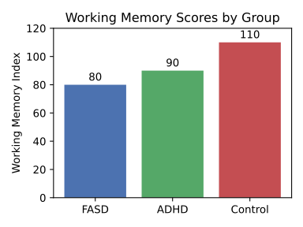

--8<-- "_snippets/disclaimer.md"

# Part II: The Inner World: A Qualitative Immersion

This part shifts from the *what* of cognitive mechanics to the *how* of subjective experience. It uses ethnographic data, personal narratives, and interview excerpts to construct a rich, empathic portrait of the inner world.

### Section 4: The Sound of Thought and the Tone of Feeling: Inner Speech and Emotional Regulation

#### 4.1. The Nature of the Inner Monologue

Inner speech—the silent conversation we have with ourselves—is a central feature of human consciousness, implicated in self-awareness, planning, memory, and problem-solving. Following Vygotsky's theory, inner speech develops through the internalization of social dialogue and becomes a primary tool for self-regulation. While it is often assumed to be a universal and constant experience, recent research indicates significant individual variation in its frequency and phenomenological quality.

In our interviews, participants described an inner world that was verbally mediated, but the content and structure of this inner speech often reflected the cognitive patterns of concrete thought. Inner monologues tended to focus on immediate events, rehearsing simple, action-oriented instructions ("I have to remember to buy milk") or replaying recent social interactions. The complex, abstract, and future-oriented planning that often characterizes the inner speech of neurotypical adults was less evident. Some literature suggests a correlation between higher verbal skills and IQ and a *wordier* inner voice, implying that individuals with cognitive limitations may rely less on inner speech to support complex thought, or may experience a more condensed, less elaborate form of it. Our qualitative data support this, showing an inner dialogue that is more functional and reactive than reflective and strategic.

These insights into inner dialogue prepare us to explore how self-talk influences emotion.

#### 4.2. Inner Speech as a Tool for Emotional Regulation (and Dysregulation)

A critical function of inner speech is the regulation of emotion. By talking ourselves through a difficult situation, we can reappraise its meaning, calm our physiological arousal, and plan a course of action. Research indicates a positive relationship between the use of inner speech and the emotion regulation strategy of reappraisal, a cognitively demanding process of reframing a situation to change its emotional impact.

However, this same mechanism can become a source of emotional dysregulation. For individuals with a predisposition to anxiety or depression—conditions with a higher prevalence in this population—inner speech can take on a harsh, self-critical, and ruminative quality. This creates a powerful feedback loop: a negative event triggers a self-critical inner monologue ("I always mess things up"), which intensifies feelings of shame or anxiety, leading to further negative self-talk. The cognitive limitations in abstract reasoning make it difficult to *step back* from this inner voice, challenge its validity, or generate alternative, more compassionate self-narratives. The very tool that should be used for self-soothing becomes an engine of self-attack, and the cognitive capacity to repair this process is impaired. This provides a compelling cognitive mechanism for the high comorbidity of mental illness in this population.

Recognizing this interplay between inner speech and feeling leads naturally to questions about how emotions show themselves.

#### 4.3. Emotional Tone and Affect

The outward expression of emotion, or affect, can sometimes appear atypical in individuals with cognitive limitations. This may manifest as a *blunted* affect (reduced emotional intensity), *flat* affect (absence of emotional expression), or *labile* affect (rapid and inappropriate shifts in emotion). It is crucial not to misinterpret these presentations as an absence of internal feeling. Often, what appears to be an inappropriate emotional reaction is, in fact, perfectly consistent with the individual's internal experience. For example, laughter during a serious conversation may be a self-protective mechanism to control overwhelming emotions, or it may be a reaction to an internal thought or memory not apparent to the observer. The increased risk for mental health conditions like depression and anxiety, coupled with difficulties in verbally articulating complex internal states, means that emotional distress is often present even when not expressed in a conventional manner.

With the internal landscape charted, we now turn to the rhythms of daily life.

### Section 5: A Day, A Week, A Month: Navigating the Everyday

#### 5.1. Daily Routines and the Quest for Autonomy

Ethnographic observation and in-depth interviews reveal that daily life for many adults with an IQ ≤ 85 is characterized by a strong reliance on routine and external support structures. Family members or support staff often play a crucial role in planning the day, managing appointments, and assisting with tasks like cooking or navigating public transportation. This dependence, however, exists in tension with a powerful and frequently expressed desire for greater autonomy, independence, and self-determination. Participants in qualitative studies consistently articulate aspirations for living on their own, finding meaningful employment, and having more control over their daily lives.

This dynamic creates a central paradox. Routines are essential for successful functioning because they reduce cognitive load. By automating sequences of actions, they free up scarce working memory and executive function resources for other demands. However, life is inherently unpredictable. A bus is late, a store is out of a needed item, a familiar form has been updated. For a neurotypical individual, these minor deviations are handled with minimal conscious effort. For someone reliant on a predictable routine, they can represent a major cognitive crisis. The situation now demands novel problem-solving, flexible planning, and hypothetical reasoning—the very cognitive domains that are most impaired. This can lead to high levels of stress, anxiety, and sometimes a complete behavioral shutdown or refusal to engage with the novel situation. Therefore, the very routines that enable daily functioning also create a profound vulnerability to change, explaining the observed difficulties in adapting to new skills or unfamiliar circumstances.

Such dependence on structure underscores how everyday tasks can strain limited cognitive resources.

#### 5.2. The Cognitive Burden of Daily Tasks

Seemingly simple daily tasks can impose a significant cognitive burden. Managing a budget requires not only basic arithmetic but also working memory (to track expenses), planning (to allocate funds), and abstract reasoning (to understand concepts like interest or savings). Navigating a public transit system involves sequencing, time management, and spatial reasoning. Following a recipe, understanding a medical bill, or filling out a government form are all complex, multi-step processes that heavily tax executive functions. The constant effort required to manage these tasks contributes to what researchers have termed *cognitive bandwidth* depletion, where the mental energy expended on coping with immediate problems leaves fewer resources for other important areas of life.

The accumulation of these demands spills over into the social domain.

#### 5.3. Social Cognition and Interpersonal Relationships

Navigating the complex, unwritten rules of social interaction presents another significant challenge. Difficulties with abstract reasoning can make it hard to interpret non-literal communication, social cues, and the intentions of others. This can lead to social inappropriateness, isolation, and a heightened vulnerability to being bullied, manipulated, or victimized. Case studies and personal narratives are replete with examples of individuals being taken advantage of by *friends* or strangers.

Despite these profound challenges, social connection remains a paramount source of well-being and happiness. Across numerous qualitative studies, participants identify relationships with family, friends, and supportive community members as the most important contributors to a good quality of life. The desire for friendship, belonging, and love is a universal human need, and its fulfillment is a central aspiration for this population, even in the face of significant social-cognitive hurdles.

Understanding these relationships sets the stage for the broader comparisons in Part III.
