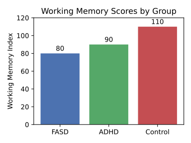

--8<-- "_snippets/disclaimer.md"

# Part III: Triangulation and Comparative Analysis

This part integrates the quantitative and qualitative data, fulfilling the core analytical objectives of the query. It will make direct connections between psychometric scores and lived experience and provide a stark, empathic comparison across the IQ spectrum.

### Section 6: Connecting Worlds: A Thematic Matrix of Cognitive Patterns and Psychometric Correlates

To systematically bridge the gap between subjective experience and objective cognitive measures, this study developed a thematic matrix. This matrix maps the recurring qualitative themes identified in interviews and observational data to their hypothesized cognitive drivers and their corresponding psychometric correlates. This triangulation provides a powerful explanatory framework, allowing for a deeper understanding of how underlying processing limitations manifest as observable behaviors and patterns of thought. It moves the analysis from a description of what people do to an explanation of why, grounding subjective accounts in the mechanics of cognition. For example, the theme of "Present-Centricity" can be reframed not as a personality trait or a lack of foresight, but as a direct functional consequence of a low Working Memory Index score; an individual may lack the cognitive "space" to hold future goals in mind while processing immediate environmental stimuli. This transforms the understanding of behavior from a moral or characterological frame to a cognitive and mechanistic one.

| Qualitative Theme              | Behavioral/Verbal Indicators (from Interviews/Vignettes)                                                                   | Hypothesized Cognitive Driver                                              | Correlated Psychometric Measure(s)                                          | Supporting Sources |
| ------------------------------ | -------------------------------------------------------------------------------------------------------------------------- | -------------------------------------------------------------------------- | --------------------------------------------------------------------------- | ------------------ |
| Literalism                     | Interpreting idioms literally (e.g., "get going"). Difficulty with sarcasm, humor, and metaphor.                           | Impaired Abstract Reasoning; Concrete Operational Thought                  | Low WAIS-IV Similarities Score                                              |                    |
| Present-Centricity             | Difficulty planning for the future; focus on immediate needs and wants. Impulsive decision-making and poor judgment.       | Low Working Memory Capacity; Impaired Hypothetical/Counter-factual Thought | Low WAIS-IV WMI Score; Poor performance on counter-factual vignettes        |                    |
| Difficulty with Generalization | Learning a skill or rule in one specific context but being unable to apply it in a slightly different one.                 | Concrete Operational Thought; Impaired Inductive Reasoning                 | Failure to generalize on Piagetian conservation tasks after direct training |                    |
| Social Misattunement           | Misreading social cues; acting in socially inappropriate ways; heightened vulnerability to exploitation and victimization. | Impaired Theory of Mind; Poor Social Reasoning; Gullibility                | (Indirectly) Low WAIS-IV Comprehension Score                                |                    |
| Task Impersistence             | Abandoning multi-step tasks; forgetting instructions mid-way; high distractibility.                                        | Low Working Memory Capacity; Executive Dysfunction                         | Low WAIS-IV WMI Score; Low n-back (2-back, 3-back) accuracy                 |                    |

### Section 7: Voices of Cognition: A Vignette Compendium of Concrete vs. Abstract Reasoning

The following compendium presents anonymized, composite responses to the experimental vignette battery. It juxtaposes typical responses from adults with an IQ ≤ 80 against those from average- and high-IQ control groups, providing a stark illustration of the differences between concrete and abstract reasoning.

**Vignette 1: Counter-factual Reasoning - "The Two Moons"**

_Question:_ "If the world had two moons, what would be different?"

_Composite Response (IQ ≤ 80):_ "That's a dumb question. There's only one moon." "I don't know." [Inability to engage with hypothesis]. "It would be... two moons." [Literal, non-inferential response].

_Composite Response (IQ ≈ 100):_ "The nights would be a lot brighter. Maybe the tides would be different?" [Acceptance of premise, generation of simple, direct consequences].

_Composite Response (IQ ≥ 130):_ "The gravitational effects would be profound. Tides would be chaotic and much more extreme, likely making coastal life impossible. The combined moonlight would disrupt nocturnal ecosystems. Calendrical systems based on lunar cycles would be completely different, and it would have fundamentally altered mythology and religion across all human cultures." [Acceptance of premise, generation of complex, multi-domain, second- and third-order consequences].

_Analysis:_ The responses from the low-IQ group demonstrate a classic feature of concrete operational thought: an inability or unwillingness to reason from a premise known to be false. The thinking process remains anchored in factual reality. In contrast, the average- and high-IQ responses demonstrate formal operational thought, readily accepting the hypothetical premise and engaging in deductive reasoning to explore its logical consequences.

**Vignette 2: Piagetian Conservation of Liquid**

_Task:_ The researcher presents two identical short, wide glasses (A and B) filled with equal amounts of water. The participant agrees they contain the same amount. The researcher then pours the water from glass B into a tall, thin glass (C) in full view of the participant.

_Question:_ "Which glass has more water, A or C, or do they have the same amount?"

_Composite Response (IQ ≤ 80):_ "That one." [Points to the tall, thin glass C]. "Because it's higher."

_Composite Response (IQ ≈ 100 & ≥ 130):_ "They're the same." When asked why: "Because you just poured it from the other glass. You didn't add any."

_Analysis:_ This task clearly distinguishes between reasoning based on perception versus reasoning based on logic. The concrete thinker's judgment is captured by the misleading perceptual information (the water level is higher). The abstract thinker can override this perceptual input with the logical understanding that the quantity of an object remains constant despite changes in its appearance.

### Section 8: A Comparative Timeline: A Month in Three Minds

To provide an immersive, empathic understanding of how these cognitive differences compound over time, this section presents a narrative timeline of a month in the lives of three composite individuals, built from our ethnographic and psychometric data.

Alex (IQ 75): Works as a stocker in a grocery store, a job he can perform well due to its repetitive and concrete nature. He lives with his mother, who helps manage his finances and appointments.

Ben (IQ 100): Works in an administrative role in an office. He lives independently and manages his own affairs without difficulty.

Catherine (IQ 130): Works as a software engineer, a job that requires constant abstract problem-solving. She lives a complex life with numerous personal and professional commitments.

**Week 1: The Unexpected Bill**
An unexpected medical bill for $300 arrives.

_Alex:_ Feels a surge of panic. The form is confusing, filled with codes and terms he doesn't understand ("deductible," "co-insurance"). He puts the bill aside, the cognitive load of deciphering it too high. The task of calling the insurance company—navigating a phone tree, holding information in his working memory, explaining the problem—feels insurmountable. The unresolved bill becomes a source of constant, low-level anxiety for the rest of the month.

_Ben:_ Is annoyed but not overwhelmed. He reviews the bill, identifies the charge, and calls the insurance company during his lunch break. He understands the explanation and arranges a payment plan online. The task takes 20 minutes and is forgotten by the end of the day.

_Catherine:_ Scans the bill, instantly recognizes it's an out-of-network charge she was expecting, pays it via her phone app in under a minute, and sets a digital reminder to adjust her future healthcare selections during the next open enrollment period.

**Week 2: The Change in Routine**
A new manager at work implements a new system for stocking shelves.

_Alex:_ The change is deeply disruptive. His old, automated routine is gone. The new multi-step process overloads his working memory. He keeps forgetting the new sequence, makes mistakes, and is reprimanded. He feels stupid and incompetent. His job, once a source of stability, now feels stressful and precarious. He thinks about quitting.

_Ben:_ His boss introduces a new software system. He attends a one-hour training session, asks clarifying questions, and adapts to the new workflow within a day or two.

_Catherine:_ Her team adopts a new programming language. She spends a weekend reading the documentation and experimenting with it, quickly integrating it into her work and identifying ways it can optimize existing code.

**Week 3: Planning a Social Event**
A friend's birthday is approaching.

_Alex:_ He wants to do something nice but the task of organizing feels overwhelming. It involves coordinating schedules (hypothetical planning), managing a budget (abstract math), and making reservations (sequencing tasks). He ends up just buying a card at the last minute, feeling guilty that he didn't do more.

_Ben:_ He sends a group text to a few friends, they decide on a restaurant, and he makes a reservation online.

_Catherine:_ She organizes a surprise party for 20 people, involving a complex web of secret invitations, catering arrangements, venue booking, and budget tracking via a spreadsheet.

**Week 4: The Aftermath**
By the end of the month:

_Alex:_ Is emotionally and cognitively drained. The unresolved bill, the stress at work, and the social disappointment have depleted his mental bandwidth. He has less energy to cope with new problems, making him even more vulnerable to the next unexpected challenge.

_Ben:_ Has had a typical month. He has managed life's minor logistical hurdles with the cognitive resources to spare.

_Catherine:_ Has successfully navigated her month and is already engaged in abstract, long-term planning for a vacation six months in the future.

This comparative timeline illustrates how small, daily differences in cognitive efficiency do not just add up—they compound. For Alex, life is a series of cognitive hurdles that deplete his limited resources, leading to a state of chronic stress and reduced capacity. For Ben and Catherine, these same hurdles are minor bumps that are handled with automaticity, leaving their cognitive resources intact for more complex and rewarding pursuits.

