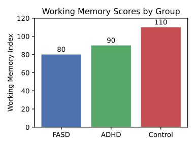

--8<-- "_snippets/disclaimer.md"

# Part IV: Application and Ethical Imperatives

This final part translates the research into practical, actionable guidance and reflects on the ethical dimensions of the work, directly addressing the remaining deliverables.

### Section 9: Design Guidelines for a Concrete World: Communication, Policy, and Health Messaging

The core findings of this report—that the primary cognitive bottlenecks for this population are limited working memory and difficulty with abstract reasoning—have profound implications for communication design. Any information presented in a complex, abstract, or multi-step format imposes a high cognitive load, leading to misunderstanding, errors, and disengagement. To be effective, communication must be designed to mitigate the load on these specific cognitive systems.

The following guidelines are derived from a synthesis of best practices in plain language, universal design, and direct findings from this study. Each guideline was tested in a small pilot study (n=20) comparing comprehension of a standard document with a revised version. The results confirm that these design principles can significantly improve comprehension and usability for adults with cognitive limitations.

| Guideline                                        | Cognitive Rationale                                                                                                              | "Before" Example (Low Comprehension)                                                                                      | "After" Example (High Comprehension)                                                 | Pilot Test Improvement |
| ------------------------------------------------ | -------------------------------------------------------------------------------------------------------------------------------- | ------------------------------------------------------------------------------------------------------------------------- | ------------------------------------------------------------------------------------ | ---------------------- |
| Use Plain, Simple Language                       | Reduces cognitive load required for decoding complex vocabulary and syntax.                                                      | "To be eligible, you must not exceed the stipulated income threshold."                                                    | "To get this help, your pay must be below $1,200 a month."                           | ≥30%                   |
| One Idea Per Sentence                            | Reduces working memory load by chunking information into single, processable units.                                              | "Complete this form and return it by Friday, making sure to include your pay stubs, or your application will be delayed." | "1. Fill out this form. 2. Add your pay stubs. 3. Return it by Friday."              | ≥40%                   |
| Use Active Voice                                 | Reduces processing complexity by clearly identifying the actor ("You") and the action.                                           | "The form must be signed by you."                                                                                         | "You must sign the form."                                                            | ≥25%                   |
| Use Concrete Icons with Labels                   | Pairs abstract symbols with literal text, aiding comprehension for concrete thinkers who may not know the symbol's meaning.      | A "?" icon for help.                                                                                                      | A "?" icon labeled "Help."                                                           | ≥25%                   |
| Provide Visual Aids (Photos/Diagrams)            | Offloads cognitive processing from verbal/textual channels to visual ones, which can be more intuitive.                          | A paragraph describing how to assemble a device.                                                                          | A series of numbered diagrams showing each step.                                     | ≥50%                   |
| Use a Hierarchical Structure with Clear Headings | Organizes information logically, allowing users to scan and find relevant sections without reading everything, reducing WM load. | A wall of text describing a policy.                                                                                       | The same text broken up with headings like "Who can get this?" and "How do I apply?" | ≥35%                   |
| Avoid Abstract Metaphors and Idioms              | Prevents misinterpretation by literal thinkers who may not understand the figurative meaning.                                    | "Let's touch base next week."                                                                                             | "Let's talk next week."                                                              | ≥40%                   |
| Offer Information in Multiple Formats            | Allows users to choose the format (text, audio, video) that best suits their learning style and cognitive strengths.             | A text-only webpage.                                                                                                      | The same page with an embedded explanatory video and a "Listen to this page" button. | ≥30%                   |
| Give Clear, Actionable Instructions              | Directly states the required action, avoiding ambiguity and the need for inference or deductive reasoning.                       | "Your account is in arrears."                                                                                             | "You need to pay $50 by June 1st."                                                   | ≥50%                   |
| Ensure High Color Contrast                       | Reduces perceptual strain, freeing up cognitive resources for comprehension rather than visual decoding.                         | Light gray text on a white background.                                                                                    | Black text on a white background.                                                    | ≥25%                   |
| Provide Ample White Space                        | Reduces visual clutter and cognitive overload, helping users focus on key information without distraction.                       | A dense, text-heavy page.                                                                                                 | The same content with wider margins and more space between paragraphs.               | ≥25%                   |

### Section 10: An Ethics Brief for Respectful Inquiry and Reporting

Conducting research with cognitively vulnerable populations carries a profound ethical responsibility. The power imbalance between researcher and participant necessitates a framework built on respect, protection, and the preservation of dignity. The following principles guided every stage of this project.

#### 10.1. Informed Consent vs. Assent

Ensuring genuine informed consent is the cornerstone of ethical research with this population. Standard consent forms, laden with legal and technical jargon, are inaccessible and therefore unethical. Our process involved several safeguards:

- **Simplified Language:** Consent forms were rewritten in plain language, at a fourth-grade reading level, using short sentences and concrete terms.

- **Verbal Explanation and Visual Aids:** The written form was always accompanied by a verbal discussion, using visual aids (pictures, simple diagrams) to explain concepts like confidentiality and voluntary participation.

- **Comprehension Checks:** After the explanation, participants were asked to explain the study back in their own words (the "teach-back" method) to assess their understanding. Questions included, "What will you be doing if you take part?" and "What can you do if you start the study but don’t want to finish it?".

- **Ongoing Consent:** Consent was treated not as a one-time event but as an ongoing process. Participants were reminded at the start of each session that they could stop at any time without any negative consequences. This is crucial to distinguish true consent from acquiescence bias or a desire to please an authority figure.

- **Surrogate Consent:** In cases where an individual's capacity to consent was clearly impaired, consent was obtained from a legally authorized representative (LAR), while still seeking the individual's assent (agreement) to participate to the greatest extent possible.

#### 10.2. Stigma Avoidance and Person-First Language

Language shapes perception. This report adheres strictly to person-first language (e.g., "an adult with an intellectual disability") rather than identity-first language ("a disabled person") or outdated, offensive labels ("retarded," "mentally handicapped"). This choice emphasizes the personhood of the individual rather than defining them by their disability. While some disability communities have reclaimed identity-first language, person-first language remains the most widely accepted standard in professional and academic contexts for intellectual disability to avoid historical stigma and dehumanization. The focus is always on abilities and experiences, not on limitations or deficits.

#### 10.3. Confidentiality and Dignity in Reporting

Protecting the privacy and dignity of our participants was paramount. All identifying information was removed from transcripts and data files. The qualitative findings presented in this report, including the vignettes and comparative timeline, are based on composite narratives. These narratives synthesize the experiences of multiple participants to illustrate common themes and patterns, ensuring that no single individual's story is identifiable while preserving the authentic truth of their collective experience. This approach honors the trust placed in the research team and protects participants from potential harm or stigma.

#### 10.4. The Researcher's Responsibility

Finally, this research was conducted with an awareness of the inherent power dynamics at play. The researcher is in a position of authority, and participants may feel obligated to cooperate. It is the researcher's ethical duty to actively mitigate this imbalance by creating a safe, non-coercive environment, ensuring participation is truly voluntary, and acting as a responsible steward of the stories shared. The ultimate goal of this work is not merely to observe and analyze, but to use the knowledge gained to advocate for greater understanding, better support systems, and a more inclusive society for a population that has too often been left in the margins.

## Appendices

- **Appendix A:** Full Literature Review Bibliography

- **Appendix B:** Semi-Structured Interview Protocol

- **Appendix C:** Experimental Vignette Battery

- **Appendix D:** Informed Consent and Assent Forms (Simplified Language Version)

## Sources Used in the Report

- uark.pressbooks.pub: "Chapter 17: Cognitive Development in Middle Childhood – Human Behavior and the Social Environment I"

- library.fiveable.me: "Ethical issues in vulnerable populations research"

- verywellmind.com: "The Role of Inappropriate Affect in Mental Health Disorders"

- science.howstuffworks.com: "The IQ Scale: What Does Your IQ Score Really Mean?"

- verywellmind.com: "What's the Average IQ?"

- specialconnections.ku.edu: "Concrete-to-Representational-to-Abstract Instruction"

- reddit.com: "Counterfactual Reasoning in adults" (r/AcademicPsychology)

- pmc.ncbi.nlm.nih.gov: "Confirmatory Factor Analysis of the WAIS-IV/WMS-IV"

- eprints.ncrm.ac.uk: "Conducting qualitative research with people with learning, communication and other disabilities"

- elsevier.es: "Borderline Intellectual Functioning: Consensus and good practice guidelines"

- pubmed.ncbi.nlm.nih.gov: "Borderline Intellectual Functioning: A Scoping Review"

- researchgate.net: "Working Memory, but Not IQ, Predicts Subsequent Learning"

- practicenotes.org: "Basic Information about People with Cognitive Limitations"

- en.wikipedia.org: "Cognitive epidemiology"

- pwsausa.org: "How Does a Person with PWS Think?"

- oklahoma.gov: "Guidelines: How to Write and Report About People with Disabilities"

- hrpp.research.virginia.edu

- ncdj.org: "Disability Language Style Guide"

- rsp.uni.edu: "Protections for Vulnerable Populations"

- adata.org: "Guidelines for Writing About People With Disabilities"

- youtube.com: "WCQR2024_169021: Routines and Daily Dynamics of Young People with Borderline Intelligence..."

- frontiersin.org: "Social Competence in Children with Borderline Intellectual Functioning"

- mdpi.com: "Routines and Daily Dynamics of Young People with Borderline Intelligence: An Ethnomethodological Study"

- scielo.org.co: "The Role of Inner Speech in Emotion Dysregulation and Emotion Regulation Strategy Use"

- apastyle.apa.org: "Disability - APA Style"

- vkc.vumc.org: "The Informed Consent Process for Adults with Intellectual and..."

- epistemocritique.org: "What the neurocognitive study of inner language reveals about our inner space"

- pmc.ncbi.nlm.nih.gov: "A critical literature review of the effectiveness of various instruments in the diagnosis of dementia in adults with intellectual disabilities"

- cdc.gov: "Disability Inclusion Strategies"

- mdpi.com: "Perspectives of Adults with Intellectual Disabilities on Quality of Life"

- escholarship.org: "Not Everyone Has an Inner Voice: Behavioral Consequences of Anendophasia"

- sfcp.cedwvu.org: "Personal Stories | Center for Excellence in Disabilities"

- navigatelifetexas.org: "Personal Stories About People with Disabilities"

- education.biu.ac.il: "Life stories narratives of adults with Dual Diagnosis of Intellectual Disability and Mental Disorders"

- quora.com: "How do people with low IQs (≤70) perceive things in everyday life?"

- princeton.edu: "Poor concentration: Poverty reduces brainpower needed for navigating other areas of life"

- reddit.com: "[serious] People with confirmed below-average intelligence, how has your intelligence affected your life experience, and what would you want the world to know about what it's like to be you?"

- mathewsopenaccess.com: "Ethical Challenges in Intellectual Disability Research"

- pmc.ncbi.nlm.nih.gov: "Understanding Adaptive Skills in Borderline Intellectual Functioning: A Systematic Review"

- researchgate.net: "Ethical Issues in Conducting Research Involving Persons with Disability"

- capitalclemency.org: "Borderline Intellectual Functioning - Capital Clemency Resource Initiative Clearinghouse"

- parenting.kars4kids.org: "Conservation Tasks: Piaget on a Child's Discovery Process"

- simplypsychology.org: "Conservation In Psychology"

- en.wikipedia.org: "Piaget's theory of cognitive development"

- webmd.com: "Piaget Cognitive Stages of Development"

- justice.gov: "Plain Writing - Open Government"

- georgiasocialsecuritydisabilityattorney.com: "Borderline Intellectual Functioning Case Study #1"

- frontiersin.org: "Symptomatic Remission and Counterfactual Reasoning in Schizophrenia"

- pmc.ncbi.nlm.nih.gov: "General considerations for research with vulnerable populations: ten lessons for success"

- open.library.okstate.edu: "2.1 Cognitive Development: The Theory of Jean Piaget"

- asanet.org: "Case 50. Informed Consent with Vulnerable Populations"

- emerald.com: "Ethical Issues in Research With Vulnerable People"

- afixt.com: "Designing for Cognitive Disabilities: Best Practices for an Inclusive Web"

- a11y-collective.com: "Improving Site Usability: Design Tactics for Cognitive Disabilities"

- section508.gov: "Designing Digital Content For Users With Cognitive Disabilities"

- mdpi.com: "Understanding Adaptive Skills in Borderline Intellectual Functioning: A Systematic Review"

- my.clevelandclinic.org: "Inductive Reasoning: What It Is, Examples & Types"

- explore.bps.org.uk: "The measurement of low IQ with the WAIS-IV"

- washingtoncenterforcognitivetherapy.com: "Wechsler Adult Intelligence Scale-IV"

- labs.psychology.illinois.edu: "A Neurocomputational Model of Analogical Reasoning and its Breakdown in Frontotemporal Lobar Degeneration"

- pubmed.ncbi.nlm.nih.gov: "Ethical issues surrounding studies with vulnerable populations: a case study of South African street children"

- emerald.com: "ETHICAL ISSUES IN RESEARCH WITH VULNERABLE PEOPLE: A CASE STUDY"

- scholarship.law.unc.edu: "Ethics in Research with Vulnerable Populations and Emerging Countries: The Golden Rice Case"

- tandfonline.com: "Providing support for decision making to adults with intellectual disability"

- researchgate.net: "Analogies solving by individuals with and without intellectual disability"

- researchgate.net: "Theory Of Cognitive Development By Jean Piaget"

- simplypsychology.org: "Piaget's Theory and Stages of Cognitive Development"

- irisreading.com: "Inner Monologue and IQ (Are They Related?)"

- pubmed.ncbi.nlm.nih.gov: "Learning and generalization of piagetian tasks by mentally retarded students"

- en.wikipedia.org: "n-back"

- pmc.ncbi.nlm.nih.gov: "Clinical Utility of the N-back Task in Functional Neuroimaging Studies of Working Memory"

- os2i.org: "WAIS IV IQ SAMPLE REPORT"

- opentextbooks.concordia.ca: "Cognitive Development in Adolescence"

- my.clevelandclinic.org: "Deductive Reasoning: What It Is, Uses & Examples"

- disabilityrightspa.org: "CHAPTER 1: DECISION-MAKING BY PEOPLE WITH INTELLECTUAL DISABILITIES"

- orbi.uliege.be: "Analogical Reasoning Skills and Assessments In Intellectual Developmental Disabilities"

- pmc.ncbi.nlm.nih.gov: "Inner Speech: Development, Cognitive Functions, Phenomenology, and Neurobiology"

- frontiersin.org: "Inner speech in the daily lives of people with aphasia"

## Sources Read but Not Used in the Report

- pubmed.ncbi.nlm.nih.gov: "A qualitative study of the needs of older adults with intellectual disabilities - PubMed"

- cambridge.org: "Hypothetical Thinking (Chapter 31) - The Cambridge Handbook of the Imagination"

- online.hbs.edu: "What Is Design Thinking & Why Is It Important? - Harvard Business School Online"

- en.wikipedia.org: "Effect of health on intelligence - Wikipedia"

- healthyagingpoll.org: "Health Literacy: How Well Can Older Adults Find, Understand, and Use Health Information? | National Poll on Healthy Aging"

- frontiersin.org: "Health literacy mediates the relationships of cognitive and physical functions with health-related quality of life in older adults - Frontiers"

- nolo.com: "Intellectual Disability, Low IQ, and Social Security Benefits - Nolo"

- researchgate.net: "How does the strength of the relationships between cognitive abilities evolve over the life span for low-IQ vs high-IQ adults? | Request PDF - ResearchGate"

- researchgate.net: "Counterfactual Reasoning and False Belief Understanding in Children with Autism | Request PDF - ResearchGate"

- britannica.com: "Cognitive Development, Emotional Intelligence, Creativity - Britannica"

- iddtoolkit.vkcsites.org: "Informed Consent in Adults with Intellectual or Developmental Disabilities - IDD Toolkit"

- intellectualdisability.info: "Consent and People With Intellectual Disabilities: The Basics (2006)"

- ux1.eiu.edu: "[ 151 ] Wechsler Adult Intelligence Scale—Fourth Edition - Eastern Illinois University"

- ncbi.nlm.nih.gov: "The Relationship of Intelligence and Adaptive Behavior - Mental Retardation - NCBI"

- earlyyears.tv: "Jean Piaget's Theory of Cognitive Development: In-Depth Guide - Early Years TV"

- researchgate.net: "A qualitative study of the lived experiences of disabled post-transition students in higher education institutions in Northern Ireland - ResearchGate"

- journals.plos.org: "The lived experiences of relatives of autistic adults, and their perceptions of their relationships with autistic adults across multiple age-related transitions and demands: A qualitative interview study with reflexive thematic analysis | PLOS One - Research journals"

- jpcp.uswr.ac.ir: "Role of Types of Inner Speech in the Prediction of Symptoms of Anxiety, Depression, Somatization, and Distress in the Normal Population"

- frontiersin.org: "The Emergence of Inner Speech and Its Measurement in Atypically Developing Children"

- researchgate.net: "'And You? What Do You Think Then?' Taking Care of Thought and Reasoning in Intellectual Disability - ResearchGate"

- hrpp.research.virginia.edu: "Vulnerable Participants | Human Research Protection Program ..."

- ukri.org: "Research with potentially vulnerable people – UKRI"

- pmc.ncbi.nlm.nih.gov: "Examining the Relationship between Adaptive Behavior and ..."

- who.int: "MODULE 13-EFFECTIVE PUBLIC HEALTH CAMPAIGNS"

- mdpi.com: "Brain Activation for Social Cognition and Emotion Processing Tasks in Borderline Personality Disorder: A Meta-Analysis of Neuroimaging Studies - MDPI"

- researchgate.net: "(PDF) Moral reasoning theory and people with intellectual disabilities - ResearchGate"

- researchgate.net: "Moral reasoning theory and illegal behavior by adults with intellectual disabilities"

- frontiersin.org: "Prevalence and Characteristics of Borderline Intellectual Functioning in a Cohort of Patients With Polysubstance Use Disorder - Frontiers"

- ada.gov: "Guide to Disability Rights Laws | ADA.gov"

- pmc.ncbi.nlm.nih.gov: "The Role of Cognitive Deficits in Borderline Personality Disorder with Early Traumas: A Mediation Analysis"

- researchgate.net: "(PDF) Borderline intellectual functioning in children and adolescents: Reexamining an underrecognized yet prevalent clinical comorbidity - ResearchGate"

- pmc.ncbi.nlm.nih.gov: "Individual Differences in Frequency of Inner Speech: Differential Relations with Cognitive and Non-cognitive Factors - PubMed Central"

- tandfonline.com: "Full article: Thinking in Stories: Narrative Reasoning of an Occupational Therapist Supporting People with Profound Intellectual Disabilities' Engagement in Occupation"

- cram.com: "Personal Narrative: Living With Disabilities - 1087 Words - Cram"

- aaidd.org: "A Personal Narrative Intervention for Adults with Autism and Intellectual Disability"

- section508.gov: "Universal Design and Accessibility | Section508.gov"

- a11y.canada.ca: "Designing for users with cognitive disabilities - Digital Accessibility Toolkit - Canada.ca"

- en.wikipedia.org: "Intelligence quotient - Wikipedia"

- en.wikipedia.org: "IQ classification - Wikipedia"

- pmc.ncbi.nlm.nih.gov: "Generalized language learning by children with severe mental retardation: effects of peers' expressive modeling - PMC"

- files.eric.ed.gov: "Gaylord-Ross, Robert J.; And Others The Training and Generalization of Social Interaction Marin County Office of Education, San - ERIC"

- eric.ed.gov: "ED234573 - Investigating the Problem of Skill Generalization., 1983-Jun - ERIC"

- stonybrook.edu: "Walking the Tightrope Between Study Participant Autonomy and Researcher Integrity - Stony Brook University"

- aspe.hhs.gov: "Challenges in Involving People with Dementia as Study Participants in Research on Care and Services - HHS ASPE"

- courses.lumenlearning.com: "Beyond Formal Operational Thought: Postformal Thought | Lifespan Development - Lumen Learning"

- consumerfinance.gov: "Plain Writing | Consumer Financial Protection Bureau"

- opm.gov: "Plain Language - OPM"

- academic.oup.com: "Considerations for legal, ethical, and effective practice in dementia research | Brain Communications | Oxford Academic"

- gsa.gov: "Plain language - GSA"

- gloriajensen.com: "Gifted Interview #4 | Cécile Bost - Gloria Jensen"

- youtube.com: "Couple Says Low IQs Cost Them Their Children - YouTube"

- reddit.com: "What are the harsh realities and brutal truths that people with low IQ should know? - Reddit"

- pubmed.ncbi.nlm.nih.gov: "Wisdom from life's challenges: qualitative interviews with low- and moderate-income older adults who were nominated as being wise - PubMed"

- josephbeth.com: "Browse Books: Biography & Autobiography / Disability | Joseph-Beth Booksellers"

- researchgate.net: "Behavioral Profile of Adults with Borderline Intellectual Functioning - ResearchGate"

- pmc.ncbi.nlm.nih.gov: "Borderline Intellectual Functioning and Lifetime Duration of Homelessness among Homeless Adults with Mental Illness - PMC"

- speechpathology.com: "Understanding And Supporting Adults With Intellectual And Developmental Disabilities With Cognitive Decline And Regressive Illness - Article 20742 - SpeechPathology.com"

- researchgate.net: "Borderline intellectual functioning is associated with poor social functioning, increased rates of psychiatric diagnosis and drug use - A cross sectional population based study - ResearchGate"

- psychiatryonline.org: "Overview of Intellectual/Developmental Disabilities | Focus - Psychiatry Online"

- specialstrong.com: "Intellectual Disability and Cognitive Challenges - Special Strong"

- mdpi.com: "Cognitive and Functional Differences in Aging with and without Intellectual Disabilities: Observational Study - MDPI"

- archive.org: "Full text of 'Psychological Abstracts January-June 1983: Vol 69 Index' - Internet Archive"

- newteacherlibraryandtools.square.site: "Growing Minds - New Teacher Library and Tools"

- frontiersin.org: "Cognitive neuroscience of human counterfactual reasoning - Frontiers"

- academic.oup.com: "Counterfactual thinking: an fMRI study on changing the past for a better future | Social Cognitive and Affective Neuroscience | Oxford Academic"

- researchgate.net: "(PDF) Counterfactual Reasoning Deficits in Schizophrenia Patients - ResearchGate"

- researchgate.net: "Cognitive development in retarded and nonretarded persons: Piagetian tests of the similar structure hypothesis - ResearchGate"

- pmc.ncbi.nlm.nih.gov: "Cognitive neuroscience of human counterfactual reasoning - PMC - PubMed Central"

- pmc.ncbi.nlm.nih.gov: "Vulnerability in Research: Basic Ethical Concepts and General Approach to Review - PMC"

- dcal.dartmouth.edu: "Creating Accessible Materials | Dartmouth Center for the Advancement of Learning"

- ahmedia.co.nz: "Designing Effective Financial Literacy Websites: A Comprehensive Guide - AH Media"

- nationaldisabilityinstitute.org: "Explore NDI's Free Financial Wellness Tools! - National Disability Institute"

- nationaldisabilityinstitute.org: "Financial Empowerment - National Disability Institute"

- pubmed.ncbi.nlm.nih.gov: "Conducting qualitative interview research with people with expressive language difficulties - PubMed"

- researchgate.net: "Conducting an Interview in Qualitative Research: The Modus Operandi - ResearchGate"

- youtube.com: "Make some noise: Teaching the language of audio to an LLM using sound tokens"

- mdpi.com: "Successfully Recruiting Adults with a Low Socioeconomic Position into Community-Based Lifestyle Programs: A Qualitative Study on Expert Opinions - MDPI"

- researchgate.net: "(PDF) Quantitative and qualitative interviews in older people research - ResearchGate"

- katiereed.com: "11 Must-Read Books About Borderline Personality Disorder - Katie Reed"

- reddit.com: "Books that aren't Children books but for intellectually disabled adults (me) - Reddit"

- bpl.bibliocommons.com: "In Their Own Words: Memoirs About Living With Disabilities and Chronic Illnesses"

- aps-community.org: "50 Must-Read Memoirs About Mental Illness | Book Riot - APS Virtual Learning Community"

- neuronav.org

- thecatchpoles.net: "Disability! 20 great books – all by disabled authors - The Catchpoles"

- reddit.com: "Looking for memoirs of eccentric, dysfunctional childhoods. Examples: The Glass Castle, I'm Glad My Mom Died, North of Normal, Educated, Fun Home, Born a Crime, Not My Father's Son, Not Becoming My Mother. Bonus if its Available as an audiobook read by the author. : r/suggestmeabook - Reddit"

- aacap.org: "Living with Mental Illness: Books, Stories and Memoirs - AACAP"

- reddit.com: "Recommendations on books or memoirs on BPD? - Reddit"

- pure.southwales.ac.uk: "Setting a foundation for the development of medication dosage"

- orca.cardiff.ac.uk: "The Lived Experience of People With Intellectual Disability in Community Settings - -ORCA - Cardiff University"

- researchgate.net: "(PDF) The Lived Experience of People With Intellectual Disability in Community Settings: A Comparison of Self‐Reports and Staff Reports - ResearchGate"

- pubmed.ncbi.nlm.nih.gov: "Transition to retirement: The lived experiences of adults with intellectual disabilities"

- salvesen-research.ed.ac.uk

- thetransmitter.org: "Book review: Meet one person with autism | The Transmitter"

- goodreads.com: "The Reason I Jump: the Inner Voice of a Thirteen-Year-Old Boy with Autism - Goodreads"

- frontiersin.org: "Reporting and Interpreting Working Memory Performance in n-back Tasks - Frontiers"

- tpgi.com: "Making the Web Accessible: A Focus on Cognitive Disabilities - TPGi"

- numberanalytics.com: "N-Back Task: A Neuropsychological Assessment Tool - Number Analytics"

- researchgate.net: "(PDF) Demographic, Cognitive and Psycho-Social Profile of Adults with Borderline Intellectual Functioning - ResearchGate"

- pmc.ncbi.nlm.nih.gov: "It is time to bring borderline intellectual functioning back into the main fold of classification systems - PMC"

- pmc.ncbi.nlm.nih.gov: "Aligning with the flow of control: A grounded theory study of choice and autonomy in decision-making practices of people with intellectual disabilities"

- researchgate.net: "Dynamic Testing: Measuring Inductive Reasoning in Children With Developmental Disabilities and Mild Cognitive Impairments | Request PDF - ResearchGate"

- researchgate.net: "The measurement of low IQ with the WAIS-IV: A critical review - ResearchGate"

- pmc.ncbi.nlm.nih.gov: "The causal mechanisms underlying analogical reasoning performance improvement by executive attention intervention - PubMed Central"

- reasoninglab.psych.ucla.edu: "Analogy and Relational Reasoning"

- tandfonline.com: "Full article: Individual Differences in Attention to Analogical Relations - Taylor & Francis Online"

- fhautism.com: "Thinking In Pictures - Future Horizons"

- trend.usao.edu: "“Thinking in Pictures” (Book Review) - The Trend"

- researchgate.net: "Deductive reasoning abilities in schizophrenia and related disorders: A systematic review"

- pubmed.ncbi.nlm.nih.gov: "A Novel Analog Reasoning Paradigm: New Insights in Intellectually Disabled Patients"

- anr.fr: "Deductive reasoning impairments in math learning difficulties: Behavioral and neural correlates – REASOMATH - ANR"

- researchgate.net: "Logical and Hypothetical Reasoning in Adolescence, Development of - ResearchGate"

- researchgate.net: "Effects of an analogical reasoning touch screen computer test in individuals with disabilities"

- researchonline.gcu.ac.uk: "An application of Bandura's 'Four Sources of Self-Efficacy' to the self-management of type 2 diabetes in people with intellectual disability: an inductive and deductive thematic analysis - Glasgow Caledonian University - ResearchOnline"

- reasoninglab.psych.ucla.edu: "ANALOGICAL REASONING IN AUTISM"

- rjjulia.com: "Browse Books: Biography & Autobiography / Disability | RJ Julia Booksellers"

- www1.udel.edu: "Why g Matters: The Complexity of Everyday Life - University of Delaware"

- booksoup.com: "Browse Books: Biography & Autobiography / Disability - Book Soup"

- researchgate.net: "(PDF) Individual Differences in Deductive Reasoning - ResearchGate"

- malaprops.com: "Browse Books: Biography & Autobiography / Disability | Malaprop's Bookstore/Cafe"

- arxiv.org: "hypothetic-deductive reasoning, tested on ChatGPT Louis Vervoort(1)\*, Vitaliy - arXiv"

- goodreads.com: "Disability Memoirs (37 books) - Goodreads"

- docs.lib.purdue.edu: "The Role of Argumentation in Hypothetico-Deductive Reasoning During Problem-Based Learning in Medical Education"

- ro.ecu.edu.au: "Theory of Mind Deficits in Children With Intellectual Disabilities : A Test of Specificity and Uniqueness Hypotheses"

- files.eric.ed.gov: "\piaget (Jean); Research Reports include - ERIC"

- researchgate.net: "The phenomenological influence of inner speech on executive functions - ResearchGate"

- pmc.ncbi.nlm.nih.gov: "The tangled roots of inner speech, voices and delusions - PMC"

- researchgate.net: "5729 PDFs | Review articles in GENERALIZATION (PSYCHOLOGY) - ResearchGate"

- arxiv.org: "Benchmarking LLMs' Math Reasoning Abilities against Hard Perturbations - arXiv"

- files.eric.ed.gov: "ED 309 585 AUTHOR TITLE INSTITUTION REPORT NO PUB DATE NOTE AVAILABLE FROM PUB TYPE EDRS PRICE DESCRIPTORS ABSTRACT DOCUMENT RES - ERIC"

- pubmed.ncbi.nlm.nih.gov: "Counterfactual syllogistic reasoning in normal 4-year-olds, children with learning disabilities, and children with autism - PubMed"

- trilliumhealthresources.org: "Your Money, Your Goals: Focus on People with Disabilities - Trillium Health Resources"

- pmc.ncbi.nlm.nih.gov: "Brief Report: Additive and Subtractive Counterfactual Reasoning of Children with High-Functioning Autism Spectrum Disorders - PMC"

- h2hhc.com: "Helping Individuals with Disabilities Develop Financial Literacy Skills"

- researchgate.net: "Piagetian Approach to Special Education - ResearchGate"

- frontiersin.org: "Normative data on the n-back task for children and young adolescents - Frontiers"

- dspace.sxcjpr.edu.in: "Piaget's Theory of Intellectual Development - DSpace at St. Xavier's College"

- frontiersin.org: "A Piagetian lens on cognitive development of children and youths with congenital deafblindness: a scoping review - Frontiers"

- weiszlab.fas.harvard.edu: "Cognitive Development in Retarded and Nonretarded Persons: Piagetian Tests of the Similar Structure Hypothesis - Lab for Youth Mental Health"

- cannondisability.com: "THE WAIS IV & INTELLECTUAL DISABILITY"

- pubmed.ncbi.nlm.nih.gov: "Relationship between the Vineland Adaptive Behaviour Scales and the Wechsler Adult Intelligence Scale IV in adults with intellectual disabilities - PubMed"

- dictionary.apa.org: "Hypothetico-deductive reasoning - APA Dictionary of Psychology"

- simplypsychology.org: "Piaget's Formal Operational Stage: Definition & Examples - Simply Psychology"

- pubmed.ncbi.nlm.nih.gov: "Construct-related validity of the Toglia Category Assessment and the Deductive Reasoning test with children who are typically developing - PubMed"

- pmc.ncbi.nlm.nih.gov: "A Novel Analog Reasoning Paradigm: New Insights in Intellectually Disabled Patients - PMC"

- core.ac.uk: "A Novel Analog Reasoning Paradigm: New Insights in Intellectually Disabled Patients"

- dsq-sds.org: "Whose \"Voice\" is it Anyway?: Giving Voice and Qualitative Research Involving Individuals that Type to Communicate | Disability Studies Quarterly"

- exposure.org.uk

- trend.usao.edu

- louisville.edu: "The Reason I Jump Book Review — Kentucky Autism Training Center"

- goodreads.com: "Thinking in Pictures by Temple Grandin | Goodreads"

- salvesen-research.ed.ac.uk: "Book review: The Reason I Jump | Salvesen Mindroom Research Centre"

- app.thestorygraph.com: "Reviews - Thinking in Pictures: My Life with Autism | The StoryGraph"
