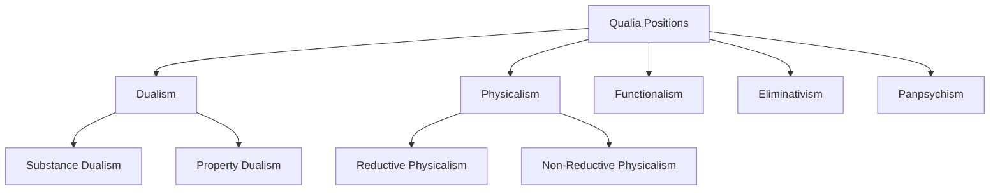

# From Qualia to Simulacra: An Inquiry into the Communicability of Experience

## Part I: The Inward Glance: Defining and Defending Private Experience

*Figure: major philosophical positions on qualia.*

The central problematic in the philosophy of mind and language for the last century has been the status of private experience. There appears to be a dimension of consciousness—the subjective, felt quality of sensation—that is irreducibly first-personal and resistant to public expression. This part establishes the contours of this problem, exploring the most formidable arguments for the existence of a private, ineffable phenomenal realm. By examining the concepts of qualia, the "hard problem," and the phenomenological structure of lived experience, it sets the stage for the subsequent philosophical traditions that seek to dismantle, reframe, or dissolve this "inner" world.

### Section 1: The Phenomenal Realm: Qualia and the "Hard Problem"
The intuition that experience possesses a private, qualitative dimension forms the bedrock of modern debates on consciousness. This dimension, often termed 'phenomenal consciousness', is characterized by its subjective feel, a characteristic that seems to elude capture by the objective, third-person methods of physical science.

#### 1.1 Defining Qualia
The term qualia (singular: quale) refers to the subjective or qualitative properties of experience—the "what it's like" character of mental states. The experience of seeing a red rose, hearing a C-sharp on a piano, or feeling a sharp pain each has a distinct qualitative feel. These feels are the qualia of those experiences. Traditionally, qualia have been ascribed a set of defining properties: they are considered ineffable (incapable of being fully communicated), intrinsic (non-relational properties of experience), private (inaccessible to direct interpersonal comparison), and directly or immediately apprehensible in consciousness. The foundational claim, articulated by Thomas Nagel, is that "an organism has conscious mental states if and only if there is something that it is like to be that organism – something it is like for the organism". This subjective point of view is what a purely physicalist account of the mind is often accused of leaving out.

#### 1.2 The Hard Problem of Consciousness (Chalmers)
Philosopher David Chalmers has influentially framed the challenge posed by qualia by distinguishing between the "easy problems" and the "hard problem" of consciousness. The easy problems, while technically complex, are amenable to standard methods of cognitive science and neuroscience. They concern the explanation of functions and behaviors, such as the ability to discriminate sensory stimuli, integrate information, or produce verbal reports.

The hard problem, in contrast, is the question of why and how the performance of these functions is accompanied by subjective experience at all. As Chalmers frames it, even after a complete explanation of the brain's information processing, "...there may still remain a further unanswered question: Why is the performance of these functions accompanied by experience?". This question highlights what is often called the "explanatory gap": the seeming inability of physical or functional explanations to account for the qualitative, phenomenal character of consciousness. The existence of qualia thus presents a profound metaphysical challenge to physicalism, the view that the world is entirely physical.

#### 1.3 Classic Arguments for Irreducibility and Ineffability
The ineffability and irreducibility of qualia are not merely asserted; they are supported by a series of powerful thought experiments designed to show the limits of objective, physical description. These arguments strategically deploy the concept of ineffability not simply as a claim that qualia are difficult to describe, but that they are in principle beyond the reach of a certain kind of public, third-person discourse. They pivot on a distinction between propositional knowledge (knowing that) and a different, phenomenal form of knowledge (knowing what it's like), positing a form of being or knowing that is definitionally outside the scope of physicalism.

Nagel's "What is it like to be a bat?": Thomas Nagel argues that the subjective character of experience is inextricably tied to a specific point of view. A bat, for example, navigates the world through echolocation, a sensory modality so different from our own that we cannot imagine what it is like

for the bat to be a bat. Even if we possessed a complete neurophysiological account of the bat's brain, this objective, third-person knowledge would not grant us access to the first-person facts of its phenomenal experience. The argument's force lies in showing that certain facts are accessible only from a particular point of view, and a complete objective science would necessarily omit these facts.

Jackson's Knowledge Argument ("What Mary Didn't Know"): Frank Jackson's thought experiment imagines Mary, a brilliant neuroscientist who has spent her entire life in a black-and-white room but has learned all the physical facts about human color vision. She knows everything there is to know about the physics of light, the neurophysiology of the eye and brain, and the functional roles of color perception. The question is: when Mary is finally released from the room and sees the color red for the first time, does she learn anything new?. The powerful intuition is that she does. She learns

what it is like to see red. Since she already had all the physical information, this new knowledge must be of something non-physical: a quale. Jackson's conclusion is that physicalism is false because it leaves something out—the qualia themselves. As he puts it, "knowing all the physical information... is not knowing everything about Fred. It follows that Physicalism leaves something out".

The Inverted Spectrum Argument: This classic argument asks us to imagine two individuals who are functionally and behaviorally identical, but whose color experiences are systematically inverted. Where one person has the experience of red, the other has the experience of green, and so on. Since their functional organization and linguistic behavior are identical (they both call fire trucks "red" and grass "green"), there would be no way to discover this difference from the outside. This suggests that qualia are distinct from, and not reducible to, the functional or physical properties of the brain, as two systems could be functionally equivalent while having different qualia.

#### 1.4 Historical Antecedent: C.I. Lewis and "The Given"
The modern philosophical vocabulary for discussing these issues owes a significant debt to C. I. Lewis, who in his 1929 work Mind and the World Order was the first to use the term "qualia" in its contemporary sense. Lewis, a conceptual pragmatist, proposed a foundationalist epistemology in which knowledge is the result of interpreting "the given" by means of concepts.

For Lewis, experience contains three distinct elements: (1) the given, or immediate data of sense; (2) the act of interpretation; and (3) the concept applied in that act. The given is composed of

qualia, which he described as "recognizable qualitative characters of the given". These qualia—the redness of a red patch, the painfulness of a pain—are the ineffable, incorrigible, and purely subjective foundation of all empirical knowledge. We are immediately aware of them, and this awareness is not subject to error. Objective knowledge of the world is then constructed by applying concepts to this given sensory stream, which involves making predictions about future possible experiences. Lewis's framework represents a classic formulation of the view that a private, subjective layer of experience serves as the ultimate ground for public knowledge, a view that would become the primary target for later critiques by figures like Wilfrid Sellars.

### Section 2: The Lived World: Phenomenological Accounts of Experience
While the analytic tradition framed the problem of experience around discrete, private qualia, the phenomenological tradition, founded by Edmund Husserl, offered a radically different starting point. For phenomenology, experience is not a collection of inner data but a structured, world-directed activity. This approach affirms the richness of subjective experience but denies that it consists of uninterpreted, atomic sensations, thereby offering a "third way" between qualia realism and its later critics.

#### 2.1 Husserl on Intentionality and the Structure of Consciousness
At the core of Husserl's philosophy is the concept of intentionality: the thesis that consciousness is always consciousness of something. A perception is a perception

of a tree; a judgment is a judgment that the tree is green; a memory is a memory of a past event. This directedness means that experience is not a self-contained inner state but a world-disclosing act. Husserl analyzed this structure by distinguishing between the noesis (the intentional act, such as perceiving or judging) and the noema (the intentional content, or the object as it is intended or presented to consciousness). The same object can be intended in different ways—seen from the front, remembered from yesterday, imagined in a different color—each constituting a different noema. This framework provides a structured account of experience that moves beyond the notion of a simple "raw feel."

#### 2.2 Husserl's Theory of Time-Consciousness
Husserl's analysis of time-consciousness is crucial for his redefinition of what is "given" in experience. He argues that our consciousness of the present moment, what he calls the "primal impression," is never experienced in isolation. It is always framed by a temporal "horizon". This horizon consists of

retention, the immediate "just-past" that is still held in consciousness, and protention, the immediate anticipation of the "just-about-to-be".

The canonical example is listening to a melody. We hear the current note not as an isolated sound-atom, but within the context of the notes that have just faded (held in retention) and in anticipation of the notes that are to come (projected in protention). This temporal structure is intrinsic to the experience itself. It means that even the most "immediate" perception is not an uninterpreted snapshot but an already synthesized and meaningful temporal flow. This directly challenges the idea, central to both sense-data theory and Lewis's account, of a simple, atomic, and uninterpreted "given" that serves as the raw material for later conceptualization. For Husserl, what is given is already a structured, meaningful whole.

#### 2.3 Merleau-Ponty on the Lived Body and Pre-Reflective Perception
Maurice Merleau-Ponty radicalized Husserl's phenomenology by grounding it in the body. He distinguished between the body as an object of science, the Körper, and the body as experienced from the first-person perspective, the Leib or "lived body".

The Lived Body (Leib): The lived body is not an object in the world but our vehicle for being-in-the-world. It is the center of our perceptual field and the source of our actions. Merleau-Ponty argues that our fundamental engagement with the world is not cognitive ("I think") but practical and embodied ("I can"). The body possesses a "body schema," a pre-reflective, practical understanding of its own posture and its possibilities for movement in relation to its environment. This embodied "understanding" is a form of operant intentionality that precedes and makes possible all explicit, reflective thought.

Primacy of Perception: For Merleau-Ponty, perception is the primary mode of our access to the world. All higher-order functions of consciousness, such as reflection and judgment, are founded upon a "pre-reflective, bodily existence". Perception is not an intellectual act of interpreting raw sensations; it is a holistic, embodied engagement with a world that is already meaningful. As he famously declared, "Truth does not inhabit only the inner man, or more accurately, there is no inner man, man is in the world, and only in the world does he know himself". This statement encapsulates the phenomenological rejection of the Cartesian "inner theater" model, arguing instead that subjectivity is fundamentally worldly and embodied. What is "given" in experience is therefore not a private sensation but a structured field of possibilities for an embodied agent engaged with its world.

## Part II: The Outward Turn: Grounding Meaning in a Public World
In the mid-20th century, a powerful current in analytic philosophy turned decisively away from the inner, private world of experience as the foundation for meaning. Led by figures like Ludwig Wittgenstein, Wilfrid Sellars, and J. L. Austin, this movement argued that the very possibility of meaning, knowledge, and even coherent thought depends not on private introspection but on public language, shared practices, and observable criteria. This "outward turn" sought to dismantle the Cartesian model of the mind and relocate the grounds of meaning in the public sphere.

### Section 3: The Wittgensteinian Pivot: The Private Language Argument
Ludwig Wittgenstein's Philosophical Investigations presents one of the most influential and debated critiques of the idea that language can be grounded in private experience. His argument aims to show that the very concept of a language whose terms refer to private sensations is incoherent.

#### 3.1 The Target: A Necessarily Private Language
Wittgenstein is not concerned with a language that is merely contingently private, such as a personal code that could, in principle, be deciphered. His target is a language that is

necessarily private, one that is in principle untranslatable because, as he defines it, "The individual words of this language are to refer to what can only be known to the person speaking; to his immediate private sensations. So another person cannot understand the language" (Philosophical Investigations §243). This is a language built directly upon the kind of private data championed by qualia realists and sense-data theorists.

#### 3.2 The Impossibility of Private Ostensive Definition
The core of the argument unfolds as Wittgenstein imagines a private linguist attempting to establish a meaning for a sign, say 'S', to name a recurring private sensation. The linguist performs a kind of "private ostensive definition" by focusing their attention on the sensation and writing 'S' in a diary. Wittgenstein questions this "ceremony". The central problem is the lack of any independent

criterion of correctness for the future application of 'S'. The only available check is the linguist's own memory of the original sensation. However, there is no way to distinguish between

correctly remembering the connection and merely seeming to remember it correctly. This is not an epistemological problem about the fallibility of memory, but a deeper conceptual problem about the preconditions for normativity. For a sign to have meaning, there must be a genuine distinction between its correct and incorrect application. In the private case, this distinction collapses. As Wittgenstein famously puts it, "whatever is going to seem right to me is right. And that only means that here we can't talk about 'right'" (

PI §258). Without a public check, the normative foundation of meaning crumbles.

#### 3.3 The "Beetle in a Box" Analogy (PI §293)
Wittgenstein's "beetle in a box" analogy powerfully illustrates this conclusion. He asks us to imagine a community where everyone has a box, and inside is something they call a "beetle." However, no one can look into anyone else's box.

"Suppose everyone has a box with something in it: we call it a “beetle”. No one can look into anyone else’s box, and everyone says he knows what a beetle is only by looking at his beetle. – Here it would be quite possible for everyone to have something different in their box...The thing in the box has no place in the language game at all" (PI §293).

The word "beetle" has a use in their public language, but its meaning cannot be the object inside the box. That object could be different for everyone, or constantly changing, or even absent altogether. The private object "cancels out"; it is irrelevant to the public meaning of the word. Wittgenstein applies this analogy directly to sensation-words like 'pain'. This does not mean he denies the existence of the inner feeling of pain (the "beetle"). Rather, he denies that this private feeling is what gives the public word 'pain' its meaning. The feeling is dethroned from its supposed role as the semantic foundation of the word.

#### 3.4 Meaning as Use in a "Form of Life"
The positive upshot of Wittgenstein's critique is a revolutionary picture of meaning. Meaning is not a relationship of reference between a word and an object (whether private or public). Instead, the meaning of a word is its use in the language. This use is governed by public rules and embedded in the shared practices, customs, and behaviors of a community—what Wittgenstein calls a "form of life". Learning the meaning of 'pain' is not about introspecting a private feeling and attaching a label to it; it is about learning how to participate in a public language-game involving pain-behavior, expressions of sympathy, requests for help, and so on. Obeying a rule is a public practice, a "custom (use, institution)," not a private mental process.

### Section 4: Dismantling the Foundation: Sellars and Austin
Working in parallel with Wittgenstein's insights, Wilfrid Sellars and J. L. Austin launched their own powerful critiques against the idea that knowledge is built upon a foundation of private, immediate experience. Though their methods differed—Sellars offering a systematic critique of epistemological structure and Austin a therapeutic analysis of philosophical language—both converged on the conclusion that the foundationalist picture of the mind as an "inner theater" of private data was deeply incoherent.

#### 4.1 Sellars and the "Myth of the Given"
In his landmark essay "Empiricism and the Philosophy of Mind," Wilfrid Sellars attacks what he calls the "Myth of the Given." This is the foundationalist thesis that empirical knowledge rests on a base of non-inferential knowledge provided directly by experience—a "given" that is thought to be epistemically immediate and certain. Classical sense-datum theories, like that of C. I. Lewis, are prime examples of this myth.

Sellars's core argument is that the "given" is asked to perform two incompatible roles. On the one hand, it is supposed to be non-conceptual—a "raw feel" or pure sensation—to guarantee its immediacy. On the other hand, it is supposed to provide justification for our beliefs. Sellars argues this is impossible. For something to serve as a justification, it must be able to stand in logical, inferential relations with other beliefs. Only items with propositional structure (e.g., "this is red") can enter into such relations. A non-conceptual, non-propositional "raw feel" is, by definition, outside what Sellars calls the "logical space of reasons". As he states, "...in characterizing an episode or a state as that of knowing, we are not giving an empirical description of that episode or state; we are placing it in the logical space of reasons, of justifying and being able to justify what one says". A raw sensation cannot justify the belief 'This is red' because it cannot serve as a premise in an argument. Therefore, the very idea of a non-inferential foundation for knowledge is a confusion.

#### 4.2 Austin's Ordinary Language Critique in Sense and Sensibilia
J. L. Austin's critique in Sense and Sensibilia is a masterpiece of ordinary language philosophy. He argues that sense-data theories, particularly as advanced by A. J. Ayer, are built upon a systematic misuse and oversimplification of ordinary language.

Austin's primary target is the "Argument from Illusion," which sense-data theorists use to argue that we never perceive material objects directly. The argument points to cases like a straight stick appearing bent in water and concludes that what we directly perceive is not the stick itself but a bent-looking sense-datum. Austin dismantles this by first carefully distinguishing between

illusion (misperceiving a real, public object) and delusion (perceiving something that is not there at all, which is a subjective state). He shows that the argument from illusion illegitimately generalizes from specific, correctable cases of illusion to the sweeping metaphysical conclusion that all perception is indirect.

Furthermore, Austin demonstrates that words like 'directly' and 'real' derive their meaning from specific contrasts in ordinary contexts. We talk of seeing a ship
 directly as opposed to seeing it through a periscope, or a real duck as opposed to a decoy. Sense-data theorists strip these words of their ordinary contexts and turn them into all-encompassing philosophical terms, thereby rendering them meaningless. Austin's method is therapeutic: by returning to the subtle distinctions marked by ordinary language, he aims to dissolve the philosophical problems that arise from its misuse.

#### 4.3 Convergences and Divergences
Both Sellars and Austin arrive at a similar anti-foundationalist conclusion: the idea of a private, pre-conceptual layer of experience serving as the basis for knowledge is untenable. They both effectively attack the Cartesian model of the mind as a private space separated from the world by an interface of "ideas" or "sense-data." However, their approaches differ. Sellars provides a top-down, systematic argument about the logical requirements of justification, showing that the "given" cannot fulfill its required normative role. Austin provides a bottom-up, therapeutic analysis, showing that the very language used to posit the "given" is a product of philosophical confusion. Together, their critiques represent a fundamental shift, reframing the problem of experience from an epistemological question (how to build knowledge from sensation) to a semantic one (what are the public conditions for our talk about experience to be meaningful at all?).

### Section 5: Meaning Beyond the Head: The Externalist Turn
The critique of private foundations for meaning was further radicalized by a series of arguments demonstrating that the content of our words and thoughts is determined not by what is "in the head," but by factors in the external physical and social environment. This "externalist turn," exemplified by the work of W. V. O. Quine, Donald Davidson, and Hilary Putnam, represents a profound inversion of the traditional picture of communication, suggesting that our inner lives are constitutively public and world-involving.

#### 5.1 Quine and the Indeterminacy of Translation
W. V. O. Quine's thought experiment of "radical translation," presented in Word and Object, challenges the very idea of determinate meaning. He imagines a field linguist attempting to translate a completely unknown language based solely on the observable behavior of its speakers. The linguist observes a native speaker utter "Gavagai" as a rabbit scurries by. The linguist might hypothesize that "Gavagai" means "Rabbit". This hypothesis can be tested by querying the native in various situations.

However, Quine argues that all possible behavioral evidence—every instance of assent and dissent from the native—is equally compatible with a range of mutually exclusive translation manuals. "Gavagai" could just as well be translated as "undetached rabbit part," "rabbit stage," or "rabbithood-being-instantiated". Since a rabbit is never present without its parts or a temporal stage of itself, no behavioral test can distinguish between these hypotheses. Quine's radical conclusion is not just that we can never be

sure which translation is correct, but that there is no fact of the matter that makes one correct and the others wrong. Meaning is indeterminate because it is underdetermined by all possible physical evidence (i.e., behavior). This thesis strikes at the heart of the idea that words possess discrete, "in-the-head" meanings that translation is supposed to preserve.

#### 5.2 Davidson and Radical Interpretation
Donald Davidson adapts Quine's scenario but shifts the goal from translation to interpretation. The task is not to find synonymous words in another language, but to construct a theory of meaning for the speaker that allows us to understand them. Davidson argues that a theory of meaning should take the form of a Tarski-style theory of truth, which for every sentence of the speaker's language would generate a theorem (a "T-sentence") specifying its truth conditions, such as "'Es regnet' is true if and only if it is raining".

The central challenge is that a speaker's utterance depends on two variables: what their words mean and what they believe. To solve for both simultaneously, Davidson introduces the Principle of Charity. This is a methodological constraint that requires the interpreter to assume that the speaker is largely rational and that their beliefs are largely true, by the interpreter's own standards. We must interpret others in a way that maximizes agreement and logical coherence. This principle is not an empirical guess but a precondition for interpretation itself; without assuming a vast background of shared true beliefs about a common world, communication could not get off the ground. Meaning is thus constitutively tied to a shared, public world of objects and events that cause and justify beliefs.

#### 5.3 Putnam and Content Externalism
Hilary Putnam's Twin Earth thought experiment provides the most direct and influential argument for the thesis that "meanings just ain't in the head".

The scenario asks us to imagine a Twin Earth, identical to Earth in every respect, except that the liquid its inhabitants call "water" is not H₂O but a different chemical compound, XYZ. You on Earth and your molecular duplicate on Twin Earth are in identical neurological and psychological states down to the last particle. When you both think or say, "water is wet," are you thinking the same thought?

Putnam argues that you are not. Your word 'water' refers to H₂O, while your twin's refers to XYZ. Since the content of a thought is determined by what it is about (its reference), you and your twin are having thoughts with different contents. Because your internal states are identical, this difference in mental content must be determined by something external to your body—namely, the physical nature of your environment. This thesis is known as

content externalism: the content of at least some of our mental states (our thoughts, beliefs, desires) is partly constituted by factors in our physical and social environment. Putnam also points to a "division of linguistic labor," where the exact meaning of a term like 'gold' is fixed not by every individual speaker's internal concept, but by the usage of experts within the linguistic community, another external factor.

These externalist arguments represent a spectrum of claims, from Quine's skepticism about determinate meaning based on behavioral evidence, to Davidson's methodological requirement to anchor interpretation in a shared world, to Putnam's strong metaphysical thesis that the world itself partly constitutes the content of our minds. This progression fundamentally inverts the traditional problem of communication. The challenge is no longer how to externalize a private, internal meaning, but rather how to account for the subjective feeling of an inner life, given that the very content of our thoughts is already public and world-involving.

## Part III: Structures of Meaning and the Fraying of Reality
Having explored the philosophical turns toward public and external grounds for meaning, this part examines the formal structures through which meaning is organized and the postmodern claim that this entire structure—the relationship between experience, signs, and a stable reality—has undergone a fundamental collapse. The semiotic theories of Saussure and Peirce provide models for how signs function, while the work of Baudrillard suggests that these signs no longer point to reality but have come to replace it entirely.

### Section 6: The Machinery of Signs: Saussure and Peirce
Semiotics, the general theory of signs, offers formal models for understanding how language and other sign systems create meaning. The two foundational figures, Ferdinand de Saussure and Charles Sanders Peirce, proposed influential but starkly different models.

#### 6.1 Saussure's Dyadic Model
The Swiss linguist Ferdinand de Saussure conceived of the linguistic sign as a two-part, or dyadic, psychological entity. It consists of:

Signifier (signifiant): The "sound-image" or the form the sign takes (e.g., the sound of the word 'tree').

Signified (signifié): The concept or idea the signifier evokes (e.g., the concept of a tree).

Crucially, for Saussure, the actual object in the world (the referent) is bracketed out of this linguistic analysis. His model is built on two core principles:

The Arbitrary Nature of the Sign: The link between the signifier and the signified is not natural or necessary; it is based purely on social convention. There is nothing inherently "tree-like" about the sound /tri:/. Any other sound could have served, provided the linguistic community agreed upon it.

Meaning from Difference: A sign does not derive its meaning (or "value") from its own positive content, but from its systematic difference from all other signs in the language system (langue). The concept of 'red' is what it is because it is not 'green', not 'blue', not 'yellow', and so on. As Saussure states, "[I]n language there are only differences... without positive terms". Meaning is thus a product of a closed, differential network of relations.

#### 6.2 Peirce's Triadic, Processual Model
The American philosopher and logician Charles Sanders Peirce offered a more dynamic and world-oriented model. For Peirce, signification, or semiosis, is an irreducibly triadic process involving three components :

Sign (or Representamen): The form which the sign takes (comparable to Saussure's signifier).

Object: The entity to which the sign refers (the referent, which Saussure excluded).

Interpretant: The sense made of the sign in the mind of the interpreter. The interpretant is itself another sign that refers to the same object, but perhaps in a more developed way.

The role of the interpretant is pivotal. Because each interpretant is itself a sign, it requires a further interpretant to be understood, leading to a potentially infinite chain of interpretation, a process Peirce called "unlimited semiosis". This process is not a vicious regress but reflects the fact that understanding is an ongoing, evolving process. Unlike Saussure's static, psychological model, Peirce's semiotics is pragmatic and open-ended, explicitly connecting signs to the world (via the Object) and embedding meaning in a continuous process of interpretation.

#### 6.3 Application to the Problem of Experience
These two models offer different resources for understanding the communication of experience. Saussure's model, with its closed system where meaning arises from arbitrary divisions within a "shapeless and indistinct mass" of thought, seems to formalize the problem of being "trapped in language". It suggests that different languages might carve up the continuum of experience in radically different and incommensurable ways, making the communication of a pre-linguistic "quale" seem impossible. Peirce's model, by contrast, offers a potential escape from this trap. The inclusion of the Object provides an external anchor, grounding the semiotic process in a shared reality. The dynamic nature of the interpretant suggests that meaning is not about finding a static label for an inner state, but about engaging in a continuous, world-directed process of making sense.

### Section 7: The Precession of Simulacra: Baudrillard and the Hyperreal
The postmodern theorist Jean Baudrillard argues that the relationship between signs and reality described by classical semiotics has been fundamentally overturned in contemporary media-saturated societies. The sign no longer refers to, or even distorts, reality; it has replaced it.

#### 7.1 The Orders of Simulacra
Baudrillard charts a history of the sign through four successive phases or "orders of simulacra" :

The First Order (Reflection): The sign is a faithful copy or reflection of a profound reality. This is the sacramental order of representation.

The Second Order (Perversion): The sign masks and denatures a profound reality. This is the order of ideology, where representations are distortions of the real.

The Third Order (Sorcery): The sign masks the absence of a profound reality. It pretends to be a copy of something, but the original referent no longer exists. This is the order of simulation.

The Fourth Order (Pure Simulation): The sign bears no relation to any reality whatsoever. It is its own pure simulacrum, generating a reality of its own.

#### 7.2 Hyperreality and the Precession of Simulacra
According to Baudrillard, contemporary Western society has entered this fourth phase, the age of the hyperreal. Hyperreality is a condition in which the distinction between the "real" and its simulation has imploded. The real is no longer the stable referent for our signs; instead, the "real" is produced by our models, codes, and simulations. This reversal is what Baudrillard calls the "precession of simulacra": the map now precedes and generates the territory.

Canonical Example: Disneyland: Baudrillard famously argues that Disneyland is not "fake" in contrast to a "real" America outside its walls. Rather, Disneyland is presented as the condensed form of the "imaginary" so that we can believe that the rest of America—itself a vast simulation of community, work, and life—is "real". Disneyland's manifest unreality serves to conceal the fact that the "real" world outside is just as simulated.

Canonical Example: "The Gulf War Did Not Take Place": This infamous provocation was not a denial of the historical event of combat and death. It was a claim that what was globally "experienced" as the Gulf War was a pure media event—a clean, surgical, video-game-like spectacle constructed from satellite images and press briefings. This media simulation was so totalizing that it bore no relation to the messy, brutal reality on the ground, effectively supplanting it in global consciousness.

#### 7.3 Implications for Experience and Communication
In a state of hyperreality, the entire problematic of this report is dissolved. The question "Can language convey private experience?" presupposes a stable distinction between an authentic, primary "experience" and a secondary, public "representation." Baudrillard's thesis is that this distinction has become obsolete. What we take to be our authentic "experiences" are themselves already simulations, pre-packaged and mediated by the codes of consumerism and media. Subjectivity is no longer an inner sanctum but is constructed through the appropriation of external images and signs. Communication is no longer about bridging a gap between a private interior and a public exterior, because the "outside" (the world of signs) has completely consumed the "inside." The problem is not that representation fails to capture reality, but that it has become so successful that it has eliminated reality altogether. This represents the ultimate collapse of the normative frameworks that philosophers like Wittgenstein and Davidson saw as essential for meaning, as the anchors of shared practices and a shared world dissolve into a free-floating play of signifiers.

## Part IV: Synthesis, Cases, and Conclusions
The preceding analysis has traversed a complex philosophical landscape, moving from the defense of a private, phenomenal realm to its critique and dissolution through public language, externalism, and finally, the postmodern collapse of reality into simulation. This final part consolidates these diverse perspectives through a comparative framework, applies them to concrete case studies of communication, and offers a synthetic conclusion on the relationship between language, experience, and reality.

### Section 8: A Comparative Map of the Terrain
To clarify the points of convergence and divergence among the traditions examined, a systematic comparison is necessary. The following tables distill the core positions of each school of thought on the central questions of this inquiry.

#### 8.1 Table 1: Comparative Framework of Philosophical Traditions
This table provides a synoptic overview, mapping how each major tradition approaches the core issues of what is given in experience, how language connects to it, and the ultimate limits of communication.

| Tradition | What is "given" in experience? | How do words/signs latch on? | Primary Locus of Meaning | Limits of Communicability |
|-----------|--------------------------------|-----------------------------|-------------------------|--------------------------|
| Qualia Realism | Private, intrinsic, atomic sensory qualities (qualia). | Private ostensive definition; labeling of inner states. | In the head (as private phenomenal content). | Qualia are ineffable; "what it's like" cannot be conveyed propositionally. |
| Phenomenology | The structured, lived world as a phenomenal field. | Intentional constitution; embodied, pre-reflective engagement. | In the embodied agent-world relation. | Lived experience is expressible but never exhaustible by language. |
| Wittgensteinianism | Nothing is "given" prior to language; only what is in a language-game. | Public rule-following within a shared "form of life." | In the community (as public use). | All meaning is public; the notion of a private, incommunicable meaning is incoherent. |
| Sellarsianism | Nothing non-conceptual is given to knowledge. | Placement in the "logical space of reasons"; inferential roles. | In the normative, rule-governed practice of a linguistic community. | "Raw feels" are outside the space of reasons and thus not communicable as knowledge. |
| Externalism | The public world of objects, events, and social norms. | Causal chains (Putnam) and principles of interpretation (Davidson). | In the external physical and social environment. | Meaning is public, but translation/interpretation is indeterminate (Quine/Davidson). |
| Saussurean Semiotics | An undifferentiated "nebula" of thought/sensation. | Arbitrary division of the conceptual plane by a system of differences. | In the abstract linguistic system (langue). | Communication is possible only within the shared, arbitrary conventions of a language system. |
| Peircean Semiotics | The world of Objects encountered through signs. | A continuous, triadic process of semiosis (Sign-Object-Interpretant). | In the ongoing process of interpretation. | Understanding is an infinite, evolving process; communication is always provisional. |
| Postmodernism | The hyperreal; a world of models and codes without origin. | Signs do not latch on; they generate what passes for "reality." | In the code; the system of simulation. | The distinction between authentic experience and communication has collapsed. |

Export to Sheets
#### 8.2 Table 2: Argument Table
This table formalizes the key philosophical arguments discussed, breaking them down into their constituent parts to clarify their logical structure and the primary points of contention.

| Argument Name | Proponent(s) | Core Claim | Premises | Canonical Example | Standard Counter-move/Critique |
|---------------|--------------|-----------|----------|------------------|------------------------------|
| The Knowledge Argument | F. Jackson | Physicalism is false because physical facts are not all the facts there are. | 1. Mary knows all physical facts about color vision. 2. Upon seeing red, Mary learns something new. 3. Therefore, there are non-physical facts (qualia). | Mary the color scientist. | The "Ability Hypothesis" (she gains a new ability, not new factual knowledge); the "Old Fact, New Mode" response. |
| The Private Language Argument | L. Wittgenstein | A language whose words refer to necessarily private sensations is impossible. | 1. Meaning requires a criterion of correctness. 2. In a private language, there is no independent check on correctness ("what seems right is right"). 3. Therefore, the distinction between correct/incorrect collapses. | Naming a private sensation 'S' in a diary. | The argument relies on a behaviorist verificationism; a sufficiently stable memory could provide a criterion. |
| The "Myth of the Given" | W. Sellars | Non-inferential experience cannot provide epistemic justification. | 1. Justification requires standing in inferential relations. 2. Only propositionally structured items can stand in inferential relations. 3. "The given" (e.g., a raw feel) is non-propositional. | A red sense-datum justifying the belief "This is red." | Rejects premise 2, arguing for non-conceptual content that can still be reason-giving (McDowell); phenomenology's claim that experience is already structured. |
| Indeterminacy of Translation | W.V.O. Quine | There is no fact of the matter about the correct translation of a term. | 1. All evidence for translation is behavioral (assent/dissent). 2. All behavioral evidence is compatible with multiple, incompatible translation manuals. | "Gavagai" can be translated as "rabbit," "undetached rabbit part," etc. | Davidson's Principle of Charity can constrain interpretation; the argument's behaviorist premise is too restrictive. |
| The Twin Earth Argument | H. Putnam | The content of our thoughts is not solely determined by what is in our heads. | 1. A person and their molecular duplicate can be in identical internal states. 2. The reference of their terms (e.g., 'water') can differ due to their environment. 3. Therefore, meaning/content is determined by external factors. | Earth (H₂O) vs. Twin Earth (XYZ). | The argument conflates two different concepts of meaning (narrow vs. broad content); intuitions about sci-fi cases are unreliable. |

Export to Sheets
### Section 9: Case Studies in Expression and Ineffability
Applying these theoretical frameworks to specific domains reveals the complex interplay between what can be shared through language and what may remain unshareable.

#### 9.1 Pain Talk
Pain is the classic battleground for this debate. From a qualia-realist perspective, the word 'pain' is a label for a private, intrinsically awful quale. Communication is fundamentally limited; one can describe the location, intensity, and type of pain (throbbing, sharp), but the raw hurtfulness itself is incommunicable. A

Wittgensteinian analysis, however, argues that the meaning of 'pain' is not this private beetle but its use in a public language-game. We learn the word in contexts of injury, grimacing, and seeking comfort. The word's function is to coordinate behavior—to elicit care, to warn others, to explain inaction. The private feeling is the occasion for using the word, but not its meaning. A

phenomenological view would describe pain as an intentional state that disrupts our embodied being-in-the-world. It is not a mere sensation but a mode of experience that restructures our world, making certain actions impossible and focusing our attention. Language can express this structural disruption, communicating the way pain alters our lived world, even if the raw sensation remains unique to the individual.

#### 9.2 Color Terms
The debate over color terms pits universalists against relativists. Universalists, like Berlin and Kay, argue that while languages differ, they all draw from a universal, biologically determined set of focal colors (e.g., the best example of 'red'). Language simply labels pre-existing perceptual categories. Relativists, following the Sapir-Whorf hypothesis, argue that the linguistic categories we possess shape and influence our perception. A speaker of a language that does not distinguish between blue and green might not just lack the words but might have a different phenomenal experience when looking at the sky and the grass. From a

qualia perspective, the debate is about whether the qualia of color are universal or culturally molded. A Wittgensteinian would sidestep this, arguing that color words get their meaning from their role in public practices like sorting, matching, and decorating, not from private color patches. The fact that we can successfully coordinate our actions using color words is what matters.

#### 9.3 Wine-Tasting and Music Description
These are domains of highly refined descriptive language. Does the wine critic's vocabulary—"notes of cassis, leather, and forest floor"—allow them to communicate a fine-grained quale?. Or, as a

Wittgensteinian might argue, does this language function as a sophisticated classificatory skill, enabling experts to reliably sort and identify wines based on shared public criteria, where the terms gain their meaning within the specific "form of life" of oenology?. The language may be more evocative and coordinative than strictly descriptive of private sensations. Similarly, describing music as "yearning" or "triumphant" is hard to parse as a description of a sound-quale. A

phenomenological or embodied account seems more apt: the music's dynamic structure resonates with our own embodied, affective patterns of tension and release, and our language describes this shared, intersubjective experience of movement and feeling rather than a private auditory sensation.

#### 9.4 Synesthesia
Synesthesia, where a stimulus in one sense modality involuntarily triggers an experience in another (e.g., hearing a trumpet and seeing scarlet), presents a fascinating test case. For the

qualia realist, this is a clear example of unusual, private qualia. The synesthete has access to a phenomenal world others do not. Yet, language plays a crucial role. Research shows that synesthetic associations are often tied to learned linguistic units like graphemes and phonemes, not just raw sensation, suggesting a deep link between abstract representation and sensory experience. This complicates a simple "raw feel" account. From a

constructivist viewpoint, influenced by Wittgenstein, the synesthete's experience is real, but their ability to understand and report it is necessarily structured by the public language they have learned. They use analogy and metaphor (e.g., "a smooth melody") to bridge their unique experience with the shared linguistic world, demonstrating language's flexibility in accommodating even highly atypical experiences.

#### 9.5 Mystical Reports
Mystics across traditions often claim their experience is ineffable—a core mark identified by William James in The Varieties of Religious Experience. This seems to be the ultimate case for incommunicable private experience. James also noted the "noetic" quality: these experiences feel like states of profound knowledge. However, the

constructivist critique (e.g., Steven Katz) argues that these experiences are not raw, unmediated encounters with reality but are profoundly shaped by the mystic's pre-existing theological and linguistic framework. A Christian mystic has a unitive experience of God, while a Buddhist has an experience of selfless emptiness. The language and concepts one brings to the experience structure the experience itself. Language here does not merely report the experience post-facto; it helps constitute it. The claim of ineffability itself becomes a linguistic convention within mystical traditions, a way of marking the experience's significance.

### Section 10: Synthesis Essay: The Possibilities and Pathologies of Communication
The central question—Can language convey private experience?—is founded on a misleading premise. It presupposes what can be called a "conduit metaphor" of communication: the idea that private experiences are discrete objects or contents "in the head" that language must then package and transfer into another's head. The entire philosophical trajectory from the defense of qualia to the externalist and postmodern critiques reveals the inadequacy of this model. A more robust understanding emerges if we discard the transfer model and see language's primary function as coordinative. Language does not convey experience; it enables embodied agents, situated in a shared world, to coordinate their attention, actions, and affective states.

This coordination is achieved through a multi-layered process that sidesteps the impossible task of accessing another's private mind. First, it relies on shared practices, as Wittgenstein demonstrated. We learn to use sensation-words like 'pain' or 'red' within public language-games that are interwoven with our activities. The meaning of 'red' is anchored in our shared ability to stop at red lights, pick ripe tomatoes, and sort objects by color. The word succeeds not because it generates an identical private color-patch in each of us, but because it reliably coordinates our behavior with respect to our shared environment.

Second, this coordination is scaffolded by embodied resonance, as the work of phenomenologists like Merleau-Ponty suggests. Our shared human embodiment provides a pre-reflective basis for understanding. We grasp the meaning of another's pained expression or joyful gesture not by inferring a hidden inner state, but because their bodily comportment resonates with our own possibilities for being. Language builds upon this primordial intersubjectivity, articulating and refining distinctions within a field of shared, embodied meaning. The description of a piece of music as "somber" works because the music's slow tempo and minor key map onto a shared vocabulary of embodied affective comportment.

Third, coordination requires external anchors, as the externalist turn from Quine to Putnam makes clear. Our language is not a free-floating system of conventions but is causally and referentially tethered to a common world. The Principle of Charity is a methodological recognition of this fact: interpretation can only proceed on the assumption that we and the person we are interpreting inhabit and are responding to the same reality. The meaning of 'water' is stable because it is anchored to the objective molecular structure of H₂O, a fact that transcends any individual's subjective conception.

What, then, of the "private" and "ineffable" remainder? What the conduit metaphor mistakenly reifies as a positive "content" called a quale is better understood as the indexical, first-person perspective from which this coordinated activity is undertaken. The "ineffability" of my experience of red is not a failure to describe a secret object, but the simple fact that my tokening of that experience is irreducibly mine. Language communicates the type—the public, relational, structural meaning of 'red'—by coordinating my behavior and attention with others. The private token is what remains when you subtract the entire public, coordinative apparatus. The ineffable is not a content beyond language, but the limit-point of our coordinative practices.

This brings us to the final, radical challenge posed by Jean Baudrillard. His theory of hyperreality describes a state where the external anchors required for the coordinative function of language have been deliberately and systematically severed. If the "real world" that grounds our shared beliefs and referential chains is replaced by a self-referential universe of simulations, then the nature of communication must also change. Language no longer coordinates our engagement with a shared reality, but instead coordinates our participation within a shared simulation. The distinction between a true report and a false one, or between an authentic expression and a fabricated one, dissolves. This represents the ultimate pathology of communication: a system that has become so perfectly "communicative" within its own coded confines that it no longer communicates anything beyond itself. The experience it "conveys" is the experience of the code. In this hyperreal condition, the question of conveying private experience becomes triply moot: the "private" has been colonized by external images, the "experience" is a simulation, and "conveying" has been replaced by circulating.

Sources used in the report

en.wikipedia.org
Sense and Sensibilia (Austin book) - Wikipedia
Opens in a new window

researchgate.net
The history of qualia and C.I. Lewis' role in it - ResearchGate
Opens in a new window

ebsco.com
Mind and the World-Order by C.I. Lewis | EBSCO Research Starters
Opens in a new window

selfawarepatterns.com
Do qualia exist? Depends on what we mean by “exist.” - SelfAwarePatterns
Opens in a new window

ir.vidyasagar.ac.in
CHAPTER-02
Opens in a new window

iep.utm.edu
Knowledge Argument Against Physicalism | Internet Encyclopedia of Philosophy
Opens in a new window

en.wikipedia.org
Hard problem of consciousness - Wikipedia
Opens in a new window

reddit.com
Wittgenstein's Beetle in a Box Analogy : r/philosophy - Reddit
Opens in a new window

reddit.com
What does Wittgenstein mean by "private language"? : r/askphilosophy - Reddit
Opens in a new window

reddit.com
Why does C.I. Lewis think qualia are not baffling? : r/askphilosophy - Reddit
Opens in a new window

maartepabebe.com
Wittgenstein's Beetle in a Box Analogy and his Investigation of Pain - Maarte Pabebe
Opens in a new window

en.wikipedia.org
en.wikipedia.org
Opens in a new window

reddit.com
Can anyone here explain the "Myth of the Given" and its relation to modern philsophy, especially that of McDowell, to me? : r/askphilosophy
Opens in a new window

cpb-us-w2.wpmucdn.com
1 Avoiding the Myth of the Given John McDowell University of Pittsburgh 1. What is the Myth of the Given? Wilfrid Sellars, who
Opens in a new window

en.wikipedia.org
Wilfrid Sellars - Wikipedia
Opens in a new window

nigelwarburton.typepad.com
Wittgenstein and the Beetle in the Box - virtual philosopher
Opens in a new window

plato.stanford.edu
Clarence Irving Lewis (Stanford Encyclopedia of Philosophy)
Opens in a new window

1000wordphilosophy.com
Ludwig Wittgenstein's Private Language Argument - 1000-Word Philosophy: An Introductory Anthology
Opens in a new window

reddit.com
I'm confused about Wittgenstein's private language argument : r/askphilosophy
Opens in a new window

en.wikipedia.org
Qualia - Wikipedia
Opens in a new window

iep.utm.edu
Qualia | Internet Encyclopedia of Philosophy
Opens in a new window

medium.com
Consciousness, Qualia, and AI: Can We Build What We Don't Understand? - Medium
Opens in a new window

sas-space.sas.ac.uk
Austin: Sense & Sensibilia Revisited - SAS-Space
Opens in a new window

philosophy.stackexchange.com
Definitive refutation of JL Austin? [closed] - Philosophy Stack Exchange
Opens in a new window

plato.stanford.edu
Private Language (Stanford Encyclopedia of Philosophy)
Opens in a new window

munin.uit.no
The principle of charity has always occupied a key role in Davidson's theory of interpretation. Roughly, the principle states that in order to understand another being, one - has to assume that the other being is in accordance with himself, and that he speaks the - Munin
Opens in a new window

ijoc.org
The Principle of Charity and Intercultural Communication
Opens in a new window

en.wikipedia.org
Indeterminacy of translation - Wikipedia
Opens in a new window

en.wikipedia.org
Sign (semiotics) - Wikipedia
Opens in a new window

media-studies.com
Charles Peirce's Triadic Model of Communication | Semiotic Theory - Media Studies
Opens in a new window

en.wikipedia.org
Inscrutability of reference - Wikipedia
Opens in a new window

researchgate.net
Quine on the Indeterminacy of Translation: A Dilemma for Davidson - ResearchGate
Opens in a new window

thephilosophyforum.com
Austin: Sense and Sensibilia - The Philosophy Forum
Opens in a new window

unipune.ac.in
Untitled
Opens in a new window

visual-memory.co.uk
Semiotics for Beginners: Signs - visual-memory.co.uk
Opens in a new window

plato.stanford.edu
Peirce's Theory of Signs (Stanford Encyclopedia of Philosophy)
Opens in a new window

iep.utm.edu
Davidson: Philosophy of Language | Internet Encyclopedia of ...
Opens in a new window

iep.utm.edu
The Indeterminacy of Translation and Radical Interpretation ...
Opens in a new window

literariness.org
Baudrillard's Concept of Hyperreality - Literary Theory and Criticism
Opens in a new window

reddit.com
How does Baudrillard say we should deal with simulacra and the hyperreal? - Reddit
Opens in a new window

davidpublisher.com
Intentionality and Temporality in Husserl - David Publishing Company
Opens in a new window

pmc.ncbi.nlm.nih.gov
Habit and embodiment in Merleau-Ponty - PMC
Opens in a new window

ruccs.rutgers.edu
Stanford Encyclopedia of Philosophy - Rutgers Center for Cognitive Science
Opens in a new window

iep.utm.edu
Phenomenology and Time-Consciousness - Internet Encyclopedia of Philosophy
Opens in a new window

iep.utm.edu
Edmund Husserl: Intentionality and Intentional Content - Internet Encyclopedia of Philosophy
Opens in a new window

researchgate.net
(PDF) A Brief Account of Husserl's Conception of Our Consciousness of Time
Opens in a new window

integralleadershipreview.com
Perception, Reversibility, “Flesh”: Merleau-Ponty's Phenomenology and Leadership as Embodied Practice
Opens in a new window

iep.utm.edu
Internalism and Externalism in the Philosophy of Mind and Language
Opens in a new window

en.wikipedia.org
Twin Earth thought experiment - Wikipedia
Opens in a new window

medium.com
Hilary Putman: Twin Earth, Meaning, and the Mind | by Antoine Decressac (#LinguisticallyYours) | Medium
Opens in a new window

plato.stanford.edu
Content Externalism and Skepticism - Stanford Encyclopedia of Philosophy
Opens in a new window

experimentaltheology.blogspot.com
Our Need for Religious Experience: Part 3, The Marks of Mysticism - Experimental Theology
Opens in a new window

1000wordphilosophy.com
William James on Mystical Experience - 1000-Word Philosophy: An Introductory Anthology
Opens in a new window

en.wikipedia.org
Signified and signifier - Wikipedia
Opens in a new window

signosemio.com
Charles Sanders Peirce: Semiotics / Signo - Applied Semiotics ...
Opens in a new window

plato.stanford.edu
Externalism About the Mind (Stanford Encyclopedia of Philosophy)
Opens in a new window

en.wikipedia.org
The Varieties of Religious Experience - Wikipedia
Opens in a new window

plato.stanford.edu
Jean Baudrillard (Stanford Encyclopedia of Philosophy)
Opens in a new window

researchgate.net
(PDF) The Lived Body as Pre-Reflective Consciousness: Merleau ...
Opens in a new window

wab.uib.no
Wittgenstein's Musing on the Self and its Other Through Philosophy of Langugage
Opens in a new window

lclab.berkeley.edu
1 Language and thought: Which side are you on, anyway? Terry Regier*, Paul Kay†, Aubrey L. Gilbert†, and Richard B. Ivry
Opens in a new window

en.wikipedia.org
Private language argument - Wikipedia
Opens in a new window

creatosaurus.io
Merleau Ponty Quotes - Creatosaurus
Opens in a new window

goodreads.com
Quotes by Maurice Merleau-Ponty (Author of Phenomenology of Perception) - Goodreads
Opens in a new window

plato.stanford.edu
Wilfrid Sellars - Stanford Encyclopedia of Philosophy
Opens in a new window

philosophersmag.com
Putnam's Progress - The Philosophers' Magazine
Opens in a new window

goodreads.com
www.goodreads.com
Opens in a new window

sas.upenn.edu
www.sas.upenn.edu
Opens in a new window

awestruckwanderer.wordpress.com
“What Is It Like To Be A Bat?” – The Sci-Fi Philosophy of Thomas Nagel
Opens in a new window

lafavephilosophy.x10host.com
Notes on Frank Jackson's "Epiphenomenal Qualia" - X10 host
Opens in a new window

cambridge.org
The experience of wine: tasting, smelling and knowing (Chapter 1) - The Philosophy of Wine
Opens in a new window

cambridge.org
Linguistic Synesthesia - Cambridge University Press
Opens in a new window

cambridge.org
Exploring the Nature of Mystical Experience (Chapter 10) - Cambridge University Press
Opens in a new window

global.oup.com
Questions of Taste - Barry C Smith - Oxford University Press
Opens in a new window

en.wikipedia.org
Mystical or religious experience - Wikipedia
Opens in a new window

pmc.ncbi.nlm.nih.gov
Synesthesia and learning: a critical review and novel theory - PMC
Opens in a new window

en.wikipedia.org
Synesthesia - Wikipedia
Opens in a new window

shapin.scholars.harvard.edu
The Tastes of Wine: Towards a Cultural History - Steven Shapin
Opens in a new window

researchgate.net
The Language of Ineffability: Linguistic Analysis of Mystical Experiences - ResearchGate
Opens in a new window

medium.com
Language and Synesthesia: Learning Language Through Senses | by Layla Hedroug
Opens in a new window

bu.edu
20th WCP: Music, Emotion and Language: Using Music to Communicate
Opens in a new window

as.nyu.edu
Explaining Musical Experience - NYU Arts & Science
Opens in a new window

philosocom.com
The Rubinshteinic Philosophy On Music - Philosocom
Opens in a new window

e-l.unifi.it
Epiphenomenal Qualia - Frank Jackson
Opens in a new window

shmoop.com
Ferdinand de Saussure Quotes - Shmoop
Opens in a new window

philosophynow.org
The Private Language Argument | Issue 58 | Philosophy Now
Opens in a new window

pubmed.ncbi.nlm.nih.gov
Pain and communication - PubMed
Opens in a new window

home.sandiego.edu
Meaning and Reference Hilary Putnam The Journal of ... - Sandiego
Opens in a new window

en.wikipedia.org
Linguistic relativity and the color naming debate - Wikipedia
Opens in a new window

