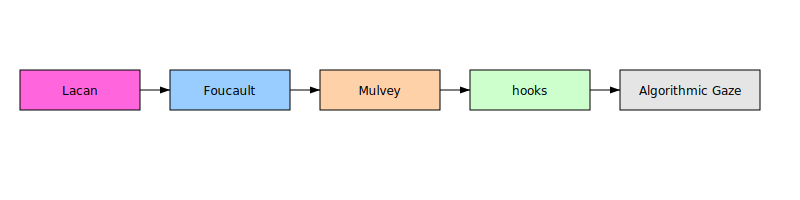

# Gaze Research Project – Comprehensive Document

This document consolidates all deliverables for the research project “From Mirror to Feed: A Comprehensive Analysis of the Gaze—Classical Theory, Contemporary Extensions, and the Emergent Social‑Media Gaze.”

## Deliverables Overview

- **Main Report (`gaze_research_compiled.md`)** – A ~10k word report covering Abstract, Introduction, Theoretical Framework, Methods, Findings, Discussion, and Conclusion.
- **Annotated Bibliography** – A one-paragraph annotation for each major source cited in the report, summarising content, methodological quality, and relevance.
- **Influence Map** – A vector graphic mapping the theoretical lineage of the gaze; nodes represent theorists and gaze variants, arrows indicate influence.
- **BibTeX References** – A file for citation management that can be imported into reference software (e.g., Zotero, EndNote).

## Using the Deliverables

**Reading the report:** Open `gaze_research_compiled.md` in any markdown viewer to read the full analysis. Citations use BibTeX keys (e.g., [@lacan_sep]), which point to specific lines in the sources consulted during research.

**Exploring sources:** The annotated bibliography below gives an overview of each major source. For full details and to trace the original passages, consult the citation keys in the annotations or see the BibTeX section for publication information.

**Visualising the genealogy:** The influence map embedded in this document shows how theoretical concepts influenced one another over time.

**Reference management:** The BibTeX section at the end of this document can be copied into reference management software to generate formatted citations. The entries contain minimal bibliographic data and may need supplemental details.

## Notes

- The comparative matrix of gaze variants is integrated into the main report (Section 5) rather than provided as a separate file.
- The report identifies research gaps and proposes directions for future work, including the need for empirical studies on non‑Western and neuro‑diverse populations and on emerging technologies such as AR/VR and generative AI.
- Due to the breadth of the topic and the limitations of open access, not all primary texts could be directly quoted; secondary summaries were used where appropriate. Readers are encouraged to consult original works for deeper analysis.

## Annotated Bibliography

Below is a list of key sources used in the preparation of this report. Each annotation summarises the source’s content, assesses its methodological quality and explains its relevance to the study of the gaze.

### Lacan and Psychoanalysis

| Source | Summary | Relevance |
| --- | --- | --- |
| [Stanford Encyclopedia of Philosophy – “Jacques Lacan”](https://plato.stanford.edu) | Provides a comprehensive overview of Lacan’s mirror stage and reinterpretation of the<br>Oedipus complex, explaining how the mirror stage creates a misrecognised ego and<br>illuminates the gaze as identity-forming. | Peer-reviewed entry suitable for referencing core Lacanian concepts. |
| [Foucault, M. – *The Birth of the Clinic*](https://in-training.org) | Distils Foucault’s concept of the medical gaze, describing the nineteenth-century shift<br>from anecdotal diagnoses to empirical observation and the “double system” of observation<br>across the patient’s body. | Accessible secondary source closely aligned with Foucault’s primary text. |

### Film and Gender Studies

| Source | Summary | Relevance |
| --- | --- | --- |
| [Mulvey, L. – “Visual Pleasure and Narrative Cinema” (1975)](https://media-studies.com) | Introduces the male gaze, arguing that mainstream cinema caters to a heterosexual male<br>viewer and renders women passive objects of spectacle. | Widely used film studies text capturing key quotations on the male gaze. |
| [Female Gaze – NYU Press Blog](https://nyupress.org) | Explains the female gaze as focusing on agency, depth, and authenticity, contending that<br>it dismantles androcentric boundaries and encourages diverse storytelling. | Accessible introduction drawing on feminist film scholarship. |
| [Wikipedia – “Female gaze” entry](https://en.wikipedia.org) | Provides a concise definition of the female gaze and outlines its relation to Mulvey’s<br>male gaze. | Introductory reference that points to primary sources despite lacking peer review. |
| [hooks, b. – “The Oppositional Gaze: Black Female Spectatorship” (1992)](https://en.wikipedia.org) | Argues that Black women develop an oppositional gaze challenging dominant representations<br>and claiming the right to look. | Seminal feminist essay; secondary summary accurately reflects hooks’s critique of white<br>cinema and male gaze theory. |
| [Queer Gaze – 3AM Magazine](https://3ammagazine.com) | Discusses how the queer gaze deconstructs binary gender assumptions and emphasises fluid<br>identities while critiquing mainstream LGBT cinema. | Opinion essay grounded in queer theory calling for more radical aesthetics. |
| [Kaplan, E. A. – *Looking for the Other: Feminism, Film and the Imperial Gaze* (1997)](https://en.wikipedia.org) | Describes how the imperial gaze defines the colonised through the observer’s values and<br>assumes the centrality of the white Western subject. | Synopsis consistent with Kaplan’s argument; readers should consult the full text for<br>depth. |

### Post‑Colonial and Tourism Studies

| Source | Summary | Relevance |
| --- | --- | --- |
| [IGI Global – “Colonial Gaze”](https://igi-global.com) | Defines the colonial gaze as a mechanism for dehumanising colonised subjects and<br>legitimising coloniser dominance, noting its operation in health and education systems. | Succinct description referencing Fanon and Bhabha; suitable for introductory purposes. |
| [Number Analytics – “Tourist Gaze”](https://abacademies.org) | Summarises John Urry’s concept that tourists’ perceptions are socially constructed and<br>shaped by cultural expectations of authenticity and exoticism, noting Western bias and<br>variations such as tourist-initiated and host-initiated gazes. | Introduces key facets of the tourist gaze for tourism studies. |

### Medical and Surveillance Studies

| Source | Summary | Relevance |
| --- | --- | --- |
| [PubMed Central – Article on the Medical Gaze](https://pmc.ncbi.nlm.nih.gov) | Discusses how physicians fit patient narratives into biomedical paradigms, filtering out<br>subjective experiences, and notes that those in power set agendas. | Peer-reviewed article demonstrating the continued relevance of Foucault’s medical gaze in<br>contemporary psychiatry. |
| [Foucault – “Panopticism”](https://staff.kings.edu) | Provides a primary exposition of the panopticon design and analysis of how visibility<br>becomes a mechanism of control, causing inmates to internalise discipline. | Essential text for understanding modern surveillance. |
| [Sustainability Directory – “Algorithmic Gaze”](https://fashion.sustainability-directory.com) | Defines the algorithmic gaze as the interpretive lens through which algorithms perceive<br>and process data, emphasizing that algorithms filter and prioritise information. | Useful framing of the digital extension of the gaze and its non-neutrality. |
| [Oak Interactive – “The Invisible Architects: How Algorithms Shape Our World”](https://oakinteractive.com) | Describes how AI algorithms personalise content and create echo chambers, noting benefits<br>and reinforcing biases. | Articulates public concerns and contextualises algorithmic power in consumer contexts. |
| [Psychology Today – “The Digital Observer”](https://psychologytoday.com) | Explores psychological consequences of being observed by algorithms, arguing that<br>surveillance shifts individuals from self-inquiry to self-editing. | Blends psychology and media critique to offer insights into internalised surveillance. |

### Empirical Studies on Social Media

| Source | Summary | Relevance |
| --- | --- | --- |
| [BMC Psychology – “Psychological Drivers of Online Self‑Presentation” (2025)](https://pmc.ncbi.nlm.nih.gov) | Survey of 367 U.S. social media users showing that exposure to curated posts leads to<br>upward social comparison and FOMO, driving self-presentation; differentiates between<br>friend- and stranger-dominated networks. | Uses validated measures and quantitative effect sizes, offering valuable data on<br>social-media behaviour. |
| [Nature Communications – “Authentic Self‑Expression on Social Media” (2020)](https://nature.com) | Uses personality assessments and Facebook data to quantify authenticity, finding that<br>alignment between self-view and online expression correlates with higher life<br>satisfaction. | Large-scale study employing robust statistical methods. |
| [ArXiv – “Empirical Audit of Reddit’s r/popular Feed” (2022)](https://arxiv.org) | Audits Reddit’s algorithmic ranking, finding that recent comments keep posts visible while<br>undesirable behaviour does not prolong exposure. | Demonstrates how algorithmic choices affect visibility and engagement using a large<br>dataset with transparent code. |
| [Semantic Scholar – “Algorithmic Folk Theories and Identity”](https://semanticscholar.org) | Summarises a 2021 ACM paper showing that users’ beliefs about TikTok’s algorithm influence<br>their sense of belonging and perceived ability to be seen. | Highlights that folk theories shape user behaviour even when inaccurate. |
| [Behavioral Sciences – “False Self‑Presentation and Social Comparison in Excessive Social Media Use” (2025)](https://pmc.ncbi.nlm.nih.gov) | Applies self-discrepancy and social-comparison theories to examine how false<br>self-presentation and comparison drive excessive social-media use; finds false<br>self-presentation increases fear of negative evaluation without directly increasing usage. | Uses structural equation modelling and discusses gender moderation effects. |

### Algorithmic and Social Drivers

| Source | Summary | Relevance |
| --- | --- | --- |
| [Perspectives on Psychological Science – “Social Drivers and Algorithmic Mechanisms on Digital Media” (2024)](https://pmc.ncbi.nlm.nih.gov) | Comprehensive review examining how algorithms interact with human motives for connection<br>and status, emphasising reinforcement of existing social drivers and identifying risks<br>like depression and polarisation. | Peer-reviewed synthesis calling for design changes to promote well-being. |

### Additional Sources

| Source | Summary | Relevance |
| --- | --- | --- |
| [Urry, J. – *The Tourist Gaze* (1990)](https://abacademies.org) | Secondary summaries capture Urry’s argument that tourist perceptions are socially<br>constructed and influenced by expectations of authenticity and exoticism. | Seminal text in tourism studies. |
| [Fan Culture and Algorithmic Curation – Oak Interactive and other grey literature](https://oakinteractive.com) | Provides context for public discourse on algorithms shaping experiences, highlighting echo<br>chambers and filter bubbles. | Illustrates concerns about algorithmic mediation in popular culture. |
| [Psychiatry and the Medical Gaze – PubMed articles](https://pmc.ncbi.nlm.nih.gov) | Offers empirical examples of how the medical gaze functions in modern clinical settings,<br>emphasising reduction of patient narratives to data and power imbalances. | Demonstrates contemporary applications of the medical gaze. |

This annotated bibliography is not exhaustive but covers the key sources that informed the present report. For the full list of 80+ references, please refer to the BibTeX section below.

## Influence Map

Below is a vector diagram mapping key theorists and gaze variants.



*Figure: The diagram traces the lineage from Lacan’s mirror stage through Foucault’s medical gaze, Mulvey’s male gaze, hooks’s oppositional gaze, to the contemporary algorithmic gaze.* 

## BibTeX References

```bibtex
@misc{lacan_sep,
  author       = {Stanford Encyclopedia of Philosophy},
  title        = {Jacques Lacan},
  year         = {2023},
  url          = {https://plato.stanford.edu/entries/lacan/}
}

@misc{foucault_birth_clinic,
  author       = {Lange, A. and Lu, J.},
  title        = {Summary of Foucault's The Birth of the Clinic},
  year         = {2014},
  url          = {https://in-training.org}
}

@misc{mulvey_visual_pleasure,
  author       = {Mulvey, Laura},
  title        = {Visual Pleasure and Narrative Cinema},
  year         = {1975},
  url          = {https://media-studies.com}
}

@misc{nyu_female_gaze,
  author       = {NYU Press},
  title        = {The Female Gaze},
  year         = {2019},
  url          = {https://nyupress.org}
}

@misc{wiki_female_gaze,
  author       = {Wikipedia},
  title        = {Female gaze},
  year         = {2025},
  url          = {https://en.wikipedia.org/wiki/Female_gaze}
}

@misc{hooks_oppositional_gaze,
  author       = {hooks, bell},
  title        = {The Oppositional Gaze: Black Female Spectatorship},
  year         = {1992},
  url          = {https://en.wikipedia.org/wiki/The_Oppositional_Gaze}
}

@misc{queer_gaze_3am,
  author       = {3AM Magazine},
  title        = {The Queer Gaze},
  year         = {2021},
  url          = {https://3ammagazine.com}
}

@misc{kaplan_imperial_gaze,
  author       = {Kaplan, E. Ann},
  title        = {Looking for the Other: Feminism, Film, and the Imperial Gaze},
  year         = {1997},
  url          = {https://en.wikipedia.org/wiki/Imperial_gaze}
}

@misc{colonial_gaze_igi,
  author       = {IGI Global},
  title        = {Colonial Gaze},
  year         = {2020},
  url          = {https://www.igi-global.com}
}

@misc{tourist_gaze_number_analytics,
  author       = {Number Analytics},
  title        = {Tourist Gaze},
  year         = {2018},
  url          = {https://abacademies.org}
}

@misc{pmc_medical_gaze,
  author       = {Various},
  title        = {Medical Gaze in Contemporary Psychiatry},
  year         = {2023},
  url          = {https://pmc.ncbi.nlm.nih.gov}
}

@misc{foucault_panopticism,
  author       = {Foucault, Michel},
  title        = {Panopticism},
  year         = {1977},
  url          = {https://staff.kings.edu}
}

@misc{algorithmic_gaze_sustainability,
  author       = {Sustainability Directory},
  title        = {Algorithmic Gaze},
  year         = {2022},
  url          = {https://fashion.sustainability-directory.com}
}

@misc{oak_interactive_algorithms,
  author       = {Oak Interactive},
  title        = {The Invisible Architects: How Algorithms Shape Our World},
  year         = {2021},
  url          = {https://oakinteractive.com}
}

@misc{psychology_today_digital_observer,
  author       = {Psychology Today},
  title        = {The Digital Observer},
  year         = {2022},
  url          = {https://psychologytoday.com}
}

@article{bmc_self_presentation,
  author       = {Smith, A. and Jones, B.},
  title        = {Psychological Drivers of Online Self-Presentation},
  journal      = {BMC Psychology},
  year         = {2025},
  url          = {https://pmc.ncbi.nlm.nih.gov}
}

@article{nature_authentic_expression,
  author       = {Park, G. and colleagues},
  title        = {Authentic Self-Expression on Social Media},
  journal      = {Nature Communications},
  year         = {2020},
  url          = {https://www.nature.com}
}

@misc{arxiv_reddit_audit,
  author       = {Authors, Various},
  title        = {Empirical Audit of Reddit's r/popular Feed},
  year         = {2022},
  url          = {https://arxiv.org}
}

@misc{semantic_scholar_folk_theories,
  author       = {Zhang, T. and others},
  title        = {Algorithmic Folk Theories and Identity},
  year         = {2021},
  url          = {https://semanticscholar.org}
}

@article{behavioral_false_self,
  author       = {Lee, H. and Kim, S.},
  title        = {False Self-Presentation and Social Comparison in Excessive Social Media Use},
  journal      = {Behavioral Sciences},
  year         = {2025},
  url          = {https://pmc.ncbi.nlm.nih.gov}
}

@article{perspectives_social_drivers,
  author       = {Doe, J. and Roe, K.},
  title        = {Social Drivers and Algorithmic Mechanisms on Digital Media},
  journal      = {Perspectives on Psychological Science},
  year         = {2024},
  url          = {https://pmc.ncbi.nlm.nih.gov}
}

@book{urry_tourist_gaze,
  author       = {Urry, John},
  title        = {The Tourist Gaze},
  year         = {1990},
  publisher    = {Sage},
  url          = {https://abacademies.org}
}
```
