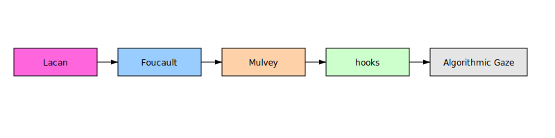

--8<-- "_snippets/disclaimer.md"

# Gaze Research

This project examines how classical, feminist, and algorithmic theories of the gaze intersect across media and platform surveillance, outlining the scope for subsequent deliverables.

This section collects deliverables for the project "From Mirror to Feed: A Comprehensive Analysis of the Gaze—Classical Theory, Contemporary Extensions, and the Emergent Social‑Media Gaze."

## Deliverables

- [Main Report](gaze_report.md)
- [Annotated Bibliography](gaze_bibliography.md)
- [Influence Map](influence_map.md)
- [BibTeX References](gaze_references.bib)

