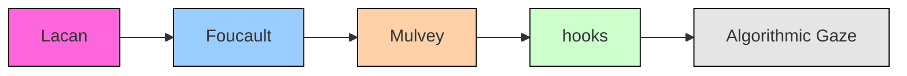

--8<-- "_snippets/disclaimer.md"

# Influence Map

Below is a vector diagram mapping key theorists and gaze variants.

*Figure: Colored nodes trace theoretical traditions—pink for psychoanalysis (Lacan), blue for post-structural power (Foucault), orange for feminist film (Mulvey), green for intersectional feminism (hooks), and gray for the algorithmic gaze. Arrows indicate the flow of influence from earlier to later thinkers.*

The diagram was generated using a short Python script leveraging the `svgwrite` library.

## Legend

- Pink nodes (e.g., [Lacan](gaze_bibliography.md)) denote psychoanalytic foundations.
- Blue nodes (e.g., [Foucault](gaze_bibliography.md)) mark post-structural power analyses.
- Orange nodes (e.g., [Mulvey](gaze_bibliography.md)) represent feminist film theory.
- Green nodes (e.g., [hooks](gaze_bibliography.md)) highlight intersectional feminism.
- Gray node ([algorithmic gaze](gaze_bibliography.md)) indicates contemporary digital extensions.
- Arrows show the direction of theoretical influence from earlier to later thinkers.
