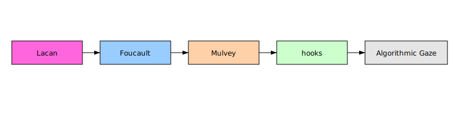

--8<-- "_snippets/disclaimer.md"

# Influence Map

Below is a vector diagram mapping key theorists and gaze variants.

*Figure: The map links Lacan’s psychoanalytic gaze through Foucault, Mulvey, and hooks to the algorithmic gaze.*
