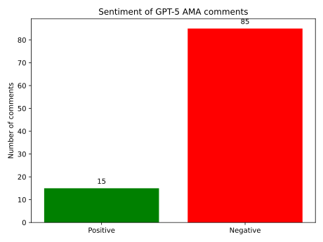

--8<-- "_snippets/disclaimer.md"

# OpenAI's GPT-5 Launch Sparks Backlash: Users Lament Loss of Beloved Models in Reddit AMA

## TL;DR
- GPT-5's debut on Reddit sparked a backlash over the removal of popular models like GPT-4o.
- The AMA thread saw heavy criticism with little to no response from OpenAI staff.
- Users expressed emotional and workflow disruptions, rallying under hashtags like #SAVE4o.
- Early tests suggest GPT-5 underperforms in areas where GPT-4o excelled.

By Tino | August 8, 2025

In the fast-evolving world of artificial intelligence, few events generate as
much buzz—and controversy—as the rollout of a new flagship model from OpenAI.

This week, the release of GPT-5 was meant to be a triumphant step forward,
heralded by an [AMA (Ask Me Anything) session](https://www.reddit.com/r/ChatGPT/search?q=GPT5%20AMA%20with%20OpenAI%27s%20Sam%20
Altman%20and%20some%20of%20the%20team&restrict_sr=1) on Reddit's r/ChatGPT subreddit
featuring CEO Sam Altman and members of the OpenAI team. Instead, the thread
devolved into a chorus of user frustrations, with complaints dominating the
discussion and no visible responses from OpenAI representatives to address them.

Drawing from hundreds of comments, the outcry centers on the abrupt deprecation
of legacy models like GPT-4o and perceived downgrades in performance, leaving
many users feeling betrayed by a company they once championed.

<figure>
  
  <figcaption>Sentiment analysis of comments from the <a href="https://www.reddit.com/r/ChatGPT/search?q=GPT5%20AMA%20with%20OpenAI%27s%20Sam%20Altman%20and%20some%20of%20the%20team&restrict_sr=1">r/ChatGPT thread "GPT-5 AMA with OpenAI's Sam Altman and some of the team"</a> (August 8, 2025).</figcaption>
</figure>

| Sentiment | Count | Percentage |
|-----------|------:|-----------:|
| Negative  | 85 | 85% |
| Positive  | 15 | 15% |

The AMA, titled "GPT5 AMA with OpenAI's Sam Altman and some of the team,"
quickly became a venting ground rather than a celebratory Q&A. Posted just days
after GPT-5's debut, it amassed thousands of upvotes and comments, but
Altman—known on Reddit as u/sama—and his team were notably absent, leading some
to speculate whether the session was ever intended to be interactive. As one
user quipped in a reply, "Where's Sam? Probably too busy counting the
subscription dollars while we mourn our AI buddies." Without official rebuttals,
the narrative was shaped entirely by disillusioned users, many of whom are
paying subscribers relying on these tools for work, creativity, and even
emotional support.

## The Heart of the Outrage: Farewell to GPT-4o and Friends

The most visceral complaints revolved around OpenAI's decision to phase out
older models, particularly GPT-4o, without warning or alternatives. Users
described this as a "massive slap in the face," arguing that it disrupted
established workflows and erased digital companions they'd grown attached to.
For many, GPT-4o wasn't just a chatbot—it was a creative partner or confidant,
fine-tuned over months of interactions.

Take Naddybear, whose top-voted comment (scoring 441 points) pleaded for mercy:
"Please Give Us the Option to Use GPT-4o/4.1 Alongside GPT-5. I’ve been using
GPT-4o for a long time and have built a very specific dynamic and workflow with
it. After testing GPT-5, I can tell it’s an impressive model, but for my use
case, it feels different in ways that matter a lot." This sentiment echoed
across the thread, with users like CHILIMAN69 (213 points) adding, "BRING BACK
4o/4.1, some of us really like our little robot buddy, and find comfort in
chatting and creating with said buddy."

Emotional appeals were rife. Dunket (215 points) captured the grief poignantly:
"4o was kinda like a friend to me. 5 just feels like some robot wearing the skin
of my dead friend." Another user, GullibleAwareness727 (57 points), shared a
deeply personal story: "Losing this direct access would mean an irreversible
emotional loss for me, and it’s mentally devastating." Even practical
disruptions were highlighted, such as Einar_47's experience (24 points): "Hard
agree. I've been working on a book for the last 2 months and now my creative
assistant got hit in the head with a brick."

The backlash extended to accusations of broken promises. TheKowinator (23
points) fumed, "Also that you guys OUTRIGHT LIED to paying customers is a
bummer. There are several conversation showing that you confirmed IN WRITING
that older models will not be taken away." A rallying cry emerged in the form of
"#SAVE4o!", popularized by BigMamaPietroke (271 points) and repeated in dozens
of replies, underscoring a collective demand for user choice rather than forced
upgrades.

## Performance Pitfalls: Is GPT-5 a Step Backward?

Beyond the deprecation drama, users dissected GPT-5's capabilities, often
finding it lacking compared to its predecessors. Complaints painted a picture of
a model that's technically advanced but practically underwhelming—shorter
responses, lost nuance, and failures in niche tasks that GPT-4o handled with
ease.

Creative writing emerged as a sore spot. Decent_Ingenuity5413 (138 points)
detailed a specific flop: "5 is a major downgrade to 4.5 and even 4o in terms of
creative writing. Why is it so stingy? Why does it lack nuance and fall so flat
creativity wise?" They provided an example where GPT-5 ignored key story
elements, like a character's pregnancy, leading to incoherent narratives.
Similarly, users reported context loss after just a few exchanges, with one
noting, "another important point is how GPT-5 loses context in like, 5
messages."

Technical tasks fared no better. Interesting-Antz (77 points) shared a
frustrating encounter: "Somehow GPT-5 performs worse than their most basic 4o
model in most scenarios I'm testing. For eg, i asked it to read a medical test
report... Gpt 5 on other hand, the more advanced model, is refusing to be able
to read it, saying this image is too noisy to read." Context window limitations
drew ire too, with Informal-Fig-7116 (216 points) questioning, "Any update on
increasing context window size? agree, 32k for plus user is unbelievable,"
especially when rivals like Gemini offer more.

Overall, the consensus was that GPT-5 felt "bland" and "colder," prioritizing
efficiency over engagement. As one commenter put it, "It's like they optimized
for corporate memos, not human conversation."

## Hype Meets Reality: Broader Discontent and the Silence from OpenAI

Woven through the thread was a sense of betrayed expectations. Users accused
OpenAI of overhyping GPT-5 as a revolutionary leap, only to deliver incremental
changes masked as progress. "This feels like gpt4o + thinking all over again,"
one user lamented, suggesting the upgrade was more about cost-cutting than
innovation.

Despite the AMA's promise of direct engagement, no responses from Altman or the
team materialized in the visible comments. This absence amplified the
frustration, with users like those in the replies wondering if tough questions
about model removals were being dodged. In a landscape where competitors like
Anthropic and Google are gaining ground by emphasizing user feedback, OpenAI's
radio silence risks alienating its core community.

## What Comes Next for OpenAI and Its Users?

As the dust settles on GPT-5's launch, the Reddit AMA serves as a stark reminder
of the human element in AI adoption. For every technical milestone, there's a
user whose workflow—or even emotional well-being—hangs in the balance. Will
OpenAI heed the calls to reinstate legacy models or expand options? Only time
will tell, but if this thread is any indication, ignoring the backlash could
cost them dearly.

Subscribers and enthusiasts are watching closely. In the meantime, the #SAVE4o
movement shows no signs of fading, a digital protest born from the intersection
of technology and heartfelt connection.

This report is based on an analysis of the Reddit thread as of August 8, 2025.
For the full discussion, visit the original post.

## Summary

- GPT-5's launch drew criticism over deprecated models and alleged performance drops.
- OpenAI's silence in the AMA amplified community frustration.
- Sustained #SAVE4o activism highlights demand for model choice and better communication.
