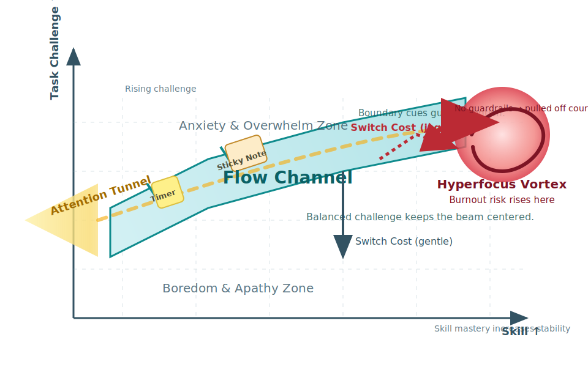

--8<-- "_snippets/disclaimer.md"

- [The Artist's Field Guide to Attention & Energy: Navigating Flow, Focus, and Burnout in the Studio](#the-artists-field-guide-to-attention--energy-navigating-flow-focus-and-burnout-in-the-studio)
  * [Executive Summary](#executive-summary)
  * [Understanding the Creative Engine](#understanding-the-creative-engine)
    + [ADHD Attentional Regulation](#adhd-attentional-regulation)
    + [Monotropism: The Attention Tunnel](#monotropism-the-attention-tunnel)
    + [Flow: The Optimal Creative State](#flow-the-optimal-creative-state)
    + [Creative Burnout: The Depletion State](#creative-burnout-the-depletion-state)
  * [The Causal Pathway: Steering the Attention Tunnel](#the-causal-pathway-steering-the-attention-tunnel)
    + [Flow vs. Hyperfocus](#flow-vs-hyperfocus)
    + [Road to Burnout](#road-to-burnout)
  * [Mid-Session Diagnostic Kit](#mid-session-diagnostic-kit)
    + [Flow vs. Hyperfocus Decision Checklist](#flow-vs-hyperfocus-decision-checklist)
    + [Exit Ramp Protocol: Controlled Disengagement](#exit-ramp-protocol-controlled-disengagement)
  * [Diagram Blueprint: Attention Tunnel ↔ Flow Channel](#diagram-blueprint-attention-tunnel-%E2%86%94-flow-channel)
  * [Anti-Burnout Studio Protocol](#anti-burnout-studio-protocol)
    + [Daily Session Architecture](#daily-session-architecture)
    + [90-Minute Session Recipe](#90-minute-session-recipe)
    + [Drawing Difficulty Ladder](#drawing-difficulty-ladder)
  * [Studio Fortification & Commission Management](#studio-fortification--commission-management)
  * [If-Then Playbook for Common Creative States](#if-then-playbook-for-common-creative-states)
  * [Studio Metrics: Tiny Scorecard for Sustainable Practice](#studio-metrics-tiny-scorecard-for-sustainable-practice)
    + [Scorecard Template](#scorecard-template)
    + [Using the Scorecard](#using-the-scorecard)
  * [Recovery Toolkit: Refueling Creative Capacity](#recovery-toolkit-refueling-creative-capacity)
  * [Appendix: Foundational Sources](#appendix-foundational-sources)
  * [Sources Used in the Report](#sources-used-in-the-report)
  * [Sources Read but Not Used in the Report](#sources-read-but-not-used-in-the-report)
!!! note "Disclaimer"
    This document is provided for research purposes only and does not constitute legal advice. It also does not constitute financial advice.
[[toc]]

# The Artist's Field Guide to Attention & Energy: Navigating Flow, Focus, and Burnout in the Studio

## Executive Summary

Artists with ADHD often experience powerful but irregular attention cycles. This guide maps the creative "engine" that powers studio work by describing how ADHD attentional regulation, monotropism, flow, and burnout interact across a drawing session. Structured session design, proactive diagnostics, and intentional recovery rituals transform this engine from a depletion loop into a renewable system. The playbook combines psychological research with studio-tested protocols so that neurodivergent artists can sustain high-quality output without sacrificing health.

## Understanding the Creative Engine

Sustainable creative practice starts with a clear vocabulary for core mental states. Each component below describes a distinct force acting on attention during drawing.

### ADHD Attentional Regulation

ADHD is best characterized as a dysregulated attention system rather than an attention deficit. Dopamine-driven reward pathways pull attention toward novel, intrinsically interesting tasks that provide immediate feedback. Tedious but necessary chores (for example, layer management) are hard to initiate, while captivating rendering tasks can capture attention involuntarily. Understanding this volatility reframes the challenge from "finding focus" to steering and modulating intensity.[^additude-hyperfocus]

### Monotropism: The Attention Tunnel

Monotropism theory, developed by autistic researchers, proposes that cognitive resources cluster around a small number of interests at any one time. In the studio this becomes a powerful "attention tunnel" that enables deep immersion on a single creative problem. Trade-offs include expensive task switching (such as moving from sketching to inking) and high sensitivity to interruptions. Treating monotropism as a cognitive style—rather than a deficit—makes it possible to design supports that preserve its strengths while easing transitions.[^monotropism-org]

### Flow: The Optimal Creative State

Psychologist Mihaly Csikszentmihalyi defined flow as voluntary, energized immersion in a task that is both intrinsically rewarding and well matched to skill. Flow requires:[^positivepsych-flow]

- **Clear, proximal goals:** e.g., "Render the helmet reflections in the next 20 minutes."
- **Immediate feedback:** drawing provides a real-time visual loop for adjustments.
- **Balance between challenge and skill:** tasks are demanding enough to require focus but still feel manageable.

Subjectively, flow feels like steady momentum and reduced self-consciousness while still preserving awareness of bodily needs and the agency to pause.

### Creative Burnout: The Depletion State

Burnout emerges when creative demands chronically outpace available resources. For artists it shows up as emotional exhaustion, loss of joy, persistent self-doubt, and physical fatigue that rest fails to resolve. Over time the brain associates drawing with depletion, producing avoidance, blocks, and disengagement from the craft.[^idsa-burnout]

## The Causal Pathway: Steering the Attention Tunnel

The creative process begins when interest pulls attention into the monotropic tunnel. From this point the session can diverge toward sustainable flow or toward hyperfocus-driven burnout.

### Flow vs. Hyperfocus

The attention tunnel can swing to either extreme depending on how a session is structured.[^chadd-hyperfocus]

| Aspect | Flow Path | Hyperfocus Path |
| --- | --- | --- |
| Session design | Micro-goals, calibrated difficulty, timers, and planned breaks keep the tunnel guided. | Vague aims and absent boundaries collapse the tunnel into compulsive focus. |
| Attention feel | Focus remains voluntary and smooth; pausing feels easy. | Attention turns sticky and involuntary; stopping feels jarring. |
| Body awareness | Bodily cues stay present and are acted upon. | Time-blindness and ignored bodily needs accumulate. |
| Energy outcome | Work feels energizing and sustainable. | Cognitive fuel is rapidly depleted, triggering stress. |

### Road to Burnout

Repeated hyperfocus sessions overdraw glucose reserves and trigger the body's stress response. High switch costs, commission pressure, and unresolved tasks amplify depletion. As exhaustion pairs with rising anxiety, drawing shifts from intrinsically rewarding to threatening. Prevention must therefore occur at the micro-level—designing each session to cap focus intensity before resources crash.[^additude-burnout]

## Mid-Session Diagnostic Kit

External cues compensate for unreliable internal signals during deep immersion. Use the diagnostic kit below to gauge whether a session remains in flow or is sliding into hyperfocus.

### Flow vs. Hyperfocus Decision Checklist

Set a timer every 45–60 minutes and walk through this table without judgment.

| Checkpoint | Question for Yourself | If YES... | If NO... |
| --- | --- | --- | --- |
| 1. Goal Clarity | Can I state my specific goal for the next 15 minutes in one sentence? | You're on track. | **Action:** Pause and define it. Write the sentence on a sticky note. |
| 2. Challenge/Skill Fit | Does this task feel engagingly difficult but doable? | You're in the channel. | **Action:** If bored, raise challenge 10% (harder brush, more dynamic pose). If anxious, lower challenge 10% (simplify the target area). |
| 3. Sense of Control | Do I feel in control of my attention and able to pause voluntarily? | This is likely flow. | **Action:** If focus feels compulsive or "sticky," proceed to Checkpoint 4. |
| 4. Bodily Needs Check | Have I noticed hunger, thirst, pain, restroom needs, or the current time within the past hour? | Awareness maintained. | **Action:** Ignoring these cues signals hyperfocus. Run the Exit Ramp Protocol immediately. |

### Exit Ramp Protocol: Controlled Disengagement

Abruptly stopping a monotropic brain can feel destabilizing. Use this three-part ritual to disengage gradually:

| Step | What to Do | Duration | Why it Matters |
| --- | --- | --- | --- |
| 1. Hard Stop Cue | Trigger a loud, unavoidable alarm, save the file, capture a screenshot, and write "Next, I will…" with the very next step. | 30 seconds | Externalizes working memory and interrupts the hyperfocus loop. |
| 2. Physical Reset | Stand up, stretch, hydrate, and take three deep breaths away from the desk. | 60–120 seconds | Reconnects interoceptive signals and breaks the physical posture tied to overfocus. |
| 3. Conscious Decision | Choose one: • Resume with a fresh 20–25 minute timer. • Switch to a 15-minute bridge task (layer cleanup, filling flats). • Log progress on the scorecard and stop fully if depletion is high. | 2–3 minutes | Puts attention back under voluntary control and protects energy reserves. |

> [!INFO] Need a printable version?
> Keep a hard copy beside your desk with the [Attention Checkpoint Card](templates/attention-checklist-card.md) quick reference. Print at 100% scale for a half-sheet card that fits on clipboards or desktop stands.
>
## Diagram Blueprint: Attention Tunnel ↔ Flow Channel

<figure>
  
</figure>

Visualize task challenge on the vertical axis and skill on the horizontal axis. The diagonal "flow channel" represents an optimal match between the two. A beam of light symbolizes the monotropic attention tunnel entering from the left. Boundary cues—timers and sticky notes—act as guardrails that keep the beam within the channel. Straying above produces anxiety and overwhelm; slipping below invites boredom and apathy. Without boundaries the beam spirals into a hyperfocus vortex that feeds burnout. Arrows labeled "switch cost" show how much energy is required to exit: gentle when leaving flow, jagged and large when yanked from hyperfocus.

## Anti-Burnout Studio Protocol

Structure, not inspiration, drives sustainable creativity. The two-week protocol below balances focused production with recovery.

### Daily Session Architecture

| Element | Recommendation | Intent |
| --- | --- | --- |
| Session count | Limit focused drawing to two blocks per day (morning and afternoon). | Prevents marathon pushes that default to hyperfocus. |
| Session length | Keep each block between 90 and 120 minutes. | Maintains a sustainable intensity curve. |
| Recovery block | Separate blocks with ≥1 hour of non-drawing recovery. | Restores cognitive and physical resources before re-entry. |

### 90-Minute Session Recipe

| Phase | Actions | Time |
| --- | --- | --- |
| Two-Minute Pre-Flight | Define the first micro-goal, set a timer, and stage water at the desk. | 2 minutes |
| 25/5 Sprint Cycles | Work for 25 minutes, then take a 5-minute reset—stand, stretch, and look 20 feet away while avoiding phones or email. | Repeat 3–4 times |
| Mid-Session Body Check | After the second sprint ask: "Am I hungry? Am I straining?" | 1 minute |
| Hard Stop & Shutdown | Save, write tomorrow's first step, tidy one item, and close the software. | Final 2–3 minutes |

### Drawing Difficulty Ladder

Alternate task difficulty to manage cognitive load:

| Tier | Cognitive Load | Typical Tasks |
| --- | --- | --- |
| Tier 1 – Easy | Low decision-making | Fill flats, organize layers, clean scans. |
| Tier 2 – Medium | Structured technical work | Clean line art, basic rendering, block proportions. |
| Tier 3 – Hard | High-concept problem-solving | Thumbnail ideation, complex perspective, tricky materials, final color grading. |

Pair a Tier 3 morning session with a Tier 1 afternoon cooldown to prevent exhaustion.

## Studio Fortification & Commission Management

| Focus | Practice | Benefit |
| --- | --- | --- |
| Digital boundaries | Use distraction blockers and silence non-essential notifications during sprints. | Protects attention from digital intrusions. |
| Physical environment | Reserve a dedicated workspace, wear noise-canceling headphones, and communicate sprint windows. | Reduces unexpected interruptions that break the tunnel. |
| Commission queue | Set realistic deadlines that include recovery time and decline overload projects when necessary. | Aligns workload with available energy and avoids chronic pressure. |
| Creative worth | Schedule regular "no-outcome" play sessions. | Rebuilds intrinsic joy separate from productivity metrics. |

## If-Then Playbook for Common Creative States

Pre-plan responses to frequent attention states to reduce executive load.

| Trigger | Planned Response | Purpose |
| --- | --- | --- |
| I feel bored or can't start. | Run a 10-minute Tier 1 warm-up **or** raise the challenge by 10%. | Builds momentum while matching the brain's need for novelty. |
| I feel overwhelmed mid-task. | Swap to a Tier 1 task for one sprint and break the work into the smallest next action. | Restores a sense of control and reboots confidence. |
| I finish one stage and feel stuck starting the next. | Spend 5–10 minutes on a micro-bridge task that touches both stages (e.g., thicken silhouettes between line art and color). | Lowers the activation energy of switching channels. |
| I notice time-blindness. | Launch the Exit Ramp Protocol immediately and reset awareness without judgment. | Prevents depletion from compounding after the fact. |
| A distraction intrudes. | Log it on a "Distractions List," take one breath, and restate the current 15-minute goal aloud. | Re-anchors attention without losing the idea. |

## Studio Metrics: Tiny Scorecard for Sustainable Practice

Redefine a "good day" by process adherence, not output volume.

### Scorecard Template

> [!INFO] Download the scorecard
> Save or print the [Artist Attention Scorecard Template](templates/artist-attention-scorecard.md) for ready-to-fill columns, or duplicate it into a spreadsheet for longer-term tracking.
>
| Metric | What to Log | Why It Matters |
| --- | --- | --- |
| Estimated Flow Minutes | Record the total number of minutes spent in sustainable flow. | Tracks sustainable focus minutes rather than raw hours. |
| Micro-Goals Hit | Count how many micro-goals you completed during the session. | Measures session structure and follow-through. |
| Boundary Breaks Taken | Log every deliberate break that protected your attention tunnel. | Rewards the breaks that prevent burnout. |
| Recovery Action Done? (Y/N) | Mark `Y` when you complete a recovery ritual before closing the session. | Confirms that recovery is treated as part of the job. |
| Next Session's First Goal Written? (Y/N) | Mark `Y` once you've written the first action for the next session. | Lowers initiation friction for the next work block. |

### Using the Scorecard

> [!TIP]
> - Track leading indicators such as boundary breaks and recovery actions, not just flow minutes.
> - Treat entries as neutral data. Low-flow days with strong recovery still count as wins against burnout.
> - Prioritize Metric 5. Writing the next session's first step lowers initiation friction for ADHD and monotropic brains.
>
## Recovery Toolkit: Refueling Creative Capacity

| Focus | Practice | Restorative Benefit |
| --- | --- | --- |
| Sleep consistency | Anchor consistent sleep and wake times. | Stabilizes hormonal rhythms and emotional regulation. |
| Short movement breaks | Insert 5–10 minute walks, stretches, or dance breaks. | Metabolizes stress hormones and refreshes focus. |
| Strategic music | Use familiar, non-lyrical tracks during sprints and novel or energizing music as a reward during breaks. | Balances stimulation across focus and recovery periods. |
| Scheduled creative play | Protect low-stakes drawing time without outcome pressure. | Reconnects with intrinsic motivation and buffers against burnout. |

## Appendix: Foundational Sources

[^additude-hyperfocus]: [ADDitude Magazine – Hyperfocus: The ADHD Phenomenon of Hyper Fixation](https://www.additudemag.com/hyperfocus-adhd-fixation/)
[^monotropism-org]: [Monotropism.org – Monotropism: The Mind as an Interest System](https://monotropism.org)
[^positivepsych-flow]: [PositivePsychology.com – What Is Flow in Positive Psychology? (Incl. 10+ Activities)](https://positivepsychology.com/what-is-flow/)
[^idsa-burnout]: [Industrial Designers Society of America – Creative Burnout: Suffocating the Future of Design](https://www.idsa.org/creativity-industrial-design/creative-burnout-suffocating-future-design)
[^chadd-hyperfocus]: [CHADD – Hyperfocus in College Students with ADHD](https://chadd.org/attention-article/hyperfocus-in-college-students-with-adhd/)
[^additude-burnout]: [ADDitude Magazine – Extreme Burnout: How ADHD Hyperfocus Broke Me](https://www.additudemag.com/adhd-burnout-hyperfocus/)

- Csikszentmihalyi, M. (1990). *Flow: The Psychology of Optimal Experience.* PositivePsychology.com and MindTools provide accessible summaries and applications.
- Murray, D., Lesser, M., & Lawson, W. (2005). "Attention, monotropism and the diagnostic criteria for autism." *Autism, 9*(2), 139–156. Introduces monotropism theory; see Monotropism.org and British Psychological Society explainers.
- Murray, F. (2018). "Me and Monotropism: A unified theory of autism." *The Psychologist.* First-person exploration of monotropism implications.
- Ashinoff, B. K., & Abu-Akel, A. (2021). "Hyperfocus: the forgotten frontier of attention." *Psychological Research, 85*(1), 1–19. Differentiates hyperfocus from other attention states.
- Grotewiel, M. M., Crenshaw, M. E., Dorsey, A., & Street, E. (2023). "Hyperfocus and flow: A qualitative study of the experiences of college students with and without ADHD." *Attention Magazine (CHADD).* Documents experiential contrasts between flow and hyperfocus.
- Nadeau, K. (2022). "Understanding ADHD Hyperfocus." *ADDitude Magazine.* Practical overview of dysregulated attention.
- Roles, K. (2022). "Creative Burnout: Suffocating the Future of Design." Industrial Designers Society of America. Identifies burnout causes and symptoms for creatives.
- Stuckey, H. L., & Nobel, J. (2010). "The connection between art, healing, and public health: A review of the literature." *American Journal of Public Health, 100*(2), 254–263. Shows creative engagement as a stress buffer.

## Sources Used in the Report

<strong>Sources used (click to expand)</strong>

- [ADDitude Magazine – Hyperfocus: The ADHD Phenomenon of Hyper Fixation](https://www.additudemag.com/hyperfocus-adhd-fixation/)
- [Hyperfocus - Wikipedia](https://en.wikipedia.org/wiki/Hyperfocus)
- [CHADD – Hyperfocus in College Students with ADHD](https://chadd.org/attention-article/hyperfocus-in-college-students-with-adhd/)
- [Envision ADHD – What are the Hidden Benefits of Hyperfocus for Adults with ADHD in Creative Industries?](https://envisionadhd.com/hidden-benefits-of-hyperfocus-for-adults-with-adhd/)
- [Team of Greats Coaching – Hyperfocus versus Flow](https://teamofgreats.com/hyperfocus-versus-flow/)
- [ADDitude Magazine – Extreme Burnout: How ADHD Hyperfocus Broke Me](https://www.additudemag.com/adhd-burnout-hyperfocus/)
- [Monotropism.org – Monotropism: The Mind as an Interest System](https://monotropism.org)
- [Autism Awareness Centre – What is Monotropism?](https://autismawarenesscentre.com/what-is-monotropism/)
- [Reframing Autism – Monotropism: Understanding Autistic Ways of Being Through the Lens of Attention](https://reframingautism.org.au/monotropism-understanding-autistic-ways-of-being-through-the-lens-of-attention/)
- [Monotropism - Wikipedia](https://en.wikipedia.org/wiki/Monotropism)
- [White Bear Psychotherapy – Understanding Monotropism: An Affirming Theory of Autism](https://whitebearpsychservices.com/understanding-monotropism-an-affirming-theory-of-autism/)
- [The Social Work Graduate – Monotropism](https://thesocialworkgraduate.com/monotropism/)
- [PositivePsychology.com – What Is Flow in Positive Psychology? (Incl. 10+ Activities)](https://positivepsychology.com/what-is-flow/)
- [PositivePsychology.com – Flow Theory in Psychology: 13 Key Findings & Examples](https://positivepsychology.com/flow-theory/)
- [Flow (psychology) - Wikipedia](https://en.wikipedia.org/wiki/Flow_(psychology))
- [PositivePsychology.com – Mihály Csíkszentmihályi: The Father of Flow](https://positivepsychology.com/mihaly-csikszentmihalyi-father-of-flow/)
- [Verywell Mind – How to Reach an Immersed State of Flow](https://www.verywellmind.com/what-is-flow-2794768)
- [Headspace – What Is a Flow State and What Are Its Benefits?](https://www.headspace.com/mindfulness/flow-state)
- [Industrial Designers Society of America – Creative Burnout: Suffocating the Future of Design](https://www.idsa.org/creativity-industrial-design/creative-burnout-suffocating-future-design)
- [Neurodivergent Insights – ADHD Burnout Recovery | What Helps—and What Makes It Worse](https://neurodivergentinsights.com/blog/adhd-burnout-recovery)
- [Hey Mate Project – Creative Burnout is Real: 5 Warning Signs Artists Shouldn't Ignore](https://www.theheymateproject.com/blogs/news/creative-burnout-is-real)
- [Sketch Design Repeat – Creative Burnout & Improving Artist Mental Health](https://sketchdesignrepeat.com/creative-burnout/)
- [Christina Greve – The Art of Overcoming a Creative Burnout](https://christinagreve.com/the-art-of-overcoming-a-creative-burnout/)
- [Atelier School of Art – The Science and Theory of Flow State in Creative Activities](https://atelierschoolofart.com/flow-state)
- [Dr. Sharon Saline – Flow State vs. Hyperfocus: On Channeling Your Unsteady ADHD Attention](https://drsharonsaline.com/2022/08/23/flow-state-vs-hyperfocus/)
- [British Psychological Society – Me and Monotropism: A unified theory of autism](https://www.bps.org.uk/psychologist/me-and-monotropism)
- [My Sprout Studio – Business Tips for Artists with ADHD: Strategies and Support](https://mysproutstudio.com/business-tips-for-artists-with-adhd-strategies-and-support/)
- [Reddit – Advice for an Artist Struggling to Focus with ADHD](https://www.reddit.com/r/animationcareer/comments/lzygvg/advice_for_an_artist_struggling_to_focus_with_adhd/)
- [Focused Space – Shut Down Rituals: The Secret to Ending Each Day Feeling Great](https://focused.space/blog/shut-down-rituals)
- [Medium – The Basic Skills of Drawing: Learn to Draw For Beginners](https://medium.com/@kevinzhoudesign/the-basic-skills-of-drawing-learn-to-draw-for-beginners-91cb77e965d4)
- [Canson – The 6 Essential Steps in Drawing](https://en.canson.com/inspiration/tutorials-tips/the-6-essential-steps-in-drawing)
- [Love Life Drawing – The Figure Drawing Roadmap – All the Skills, in Order, Part 1](https://www.lovelifedrawing.com/figure-drawing-roadmap/)
- [Medium – I'm 77. How Can I Start to Draw? A Simple Step-by-Step Guide for Beginners](https://medium.com/@malcolm.fernan/im-77-how-can-i-start-to-draw-a-simple-step-by-step-guide-for-beginners-c905024119ac)
- [Reddit – How Do You Even "Break Down into Simple Shapes"?](https://www.reddit.com/r/ArtistLounge/comments/15k1piy/how_do_you_even_break_down_into_simple_shapes/)
- [Hue Teo – Fundamentals Course: A Guide for Starters in Art](https://htartist.artstation.com/store/jN0p/fundamentals-course-a-guide-for-starters-in-art)
- [Medical News Today – Flow State: Definition, Examples, and How to Achieve It](https://www.medicalnewstoday.com/articles/flow-state)
- [New 32 Productions – ADHD and Artists: Three Tips That Changed My Life](https://new32productions.com/blogs/news/adhd-and-artists-three-tips-that-changed-my-life)
- [Scott H. Young – The 7 Essential Rituals for Focused Work](https://www.scotthyoung.com/blog/2008/01/11/rituals-for-focused-work/)
- [Employment Autism – Setting Workplace Boundaries](https://employmentautism.org.uk/setting-workplace-boundaries/)
- [Newglade Counselling – 5 Tips for Preventing Neurodivergent Burnout](https://www.newgladecounselling.co.uk/post/5-tips-for-preventing-neurodivergent-burnout)
- [The Neurodivergent Collective – Setting Boundaries as a Neurodivergent Person](https://theneurodivergentcollective.com/blogs/news/setting-boundaries-as-a-neurodivergent-person)
- [PMC – Creative Arts Interventions for Stress Management and Prevention—A Systematic Review](https://www.ncbi.nlm.nih.gov/pmc/articles/PMC10557096/)
- [Melbourne School of Psychological Sciences – If-Then Planning (MCBC Resource)](https://psychologicalsciences.unimelb.edu.au/mcbc/resources/if-then-planning)
- [University of Hamburg – If-Then Plans Benefit Executive Functions in Children with ADHD](https://www.psy.uni-hamburg.de/en/arbeitsbereiche/entwicklungspsychologie/downloads/if-then-plans.pdf)
- [Neurodiverse Connection – Monotropism and The Monotropism Questionnaire](https://ndconnection.co.uk/monotropism/)
- [Chris Bailey – How to Create a “Distraction-Free” Focus Ritual](https://chrisbailey.com/how-to-create-a-distraction-free-focus-ritual/)
- [Jody MacDonald – Measuring Success as an Artist](https://www.jodymacdonald.ca/blog/measuring-success-as-an-artist)
- [RedDotBlog – How to Track Art Studio Productivity Without Burning Out](https://reddotblog.com/how-to-track-art-studio-productivity-without-burning-out/)
- [Psychiatry.org – Preventing Burnout: A Guide to Protecting Your Well-Being](https://www.psychiatry.org/patients-families/preventing-burnout)
- [ResearchGate – Me and Monotropism: A Unified Theory of Autism (PDF)](https://www.researchgate.net/publication/327593734_Me_and_Monotropism_A_unified_theory_of_autism)
- [PMC – Hyperfocus: The Forgotten Frontier of Attention](https://www.ncbi.nlm.nih.gov/pmc/articles/PMC7806347/)
- [Industrial Designers Society of America – Suffocating the Future of Design](https://www.idsa.org/events/idsa-events/suffocating-future-design)

## Sources Read but Not Used in the Report

<strong>Additional sources consulted</strong>

- therapist.com — Hyperfocus: Meaning, examples, and how to manage.
- en.wikipedia.org — Industrial Designers Society of America - Wikipedia.
- k-state.edu — Industrial design students to present at international design conference.
- cgu.edu — Mihaly Csikszentmihalyi | The Father of Flow.
- chadd.org — Hyperfocus: The other side of adult ADHD.
- cdc.gov — About Attention-Deficit / Hyperactivity Disorder (ADHD).
- researchgate.net — Monotropism - An Interest Based Account of Autism.
- monotropism.org — ADHD and Monotropism.
- files.eric.ed.gov — Csikszentmihaliyi's Concept of Flow and Theories of Motivation Connection to the Arts.
- artspeaksstudio.com — Making Art in a “Flow State”.
- autisticrealms.com — The Power of Monotropic Flow: Reclaiming Ourselves Through Creative Practice.
- thepdaspace.com — Monotropism = Happy Flow State.
- creativespirit-us.org — Beating Burnout: A Guide Employers and Neurodiverse Professionals.
- leicspart.nhs.uk — Autistic fatigue and burnout - coping strategies.
- assets.super.so — Boundaries, Needs, and Neurodivergent Rights.
- ingym.org — Strategies to Set Boundaries with Your Neurodiverse Child.
- autisticrealms.com — Autism & The Map of Neuronormative Domination: Stuck States vs Flow States.
- goodnotes.com — 8 Creative Habit Tracker Templates to Help You Hit Your Goals.
- artstation.com — Fundamentals of Realistic Pencil Drawing.
- artstation.com — Draw Characters 102 Drawing Fundamentals.
- artstation.com — DRAWING AND SKETCHING FUNDAMENTALS.
- artstation.com — Learning - ArtStation.
- medium.com — 10 Creative Habit Tracker Ideas to Help You Stick to Your Goals.
- yopandtom.com — The Complete Guide to Habit Trackers (+ Habit Tracker Template).
- stage32.com — 5 Ways To Calculate and Track Your Artistic Progress.
- additudemag.com — Task Switching with ADHD: Help Teens with Difficult Transitions.
- earthcoaching.net — Navigating Transitions: Task-switching Tips for ADHD, AuDHD and more.
- mdpi.com — Human Attention Restoration, Flow, and Creativity: A Conceptual Overview.
- elifesciences.org — How biological attention mechanisms improve task performance.
- autisticrealms.com — The Map of Monotropic Experiences: A Summary.
- mindmate.org.uk — Monotropism, hyperfocus & ND.
- autismparentingmagazine.com — Autism Monotropism: Understanding Focus and Attention.
- skillshare.com — Drawing for Beginners: Learn How to Draw Anything (Smitesh Mistry).
- skillshare.com — Drawing for Beginners: Learn your Lines & Start your Art Journey (Tim Balhatchet).
- skillshare.com — See Better to Draw Better: Fundamental Drawing Exercises & Practices for Beginners (Yasmina Creates).
- skillshare.com — Learn The 3 Building Blocks of Drawing & a 7 Day Practice Challenge for Quick Growth.
- skillshare.com — Drawing Masterclass - The Beginner Level Skills - Develop Your Drawing Skills From Zero to Confident.
- skillshare.com — Drawing Foundations: How to Draw for Beginners (Siobhan Twomey).
- reddit.com — What Habits do you track? : r/bulletjournal.
- reddit.com — Art station pro learn. : r/ArtistLounge.
- reddit.com — What are your favorite drawing exercises? : r/ArtistLounge.
- reddit.com — How do you draw as a complete beginner? : r/IWantToLearn.
- reddit.com — A problem...with hyperfocus : r/productivity.
- reddit.com — Advice for an artist struggling to focus with ADHD : r/animationcareer.
- reddit.com — How do you even “break down into simple shapes”? : r/ArtistLounge.
- youtube.com — 4 Stages of Learning How to Draw at Any Age.
- youtube.com — 14 Crucial Drawing Exercises for Beginners.
- youtube.com — How to start drawing (for beginners).
- yvonnemorellsblog.com — Drawing Exercises to build a solid foundation!
- bingedrawing.com — 6 Beginner Drawing Exercises For Quick Progress.
- drawabox.com — Drawabox | A free, exercise based approach to learning the fundamentals of drawing.
- medium.com — I'm 77. How Can I Start to Draw? A Simple Step-by-Step Guide for Beginners.
- medicalnewstoday.com — Flow state: Definition, examples, and how to achieve it.
- lovefrommim.com — 100 Habit Tracker Ideas + FREE Habit Tracker Printable!
- blog.joinwimzee.com — Mastering Creative Skills with a Fun Habit Tracker.
- artiststrong.com — Do This to Measure your Artistic Growth.
- habitify.me — Habit Tracking Methods - Which One Is For You?
- artspeaksstudio.com — Making Art in a “Flow State”.
- artspeaksstudio.com — Steps for drawing (Lemon8 experience summary).
- visual-artists.org — Artists with ADHD: Thrive Creatively in a Neurotypical World.
- theneurodivergentcollective.com — Setting Boundaries as a Neurodivergent Person.
- creativespirit-us.org — Beating Burnout: A Guide Employers and Neurodiverse Professionals.
- leicspart.nhs.uk — Autistic fatigue and burnout - coping strategies.
- ingym.org — Strategies to Set Boundaries with Your Neurodiverse Child.
- neurodivergentinsights.com — ADHD Burnout Recovery | What Helps—and What Makes It Worse.
- new32productions.com — ADHD and artists: three tips that changed my life.
- new32productions.com — Business Tips for Artists with ADHD: Strategies and Support.
- theneurodivergentcollective.com — Setting Boundaries as a Neurodivergent Person.
- psychiatry.org — Preventing Burnout: A Guide to Protecting Your Well-Being.
- psy.uni-hamburg.de — If-then plans benefit executive functions in children with ADHD.
- psychologicalsciences.unimelb.edu.au — If-Then Planning (MCBC Resource).
- ndconnection.co.uk — Monotropism and The Monotropism Questionnaire.
- chrisbailey.com — How to Create a “Distraction-Free” Focus Ritual.
- jodymacdonald.ca — Measuring Success as an Artist.
- reddotblog.com — How to Track Art Studio Productivity Without Burning Out.
- researchgate.net — (PDF) Me and Monotropism: A unified theory of autism.
- pmc.ncbi.nlm.nih.gov — Hyperfocus: the forgotten frontier of attention.
- idsa.org — Suffocating the Future of Design.
- workamajig.com — Prove Your Worth: 8 Creative Team Metrics You Need to Track.
- cellainc.com — Measuring the Health of Your Creative Team.
- childmind.org — How Can We Help Kids With Transitions?
- timechamp.io — 10 Critical Productivity Metrics and KPIs to Elevate Performance.
- linearb.io — The 21 Developer Productivity Metrics You Should Measure.
- mikebrennan.me — The Daily Creative Habit Guided Creativity Journal.
- kabir.cc — Focus on these 5 metrics on Spotify for Artists.
- chartmetric.com — Chartmetric | Advancing music with the power of data.
- spotifyforartists.com — Canvas Metrics Guide.
- artstoheartsproject.com — Creative success: How can you measure your progress as an artist?
- chubcatart.com — 3 Key Metrics to Track in Your Art Business.
- birdwithabrush.com — Measuring Progress – More than “Better”.
- agileseekers.com — Understanding ART Metrics: Throughput, Lead Time, Cycle Time, and Flow Efficiency.
- eric.ed.gov — EJ993360 - How Can We Measure Student Progress in Art?
- focused.space — Shut Down Rituals: The Secret to Ending Each Day Feeling Great.

