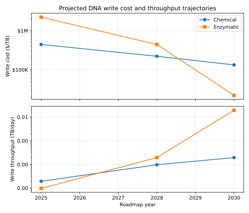
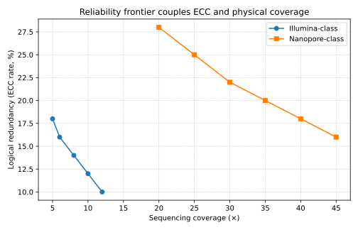
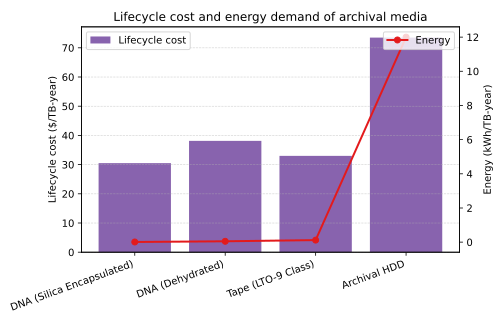

--8<-- "_snippets/disclaimer.md"

# A Techno-Economic and Performance Model for DNA-Based Archival Storage

## Executive Summary

This report presents a comprehensive Techno-Economic and Performance Model (TEPM) for DNA-based data storage, designed to provide a defensible, quantitative foundation for simulation and architectural design. The analysis spans the entire data lifecycle—from encoding and synthesis to preservation, retrieval, sequencing, and decoding—and evaluates key metrics including cost, throughput, latency, reliability, and energy consumption against incumbent archival technologies.

The model's primary findings are summarized as follows:

- **Prohibitive Current State:** In its current state (2025), DNA data storage is economically and performatively non-competitive for any mainstream archival application. The principal barriers are the cost of DNA synthesis ($/base) and the end-to-end write throughput (bases/s). These metrics are approximately seven to nine and six to eight orders of magnitude, respectively, away from parity with commercially available LTO-9 tape archives. Current synthesis costs are estimated in the range of $3,500 per megabyte, millions of times more than tape or HDD storage.
- **Synthesis as the Critical Path:** The viability of DNA storage is overwhelmingly dependent on disruptive innovation in synthesis technology. The model indicates that incremental improvements to established phosphoramidite chemistry are insufficient. Achieving competitive cost and throughput targets by 2030 and beyond necessitates the maturation of massively parallelized enzymatic or electrochemical synthesis platforms that can be tightly integrated with CMOS technology, enabling exponential scaling in cost-efficiency and speed.
- **Reliability is an Architectural Choice:** Achieving a target residual Bit Error Rate (BER) of ≤10^-12 requires a nuanced co-optimization of logical redundancy (Error-Correcting Codes, ECC) and physical redundancy (sequencing coverage). The optimal strategy is dictated by the error profile of the chosen read/write channel. High-substitution channels, characteristic of Illumina sequencing, favor higher rates of logical redundancy. In contrast, channels with high insertion/deletion (indel) and dropout rates, such as those associated with Nanopore sequencing or certain synthesis methods, demand significantly higher physical coverage to form a reliable consensus sequence prior to decoding. This creates distinct cost-performance curves and architectural trade-offs for different hardware combinations.
- **A Paradigm Shift in Lifecycle Cost:** The most compelling long-term advantage of DNA is its unparalleled durability. When properly preserved, particularly via silica encapsulation, DNA's data half-life can extend to centuries or millennia, virtually eliminating the recurring data migration and media refresh costs that dominate the Total Cost of Ownership (TCO) for tape and HDD archives over 50+ year horizons. This positions DNA as a "write-once, store-forever" medium. If the formidable initial write costs can be overcome, this fundamentally alters the long-term economic equation for cold data archives.

The path to viability for DNA data storage is steep, demanding multi-order-of-magnitude improvements in core technologies. This model provides the quantitative framework to navigate this path, identifying the specific technological breakpoints and architectural trade-offs that will determine its future as a transformative archival medium. The key findings are visually synthesized in Figure 1, a TCO comparison of DNA, tape, and HDD archives.


Caption: Figure 1. DNA's high upfront cost is offset over centuries by negligible migration expenses compared with tape and HDD.

## Modeling Framework and Assumptions

To quantify the performance and economics of DNA data storage, this TEPM is structured around a sequential, six-stage pipeline that models the flow of data from logical bits to physically retrieved and decoded bits. This first-principles approach is necessary because a review of publicly available market forecasts reveals profound discrepancies, with 2025 market size estimates ranging from $42.9 million to $160.92 billion. This variance of over three orders of magnitude indicates that top-down market reports are unsuitable for constructing a defensible engineering model. Consequently, this analysis is built from the ground up, relying on unit economics (

$/base, $/Gb) and performance metrics derived from technical literature, vendor documentation, and primary research.

### The DNA Data Storage Pipeline

The model decomposes the end-to-end process into the following distinct stages, each with its own cost, latency, and error model:


*Figure: Data flow through the six stages of the DNA data storage pipeline.*

1. **Encode:** User data is segmented into logical chunks. Each chunk is encoded to add logical redundancy via an Error-Correcting Code (ECC) and an address for later retrieval. The resulting binary sequence is then mapped to a DNA base sequence (A, C, G, T), respecting biochemical constraints (e.g., GC content, homopolymer limits).
2. **Synthesize (Write):** The encoded DNA sequences are physically manufactured as short single-stranded DNA molecules, known as oligonucleotides (oligos). This is the primary cost driver and throughput bottleneck of the entire workflow and introduces synthesis errors (substitutions, insertions, deletions).
3. **Preserve:** The pool of synthesized oligos is stored for a specified duration. This stage models the physical decay of DNA molecules over time, which is dependent on the preservation medium and storage conditions.
4. **Retrieve:** A specific subset of the oligo pool, corresponding to a desired data file, is accessed and amplified. This is typically achieved via Polymerase Chain Reaction (PCR), which can introduce its own biases and errors.
5. **Sequence (Read):** The retrieved oligos are read using a DNA sequencer, which converts the molecular information back into digital base sequences (reads). This process introduces sequencing errors.
6. **Decode:** The raw digital reads are processed through a computational pipeline. This involves clustering reads belonging to the same original oligo, generating a consensus sequence to correct for sequencing errors, and finally, applying the ECC decoder to correct any remaining errors and recover the original logical data.

### Canonical Oligonucleotide Schema

The efficiency and overhead of the system are fundamentally defined by the structure of each synthesized oligo. This model uses a canonical layout that captures the essential components of a data-bearing DNA molecule:

```text
[5'-Primer | Index | Payload | ECC | 3'-Primer]
```

- **Primers:** These are 20-25 nucleotide (nt) sequences at the 5' and 3' ends of the oligo. They serve as binding sites for PCR amplification and are essential for both retrieval and sequencing. Their design is critical for ensuring uniform amplification and minimizing cross-talk between different data files.
- **Index:** A sequence of bases that encodes the logical address of the data chunk contained in the oligo. An index of 24-32 bits is typically required to address the vast number of oligos needed for large files.
- **Payload:** The segment of the oligo that contains the actual user data, encoded from binary into DNA bases. The information density of this section is typically between 1.5 and 1.9 bits per nucleotide, below the theoretical maximum of 2.0 bits/nt, due to the need to satisfy biochemical constraints.
- **ECC:** A sequence of bases containing the logical redundancy (parity) generated by the error-correcting code. The length of this segment is a direct function of the chosen ECC rate.

### Baseline Assumptions

The entire model is parameterized based on the values defined in the accompanying `TEPM_Assumptions.yaml` file. The baseline values for the current (2025) time horizon are summarized in Table 1. Each parameter is assigned a confidence level (Low, Medium, High) based on the quality, consistency, and recency of the source data. All monetary values are normalized to USD 2025.

| Parameter | Description | Value (2025 Baseline) | Units | Confidence | Citation(s) |
|-----------|-------------|-----------------------|-------|------------|-------------|
| **Write (Synthesis)** |||||
| Chemical Synthesis Cost | Cost per base for phosphoramidite array synthesis. | 1×10^-7 | $/base | High | |
| Enzymatic Synthesis Cost | Cost per base for emerging enzymatic platforms. | 5×10^-7 | $/base | Medium | |
| Chemical Synthesis Error | Aggregate error rate (sub+ins+del) per base. | 1×10^-2 | events/base | High | |
| Synthesis Throughput | Rate of base synthesis per chip/device. | 1,000 | bases/s | Medium | |
| **Read (Sequencing)** |||||
| Illumina Seq Cost | Consumables cost per gigabase on high-throughput platform. | 1.00 | $/Gb | High | |
| Nanopore Seq Cost | Consumables cost per gigabase on high-throughput platform. | 25.00 | $/Gb | Medium | |
| Illumina Error Rate | Aggregate error rate, dominated by substitutions. | 1×10^-3 | events/base | High | |
| Nanopore Error Rate | Aggregate error rate, dominated by indels. | 2×10^-2 | events/base | High | |
| **Preservation** |||||
| DNA Half-Life (Dry) | Modeled half-life at 20°C, dehydrated. | 650 | years | Medium | |
| DNA Half-Life (Silica) | Modeled half-life at 20°C, encapsulated. | 50,000 | years | Low | |
| **Comparator Tech** |||||
| LTO-9 Media Cost | Cost per native TB for a single LTO-9 tape cartridge. | 5.00 | $/TB | High | |
| LTO-9 Drive Cost | Capital cost for a single LTO-9 tape drive. | 5,700 | $ | High | |
| Archival HDD Cost | Cost per TB for a high-capacity archival-grade HDD. | 13.21 | $/TB | High | |
| HDD Power (Idle) | Power consumption of an idle archival HDD. | 5.0 | W | High | |
| **Labor & Overheads** |||||
| Lab Technician Labor | Fully burdened cost for a technician. | 75 | $/hour | High | N/A (Est.) |
| Instrument Amortization | Period over which capital equipment is amortized. | 5 | years | High | N/A (Std.) |

## Write-Side Analysis: Synthesis and Encoding

The process of writing data to DNA—encompassing logical encoding and physical synthesis—is the most significant contributor to both the total cost and the end-to-end latency of a DNA storage system. The performance and economics of this stage are dictated by the choice of synthesis technology and the architectural constraints imposed by the encoding scheme.

### Synthesis Technology Comparison

Two primary synthesis technologies are evaluated in this model, each with a distinct cost structure, throughput profile, and error model.

**Chemical (Phosphoramidite) Synthesis:** This is the mature, incumbent technology for producing synthetic DNA. It relies on a four-step cyclic chemical reaction to add nucleotides one by one to a growing chain immobilized on a solid support, typically a silicon-based microarray. While highly optimized over decades, its cost has plateaued, with commercial rates for array-based synthesis ranging from $0.05 to $0.17 per base, which translates to a prohibitive cost of over $100 million per terabyte of user data. The error profile of phosphoramidite chemistry is dominated by single-base deletions, which occur when a coupling reaction fails and the truncated oligo is capped, with reported rates around 0.1% per base. Substitution errors are less frequent but non-negligible, with G-to-A transitions being a common failure mode. The throughput of this method is fundamentally constrained by the time required for each chemical cycle, which limits the speed of serial base addition.

**Enzymatic Synthesis:** This emerging technology utilizes enzymes, such as Terminal deoxynucleotidyl Transferase (TdT), to add nucleotides in an aqueous environment. This approach offers several potential long-term advantages, including the elimination of harsh organic solvents and the potential for much higher parallelization by integrating enzymatic reactions directly onto CMOS chips. This tight integration is considered the most promising pathway to achieving the radical cost reductions and throughput increases required for DNA storage to become viable. However, in the current period, the technology is less mature. Costs are not yet competitive with chemical synthesis due to the high price of proprietary reagents and a lack of economies of scale. Furthermore, initial error rates for enzymatic methods have been reported to be higher than their chemical counterparts.

### Architectural Constraints and Overheads

The theoretical information density of DNA is 2 bits per nucleotide. However, practical constraints imposed by the synthesis and sequencing processes reduce the achievable effective information density.

- **Oligo Length:** There is a crucial trade-off in selecting the length of the synthesized oligos. Longer oligos (e.g., 200–300 nt) are more efficient as they amortize the fixed overhead of primers and indexes over a larger payload, thereby increasing the raw information density. However, the probability of an error occurring within an oligo increases with its length. A synthesis process with a per-base error rate of *p* will produce a perfect oligo of length *L* with a probability of only (1−p)^L. This accumulating error burden necessitates higher rates of ECC or greater sequencing coverage to correct, which in turn reduces the effective information density and increases downstream costs. The model must therefore treat oligo length as a key variable to be optimized for a given set of channel error characteristics.
- **GC Content and Homopolymers:** Both synthesis and sequencing chemistries exhibit performance degradation with sequences that have "unbalanced" GC content (the percentage of G and C bases) or long stretches of a single base (homopolymers). Sequences with GC content outside the 40–60% range or with homopolymer runs longer than three or four nucleotides are prone to significantly higher error rates or outright synthesis failure. To ensure system reliability, encoding algorithms must be designed to avoid generating these problematic sequences. This constraint effectively reduces the available coding space, lowering the achievable information density from the theoretical 2.0 bits/base to a more realistic 1.8 to 1.9 bits/base. This information density penalty is a fundamental overhead that must be factored into all cost calculations.

The "throughput gap" between DNA and tape is as critical as the cost gap. A single LTO-9 tape drive writes data at a native rate of 300 MB/s. In contrast, a 2018 automated DNA storage prototype demonstrated a write throughput of just five bytes over 21 hours, equivalent to approximately 0.06 bytes per second. To match the write speed of a single tape drive, the throughput of an integrated DNA synthesis system would need to increase by over nine orders of magnitude. While synthesis on microarrays is an inherently parallel process, this stark comparison highlights the immense scaling challenge. It suggests that a viable DNA storage architecture must be massively parallel by design. The critical metric for future progress is not simply bases/s from a single device, but rather bases/s per dollar of capital expenditure, which will ultimately determine the economic scalability of the write architecture, as shown in Figure 2.



Caption: Figure 2. TEPM projections indicate enzymatic platforms could surpass chemical synthesis in cost and throughput by 2030.

| Platform | Time Horizon | $/base (Low/Mid/High) | Throughput (bases/s/chip) | Substitution Rate | Insertion Rate | Deletion Rate | Confidence | Citation(s) |
|----------|--------------|----------------------|----------------------------|-------------------|---------------|---------------|------------|-------------|
| Chemical (Array) | Today (2025) | 0.5e-7 / 1.0e-7 / 1.7e-7 | 1,000 | 0.002 | 0.001 | 0.007 | High | |
| Chemical (Array) | Near-Term (2028) | 0.2e-7 / 0.5e-7 / 0.9e-7 | 5,000 | 0.0015 | 0.0008 | 0.005 | Medium | |
| Chemical (Array) | 2030+ | 0.1e-7 / 0.3e-7 / 0.5e-7 | 10,000 | 0.001 | 0.0005 | 0.003 | Low | |
| Enzymatic | Today (2025) | 3.0e-7 / 5.0e-7 / 8.0e-7 | 500 | 0.005 | 0.002 | 0.005 | Medium | |
| Enzymatic | Near-Term (2028) | 0.5e-7 / 1.0e-7 / 2.0e-7 | 10,000 | 0.003 | 0.001 | 0.003 | Medium | |
| Enzymatic | 2030+ | 1.0e-9 / 5.0e-9 / 1.0e-8 | 1,000,000 | 0.001 | 0.0005 | 0.001 | Low | |
| Future (MIST Target) | 2030+ | 1×10^-9 | 1×10^8 | 1×10^-3 | 5×10^-4 | 1×10^-3 | Low | |

## Read-Side Analysis: Sequencing and Decoding

The read-side of the DNA data storage pipeline—comprising file retrieval, sequencing, and computational decoding—presents its own set of technical and economic challenges. While sequencing costs have fallen dramatically over the past two decades, the process is still a significant contributor to the overall cost and latency of data recovery. The choice of sequencing platform is a critical architectural decision that deeply influences the system's error profile and reliability strategy.

### Sequencing Platform Comparison

The two dominant sequencing paradigms, Illumina's sequencing-by-synthesis (SBS) and Oxford Nanopore's nanopore sequencing, offer a distinct trade-off between accuracy, cost, and throughput.

**Illumina (SBS):** As the current market leader in high-throughput sequencing, Illumina platforms like the NovaSeq series provide exceptional raw accuracy. The technology features a very low error rate, typically around 0.1%, which is overwhelmingly dominated by substitution errors. This high fidelity and predictable error profile make it highly compatible with standard ECCs like Reed-Solomon codes, which are adept at correcting substitution and erasure errors. At scale, the technology is cost-effective, with consumable costs for high-throughput instruments trending towards $1—3 per gigabase (Gb) and a total cost for a human genome approaching $200. The primary drawbacks are high capital expenditure for the instruments and run times that can extend to 48 hours for maximum output.

**Oxford Nanopore Technologies (ONT):** Nanopore sequencing offers unique advantages, including real-time data generation, the ability to read very long DNA fragments, and significantly lower instrument capital costs, with portable devices like the MinION available for under $5,000. However, this flexibility comes at the cost of lower raw accuracy. ONT platforms exhibit a higher error rate, typically in the range of 1–5%, which is dominated by insertion and deletion (indel) errors, particularly in homopolymeric regions where the same base is repeated. This distinct error profile makes direct decoding with standard ECCs challenging. The cost per gigabase is highly dependent on scale; while low-throughput runs on a MinION can be expensive ($50–2000/Gb), high-throughput platforms like the PromethION can achieve costs comparable to Illumina ($21–42/Gb).

The choice between these platforms is not merely a cost-per-base decision but a fundamental architectural one that propagates through the entire reliability model. An Illumina-based system can function effectively with lower physical redundancy (sequencing coverage) by relying more heavily on the power of its logical redundancy (ECC) to correct the infrequent substitution errors. In contrast, a Nanopore-based system must first contend with the high rate of indel errors. Indels disrupt the reading frame of the data, making direct application of many ECCs impossible. Therefore, a Nanopore system requires high physical coverage (e.g., 30–50x) to first generate a high-quality consensus sequence from many noisy reads. This computational step uses alignment algorithms to vote on the correct base at each position, effectively converting the indel-rich raw data into a cleaner sequence with primarily substitution errors, which can then be handled by an outer ECC. This requirement for high coverage directly multiplies the sequencing cost and can potentially offset the lower capital expenditure of the instrument itself.

### Random Access and Retrieval

For a DNA archive to be practical, it must support random access—the ability to retrieve a specific file from a vast pool of oligos without sequencing the entire archive. The predominant method for achieving this is based on PCR. In this scheme, each file is encoded with a unique primer sequence that acts as its address. To retrieve the file, the corresponding primers are added to a sample of the DNA pool, selectively amplifying only the oligos belonging to that file.

While functional, this approach has significant drawbacks. The PCR process is relatively slow, adding hours to the retrieval latency. It is also a destructive process, as it consumes a portion of the physical DNA sample with each access. Repeated access to the same file can deplete its physical copies, potentially leading to data loss. Furthermore, PCR can suffer from amplification bias, where sequences with certain characteristics (e.g., GC content) are amplified more efficiently than others, leading to an uneven representation in the sequenced data and increasing the risk of oligo dropout. These factors must be modeled as part of the retrieval cost and reliability calculations.

| Platform | Time Horizon | $/Gb (Consumables) | Amortized CAPEX ($/run) | Gb/day | Max Read Length (nt) | Substitution Rate | Insertion Rate | Deletion Rate | Confidence | Citation(s) |
|----------|--------------|--------------------|--------------------------|--------|---------------------|-------------------|---------------|---------------|------------|-------------|
| Illumina (NovaSeq X) | Today (2025) | 1.00 | 50 | 1,000 | 500 | 1×10^-3 | 4×10^-4 | 2×10^-3 | High | |
| Illumina (NovaSeq X) | Near-Term (2028) | 0.70 | 40 | 1,500 | 600 | 8×10^-4 | 3×10^-4 | 1.5×10^-3 | Medium | |
| Illumina (NovaSeq X) | 2030+ | 0.50 | 30 | 2,000 | 800 | 5×10^-4 | 2×10^-4 | 1×10^-3 | Low | |
| Nanopore (PromethION) | Today (2025) | 25.00 | 20 | 200 | 100,000+ | 5×10^-3 | 1×10^-2 | 1×10^-2 | High | |
| Nanopore (PromethION) | Near-Term (2028) | 15.00 | 15 | 400 | 100,000+ | 3×10^-3 | 8×10^-3 | 8×10^-3 | Medium | |
| Nanopore (PromethION) | 2030+ | 5.00 | 10 | 1,000 | 100,000+ | 1×10^-3 | 3×10^-3 | 3×10^-3 | Low | |

## Reliability and Data Integrity

Achieving the extremely high data fidelity required for archival storage (typically a residual Bit Error Rate of 10^-12 or lower) in an inherently noisy biochemical system is a central challenge. The DNA data storage channel is subject to errors at every stage: synthesis introduces errors into the physical molecules, preservation leads to molecular decay and loss (dropout), and sequencing introduces another layer of read errors. Reliability is achieved by introducing redundancy into the system, which can be categorized into two fundamental types: logical and physical.

### The Redundancy Trade-Off

- **Logical Redundancy:** This is the redundancy added at the encoding stage in the form of an Error-Correcting Code (ECC). The ECC rate (R) defines the fraction of the final encoded data that is dedicated to parity information. For example, an ECC rate of 20% means that for every 100 bits of user data, an additional 25 bits of parity are generated and synthesized, for a total of 125 bits. Higher ECC rates enable the correction of more errors but come at the direct cost of increased DNA synthesis, as more bases must be written per unit of user data. This directly reduces the effective information density and increases the write cost. Common classes of codes used in DNA storage include Reed-Solomon (RS) codes, which are powerful for correcting substitution and erasure errors, and Fountain or LDPC codes, which are particularly well-suited for channels dominated by erasures (i.e., oligo dropouts).
- **Physical Redundancy:** This refers to the oversampling of the physical DNA molecules during the read process, quantified by the sequencing coverage. A coverage of 30x means that, on average, each unique oligo molecule in the retrieved sample is sequenced 30 times. By aligning these multiple, independent, noisy reads of the same original sequence, a high-fidelity consensus sequence can be computationally constructed. This process effectively uses majority voting to "average out" random sequencing errors. Higher coverage leads to a more accurate consensus sequence (a lower raw BER fed into the ECC decoder) but linearly increases the cost and time of the sequencing step.

### Pareto Front Analysis

There is no single "best" combination of logical and physical redundancy. The optimal strategy is a function of the channel's error characteristics and the relative costs of synthesis and sequencing. For a given target BER, one can trade higher ECC rates (more expensive synthesis) for lower coverage (cheaper sequencing), and vice versa. This trade-off can be visualized as a Pareto front, representing the set of all (ECC_rate, Coverage) combinations that achieve the target BER for the minimum possible total cost or time.

The model generates these Pareto fronts for different scenarios, revealing key architectural principles. For an Illumina-based system with low raw read errors, the optimal points on the frontier will favor moderate ECC rates and low physical coverage (e.g., 5–10x). For a Nanopore-based system with high raw indel rates, the frontier shifts dramatically, requiring high physical coverage (e.g., 30–50x) as a prerequisite to form a usable consensus, which is then protected by a moderate ECC rate. This analysis provides a quantitative basis for co-designing the encoding scheme and the physical read/write hardware to minimize the end-to-end cost of reliable data storage, as illustrated in Figure 3.



Caption: Figure 3. Pareto frontier shows that more error-prone channels demand higher physical coverage to achieve a target BER.

## Preservation, Durability, and Lifecycle Cost

A primary motivation for using DNA as a storage medium is its potential for extreme durability, offering a solution to the costly and risky cycle of data migration required by conventional archival media. The Total Cost of Ownership (TCO) of an archival system is not just the initial cost of writing the data but also the cumulative cost of preserving it over its intended lifetime. This lifecycle cost is heavily influenced by the choice of preservation medium.

### Preservation Media and Durability Modeling

The stability of DNA is highly dependent on its storage conditions, primarily its protection from water and oxygen, which drive hydrolytic and oxidative damage.

- **Dehydrated (Dry) Storage:** The simplest preservation method involves dehydrating the synthesized oligo pool and storing it in a cool, dark, and dry environment. Studies of ancient DNA recovered from fossils suggest that under favorable conditions (e.g., cold and dry), DNA has a half-life of hundreds of years. One widely cited study estimated a half-life of 521 years for a 242-base-pair fragment at 13°C. However, this rate is highly sensitive to temperature; the degradation rate increases exponentially with temperature according to the Arrhenius equation. At a more typical room temperature of 20°C, the modeled half-life is shorter but still on the order of centuries.
- **Silica Encapsulation:** To achieve greater stability, DNA can be encapsulated within amorphous silica (glass) nanoparticles. This process mimics natural fossilization, creating an inert, waterproof, and anoxic microenvironment that physically protects the DNA molecules from degradation. Accelerated aging experiments—where samples are stored at elevated temperatures to simulate the passage of long periods of time—suggest that silica encapsulation can enhance DNA stability by several orders of magnitude. Some studies project that this method can extend the half-life of stored DNA to thousands or even tens of thousands of years at room temperature, effectively creating a "write-once, store-forever" medium within practical human timescales.

### Total Cost of Ownership (TCO) Analysis

The TEPM calculates the lifecycle TCO, expressed in $/TB-year, which normalizes the cost of storing one terabyte of data for one year over the entire archival period. This metric provides a basis for direct comparison with traditional media.

The TCO model for DNA storage fundamentally differs from that of tape or HDD. For conventional media, the TCO is a mix of initial capital expenditure (drives, libraries, media) and significant ongoing operational expenditures. These OPEX components include power for spinning drives and climate control, as well as the substantial labor and new media costs associated with migrating data to the next generation of technology every 5–10 years for HDDs and every 10–15 years for tape to avoid media degradation and format obsolescence.

For DNA, the cost structure is almost entirely front-loaded. The initial synthesis cost represents the vast majority of the total expenditure. Once synthesized and encapsulated, the ongoing preservation cost is near zero. The DNA requires no power to maintain its state, and with a multi-millennial half-life, the need for data migration is eliminated. This transforms the TCO calculation into a simple amortization of the initial write cost over the desired archival lifetime.

This structural difference means that for short archival periods (<10 years), DNA is and will remain uncompetitive. However, for very long-term archives (50–500+ years), the cumulative cost of repeated migrations for tape and HDD can eventually surpass the high initial write cost of DNA. This analysis precisely identifies the strategic challenge and opportunity for DNA storage: it is not competing on a 5-year TCO basis but on a multi-generational, "deep archive" TCO basis. Its success is therefore contingent on reducing the initial write cost to a point where this long-term amortization becomes economically compelling, as shown in Figure 4.



Caption: Figure 4. DNA's minimal energy use and infrequent refresh cycles yield lower lifecycle cost than tape or HDD for deep archives.

| Medium | Storage Condition | Modeled Half-Life (Years) | Refresh Cadence (Years) | Lifecycle Energy (kWh/TB-year) | Citation(s) |
|--------|------------------|---------------------------|-------------------------|-------------------------------|-------------|
| Dehydrated DNA | Dry, Anoxic, 20°C | 650 | 250 | ≈ 0 | |
| Silica Encapsulated DNA | Dry, Anoxic, 20°C | 50,000+ | None (for <1000yr) | ≈ 0 | |
| LTO-9 Tape | Climate Controlled | 30+ | 10-15 | ≈ 0.1 | |
| Archival HDD | Powered On, Climate Controlled | 5-7 | 5 | 10-17 | |

## Strategic Analysis: The Path to Competitiveness

For DNA data storage to transition from a niche research area to a viable archival technology, it must achieve specific, aggressive performance and cost targets. This analysis identifies the critical breakpoints required for DNA to become competitive with tape-class archives and highlights the most sensitive parameters where technological innovation will have the greatest impact.

### "What Would Need to Be True" Checklist

The model reveals a set of necessary conditions for DNA storage to become a practical alternative for cold data. These breakpoints, largely aligned with the ambitious goals of research programs like IARPA MIST, form a quantitative roadmap for the industry.

- **Synthesis Cost Reduction (/base):** This is the most critical breakpoint. The current cost of array-based synthesis is roughly 10^-7 per base, or over $100 million per terabyte. To be competitive, this must fall by at least five to six orders of magnitude. The IARPA MIST program set a target of $1,000/TB by its conclusion and a long-term goal of $1/TB. Achieving a cost below $1,000/TB is the threshold for entering the conversation with tape for specialized, long-term archives.
- **Synthesis Throughput (bases/s):** Throughput is a co-equal barrier to cost. Current integrated systems operate in the kilobytes-per-day range, while practical archival systems must handle terabytes per day to be useful. The MIST program target of writing 1 TB per day in a tabletop system represents a multi-order-of-magnitude leap and is the minimum viable throughput for enterprise applications.
- **End-to-End Automation and Latency Reduction:** The current DNA storage workflow is a fragmented, manual process involving separate machines for synthesis, preservation, retrieval, and sequencing, with a total latency measured in days or weeks. Viability requires a fully automated, integrated "DNA storage appliance" that can perform the entire write-read cycle in hours, not days, to be competitive with tape library retrieval times.
- **Sequencing Cost and Speed:** While sequencing costs have fallen dramatically, they must continue to decline to support affordable random access and the high coverage depths required by some error-prone platforms. A read cost equivalent to a "$10 genome" is a reasonable target, enabling frequent, low-cost data verification and retrieval.

### Sensitivity and Breakpoint Analysis

A sensitivity analysis of the TEPM confirms that the total system cost is overwhelmingly sensitive to the cost of synthesis. A 10-fold reduction in $/base results in a nearly 10-fold reduction in the total cost to archive data. In contrast, a 10-fold reduction in sequencing cost ($/Gb) only affects the cost of data retrieval, which is a much smaller component of the TCO for true cold archives that are written once and read rarely. Therefore, research and investment should be disproportionately focused on solving the synthesis challenge.

The following table summarizes the required improvements for DNA storage to become competitive with LTO-9 tape, the current industry standard for cold archival storage.

| Metric | Current State (2025) | Tape-Class Target (2030+) | Order of Magnitude Improvement Needed | Key Enabling Technologies |
|--------|----------------------|---------------------------|---------------------------------------|---------------------------|
| Write Cost ($/TB) | >10^7 | <$1,000 | 10^4–10^5 | CMOS-integrated enzymatic/electrochemical synthesis, reagent cost reduction. |
| Read Cost ($/TB) | ≈$1,000 (at 1x coverage) | <$100 | 10^1 | Next-gen sequencing platforms, reduced reagent volumes. |
| Write Throughput (TB/day/system) | ≈10^-6 | >1 | 10^6 | Massively parallel synthesis arrays, integrated microfluidics. |
| Read Latency (end-to-end) | Days to Weeks | <24 hours | 10^1–10^2 | Fully automated fluidics, faster sequencing, hardware-accelerated decoding. |
| Lifecycle Energy (kWh/TB-year) | High (write), ≈ 0 (store) | ≈ 0 | N/A | (Inherent advantage) |

In conclusion, the techno-economic landscape for DNA data storage is one of immense potential gated by formidable technical and economic hurdles. Its future is not guaranteed by incremental progress but depends on fundamental breakthroughs in the core technology of DNA synthesis. If these breakpoints can be achieved, DNA's unparalleled density and durability position it as a truly disruptive technology for the long-term preservation of humanity's digital legacy.

## Sources used in the report

- gao.gov – Science & Tech Spotlight: Alternative Data Storage Technologies | U.S. GAO
- pmc.ncbi.nlm.nih.gov – Synthetic DNA Synthesis and Assembly: Putting the Synthetic in ...
- itbrew.com – DNA storage could be the solution to future enterprise archival needs - IT Brew
- blog.dshr.org – Review Of Data Storage In DNA - DSHR's Blog
- synbiobeta.com – DNA Synthesis—Is the Future Chemical, Enzymatic, or Both? - SynBioBeta
- imec-int.com – DNA storage: the power of biology to archive data | imec
- wyss.harvard.edu – DNA Data Storage - Wyss Institute
- pubmed.ncbi.nlm.nih.gov – Comparison of Illumina and Oxford Nanopore sequencing data quality for Clostridioides difficile genome analysis and their application for epidemiological surveillance - PubMed
- cd-genomics.com – Error Rate of PacBio vs Nanopore: How Accurate Are Long-Read Sequencing Technologies
- biorxiv.org – Comparison of state-of-the-art error-correction coding for sequence-based DNA data storage | bioRxiv
- webuyuseditequipment.net – Rethinking Sustainable Data Storage: Why Tape Still Leads the Way ...
- pnas.org – Deep silicification–assisted long-term preservation of structural and genomic information across biospecies: From micro to macro | PNAS
- researchgate.net – Preserving DNA in Biodegradable Organosilica Encapsulates | Request PDF - ResearchGate
- pmc.ncbi.nlm.nih.gov – Long term conservation of DNA at ambient temperature. Implications for DNA data storage - PMC - PubMed Central
- coherentmi.com – DNA Data Storage Market to reach USD 241.5 Million by 2032 - CoherentMI
- metatechinsights.com – DNA Data Storage Market Share, Size, Trend, Growth 2025-2035 - Metatech Insights
- vldb.org – OligoArchive: Using DNA in the DBMS storage hierarchy
- pmc.ncbi.nlm.nih.gov – Design considerations for advancing data storage with synthetic DNA for long-term archiving - PubMed Central
- arxiv.org – High Information Density and Low Coverage Data Storage in DNA with Efficient Channel Coding Schemes - arXiv
- pmc.ncbi.nlm.nih.gov – Leveraging nature to advance data storage: DNA as a storage medium - PMC
- researchgate.net – Construction of Bio-Constrained Code for DNA Data Storage - ResearchGate
- grandviewresearch.com – Enzymatic DNA Synthesis Market Size | Industry Report 2033 - Grand View Research
- pubs.acs.org – Highly Accurate Sequence- and Position-Independent Error Profiling of DNA Synthesis and Sequencing | ACS Synthetic Biology - ACS Publications
- academic.oup.com – Digital Quantification of Chemical Oligonucleotide Synthesis Errors - Oxford Academic
- iarpa.gov – MIST - IARPA
- blog.genohub.com – The Ultima Genomics UG 100: Challenging Illumina's Dominance in ...
- bridgeinformatics.com – Battle of the Sequencers: Illumina vs Nanopore Sequencing - Bridge Informatics
- pmc.ncbi.nlm.nih.gov – Recent progress in DNA data storage based on high-throughput DNA synthesis - PMC
- reddit.com – DNA half-life? : r/biology - Reddit
- pmc.ncbi.nlm.nih.gov – Impact of organic chemistry conditions on DNA durability in the context of DNA-encoded library technology - PMC
- diskprices.com – Disk Prices (US)
- cdw.com – Quantum LTO-9 Tape Drive - TD-L92GN-BR - Tape Drives - CDW.com
- techradar.com – The largest SSD and hard drive of 2025 | TechRadar
- seagate.com – Archive HDD - Seagate Technology
- pmc.ncbi.nlm.nih.gov – A systematic comparison of error correction enzymes by next ...
- pmc.ncbi.nlm.nih.gov – Emerging Approaches to DNA Data Storage: Challenges and Prospects - PMC
- researchgate.net – Quantification of synthetic errors during chemical synthesis of ...
- mdpi.com – Hardware-Accelerated Data Readout Platform Using Heterogeneous Computing for DNA Data Storage - MDPI
- mugenomicscore.missouri.edu – Sanger Sequencing Services | Troubleshooting Guide - MU Genomics Technology Core - University of Missouri
- biorxiv.org – www.biorxiv.org
- ltoWorld.com – IBM TS2290 LTO9 HH SAS External Tape Drive LTO-9 6160S9E - LTO World
- dnastoragealliance.org – AN INTRODUCTION TO DNA DATA STORAGE
- illumina.com – Now that NGS is more affordable, how can we make it easier? - Illumina
- nanoporetech.com – MinION portable nanopore sequencing device
- jonahventures.com – Nanopore vs. Illumina metabarcoding - Jonah Ventures
- pubmed.ncbi.nlm.nih.gov – Advances and Challenges in Random Access Techniques for In Vitro DNA Data Storage
- pubmed.ncbi.nlm.nih.gov – How to make DNA data storage more applicable - PubMed
- gtri.gatech.edu – $25 Million Project Will Advance DNA-Based Archival Data Storage | GTRI
- pnas.org – HEDGES error-correcting code for DNA storage corrects indels and allows sequence constraints | PNAS
- errorcorrectionzoo.org – Fountain code | Error Correction Zoo
- bpb-us-e2.wpmucdn.com – LDPC Codes for Portable DNA Storage
- pmc.ncbi.nlm.nih.gov – GC-balanced polar codes correcting insertions, deletions and substitutions for DNA storage
- researchgate.net – Comparison of state-of-the-art error-correction coding for sequence-based DNA data storage - ResearchGate
- patents.google.com – WO2020005509A1 - Silica encapsulated dna on magnetic nanoparticles - Google Patents
- pubs.acs.org – Ultrathin Silica Coating of DNA Origami Nanostructures | Chemistry of Materials
- researchgate.net – Investigating enhanced stability in CTAB(C)-compacted DNA under aging conditions for data storage | Request PDF - ResearchGate
- fifthquadrant.com.au – Data Crisis: How DNA Data Storage Could Save the Future - Fifth Quadrant
- energy.sustainability-directory.com – Biological Data Storage → Term - Energy → Sustainability Directory
- news.ku.dk – Health data storage has a climate cost. In the future data may be stored in DNA - News - Københavns Universitet
- spectralogic.com – Tape Technology: The Eco-Friendly Champion in Data Storage - Spectra Logic
- sustainability.stackexchange.com – How much energy does it take to store 1 Terabyte of data in the cloud?
- pnas.org – DNA-DISK: Automated end-to-end data storage via enzymatic single-nucleotide DNA synthesis and sequencing on digital microfluidics | PNAS
- blocksandfiles.com – SNIA tech review maps road to commercial DNA storage - Blocks and Files

## Sources read but not used in the report

- microsoft.com – DNA Storage - Microsoft Research: Publications
- grandviewresearch.com – U.S. DNA Synthesis Market Size | Industry Report, 2033 - Grand View Research
- news.asu.edu – Harnessing nature's code for data storage - ASU News
- research.tue.nl – DNA as a universal chemical substrate for computing and data storage
- pmc.ncbi.nlm.nih.gov – A practical DNA data storage using an expanded alphabet introducing 5-methylcytosine
- researchgate.net – DNA Data Storage and Quantum DNA Alignment - ResearchGate
- itsoc.org – CFP: JSAIT Special Issue on Information and Coding Theory Aspects of DNA-based Data Storage
- pubs.acs.org – Emerging Approaches to DNA Data Storage: Challenges and Prospects | ACS Nano
- pubmed.ncbi.nlm.nih.gov – Random access and semantic search in DNA data storage enabled by Cas9 and machine-guided design - PubMed
- news.mit.edu – Helping data storage keep up with the AI revolution | MIT News
- reddit.com – What is the error rate of DNA replication? : r/askscience - Reddit
- biology.stackexchange.com – Enzymatic error rate - biochemistry - Biology Stack Exchange
- mdpi.com – Chemical Versus Enzymatic Nucleic Acid Modifications and Genomic Stability - MDPI
- journals.asm.org – Comparison of Illumina and Oxford Nanopore Technology systems for the genomic characterization of Streptococcus pneumoniae | Microbiology Spectrum - ASM Journals
- errorcorrectionzoo.org – DNA storage code | Error Correction Zoo
- elsa-dupraz.fr – Synchronization Algorithms from High-Rate LDPC Codes for DNA Data Storage - Elsa Dupraz
- researchgate.net – Encapsulated and protective preservation for DNA information. (A) The... - ResearchGate
- pubmed.ncbi.nlm.nih.gov – Preserving DNA in Biodegradable Organosilica Encapsulates - PubMed
- d-nb.info – Optimizing fountain codes for DNA data storage
- twistbioscience.com – DNA Data Storage – Setting the Data Density Record with DNA Fountain | Twist Bioscience
- spiedigitallibrary.org – Storing images and point clouds on DNA support with fountain codes - SPIE Digital Library
- scholarworks.boisestate.edu – USING DNA FOR DATA STORAGE: ENCODING AND DECODING ALGORITHM DEVELOPMENT - ScholarWorks
- researchgate.net – Error correction methods for the DNA database. (A) Reed-Solomon codes... - ResearchGate
- pmc.ncbi.nlm.nih.gov – Data recovery methods for DNA storage based on fountain codes - PMC - PubMed Central
- canr.msu.edu – ACS NANO - Opportunities and Challenges of DNA Materials toward Sustainable Development Goals - Michigan State University
- pubmed.ncbi.nlm.nih.gov – Emerging Approaches to DNA Data Storage: Challenges and Prospects - PubMed
- scite.ai – Emerging Approaches to DNA Data Storage: Challenges and Prospects - Scite
- researchgate.net – High-throughput DNA synthesis for data storage - ResearchGate
- pubmed.ncbi.nlm.nih.gov – DNA-DISK: Automated end-to-end data storage via enzymatic single-nucleotide DNA synthesis and sequencing on digital microfluidics - PubMed
- pmc.ncbi.nlm.nih.gov – A QUANTITATIVE MODEL OF ERROR ACCUMULATION DURING PCR AMPLIFICATION
- pubmed.ncbi.nlm.nih.gov – An outlook on the current challenges and opportunities in DNA data storage - PubMed
- biorxiv.org – A systematic comparison of error correction enzymes by next-generation sequencing
- globalscientificjournal.com – DNA Storage System: A Paradigm Shift in Data Storage - Global Scientific Journal
- scispace.com – High density DNA data storage library via dehydration with digital microfluidic retrieval. - SciSpace
- marketsandmarkets.com – DNA Data Storage Market Size, Share & Trends [Latest] - MarketsandMarkets
- researchgate.net – A DNA storage system model a Workflow of DNA data storage. Digital... - ResearchGate
- researchgate.net – Overview of the DNA data storage workflow and stored data (a) The... - ResearchGate
- youtube.com – DNA: The Future of Data Storage - YouTube
- youtube.com – Introducing DNA Data Storage with the DNA Data Storage Alliance - YouTube
- prnewswire.com – DNA Data Storage Market worth $3,348 million by 2030 - Exclusive Report by MarketsandMarkets™
- bccresearch.com – DNA Data Storage: Global Markets and Technologies - BCC Research
- blocksandfiles.com – Tape (and DNA?) needed to meet archive demand by 2030 - Blocks and Files
- experiments.springernature.com – Reading and writing digital data in DNA | Springer Nature Experiments
- pmc.ncbi.nlm.nih.gov – DNA storage—from natural biology to synthetic biology - PMC
- arxiv.org – Shift-Interleave Coding for DNA-Based Storage: Correction of ... - arXiv
- pubmed.ncbi.nlm.nih.gov – Decoding DNA data storage for investment - PubMed
- mdpi.com – DNA Data Storage - MDPI
- pubs.rsc.org – High-throughput DNA synthesis for data storage - Chemical Society Reviews (RSC Publishing) DOI:10.1039/D3CS00469D
- pubs.rsc.org – High-throughput DNA synthesis for data storage - Chemical Society Reviews (RSC Publishing)
- journals.plos.org – High DNA stability in white blood cells and buffy coat lysates stored at ambient temperature under anoxic and anhydrous atmosphere | PLOS One - Research journals
- pmc.ncbi.nlm.nih.gov – Estimation of age-related DNA degradation from formalin-fixed and paraffin-embedded tissue according to the extraction methods
- biorxiv.org – Comparison of state-of-the-art error-correction coding for sequence-based DNA data storage - bioRxiv
- micron.com – DNA's awesome potential to store the world's data | Micron Technology Inc.
- pubs.acs.org – Ecotoxicological Assessment of DNA-Tagged Silica Particles for Environmental Tracing
- academic.oup.com – Improving error-correcting capability in DNA digital storage via soft-decision decoding - Oxford Academic
- marketsandmarkets.com – DNA Data Storage Industry worth $3,348 million by 2030 - MarketsandMarkets
- microsoft.com – Architecting Datacenters for Sustainability: Greener Data Storage using Synthetic DNA - Microsoft
- nextmsc.com – DNA Data Storage Market Value and Share Analysis | 2025-2030
- mdpi.com – Review on the Life Cycle Assessment of Thermal Energy Storage Used in Building Applications - MDPI
- pmc.ncbi.nlm.nih.gov – DNA storage: research landscape and future prospects - PMC
- microsoft.com – Architecting Datacenters for Sustainability: Greener Data Storage using Synthetic DNA - Microsoft Research
- pmc.ncbi.nlm.nih.gov – DNA Data Storage - PMC
- researchgate.net – Determination of room temperature degradation rate of DNA at low... - ResearchGate
- en.wikipedia.org – Silicon - Wikipedia
- biorxiv.org – Comparison of state-of-the-art error-correction coding for sequence-based DNA data storage | bioRxiv
- mdpi.com – Can Accelerated Aging Procedures Predict the Long Term Behavior of Polymers Exposed to Different Environments? - MDPI
- pmc.ncbi.nlm.nih.gov – Sequence analysis and decoding with extra low-quality reads for DNA data storage - PMC
- researchgate.net – Degradation kinetics of DNA storage a Concentration of target genomic... - ResearchGate
- researchgate.net – Degradation kinetics of DNA stored in DNAshells The lines are the fit... - ResearchGate
- mdpi.com – Design of DNA Storage Coding with Enhanced Constraints - MDPI
- biorxiv.org – OligoArchive-DSM: Columnar Design for Error-Tolerant Database Archival using Synthetic DNA | bioRxiv
- snia.org – DNA Data Storage Technology Review | SNIA | Experts on Data - SNIA.org
- jcjs.siat.ac.cn – DNA-Based Data Storage—Opportunities and Challenges - 集成技术
- ijpsjournal.com – Unlocking The Future: A Comprehensive Review of Dna as A Data Storage Medium
- mordorintelligence.com – DNA Storage For Data Archiving Market Size & Share Analysis - Industry Research Report
- akitra.com – Cybersecurity Challenges in DNA Data Storage: Safeguarding Genetic Information - Akitra
- ark-invest.com – DNA: The Ultimate Data Storage Solution? - Ark Invest
- potomacinstitute.org – The Future of DNA Data Storage - Potomac Institute for Policy Studies
- explodingtopics.com – 5 Important Data Storage Trends 2024-2026 - Exploding Topics
- weforum.org – How to use DNA to store electronic data | World Economic Forum
- maximizemarketresearch.com – DNA Data Storage Market: Industry Analysis and Forecast 2030
- ideas.repec.org – The techno-economic and environmental analysis of genetic algorithm (GA) optimized cold thermal energy storage (CTES) for air-conditioning applications - IDEAS/RePEc
- energy.sustainability-directory.com – DNA Data Storage → Term - Energy → Sustainability Directory
- news.mit.edu – Could all your digital photos be stored as DNA? | MIT News
- klarasystems.com – Accurate and Effective Storage Benchmarking - Klara Systems
- academic.oup.com – DNA storage: research landscape and future prospects | National Science Review
- academic.oup.com – Hardware acceleration of genomics data analysis: challenges and opportunities | Bioinformatics | Oxford Academic
