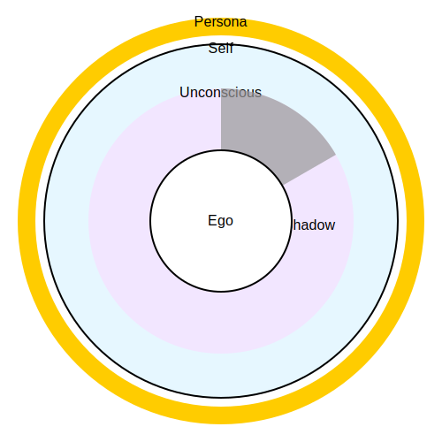

--8<-- "_snippets/disclaimer.md"

# An Analysis of the Jungian Psyche: Persona, Ego, Shadow, and the Process of Individuation

Part I: Executive Brief and A Cartography of the Psyche
1.1 Foundational Definitions
Analytical psychology, the school founded by C.G. Jung, presents a complex and dynamic model of the human psyche. At its core are several fundamental structures that govern the relationship between the conscious and unconscious realms. A clear, falsifiable understanding of these concepts requires anchoring them in Jung's primary texts. The following definitions provide a concise, high-level summary of these foundational structures.

Persona: The persona is the socially adapted "mask" an individual presents to the world. It functions as a necessary compromise between the individual's inner reality and the demands of society, facilitating social interaction. Jung defined it as "a complicated system of relations between the individual consciousness and society," designed both to make a specific impression and to conceal the individual's true nature.  

Ego: The ego is the center of the field of consciousness and the seat of personal identity. It is the executive function of the psyche, organizing thoughts, feelings, and memories, and mediating between the inner and outer worlds. Crucially, the ego is not synonymous with the total personality; it is a component part that develops out of a larger, pre-existing totality.  

Shadow: The shadow is a primary archetype representing the unconscious, disowned aspects of the personality. It is "the thing a person has no wish to be," containing repressed traits, personal inferiorities, and undeveloped potentials that are incompatible with the conscious self-image. Its contents are not exclusively negative; it also holds positive, life-giving qualities that have been repressed.  

Self: The Self is the central archetype and the organizing principle of the entire psyche, encompassing both conscious and unconscious domains. It represents the quest for and the potential of wholeness, and its realization is the ultimate goal of the lifelong process Jung termed individuation.  

1.2 The Structure of the Psyche: A Relational Diagram
To visualize the dynamic interplay of these structures, a cartographical model of the psyche is indispensable. Such a diagram illustrates the boundaries, layers, and processes that constitute Jung's framework.

At the center of the field of Consciousness resides the Ego, the seat of our subjective awareness and identity. The boundary between the individual and the external world, or Society, is mediated by the Persona. This outermost layer is the face we present publicly, shaped by collective expectations and our own adaptive strategies.

Below the threshold of consciousness lies the Unconscious, which Jung divided into two distinct layers. The first is the Personal Unconscious, a repository of an individual's forgotten memories, repressed experiences, and subliminal perceptions. It is within this layer that the Shadow is primarily located—the collection of traits and potentials deemed unacceptable by the Ego and thus relegated to darkness.

Deeper still is the Collective Unconscious, a transpersonal layer of the psyche inherited by all of humanity. This is the realm of the Archetypes, universal, innate patterns and images that structure human experience and find expression in myths, dreams, and religious symbolism across all cultures.

The entire psychic system—Consciousness, the Personal Unconscious, and the Collective Unconscious—is encompassed and organized by the Self. The Self is both the circumference and the center of the total psyche, representing an underlying unity and the teleological drive toward wholeness.

Dynamic processes connect these structures. Repression is the mechanism by which the Ego pushes unwanted content into the Shadow. Projection is the process by which the contents of the Shadow are unconsciously externalized and perceived in other people. The process of Individuation is the lifelong journey of integrating these disparate parts, bringing the contents of the Shadow into relationship with the Ego, and shifting the center of the personality from the Ego to the Self. This diagrammatic representation clarifies that the psyche, in Jung's view, is not a static entity but a living system of interacting, often conflicting, components striving for balance and wholeness.

The diagram maps these concepts into concentric layers, placing the white Ego core inside a gray Shadow wedge, nested within the lavender Unconscious, encompassed by the light-blue Self, and encircled by the gold Persona boundary.

Part II: An Annotated Glossary of the Jungian Psyche
This section provides a more exhaustive, referenced exploration of the core concepts, grounding them firmly in Jung's Collected Works and reputable Jungian scholarship. Each entry details the term's definition, its relationship to other psychic structures, and the risks associated with its misunderstanding or mismanagement.

2.1 Persona
The Persona is the functional complex through which an individual adapts to and navigates the external social world. The term, derived from the Latin for an actor's mask, aptly describes its function as a curated public face. It is a necessary psychological structure, a "compromise between the individual and society" that facilitates interaction by presenting a predictable and acceptable version of oneself. Jung describes it as a "complicated system of relations between the individual consciousness and society, fittingly enough a kind of mask, designed on the one hand to make a definite impression upon others, and, on the other, to conceal the true nature of the individual".  

The persona is constructed from a combination of societal expectations, professional roles, and personal aspirations. It is what Jung calls an "outer attitude," a functional complex that "comes into existence for reasons of adaptation or personal convenience". In essence, the persona is "that which in reality one is not, but which oneself as well as others think one is".  

While a flexible and well-adapted persona is essential for social success, a significant psychological danger lies in over-identification with this mask. When the ego mistakes the persona for the entirety of the personality, the individual's inner life and unique individuality are neglected. Jung considered this identification a "very fruitful source of neuroses," warning that "a man cannot get rid of himself in favour of an artificial personality without punishment". Such an identification shifts the personality's "centre of gravity" from the ego to the collective, leaving the individual ungrounded and susceptible to the powerful pull of the unconscious. The process of individuation, therefore, necessitates the "dissolution of the persona," a often-painful crisis where the individual must differentiate their authentic self from the social role they have been playing.  

2.2 Ego
The Ego is the center of the field of consciousness. It is the subject of all conscious acts, the seat of our subjective identity, and the "bearer of personality". The ego's function is executive: it organizes our thoughts, feelings, sensations, and intuitions, providing a sense of continuity and control. It stands at the critical junction between the inner world of the unconscious and the outer world of reality, tasked with adaptation and the assertion of will.  

A crucial distinction in analytical psychology is the relationship between the ego and the Self. Unlike in some other psychological models, the ego is not the master of the psyche. Instead, Jung posited that the ego arises out of the Self during early development. The Self is the primary, pre-existing totality, while the ego is a secondary, differentiated complex. The ego is the center of consciousness, but the Self is the center and circumference of the total psyche, which includes both the conscious and the vast unconscious. The process of individuation is not about strengthening the ego's dominance but rather about establishing a healthy dialectic between the ego and the Self. This involves a relative "surrendering of the ego's dominion" so that it can serve the larger purpose of the Self, which is the realization of wholeness.  

The ego must also be distinguished from the Persona. While they are closely related, they are not identical. The persona is the ego's tool for social adaptation, its "public relations" department. The ego is the agent that wields the mask of the persona. A common source of psychological confusion occurs when the conscious sense of "I" is identified solely with the persona. In this state, the individual's conscious identity is entirely defined by their social role, leaving the true ego—the center of subjective experience—undeveloped and disconnected from the deeper layers of the psyche. The ego is the "puppet master," while the persona is the "social puppet"; when the master believes it is the puppet, the entire psychic system is thrown into imbalance.  

2.3 Shadow
The Shadow is one of the most fundamental and accessible archetypes in Jung's model. It represents the "dark side" of the personality—not necessarily in a moral sense of evil, but in the sense of being hidden from the light of consciousness. The shadow is "the thing a person has no wish to be"; it is the repository for all the aspects of oneself that the ego has disowned and repressed. These contents are deemed incompatible with the conscious self-image and the persona, and thus are relegated to the personal unconscious. Jung describes the shadow as that "hidden, repressed, for the most part inferior and guilt-laden personality whose ultimate ramifications reach back into the realm of our animal ancestors".  

The formation of the shadow is an inevitable consequence of ego development and social adaptation. As we are praised for certain traits and punished for others, we learn to identify with the acceptable parts of ourselves and repress the unacceptable ones. This creates a split between the conscious personality and its unconscious counterpart. Jung's famous dictum, "Everyone carries a shadow, and the less it is embodied in the individual's conscious life, the blacker and denser it is," highlights the energetic reality of this structure. An unacknowledged shadow does not disappear; it gains autonomy and power in the unconscious, often sabotaging our conscious intentions and erupting in moments of stress or emotional disturbance.  

Confronting the shadow is therefore the first and most crucial step in any serious depth psychological work. Jung considered it a profound moral challenge, stating, "To become conscious of it involves recognizing the dark aspects of the personality as present and real. This act is the essential condition for any kind of self-knowledge, and it therefore, as a rule, meets with considerable resistance". This confrontation is essential for moving beyond a naive and one-sided view of oneself and for beginning the difficult but necessary process of integrating the whole personality.  

2.4 The "Golden Shadow"
A common misconception is that the shadow contains only negative or destructive traits. Jung was explicit that this is not the case. The shadow is defined by what is repressed, not by its intrinsic moral quality. Therefore, it can also contain valuable, positive, and life-giving potentials that were disowned for various reasons—perhaps because they were not valued by one's family, were perceived as threatening to one's social adaptation, or were simply inconvenient to the conscious ideal. This positive aspect is often referred to as the "gold in the shadow".  

The primary textual basis for this concept comes from Jung's work Aion, where he clarifies the shadow's composition:

"If it has been believed hitherto that the human shadow was the source of all evil, it can now be ascertained on closer investigation that the unconscious man, that is, his shadow, does not consist only of morally reprehensible tendencies, but also displays a number of good qualities, such as normal instincts, appropriate reactions, realistic insights, creative impulses, etc.".  

This passage is critical. Jung's language—"normal instincts, appropriate reactions, realistic insights"—is functional and grounded. He describes qualities essential for a whole and well-adapted human being. For example, a person with a persona of extreme agreeableness may have repressed their capacity for healthy aggression, a "normal instinct" necessary for setting boundaries. This repressed capacity is part of their shadow.

Post-Jungian writers, most notably Robert A. Johnson in his book Owning Your Own Shadow, have popularized the concept, often using more aspirational language like "pure gold" or "hidden gifts". This reframing shifts the emphasis from the corrective task of restoring psychic balance to a more appealing quest for self-actualization and uncovering dormant talents. While this has made shadow work more accessible to a modern audience focused on personal growth, it carries a risk. It can downplay the profound "moral effort" and the painful confrontation with genuine personal inferiority that Jung saw as the primary, unavoidable task of shadow integration. The "gold" is rarely found in a pure state; it is almost always fused with the "demonic dynamism" of the darker, more primitive aspects of the shadow, and the work of integration requires grappling with both simultaneously.  

2.5 Individuation
Individuation is the central, teleological concept in Jung's psychology. It refers to the lifelong, natural process of psychological development whereby a person becomes an "in-dividual"—a separate, indivisible unity or whole. It is the process of becoming one's true, authentic self. This journey involves the progressive integration of the conscious and unconscious aspects of the personality, guided by the overarching archetype of the Self.  

Individuation is not a process of isolating oneself from the collective, but of differentiating oneself within it. It requires fulfilling one's collective duties (developing a functional persona) while also attending to the unique demands of one's inner world. The goal is not to achieve a static state of perfection or to eliminate conflict, but to hold the tension of opposites within the psyche. Jung emphasized that individuation is not a linear evolution but a "circumambulation of the self," a cyclical process of returning to the central organizing principle of the psyche again and again, each time with greater consciousness.  

The process is often catalyzed by a life crisis, particularly in the second half of life, when the adaptations and goals of the first half (career, family, social standing) no longer provide sufficient meaning. This crisis forces a turn inward and a confrontation with the neglected parts of the personality—primarily the shadow and the anima/animus. By integrating these unconscious contents, the center of the personality gradually shifts from the ego to the Self, leading to a more profound sense of meaning, purpose, and wholeness. As Jung stated, "Only what is really oneself has the power to heal".  

2.6 Projection
Projection is the primary psychological mechanism by which the contents of the unconscious, particularly the shadow, are experienced. It is an involuntary and unconscious process of attributing one's own unacknowledged subjective contents—such as traits, feelings, desires, or complexes—onto an external person or object. We do not make projections; we encounter them. The world appears to be filled with people who embody the qualities we most despise or admire, when in fact we are seeing our own unknown face reflected back at us.

Jung defined projection as "the expulsion of a subjective content into an object". This mechanism serves as a defense for the ego, allowing it to maintain its conscious self-image by disowning incompatible material. However, the cost is high. As Jung warned, "Projections change the world into the replica of one's own unknown face. In the last analysis, therefore, they lead to an autoerotic or autistic condition in which one dreams a world whose reality remains forever unattainable". Projection isolates the individual from genuine relationship and reality, trapping them in a world of illusion.  

The phenomenon is often triggered when an external object or person provides a "hook" on which to hang the projection—a trait that resonates with the unconscious content. A critical dynamic is that "all projections provoke counter-projection when the object is unconscious of the quality projected upon it by the subject". This creates a powerful, unconscious collusion that can define relationships and fuel interpersonal conflict. The therapeutic task of "withdrawing projections" is therefore central to the process of individuation. It requires the moral courage to recognize that the intense emotional charge one feels toward another person originates within oneself.  

2.7 Active Imagination
Active Imagination is the primary method developed by Jung for engaging in a direct, conscious dialogue with the unconscious. It is distinct from passive fantasy or daydreaming, which often remain on the surface of personal concerns. Active imagination is a deliberate technique for "dreaming with open eyes". The process begins by concentrating on a specific starting point—a dream image, a persistent mood, a fantasy fragment—and allowing it to come to life. The individual then allows a chain of associated fantasies to develop, but with a crucial difference: the ego actively participates in the unfolding drama.  

This active participation is key. The individual must engage with the emerging figures and events as if they were real, asking questions, stating their own position, and making ethical choices within the fantasy. This conscious engagement "creates a new situation in which UNCONSCIOUS contents are exposed in the waking state". This dialectical process between the conscious ego and the autonomous figures of the unconscious activates what Jung called the transcendent function. The transcendent function is the psyche's capacity to unite the opposing positions of the conscious and unconscious, creating a new, synthesized attitude or symbol that transcends both. This process fosters psychological development and moves the individual toward a new level of integration and wholeness. The products of active imagination are often expressed and objectified through creative means like writing, painting, sculpture, or dance, which helps to further differentiate the ego from the unconscious contents.  

Table 1: Core Concepts with Primary Citations (CW Vol/¶)
This table provides a quick-reference guide to the foundational definitions, anchoring each concept directly in Jung's Collected Works.

| Concept | Key Quote Snippet | Citation (CW Vol/¶) | Source |
| --- | --- | --- | --- |
| Persona | "a complicated system of relations... a kind of mask" | CW 7, ¶305 |  |
| Persona | "that which in reality one is not..." | CW 9i, ¶221 |  |
| Shadow | "that hidden, repressed, for the most part inferior..." | CW 9ii, ¶8 |  |
| Shadow | "recognizing the dark aspects of the personality" | CW 9ii, ¶14 |  |
| Shadow's "Gold" | "...does not consist only of morally reprehensible tendencies, but also displays a number of good qualities..." | CW 9ii, ¶423 |  |
| Individuation | "Only what is really oneself has the power to heal" | CW 7, ¶258 |  |
| Projection | "Projections change the world into the replica of one's own unknown face" | CW 9ii, ¶17 |  |
| Active Imagination | "dreaming with open eyes" | CW 6, ¶723n |  |
| Active Imagination | "UNCONSCIOUS contents are exposed in the waking state" | CW 14, ¶706 |  |

Part III: The Dynamics of the Psyche: Mechanisms of Integration and Defense
The structures of the psyche are not static entities but are engaged in a constant, dynamic interplay. This section details the primary mechanisms through which the shadow is formed, maintained, and ultimately integrated into the conscious personality.

3.1 Repression and the Formation of the Shadow
The shadow is not an innate "evil" part of the psyche but is actively constructed throughout an individual's life. The primary mechanism of its formation is repression. From early childhood, individuals are subject to familial, cultural, and societal pressures that value certain characteristics and devalue others. Traits that lead to approval and acceptance are incorporated into the ego and the persona, while those that lead to punishment, shame, or disapproval are pushed out of conscious awareness. This process is largely unconscious and is a necessary part of social adaptation.  

However, what is repressed is not merely "negative" impulses like aggression or selfishness. The shadow also becomes the repository for any authentic part of the self that does not fit the conscious ideal. A child in a highly intellectual family might repress their artistic and emotional nature; a child in a rigid, conformist environment might repress their spontaneity and creativity. These positive, vital qualities become part of the shadow because they threaten the individual's sense of belonging and psychic safety. Thus, the shadow grows in direct proportion to the one-sidedness of the conscious attitude. The more an individual identifies with a "good" or socially ideal persona, the larger and darker their shadow becomes, storing all the psychic energy and potential that has been denied expression.  

3.2 Projection: The Shadow's External Manifestation
An unacknowledged shadow does not remain dormant. Its contents possess psychic energy and actively seek expression. When direct expression is blocked by the ego's defenses, the shadow's contents are almost invariably projected outward onto other people. Projection is an unconscious defense mechanism that allows the individual to encounter their own repressed qualities as if they existed in someone else. The angry person sees a world full of aggressive people; the unacknowledged artist is intensely critical or envious of other artists; the person who has repressed their own vulnerability sees weakness everywhere.  

This mechanism is particularly potent in interpersonal relationships and group dynamics. We are most likely to project onto those who provide a "hook"—a genuine, if small, trait that corresponds to the projected content. This creates a powerful and often destructive dynamic, as the projection invites a counter-projection, locking both parties into an unconscious, illusory relationship. On a collective level, mass projections fuel prejudice, scapegoating, and conflict, as groups project their collective shadow onto an "other"—a rival nation, a different ethnic group, or a political opponent. Projection is, therefore, a primary obstacle to self-knowledge and authentic human connection, as it replaces reality with a mirror of one's own unowned darkness.  

3.3 The Path of Integration: Withdrawing Projections
The journey toward psychological wholeness—individuation—begins with the difficult task of withdrawing these projections. This is the essence of "owning your own shadow." The process is initiated by a moment of insight, often painful, in which the individual begins to suspect that their intense emotional reactions to others—be it excessive anger, judgment, fascination, or idealization—say more about themselves than about the other person.  

Jung described the withdrawal of projections as a "moral achievement" of the highest order. It requires the courage to stop blaming the external world and to instead look inward for the source of the conflict. When a projection is withdrawn, the individual "saddles himself with new problems and conflicts" because the battle that was previously fought with an external enemy now becomes an internal struggle. This is a critical turning point. While it increases internal tension, it is also the only way to reclaim the psychic energy that was being wasted in the projection. By consciously grappling with the shadow within, the individual not only moves toward personal wholeness but, as Jung argued, has "done something real for the world" by ceasing to add their own unconscious darkness to the collective.  

This process reveals the profound ethical dimension of shadow work. Jung's use of the term "moral" is not about adhering to a conventional societal code, but about the fundamental responsibility to become conscious of one's total personality, both light and dark. Repression and projection are, from this perspective, not just psychological errors but moral failures—failures to be whole. They are energetically costly, binding psychic energy in unconscious complexes and leading to a state of psychic impoverishment and a loss of vitality. Integrating the shadow is therefore not simply a therapeutic technique for reducing symptoms; it is an ethical imperative for achieving psychological maturity. It is the process of expanding consciousness and taking responsibility for the entirety of one's being. By owning the shadow, the individual ceases to unconsciously inflict their disowned parts on the world, which forms the basis of Jung's conviction that true and lasting social change can only begin with the inner work of the individual.  

Part IV: The Practice of Integration: A Protocol for Active Imagination
While dream analysis is a primary tool for understanding the unconscious, Jung developed Active Imagination as a more direct and potent method for engaging with it. This technique moves beyond interpretation to foster a direct, dialogical relationship between the conscious ego and the autonomous figures of the psyche. This section outlines the method, its inherent risks, and the necessary safeguards, based on Jung's own descriptions.  

4.1 The Method of Active Imagination
The practice of active imagination can be broken down into three distinct, though overlapping, stages.

**Step 1: The Starting Point (Inviting the Unconscious)**
The process must begin with a conscious act of introversion and concentration. The ego must create a "hermetically sealed vessel" by setting aside external distractions and turning its attention inward. The starting point can be any psychic content that has energy and numinosity:  

- **A Persistent Mood:** If one is in a disturbed or depressed state, one should not try to escape it but rather sink into it, making the mood itself the object of concentration. The goal is to allow the mood to express itself in images or fantasies without letting the mind wander away from the core affect.  
- **A Dream Image:** A particularly vivid or recurring image from a dream can be chosen. The individual concentrates on this image, holding it in the mind's eye until it begins to shift, move, or change, as if coming to life on its own.  
- **Spontaneous Fantasy:** For visual types, this involves waiting with an attitude of expectation for an inner image to appear. For auditory types, it may begin with hearing inner words or phrases. For kinesthetic types, it can involve allowing the hands to express themselves through drawing, painting, or sculpting without a conscious plan.  

**Step 2: The Dialogue and Elaboration (Engaging the Figures)**
Once a fantasy begins to unfold, the crucial element of active participation comes into play. This is what distinguishes the method from passive daydreaming. The ego must enter the fantasy as a participant, not just an observer.  

- **Engage in Dialogue:** When figures appear, one must speak to them, ask them what they want, and state one's own viewpoint. This should be a genuine dialogue between two relatively autonomous beings.  
- **Act and React:** The individual must make choices and take action within the fantasy, behaving with the same moral and practical seriousness as they would in outer reality.  
- **Give it Form:** To objectify the experience and prevent being overwhelmed by it, the unfolding drama should be recorded. This can be done through writing down the dialogue verbatim, painting the scenes, or sculpting the figures that appear. This act of creative formulation helps to differentiate the ego from the unconscious contents and provides a concrete record of the process.  

**Step 3: The Ethical Confrontation (Integration into Life)**
This final stage is the most important and the most difficult. The process is not complete once the fantasy ends. The insights and experiences gained through the dialogue must be integrated into conscious life.

- **Understand the Meaning:** The individual must reflect on the fantasy and strive to understand its symbolic meaning in relation to their life situation.  
- **Take a Moral Stance:** The ego must take the lead in coming to terms with the unconscious position. This is an ethical confrontation (Auseinandersetzung), where the ego weighs its own values against the demands or perspectives of the unconscious figures.  
- **Live the Synthesis:** The goal is to arrive at a new, synthesized attitude that honors both the conscious and unconscious positions. This requires an ethical commitment to live out the new understanding in one's daily life. Failure to do so renders the entire exercise sterile and can even be dangerous, as unintegrated insight can lead to inflation or a split between one's inner and outer life.  

4.2 Risks and Contraindications
Active imagination is a powerful technique and is not without significant risks. Jung issued numerous cautions regarding its use.  

- **Psychosis:** The most severe danger is that the autonomous contents of the unconscious can overwhelm the ego, leading to a state of possession or a psychotic break. This risk is especially high for individuals with a weak ego structure or a latent psychosis.  
- **Inflation:** The individual may identify with the powerful archetypal figures encountered in the fantasy, leading to an inflated sense of self, grandiosity, and a disconnect from human reality.  
- **Sterility and Fascination:** The process can become sterile if the individual remains caught in their personal complexes without reaching a deeper, archetypal level. Alternatively, they may become fascinated by the beauty or drama of the images (aestheticism) or the intellectual puzzle of their meaning (intellectualism), in both cases avoiding the necessary ethical confrontation and integration.  

4.3 Essential Safeguards
Given the risks, Jung outlined several crucial safeguards for the practice.  

- **A Strong and Stable Ego:** The method should only be attempted by individuals with a reasonably strong ego that can maintain its own standpoint and not be dissolved by the encounter with the unconscious. For those with a fragile ego, the therapeutic work should focus on strengthening consciousness first.  
- **Expert Supervision:** Jung strongly recommended that the process be undertaken under the guidance of an experienced analyst, particularly for individuals with any underlying psychological instability. The analyst can help contain the experience, provide objective feedback, and recognize warning signs.  
- **Grounding in External Reality:** A firm connection to the duties and relationships of everyday life is essential. A stable job, family life, and practical responsibilities provide a necessary counterweight to the intense inner work, ensuring the individual does not lose their footing in the real world.  

Part V: A Critical Appraisal of Analytical Psychology
While Jung's model of the psyche has had a profound influence on psychotherapy, art, and spirituality, it has also faced significant criticism from academic, clinical, and cultural perspectives. A comprehensive understanding requires a balanced appraisal of both its contributions and its limitations.

5.1 The Question of Empiricism
The most persistent critique of Jungian psychology from the scientific community is its perceived lack of empirical validation. Core concepts such as the collective unconscious and the archetypes are often dismissed as metaphysical, mystical, and unfalsifiable. Critics argue that these constructs are inherently ambiguous and subjective, derived from Jung's personal experiences and anecdotal evidence rather than from systematic, controlled research. Because there is no conceivable experiment that could disprove the existence of an archetype, the theory is seen as incompatible with the scientific method as defined by thinkers like Karl Popper. This has led to analytical psychology being largely marginalized within academic psychology departments, which prioritize a "psychology without the psyche"—a model based on observable behavior and biochemical processes.  

However, this critique of the theory exists alongside a growing body of evidence for the effectiveness of the therapy. A landmark 2013 review by Christian Roesler aggregated the results of multiple prospective, naturalistic outcome studies on Jungian psychotherapy. The review found that patients undergoing Jungian analysis showed significant and stable improvements across a range of measures. This included not only a reduction in symptoms like depression and anxiety but also positive structural changes in personality and improvements in daily life conduct. Effect sizes were moderate to large, and the positive changes were maintained in follow-up studies for up to six years. Notably, many patients continued to improve after therapy ended, an effect long claimed by depth psychologies. Furthermore, data showed that after therapy, patients' utilization of healthcare services dropped to a level below the population average, indicating that the treatment is both effective and cost-effective. A separate German study of 104 patients confirmed these findings, showing significant reductions in symptom burden for depression, anxiety, and obsessive-compulsive symptoms.  

This creates a significant chasm between the theoretical foundations and the practical outcomes. The core constructs of the theory are not easily falsifiable by the standards of empirical science. Yet, the clinical application of this theory yields measurable, positive results. This suggests that the debate over Jungian psychology's validity may involve a category error. Critics are applying the epistemological standards of the natural sciences to what is fundamentally a phenomenological and hermeneutic system—a system designed to explore subjective meaning rather than to predict objective behavior. The therapy's success does not necessarily prove the literal, metaphysical existence of archetypes. Instead, it may be that the Jungian framework functions as a uniquely powerful and culturally resonant heuristic model—a "map of the soul"—that enables individuals to organize their subjective experience, make meaning of their suffering, and integrate neglected parts of themselves within a deep and supportive therapeutic relationship. The value of the theory may lie not in its objective truth, but in its therapeutic utility as a mythopoetic language for navigating the inner world.

5.2 Cultural and Decolonial Critiques
A more recent and pressing critique concerns the cultural and colonial biases embedded in Jung's work. Despite his interest in non-European cultures, Jung's writings often reflect a Eurocentric and colonialist worldview. He frequently used the term "primitive" to describe both the unconscious processes of modern Europeans and the psyches of non-white peoples, particularly those in Africa. This equation of non-European consciousness with an earlier, less developed stage of psychic evolution is fundamentally racist and undermines the claimed universality of his archetypal theory. If the archetypes are truly universal, their expression should not be hierarchically ranked by culture or race. Critics argue that Jung's framework, by defining the Western rational ego as the pinnacle of consciousness, implicitly validates a colonialist mindset.  

In response, a decolonial movement has emerged within the post-Jungian community. Scholars like Fanny Brewster have provided a sharp critique of the "blank spaces around race" in classical Jungian theory and the historical failure of the Jungian community to address these issues. A significant theoretical development aimed at correcting this bias is the concept of cultural complexes, developed by Jungian analysts Thomas Singer and Samuel Kimbles. A cultural complex is a system of shared feelings, memories, and archetypal patterns that operate in the collective psyche of a group, shaping its identity and its relationship with other groups. Kimbles, an African American analyst, uses this concept to explore the trans-generational trauma of racism, showing how the unconscious is shaped not only by universal archetypes but also by the specific historical and cultural experiences of a people. This approach attempts to decolonize Jungian thought by grounding the psyche in specific cultural contexts, moving away from a universalism that was, in practice, often a projection of a European worldview.  

5.3 Feminist Critiques
Jungian psychology has also faced sustained critique from feminist scholars for its essentialist and often patriarchal views on gender. The core of this critique targets the concepts of the anima (the inner feminine in a man) and the animus (the inner masculine in a woman), and the associated dichotomy of Eros and Logos. Jung typically associated Logos—the principle of intellect, order, and rationality—with the masculine, and Eros—the principle of relatedness, feeling, and soulfulness—with the feminine.  

Feminist critics argue that this binary perpetuates harmful stereotypes that confine women to the realm of feeling and relationship while devaluing their intellectual and agentic capacities. Jung's writings contain passages that explicitly state that a woman pursuing a "masculine" profession is doing something "injurious to her feminine nature". By defining the animus in a woman as a collection of unconscious opinions, it can be used to dismiss a woman's assertive intellectual contributions as being "animus-ridden". This theoretical framework has been criticized for reinforcing the very patriarchal structures that limit women's development.  

In response, post-Jungian feminist authors have attempted to revise or reclaim these concepts. Susan Rowland, in Jung: A Feminist Revision, argues for a critical approach that separates the useful aspects of Jung's thought (his focus on personal myth, the value of the unconscious) from his outdated, patriarchal "grand theory". Other analysts, such as Marion Woodman and Jean Shinoda Bolen, have focused on exploring goddess archetypes to create a more woman-centered psychology, though this approach has itself been criticized by some feminists for its own form of essentialism. The ongoing debate highlights the deep tension within Jung's work between its potential for profound insight into the psyche and its embeddedness in the patriarchal culture of its time.  

Part VI: Contemporary Dialogues: Jungian Psychology and Internal Family Systems (IFS)
In recent years, one of the most fruitful dialogues for depth psychology has been the comparison between Jung's analytical psychology and the Internal Family Systems (IFS) model developed by Richard Schwartz. While originating from different traditions, the two models exhibit remarkable conceptual resonance, particularly in their view of the psyche as a multiplicity of sub-personalities. However, they also diverge significantly in their therapeutic methodology, offering complementary approaches to healing and integration.  

6.1 Conceptual Mapping
A direct comparison of the core terminology of both systems reveals both profound similarities and crucial distinctions. It is important to map these terms cleanly, avoiding the common error of treating them as simple synonyms, as their theoretical underpinnings and therapeutic applications differ.  

Table 2: Comparison of Jungian Concepts and IFS Terminology

| Jungian Concept | Closest IFS Equivalent | Conceptual Similarity | Conceptual & Methodological Difference |
| --- | --- | --- | --- |
| Self | Self | Both are the core of the psyche, the seat of wisdom, compassion, and wholeness. Both are viewed as an innate, undamaged center of the personality. | In Jungian theory, the Self is an archetype and the ultimate, often numinous, goal of the lifelong individuation process. In IFS, the Self is an ever-present resource that can be accessed in the present moment to lead the inner system. The goal is Self-leadership, not just Self-realization. |
| Shadow | Exiles & Protectors | Both represent disowned, repressed, or unconscious parts of the psyche that hold pain, shame, or traits deemed "unacceptable" by the conscious mind. | The Jungian Shadow is a single, complex archetype containing a mixture of positive and negative traits. In IFS, the painful content is held by specific, vulnerable child-parts called Exiles, while the "shadowy" behaviors are the work of Protectors (Managers and Firefighters) trying to keep the Exiles from being activated. IFS explicitly states all parts have a positive intent, a more nuanced view than Jung's description of the shadow's potential "demonic dynamism." |
| Complexes | Parts | Both are autonomous or semi-autonomous sub-personalities with their own energy, memories, beliefs, and intentions that can hijack the ego/Self. | Jungian complexes are organized around a universal, archetypal core. IFS Parts are understood to be organized primarily around an individual's life experiences, particularly relational trauma. The IFS method is to "unburden" the trauma from Exiles, whereas the Jungian approach is to "integrate" the complex into consciousness. |
| Individuation | Integration / Self-Leadership | Both describe a process of achieving inner harmony and wholeness by bringing disparate parts of the psyche into a cooperative and balanced relationship. | Individuation is a broader, lifelong teleological process that includes engaging with transpersonal, archetypal, and symbolic dimensions. IFS Integration is a more specific, repeatable therapeutic process of unburdening traumatized parts so they can trust and be led by the compassionate Self. |

6.2 Methodological Divergence: Confrontation vs. Compassion
The most significant divergence between the two models lies in their therapeutic method and attitude. Jungian shadow work is consistently framed in the language of struggle and conflict. It is a "confrontation" with a powerful inner "other" that requires "considerable moral effort" and a heroic ego strong enough to withstand the encounter. The shadow is an opponent to be wrestled with, and the process is a "struggle that cannot be abolished by rational means".  

Internal Family Systems, in contrast, is founded on a radically different principle: approaching all parts, even those that manifest in the most destructive behaviors, with curiosity and compassion. The foundational insight of IFS is that there are no "bad parts," only parts forced into extreme roles by trauma. A "Firefighter" part that drives an addiction, for example, is not seen as a demonic aspect of the shadow to be confronted. Instead, it is understood as a desperate protector trying to extinguish the overwhelming pain of a wounded, exiled child-part.  

This difference in perspective leads to a profound methodological split. The Jungian approach requires a strong ego to face and integrate a potentially hostile shadow. The IFS approach does not require the ego to fight; instead, it teaches the individual to access their core Self—which is characterized by compassion, curiosity, and calm—and to build a trusting, internal attachment relationship with their parts. The therapeutic act is not to confront the protective Firefighter, but to compassionately ask for its story, understand its positive intent (to protect from pain), and gain its trust to "step aside" so that the Self can connect with and heal the underlying Exile it is guarding. Once the Exile is "unburdened" of its trauma, the Protector is freed from its extreme and destructive role.  

From this vantage point, IFS can be viewed as a methodological evolution that operationalizes the goal of Jungian integration—a psyche harmonized and led by the Self—but replaces the method of heroic confrontation with a systematic process of internal attachment repair. It provides a concrete, step-by-step "how-to" for establishing the compassionate inner relationship that Jung's work often describes more symbolically. This may account for the rapid adoption of IFS in the field of trauma therapy, as its non-confrontational, Self-led approach is often safer and more effective for clients with compromised ego strength, for whom a direct "confrontation with the shadow" could be overwhelming, re-traumatizing, or psychologically dangerous.

Conclusion
C.G. Jung's model of the psyche, centered on the dynamic interplay of the persona, ego, shadow, and Self, remains one of the most influential frameworks in depth psychology. The persona serves as the necessary mask for social adaptation, while the ego acts as the center of consciousness. The shadow, containing all that is repressed and unlived, stands as the unconscious counterpart to the conscious personality, holding both destructive tendencies and invaluable "gold." The lifelong process of individuation is the journey toward wholeness, a difficult but essential synthesis of these conscious and unconscious elements, guided by the central archetype of the Self. This integration is facilitated by practices like active imagination, a method for direct dialogue with the figures of the inner world.

The mechanisms of repression and projection are central to this model. Repression forms the shadow, while projection externalizes it, creating an illusory world and preventing authentic self-knowledge. The withdrawal of projections is thus a profound moral and energetic task, requiring the individual to take responsibility for their total personality.

Despite its enduring clinical and cultural influence, Jung's work is not without significant challenges. It faces persistent critiques regarding its lack of empirical falsifiability, its embeddedness in a Eurocentric and colonial worldview, and its perpetuation of patriarchal gender stereotypes. These critiques are vital, and the ongoing work of post-Jungian scholars to decolonize the theory with concepts like cultural complexes and to revise it through a feminist lens is essential for its continued relevance.

The emergence of models like Internal Family Systems offers a powerful contemporary dialogue, highlighting a methodological shift from the Jungian emphasis on "confrontation" with the shadow to an IFS-based approach of "compassionate" engagement with protective parts. This evolution provides a safer, more systematic pathway for trauma healing, operationalizing the goal of integration that lies at the heart of Jung's work.

Ultimately, the enduring power of Jung's framework lies not in its status as a scientifically proven fact, but in its utility as a profound heuristic map of the human soul. It provides a rich, symbolic language for navigating the complexities of inner experience, confronting the totality of one's nature, and pursuing a life of greater consciousness and meaning. While the empirical evidence demonstrates the effectiveness of the therapy, the theory itself is best understood as a powerful mythopoetic system that, when engaged with critically and consciously, continues to offer a compelling path toward psychological wholeness.

Sources used in the report

iaap.org
Persona – International Association of Analytical Psychology – IAAP
Opens in a new window

thesap.org.uk
Jung's model of the psyche | Jung and the Ego - The SAP
Opens in a new window

eternalisedofficial.com
The Persona - The Mask That Conceals Your True Self - Eternalised
Opens in a new window

thesap.org.uk
Individuation and the Self - The SAP - The Society of Analytical Psychology
Opens in a new window

thesap.org.uk
The Jungian Shadow - The Society of Analytical Psychology
Opens in a new window

en.wikipedia.org
Self in Jungian psychology - Wikipedia
Opens in a new window

reddit.com
The 'I' is the persona, not the ego?! : r/Jung - Reddit
Opens in a new window

shortform.com
Jung's Map of the Soul Book Summary by Murray Stein - Shortform
Opens in a new window

cjbecker.com
Finding Gold in the Mud – Integrity and the Shadow - Christina Becker
Opens in a new window

somatopia.com
Projection as Defense Mechanism & How to Work with It - Somatopia
Opens in a new window

scottjeffrey.com
A Beginner's Guide to Jungian Shadow Work: How to Integrate Your Dark Side
Opens in a new window

intuitivehealingnyc.com
The Shadow, Projection, and Giving Away Our Gold — Psychotherapy Practice
Opens in a new window

psikoloji.fisek.com.tr
Jung: On The Shadow - Psikoloji
Opens in a new window

eternalisedofficial.com
The Shadow - Carl Jung's Warning to The World - Eternalised
Opens in a new window

appliedjung.com
Collected Works of CG Jung: Volume 9ii: AION: Researches into the Phenomenology of the Self
Opens in a new window

frithluton.com
The Shadow – Conflict with the Persona and Ego Responsibility - FrithLuton.com
Opens in a new window

gettherapybirmingham.com
What is The Golden Shadow In Jungian Psychology? -
Opens in a new window

walkingthroughtransitions.com
“The Shadow is ninety percent pure gold.” - Walking Through Transitions
Opens in a new window

carljungdepthpsychologysite.blog
Shadow | Carl Jung On The “Shadow”
Opens in a new window

typeindepth.org
Psychodynamic Coaching and Type - Personality Type in Depth
Opens in a new window

junguipediaeng.miraheze.org
Shadow - Junguipedia English
Opens in a new window

splicetoday.com
Ursula K. Le Guin and the Shadow of Earthsea | www.splicetoday.com
Opens in a new window

symbolreader.net
The Shadow Archetype | symbolreader
Opens in a new window

carljungdepthpsychologysite.blog
Carl Jung Evil – Anthology
Opens in a new window

carljungdepthpsychologysite.blog
Aion | Carl Jung: Aion: Researches Into The Phenomenology Of The Self – Quotations
Opens in a new window

barnesandnoble.com
Owning Your Own Shadow: Understanding the Dark Side of the Psyche - Barnes & Noble
Opens in a new window

goodreads.com
Owning Your Own Shadow: Understanding the Dark Side of the Psyche - Goodreads
Opens in a new window

iaap.org
The Transcendent Function - International Association of Analytical Psychology
Opens in a new window

sobrief.com
Jung's Map of the Soul | Summary, Quotes, FAQ, Audio - SoBrief
Opens in a new window

thesap.org.uk
Analytical Psychology - an Overview of Jungian Psychology
Opens in a new window

junguipediaeng.miraheze.org
Projection - Junguipedia English
Opens in a new window

en.wikipedia.org
Psychological projection - Wikipedia
Opens in a new window

perlego.com
[PDF] A Critical Dictionary of Jungian Analysis by Andrew Samuels ...
Opens in a new window

archive.org
Jung on active imagination - PDFDrive.com
Opens in a new window

scribd.com
Owning Your Own Shadow PDF | PDF - Scribd
Opens in a new window

anchorpointexpeditions.com
Book Review - Owning Your Own Shadow — Anchorpointexpeditions.com
Opens in a new window

spiritualityandpractice.com
Owning Your Own Shadow by Robert A. Johnson | Book Excerpt - Spirituality & Practice
Opens in a new window

medium.com
10 Major Criticisms of Jungian Psychology | by Dr. Victor Bodo | Medium
Opens in a new window

reddit.com
“Modern Psychology dislikes Jung” : r/Jung - Reddit
Opens in a new window

core.ac.uk
THE APPLICATION OF JUNGIAN ARCHETYPES TO THE ANALYSIS OF CHARACTER IN THREE EARLY PLAYS BY W. B. YEATS A THESIS IN Theatre Prese - CORE
Opens in a new window

pure.hud.ac.uk
Jungian Archetypes: A Step Towards Scientific Enquiry - Kyah McDonald - University of Huddersfield Research Portal
Opens in a new window

pmc.ncbi.nlm.nih.gov
Jung's “Psychology with the Psyche” and the Behavioral Sciences - PMC - PubMed Central
Opens in a new window

pmc.ncbi.nlm.nih.gov
Evidence for the Effectiveness of Jungian Psychotherapy: A Review of Empirical Studies
Opens in a new window

researchgate.net
Evidence for the Effectiveness of Jungian Psychotherapy: A Review of Empirical Studies
Opens in a new window

pubmed.ncbi.nlm.nih.gov
Evidence for the effectiveness of jungian psychotherapy: a review of empirical studies
Opens in a new window

researchinpsychotherapy.org
Effectiveness of Jungian psychotherapy in supervised training settings
Opens in a new window

iksiopan.pl
Carl Jung's Colonial Passages: Archetypes on the Imperial Frontiers
Opens in a new window

britishpsychotherapyfoundation.org.uk
Jung and Racism - The British Psychotherapy Foundation
Opens in a new window

extension.pacifica.edu
Decolonizing Jungian Psychology - Pacifica Extension and International Studies
Opens in a new window

mdpi.com
Seeing Jung's Shadow in a New Light: Decolonizing the Undisciplined Depths - MDPI
Opens in a new window

api.pageplace.de
african americans and jungian psychology
Opens in a new window

researchgate.net
(PDF) Susan Rowland, Jung: A Feminist Revision - ResearchGate
Opens in a new window

scribd.com
Critica Feminista A Jung | PDF | Analytical Psychology | Carl Jung
Opens in a new window

pmc.ncbi.nlm.nih.gov
Gender Legacies of Jung and Freud as Epistemology in Emergent Feminist Research on Late Motherhood - PMC
Opens in a new window

reddit.com
What are the differences and similarities between Jungian Psychology and IFS (Internal Family Systems) : r/Jung - Reddit
Opens in a new window

saffronsageliving.com
IFS Therapy: Working with your Shadow Parts - Saffron & Sage
Opens in a new window

soulspeakpsychotherapy.com
Working with Shadow and Parts of Self — Soul Speak Psychotherapy
Opens in a new window

ifsguide.com
Comparing Parts to Archetypes: The Hero, Shadow, and Child in IFS ...
Opens in a new window

drbren.com
Online Internal Family Systems Therapy (IFS) - Dr Bren
Opens in a new window

Sources read but not used in the report

researchgate.net
C.G. Jung lexicon: A primer of terms & concepts - ResearchGate
Opens in a new window

archive.org
Jung Lexicon ... A Primer Of Terms And Concepts : Daryl Sharp. - Internet Archive
Opens in a new window

archive.org
Jung lexicon : a primer of terms & concepts : Sharp, Daryl, 1936 - Internet Archive
Opens in a new window

jungny.com
Jung Lexicon, A Primer of Terms & Concepts, by Daryl Sharp
Opens in a new window

biblio.com
Jung Lexicon: A Primer of Terms and Concepts by Sharp, Daryl | Soft cover | 1991 - Biblio
Opens in a new window

books.google.com
A Critical Dictionary of Jungian Analysis - Andrew Samuels, Bani Shorter, Fred Plaut
Opens in a new window

books.google.me
A Critical Dictionary of Jungian Analysis - Andrew Samuels, Bani Shorter, Fred Plaut
Opens in a new window

ks50.karnataka.gov.in
a+critical+dictionary+of+jungian+analysis.pdf
Opens in a new window

archive.org
A critical dictionary of Jungian analysis : Samuels, Andrew : Free Download, Borrow, and Streaming - Internet Archive
Opens in a new window

api.motion.ac.in
A Critical Dictionary Of Jungian Analysis
Opens in a new window

psychceu.com
The Jung Lexicon by Jungian analyst, Daryl Sharp, Toronto
Opens in a new window

en.wikipedia.org
Jungian archetypes - Wikipedia
Opens in a new window

structural-learning.com
What are Carl Jung's Archetypes? Structural Learning | Jungian Psychology
Opens in a new window

en.wikipedia.org
Collective unconscious - Wikipedia
Opens in a new window

quora.com
In what writings did Carl Jung explain the shadow? - Quora
Opens in a new window

pmc.ncbi.nlm.nih.gov
Contemporary Jungian Analysis - PMC
Opens in a new window

clubmagichour.com
Owning Your Own Shadow by Robert Johnson - Magic Hour Tea
Opens in a new window

smtsrv.medium.com
A critique on modern applications of Jungian Archetypes frameworks | by Sumit Saurav
Opens in a new window

youtube.com
Owning Your Own Shadow: The Dark Side of the Psyche - YouTube
Opens in a new window

reddit.com
Are there any high profile criticisms of Jung's ideas? - Reddit
Opens in a new window

ijnrd.org
carl jung's archetypal tipes, images and practice of fictional literature – a bird - IJNRD
Opens in a new window

researchgate.net
(PDF) A Critique of C.G. Jung's Theoretical basis for Selfhood: Theory vexed by an Incorporeal Ontology - ResearchGate
Opens in a new window

shortform.com
www.shortform.com
Opens in a new window

goodreads.com
Jung's Map of the Soul: An Introduction by Murray B. Stein | Goodreads
Opens in a new window

faithharkey.com
Jung's Map of the Soul by Murray Stein | Book Review - The Imaginalia of Faith Harkey
Opens in a new window

bts-radio-uk.blogspot.com
Jung's Map of the Soul - A Conversation with Murray Stein pt.1 - BTS Radio UK
Opens in a new window

brill.com
Evidence for the Effectiveness of Jungian Psychotherapy: A Review of Empirical Studies - Brill
Opens in a new window

iaap.org
Development of research designs for investigating concepts of Analytical Psychology and the efficacy/effectiveness of Jungian psychotherapy
Opens in a new window

scribd.com
Effectiveness of Jungian Therapy | PDF | Psychotherapy | Analytical Psychology - Scribd
Opens in a new window

taylorfrancis.com
Aion | Researches Into the Phenomenology of the Self | C.G. Jung - Taylor & Francis eBooks
Opens in a new window

simplypsychology.org
Carl Jung's Theory of Personality - Simply Psychology
Opens in a new window

dokumen.pub
Summary of Robert A. Johnson's Owning Your Own Shadow - dokumen.pub
Opens in a new window

core.ac.uk
PhD Thesis - 'Two souls alas...' Jung's two personalities and the making of analytical psychology - CORE
Opens in a new window

repository.arizona.edu
Jungian Analytical Psychology and Education - The University of Arizona
Opens in a new window

researchgate.net
Jungian psychology in a demanding modern world - ResearchGate
Opens in a new window

researchgate.net
(PDF) Decolonial Research Practices from an Indigenous Psychology Perspective: Critical Contributions to Knowledge ©American Psychological Association, 2024. This paper is not the copy of record and may not exactly replicate the authoritative document published in the APA journal. The final article is available, upon publication, at: 10.1037/amp0001505 - ResearchGate
Opens in a new window

reddit.com
Can you help me understand this paragraphs from "owning your own shadow" by Robert Johnson. - Reddit
Opens in a new window

researchgate.net
(PDF) Temporal Orientation of Dreams: A Comparative Analysis of Freudian and Jungian Perspectives - ResearchGate
Opens in a new window

shortform.com
Owning Your Own Shadow Book Summary by Robert A. Johnson - Shortform
Opens in a new window

scholarcommons.scu.edu
Roots and Routes Toward Decoloniality Within and Outside Psychology Praxis - Scholar Commons
Opens in a new window

researchgate.net
Archetypes: Toward a Jungian Anthropology of Consciousness - ResearchGate
Opens in a new window

sciedu.ca
Women, Violence, and Jung's Archetypes - Sciedu
Opens in a new window

ijip.in
Unraveling the Depths of the Psyche: A Review of Carl Jung's Analytical Psychology - IJIP
Opens in a new window

jungiananalysts.org.uk
Women's Aggressive Fantasies: A Feminist Post- Jungian Hermeneutic
Opens in a new window

utppublishing.com
Carl Jung's Archetypal Psychology, Literature, and Ultimate Meaning - University of Toronto Press
Opens in a new window

researchgate.net
Unraveling the Depths of the Psyche A Review of Carl Jung's Analytical Psychology
Opens in a new window

goodreads.com
Quote by Carl Jung: “By not being aware of having a shadow, you decl...” - Goodreads
Opens in a new window

reddit.com
A Jung Quote on the Shadow - Reddit
Opens in a new window

goodreads.com
Quote by C.G. Jung: “Good does not become better by being exaggerate...” - Goodreads
Opens in a new window

beezone.com
The Shadow – From Carl Jung's 'Aion' - Beezone Library
Opens in a new window

gnosis.org
Jung and Aion: Time, Vision, and a Wayfaring Man
Opens in a new window

archive.org
Full text of "The Collected Works of C. G. Jung : Aion" - Internet Archive
Opens in a new window

pacifica.edu
Jung's CW 9i: Archetypes & the Collective Unconscious - Pacifica Graduate Institute
Opens in a new window

jackiejreid.com
The Shadow: What It Is + How to Use IFS to Work With It - Jackie J ...
Opens in a new window

primo.uvm.edu
Collected Works of C.G. Jung. Volume 9/2, Collected Works of C.G. Jung, Volume 9 (Part 2) ; Aion: Researches into the Phenomenology of the Self - University of Vermont
Opens in a new window

books.google.com
Collected Works of C.G. Jung, Volume 9 (Part 2): Aion Researches Into the - Google Books
Opens in a new window

jungiananalysts.org.uk
The Collected Works of C.G. Jung: Volume 12: Psychology and Alchemy - Association of Jungian Analysts
Opens in a new window

archive.org
The Collected Works of C. G. Jung : Aion - Internet Archive
Opens in a new window

jungiananalysts.org.uk
The Collected Works of C.G. Jung:Volume 9i: The Archetypes of the Collective Unconscious - Association of Jungian Analysts
Opens in a new window
