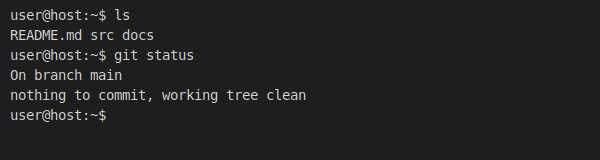

--8<-- "_snippets/disclaimer.md"

# Quickstart

!!! note
    Need command-line tips? See the [Terminal Workflow guide](terminal-workflow/index.md) for more CLI tips.

| Tool | Required Version |
| --- | --- |
| Python | >=3.11 |
| Node.js | >=20 |
| Git | >=2.40 |
| MkDocs | >=1.5 |

## Set Up Git LFS and pre-commit
Run the following steps to install Git LFS, enable the repository's custom
`.githooks/pre-commit` automation, and install the standard `pre-commit`
hooks:

1. Install Git LFS:

   ```bash
   git lfs install
   ```

2. Enable the repository Git hooks:

   ```bash
   scripts/setup_hooks.sh
   ```

3. Install pre-commit hooks:

   ```bash
   pip install pre-commit
   pre-commit install
   ```

## Run the Docs Locally

### Install Python dependencies (pip)

```bash
pip install -r requirements.txt
```

### Install Node dependencies (npm)

```bash
npm install # Node.js >= 20
```

### Start the development server

```bash
mkdocs serve
```

Then visit the local server at <http://127.0.0.1:8000> to preview the site
locally.

When the server starts, your browser should display the home page of the
documentation site generated by MkDocs.

### Windows (PowerShell)

On Windows, run these commands in a PowerShell terminal to activate both the
custom `.githooks/pre-commit` automation and the standard `pre-commit` hooks:

1. `py -m venv .venv`
2. `.\.venv\Scripts\Activate.ps1`
3. `py -m pip install -r requirements.txt`
4. `npm install`
5. `./scripts/setup_hooks.sh`
6. `py -m pip install pre-commit`
7. `pre-commit install`
8. `py -m mkdocs serve`

{data-glightbox}

*Figure: Local MkDocs preview served at 127.0.0.1:8000.*

## Lightbox for Images

The documentation now supports image lightboxes via the `mkdocs-glightbox`
plugin. Add a `data-glightbox` attribute to an image to enable the lightbox
effect:

```markdown
{data-glightbox}
```

## Build the Static Site

Generate a local build to check for broken links or other issues:

```bash
mkdocs build
```

## Troubleshooting

### Environment Issues

- `mkdocs: command not found` – install it with `pip install mkdocs`.
- `npm: command not found` – ensure Node.js is installed.
- Port 8000 already in use – stop the other process or run `mkdocs serve -a
  127.0.0.1:8001`.

### Common MkDocs Build Errors

- `ModuleNotFoundError: No module named 'mkdocs_material'` – install the
  missing theme with `pip install mkdocs-material`.
- `yaml.parser.ParserError` – check `mkdocs.yml` for indentation or syntax
  issues.
- `ERROR   -  Config file 'mkdocs.yml' does not exist` – run `mkdocs` from the
  repository root or specify the file with `-f`.

