!!! note "Disclaimer"
    This document is provided for research purposes only and does not constitute legal advice. It also does not constitute financial advice.
[[toc]]

# Security

Resources related to security practices and research.

## Guidance
- [Threat Model](threat-model.md) — identifies potential security threats and proposes mitigation strategies.

## Research
- [Quantum Reckoning](quantum-reckoning.md) — examines how quantum computing could undermine current cryptographic methods.

## Further Reading

-  — Use this icon to highlight privacy and operational security guidance within related documentation.
