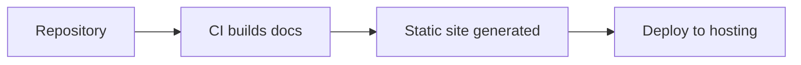

# Documentation and Scripts Threat Model

## Assets

- Public documentation site
- Build and deployment scripts
- Source repository and configuration

## Potential Threats

| Threat | Impact | Likelihood | Mitigation |
| --- | --- | --- | --- |
| Unauthorized modification or defacement of docs | Medium | Medium | Use version control with code review to gate changes |
| Malicious code injection in scripts | High | Low | Restrict script permissions and validate dependencies |
| Leakage of credentials or sensitive data | High | Low | Scan commits for secrets and rotate credentials regularly |

### Verification Steps

- **Unauthorized modification or defacement of docs**
  - Confirm each pull request has at least one reviewer.
  - Run [`scripts/setup_hooks.sh`](../../scripts/setup_hooks.sh) to enable repository-specific hooks.
- **Malicious code injection in scripts**
  - Verify script files have appropriate execute permissions.
  - Audit dependencies with `npm audit` (see [package.json](../../package.json)) and `pip install --require-hashes -r` [`requirements.txt`](../../requirements.txt).
- **Leakage of credentials or sensitive data**
  - Scan commits with [GitLeaks](https://github.com/gitleaks/gitleaks) or similar tools before merging.
  - Rotate credentials according to the organization's security policy.
