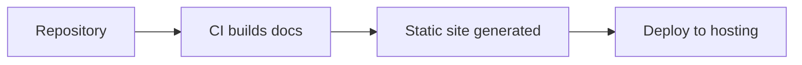

# Documentation and Scripts Threat Model

## Assets

- Public documentation site
- Build and deployment scripts
- Source repository and configuration

## Potential Threats

| Threat | Impact | Likelihood | Mitigation |
| --- | --- | --- | --- |
| Unauthorized modification or defacement of docs | Medium | Medium | Use version control with code review to gate changes |
| Malicious code injection in scripts | High | Low | Restrict script permissions and validate dependencies |
| Leakage of credentials or sensitive data | High | Low | Scan commits for secrets and rotate credentials regularly |
