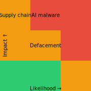

--8<-- "_snippets/disclaimer.md"

# Documentation and Scripts Threat Model

## Assets

- Public documentation site
- Build and deployment scripts
- Source repository and configuration

The risk matrix below illustrates the likelihood and impact of key threats to our documentation ecosystem.

*Risk matrix showing threat likelihood and impact.*

## Potential Threats

| Threat | Impact | Likelihood | Severity | Mitigation | Status |
|--------|--------|------------|----------|------------|--------|
| Unauthorized doc changes or defacement | Medium | Medium | 🟧 Medium | Version control and review | Monitored |
| Supply-chain attack | High | Low | 🟥 High | <ul><li>Pin dependencies</li><li>Verify checksums</li></ul> | Mitigated |
| AI-generated malware infiltration | High | Medium | 🟥 High | <ul><li>Scan generated code</li><li>Restrict untrusted executables</li></ul> | Monitored |

**Severity legend:**

<svg aria-label="Severity color legend showing Low, Medium, and High" role="img" width="240" height="20">
  <rect x="0" y="0" width="20" height="20" fill="#2ecc71" />
  <text x="25" y="15" font-size="14">Low</text>
  <rect x="80" y="0" width="20" height="20" fill="#f39c12" />
  <text x="105" y="15" font-size="14">Medium</text>
  <rect x="160" y="0" width="20" height="20" fill="#e74c3c" />
  <text x="185" y="15" font-size="14">High</text>
</svg>

- 🟩 Low
- 🟧 Medium
- 🟥 High

### Verification Steps

- **Unauthorized modification or defacement of docs**
  - Confirm each pull request has at least one reviewer.
  - Run [`scripts/setup_hooks.sh`](https://github.com/d0tTino/docs-/blob/main/scripts/setup_hooks.sh) to enable repository-specific hooks.
- **Supply-chain attack**
  - Pin dependencies and verify checksums for downloaded artifacts.
- **AI-generated malware infiltration**
  - Scan generated content and restrict execution of untrusted code.
