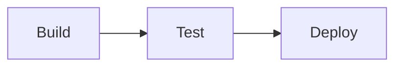

# GitHub Actions Workflows

This playbook summarizes the automated workflows that run in this repository.

*Figure: Build, test, and deploy stages.*

## Docs Deployment

- Defined in `.github/workflows/docs.yml`.
- Builds the MkDocs site and deploys it to GitHub Pages on every push that updates markdown files.

## Linting

- `markdownlint.yml` checks all Markdown files using `markdownlint-cli`.
- `python-lint.yml` runs `flake8` against Python sources.

## Tests

- `tests.yml` executes the test suite with `pytest` when Python files change.

These workflows keep the documentation site and helper scripts healthy.
